# 实现空间射击游戏的功能-盾牌的力量

> 原文：<https://medium.com/nerd-for-tech/implementing-space-shooter-game-features-shield-strength-1fd3c5c18ee3?source=collection_archive---------15----------------------->

## 统一指南

## 快速回顾 Unity 中添加到太空射击游戏的新功能

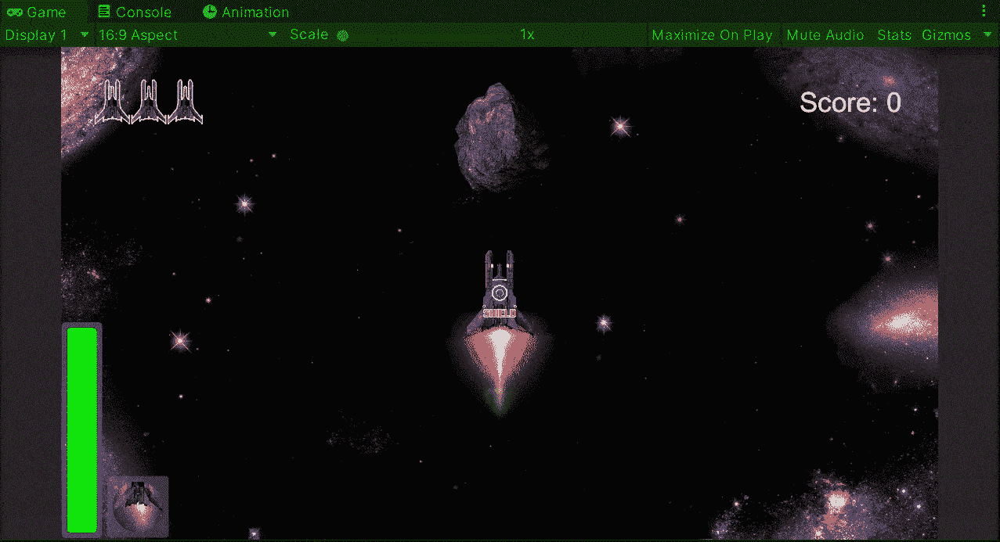

**目标**:用 Unity 实现一个空间射击游戏中盾牌的力量可视化。

在之前的帖子中，我[用 HUD](/nerd-for-tech/implementing-space-shooter-game-features-thrusters-67aa02b314b6) 为我的 Unity 太空射击游戏实现了一个助推行为。现在是时候实现一个显示玩家护盾强度的方法了。

# 屏蔽强度可视化仪

为了创建盾牌的力量可视化，让我们添加一个新的 C#脚本来处理盾牌预置:

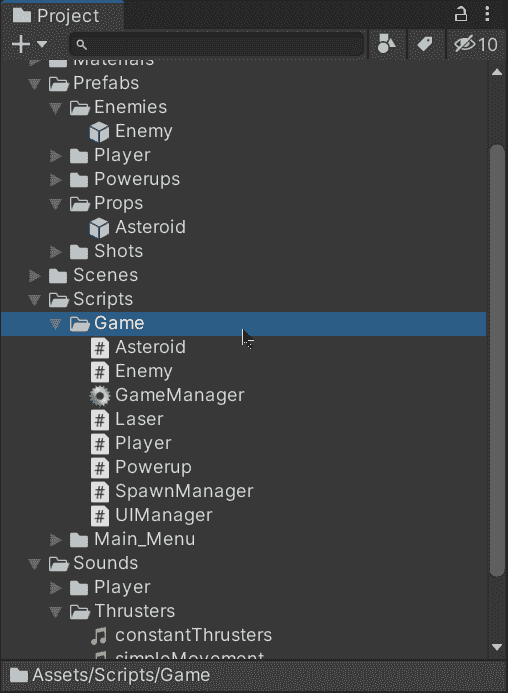

现在让我们打开脚本并创建这些变量:

*   阻力:

这个变量将存储一个盾牌消失或破碎前所能受到的打击次数。它可以在 Unity 编辑器中定制。

*   最大阻力:

这个变量将存储盾牌能抵抗的最大打击次数。这将提供一种方法来恢复护盾的属性，当它恢复或损坏时。

*   盾牌渲染器:

这个变量将存储一个对盾牌的精灵渲染器的引用，这样我们就可以通过改变精灵的颜色来显示它的强度。

*   3 种颜色:

这 3 个颜色变量将存储和定义护盾强度的 3 个阶段(正常护盾，第一次伤害和第二次)。

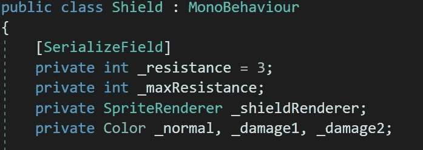

然后，在 Start 方法中，让我们从上面初始化变量:

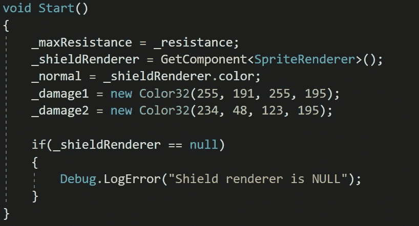

我们使用 Color32 是为了让颜色能够使用字节值作为参数。

现在，让我们创建一个根据屏蔽电阻值处理颜色变化的新方法:

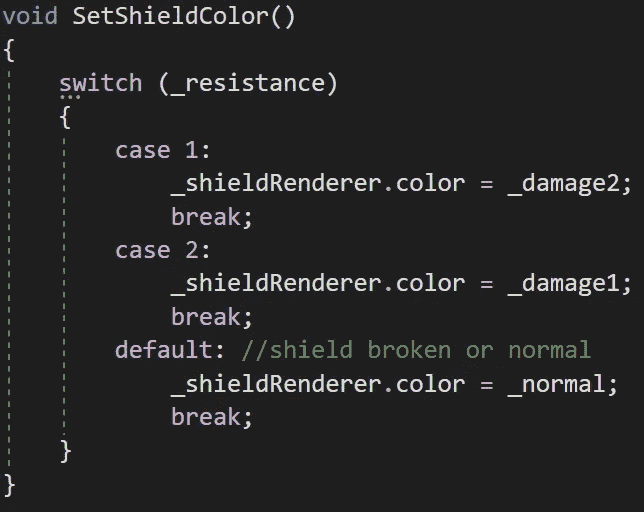

如果电阻为 0 或大于 2，屏蔽将被设置为其原始颜色。

如果您想了解更多关于精灵渲染器颜色的信息，您可以访问 Unity 文档:

 [## SpriteRenderer.color

### 此示例输出控制精灵颜色的红绿蓝元素的滑块//将此附加到…

docs.unity3d.com](https://docs.unity3d.com/ScriptReference/SpriteRenderer-color.html) 

现在，让我们创建一个新的公共 bool 方法来:

*   处理收到的损坏
*   通过调用上一个方法来设置新颜色
*   返回一个 bool 值，该值指示屏蔽是仍处于活动状态还是已损坏

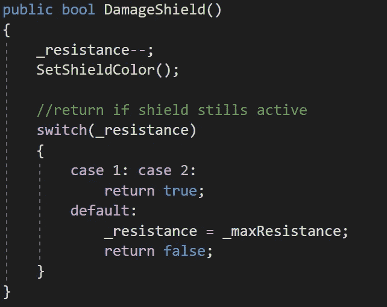

这样，我们可以从玩家脚本中调用伤害方法，并知道盾牌是否仍然有效。

最后，让我们创建一个新的公共方法来恢复屏蔽，以防它仍然处于活动状态:

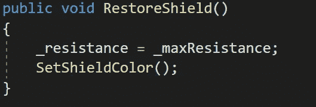

恢复最大电阻和颜色表示护盾完全恢复。

现在，让我们打开播放器脚本并创建一个新变量来存储对 Shield 脚本的引用:

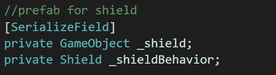

然后，在 Start 方法中，我们可以从 _shield 变量中存储的 shield prefab 引用中获取 Shield 脚本:

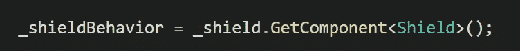

现在，在处理玩家伤害的方法中，让我们从盾牌脚本引用中调用 **DamageShield** 方法，并存储其值以指示每次击中后是否应该启用盾牌:

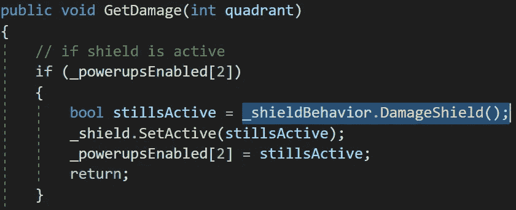

最后，在处理加电的方法中，让我们添加一个条件，指示如果屏蔽已经启用，应该做什么:

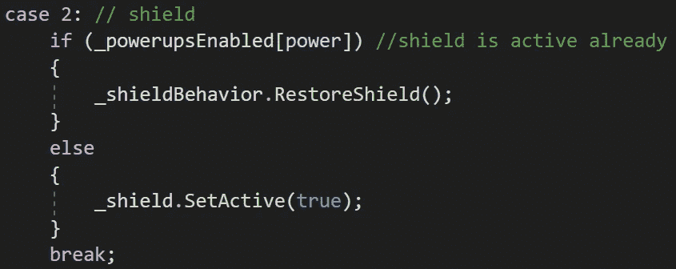

如果我们在 Unity 中运行游戏，我们会看到盾牌抵抗 3 次攻击，每次攻击后显示不同的颜色:

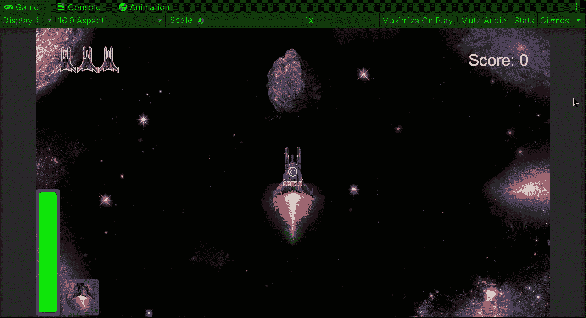

就这样，我们实现了盾牌的力量可视化！:d .我会在下一篇文章中看到你，在那里我会展示更多添加到我的 Unity 太空射击游戏中的功能。

> *如果你想更多地了解我，欢迎登陆*[***LinkedIn***](https://www.linkedin.com/in/fas444/)**或访问我的* [***网站***](http://fernandoalcasan.com/) *:D**