# 实现太空射击游戏功能-聪明的敌人

> 原文：<https://medium.com/nerd-for-tech/implementing-space-shooter-game-features-smart-enemy-5c6ff3f25076?source=collection_archive---------15----------------------->

## 统一指南

## 快速回顾 Unity 中添加到太空射击游戏的新功能

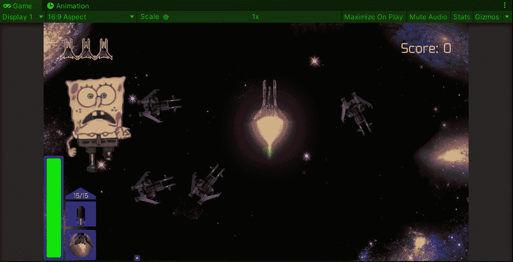

**目标**:在 Unity 的太空射击游戏中，实现一个在玩家落后时射击的聪明敌人。

在之前的帖子中，我在 Unity 的太空射击游戏中为一些敌人实施了一个攻击行为。现在是时候实现一个智能行为了，它会检查玩家是否在敌人身后进行射击。

# 新动画

就像我在以前的一些壶里说过的，我们需要包括新的精灵来为聪明的敌人创造新的动画。如果你不知道在哪里创建或获得新的精灵，那么我推荐你使用一个免费的在线程序(像我一样):

 [## 图片编辑:Pixlr.com-免费在线图片编辑

### 登录/注册欢迎使用 Pixlr 的免费高级照片编辑器。点击打开照片按钮开始编辑…

pixlr.com](https://pixlr.com/e/) 

此外，如果你不知道如何在 Unity 中添加精灵或动画，你可以查看这些旧帖子:

 [## 在 Unity 中从原型升级为艺术品

### 关于从原型升级到 Unity 艺术作品的详细指南

fas444.medium.com](https://fas444.medium.com/upgrading-from-a-prototype-to-a-work-of-art-in-unity-4f3c0435501d)  [## 在 Unity 中制作精灵动画

### 关于如何在 Unity 中制作精灵动画的快速指南

medium.com](/nerd-for-tech/animating-sprites-in-unity-9d02762bde96)  [## 在 Unity 中为你的游戏制造爆炸

### 关于如何在 Unity 中使用动画精灵创建爆炸的快速指南

medium.com](/nerd-for-tech/creating-explosions-for-your-game-in-unity-889e9c373d14) 

## 聪明的一击

为了创建动画，让我们使用 Unity 编辑器中的**动画**视图为敌人创建一个新的动画剪辑:

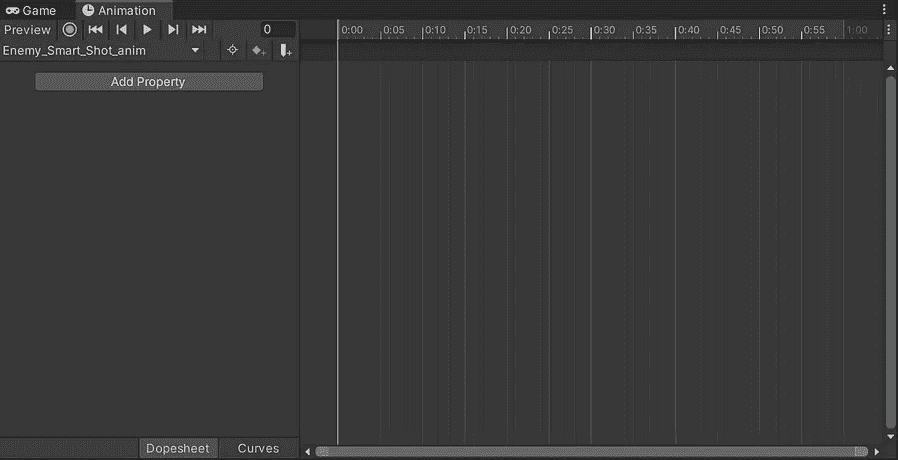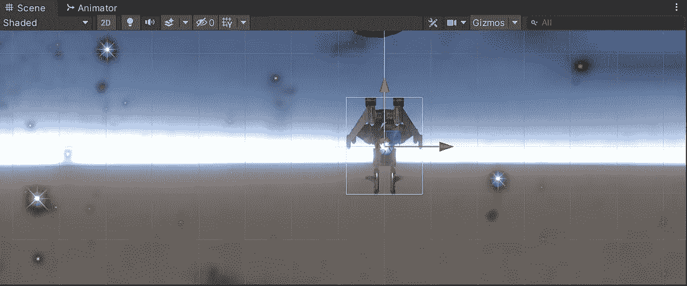

然后，让我们确定要在剪辑中使用的各个精灵:

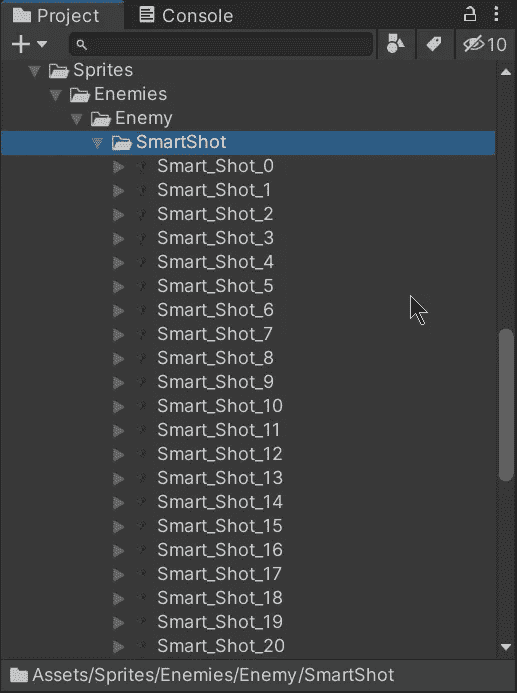

现在让我们将精灵拖动到剪辑中，按照我们的意愿显示动画。正如你在接下来的图片中所看到的，敌人会将武器移到后面，然后将它们放回原来的位置。通过使用[动画事件](https://docs.unity.cn/Manual/script-AnimationWindowEvent.html)，我们可以确保在敌人脚本中调用一个函数，在武器被放置在后面时发射激光:

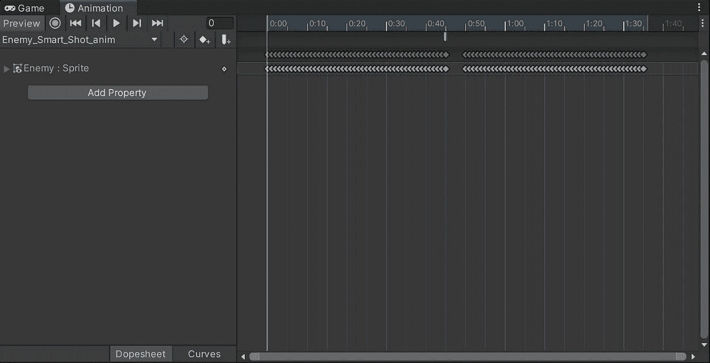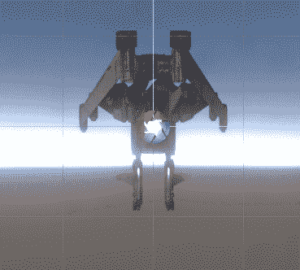

然后，我们需要在 **Animator** 视图中修改敌人动画控制器，使智能镜头回到正常动画，并且每个都与敌人被消灭时的爆炸有联系:

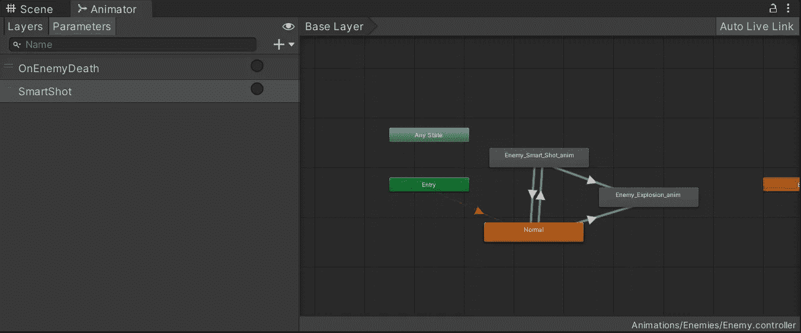

# 创造聪明的行为

为了创建智能行为，让我们打开**敌人**类，并添加一个新变量来存储敌人是否智能:

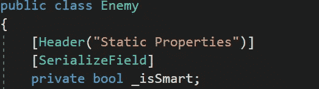

我们使用私有变量和公共属性从其他类中获取值:

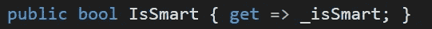

然后，让我们打开 **EnemyBehavior** 类并创建一些新变量来帮助我们处理智能行为:

*   聪明则延迟

这个变量将存储在检查玩家是否在敌人后面之前等待的时间。通过使用**【serialize field】**我们可以通过检查器修改它的值。

*   智能延迟

这将有助于处理相应的延迟时间，并避免在处理智能行为的协程中浪费内存。

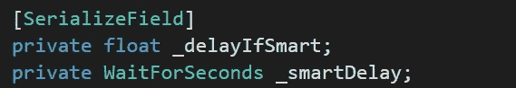

此外，让我们使用另一个变量来存储智能快照预设引用，它将有另一个要实例化的偏移:

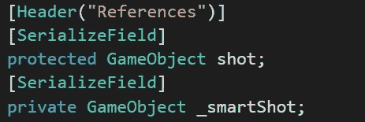

然后，让我们选择敌人预置到场景视图中，并在检查器中修改它的值，使它变得智能:

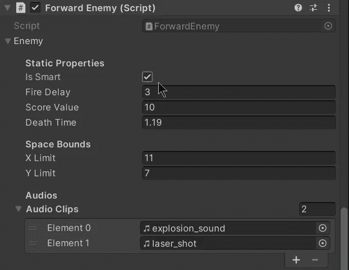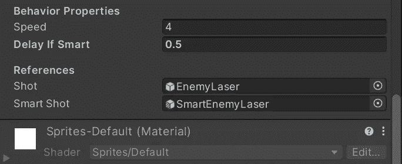

现在，让我们回到 **EnemyBehavior** 类来实现智能行为。在 **Start** 方法中，我们将检查敌人是否聪明，如果是，我们将使用各自的浮点值初始化聪明延迟，然后调用协程检查玩家是否在敌人后面:

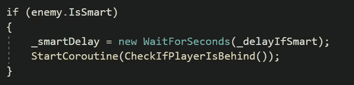

在**checkifplayerislafter**协程中，我们需要一个新的局部变量来存储光线投射的长度，以识别玩家碰撞器。

然后，我们将进入一个 while 循环，一直运行到敌人被消灭。在这个循环中，我们将使用 **Physics2D 收集所有被我们的光线投射击中的对撞机。射线追踪法。然后，我们将检查收集的所有碰撞器，如果我们确定了玩家，我们将触发智能射击动画并延迟默认射击(在敌人前面)。最后，我们需要返回相应的延迟，直到下一次光线投射开始:**

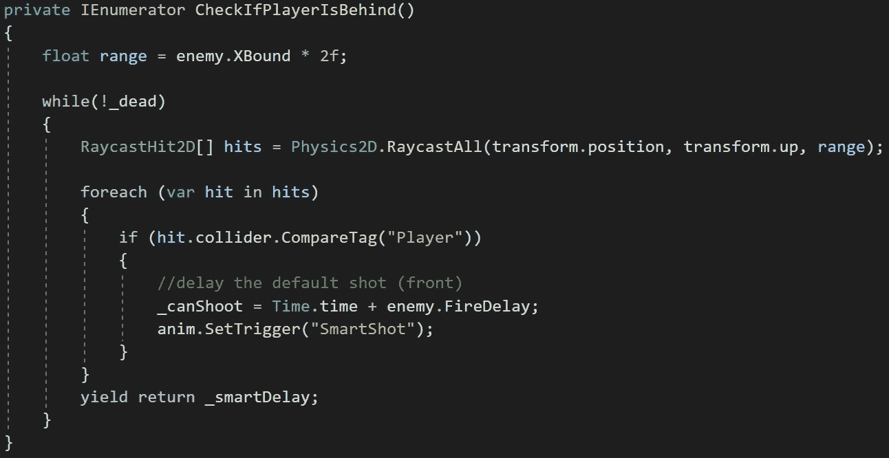

现在，让我们创建将使用智能快照动画中的动画事件调用的方法。这将实例化智能快照预设，反向旋转以移动到另一个方向:

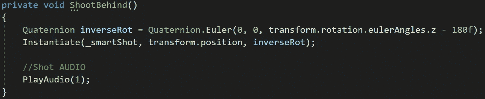

现在，在智能快照动画剪辑中，让我们单击动画事件并选择相应的方法来实例化快照:

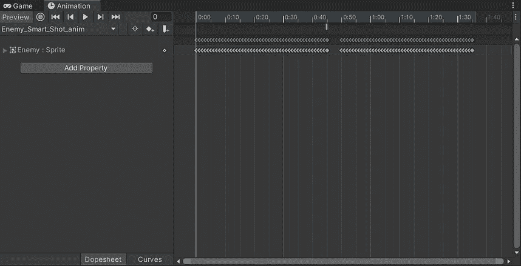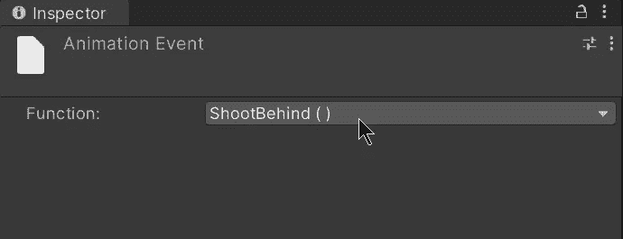

最后，我们可以将智能敌人从场景视图中拖到相应的预设文件夹中，并使其成为预设变体:

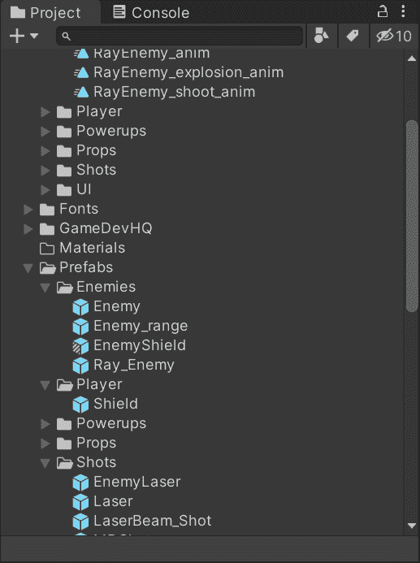

# 滋生聪明的敌人

为了实例化聪明的敌人，我们需要把新的预置拖到种子管理器中:

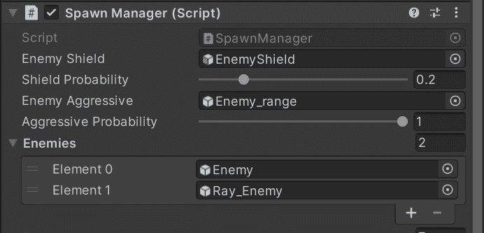

现在，如果我们在 Unity 中运行游戏，我们将能够看到一些敌人在检测到玩家在他们身后时开枪:

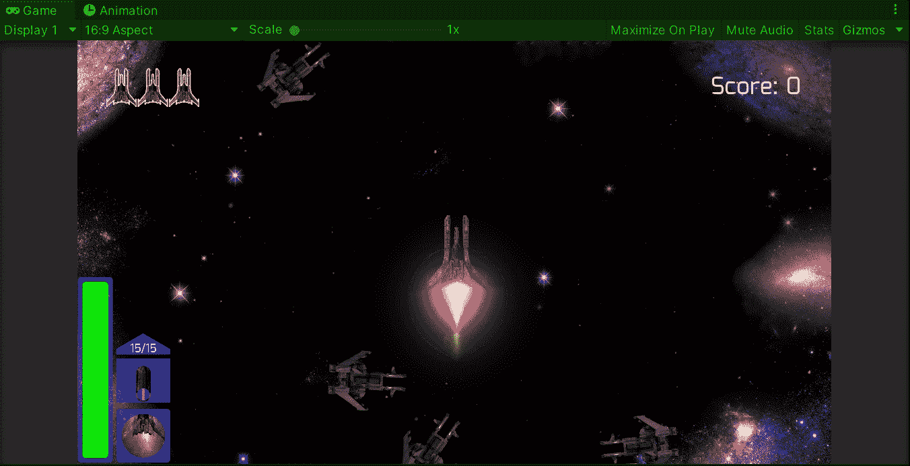

就是这样，我们实现了一个聪明的敌人！:d .我会在下一篇文章中看到你，在那里我会展示更多添加到我的 Unity 太空射击游戏中的功能。

> *如果你想了解我更多，欢迎登陆*[***LinkedIn***](https://www.linkedin.com/in/fas444/)**或访问我的* [***网站***](http://fernandoalcasan.com/) *:D**