# 实现太空射击游戏功能-推进器

> 原文：<https://medium.com/nerd-for-tech/implementing-space-shooter-game-features-thrusters-67aa02b314b6?source=collection_archive---------15----------------------->

## 统一指南

## Unity 空间射击游戏新增功能快速回顾

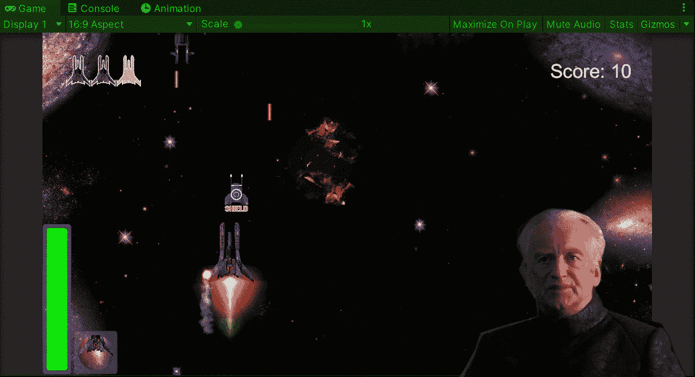

**目标**:用 Unity 实现一个太空射击游戏的助推行为及其平视显示(HUD)。

# 推进器助推行为

在以前的一篇文章中，我介绍过[如何为你的游戏](/nerd-for-tech/creating-a-power-up-for-your-game-in-unity-6810d73376a1)创建一个电源，然后[制作动画](/nerd-for-tech/animating-sprites-in-unity-9d02762bde96)。其中一个实现的增强是持续 5 秒的速度提升，但是让我们让速度提升成为玩家的一个特性。

在几个游戏中，当按下左 shift 键时会触发速度提升或跑步动画，所以我将为我的玩家做同样的事情。

首先，让我们在玩家脚本中创建一个新变量，它将存储可支配的能量，以使增强成为一个有限的功能:

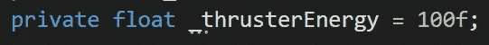

这个变量也可以是一个整数值。

然后，我们需要确定控制运动的功能:

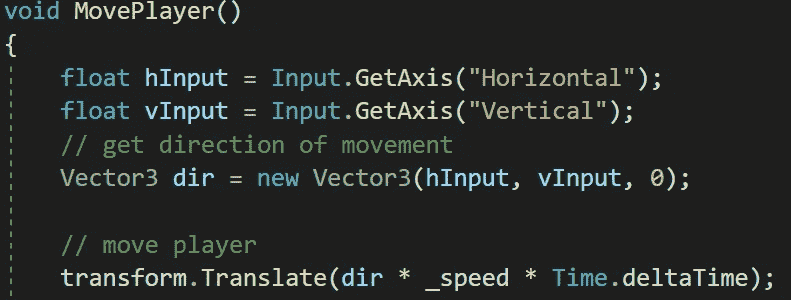

为了使用左 shift 键作为 boost 触发器并显示它，让我们向移动播放器的代码行添加一个新条件。该条件将需要左移位键保持按下，推进器能量大于 0，而移动将乘以我选择的推进系数:

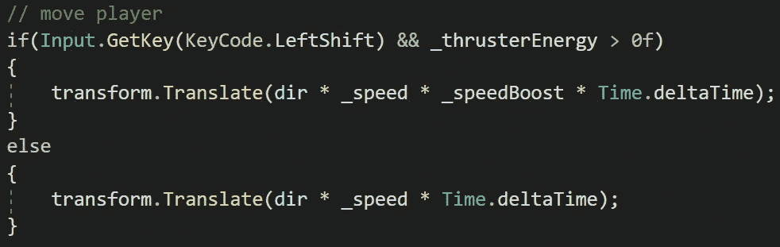

然后，让我们分别减去推进器的能量，使推进受到限制:

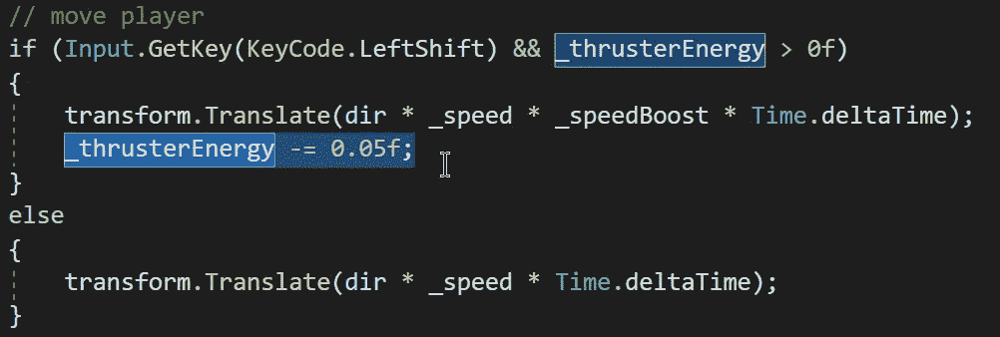

现在，当我们在 Unity 中运行游戏时，当我们按下左 shift 键直到能量耗尽时，玩家将移动得更快:

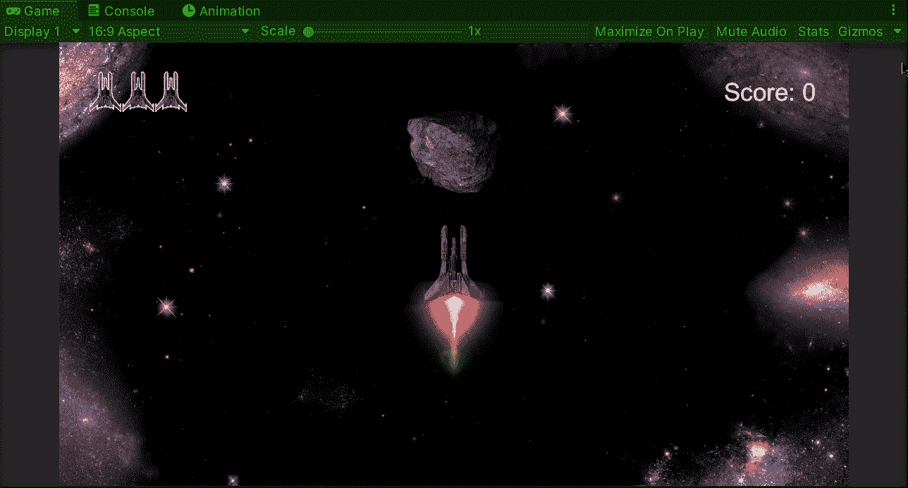

# 增强 HUD

现在，为了显示推进器的能量使用情况，让我们在画布中创建各自的 HUD，其中有分数和生命显示器。首先，让我们添加一个图像作为显示能量级别的条形图的背景:

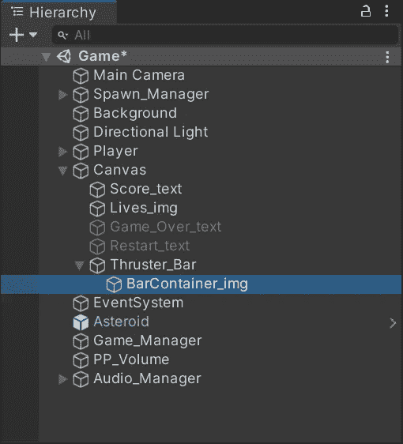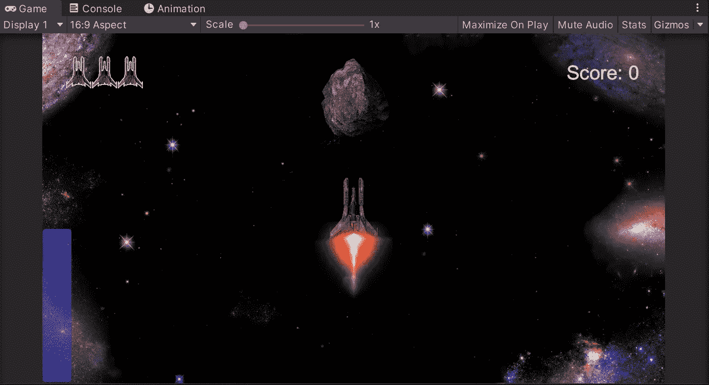

然后，让我们添加另一个图像作为能量级别的容器:

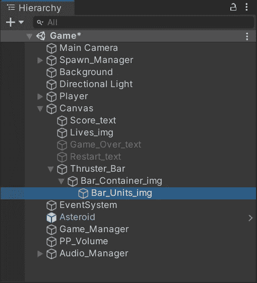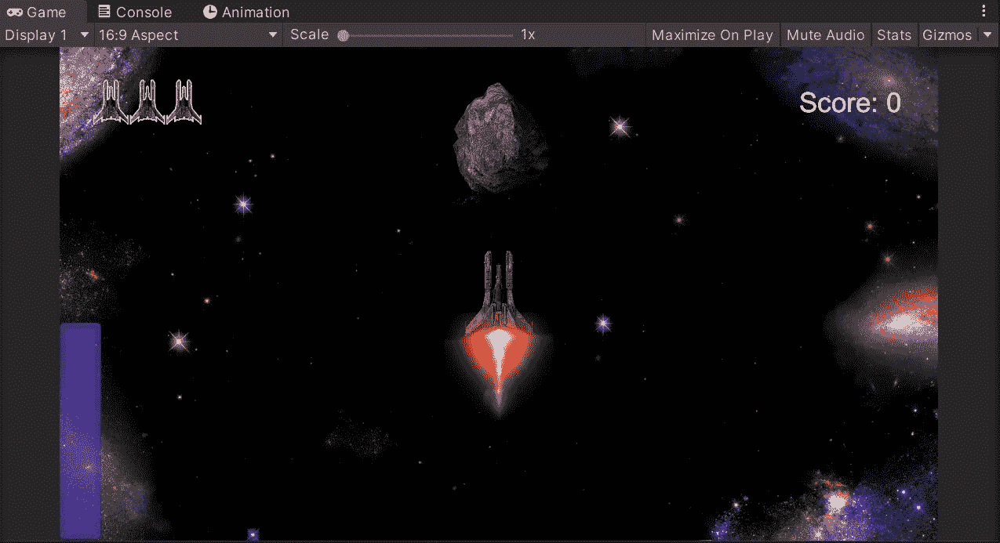

现在，为了显示每帧的更新水平，让我们创建另外两个图像:

*   父亲的形象

该图像将包含一个遮罩脚本，它将改变子图像的外观。在这种情况下，它需要是填充图像类型，以便填充量决定子图像的可见程度。

*   儿童图像

这个图像将与我们之前创建的容器图像大小相同，它将作为填充它的图像。

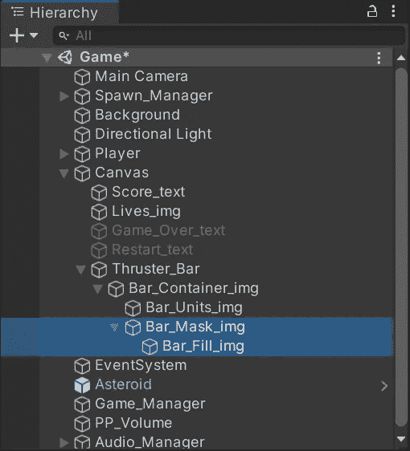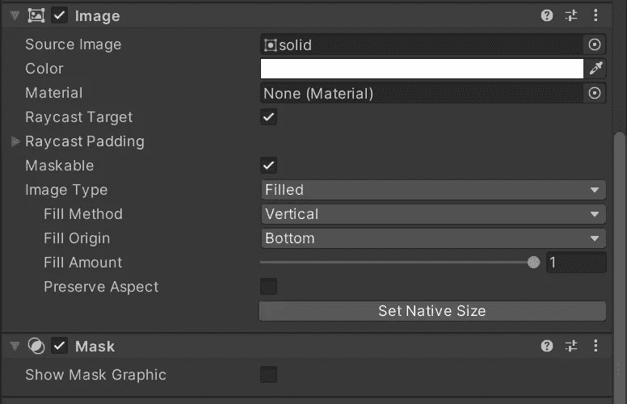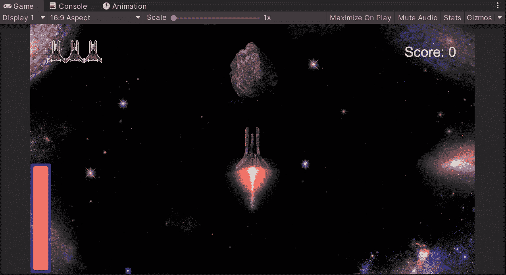

改变遮罩的填充量，让我们像这样显示能量水平。

如果您想了解更多关于口罩的信息，您可以访问 Unity 文档:

 [## 面具

### 你如何在整个工作流程中使用文档？请参加本次调查，与我们分享您的体验。一个(用户…

docs.unity3d.com](https://docs.unity3d.com/2018.4/Documentation/Manual/script-Mask.html) 

现在，在代码中，让我们打开 UI 管理器脚本，并创建新的变量来存储对遮罩的引用以及该条将显示的最大能量:

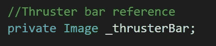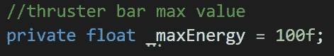

然后，让我们创建一个函数，通过将当前能量值除以最大能量值来更新遮罩的填充量:

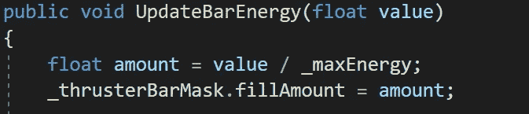

最后，在玩家脚本中，我们可以调用相应的函数来更新 HUD 上的值，每次玩家通过按下左 shift 键来使用 boost:

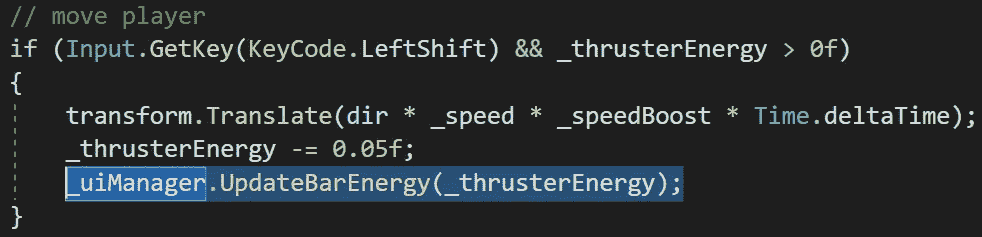

如果我们在 Unity 中运行游戏，当玩家使用 boost 时，工具条将会更新:

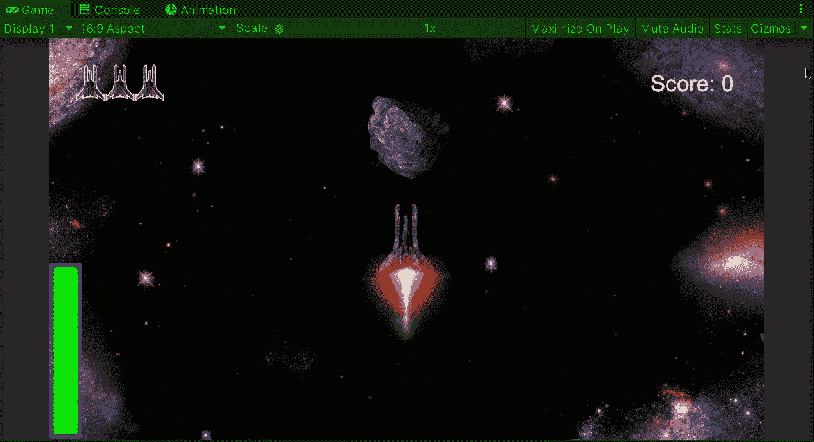

我们还可以使用协程来实现一个冷却系统，当玩家使用 boost 一段时间后，它会惩罚玩家一段时间，直到玩家可以再次使用它:

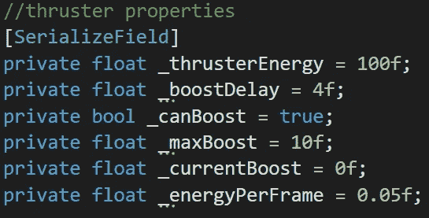

通过使用类似上面的 UI 元素，我们可以创建另一个 HUD 来显示玩家当前的能量使用情况:

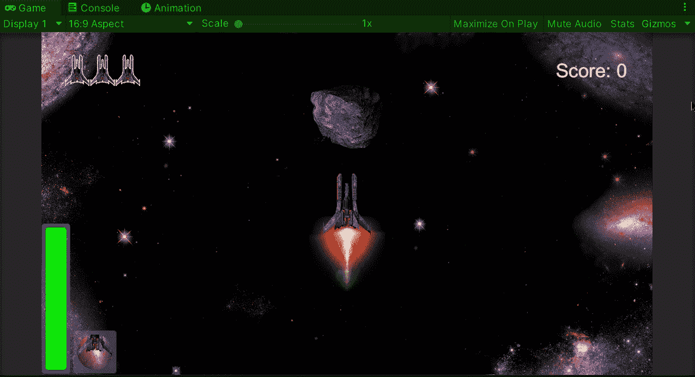

就这样，我们实现了一个推进器 HUD 及其行为！:d .我会在下一篇文章中看到你，在那里我会展示更多添加到我的 Unity 太空射击游戏中的功能。

> *如果你想更多地了解我，欢迎登陆*[***LinkedIn***](https://www.linkedin.com/in/fas444/)**或访问我的* [***网站***](http://fernandoalcasan.com/) *:D**