# 实施 LedgeGrab 系统

> 原文：<https://medium.com/nerd-for-tech/implementing-the-ledgegrab-system-3525b93127c6?source=collection_archive---------22----------------------->

昨天，我们准备了所有的部分，今天我们将把它们全部实现到一个系统中，让玩家像专业人士一样抓住边缘！

将一个刚体添加到 Ledge_Checker 立方体中。
我们将使用 Ledge_Checker 来进行检测，因此我们将为它添加一个刚体，以便触发碰撞器工作。确保关闭重力，同时打开运动学。

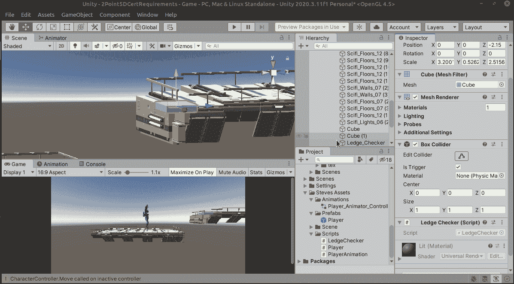

接下来，向玩家的 Ledge_Grab_Checker 立方体添加一个标签 LedgeGrabChecker

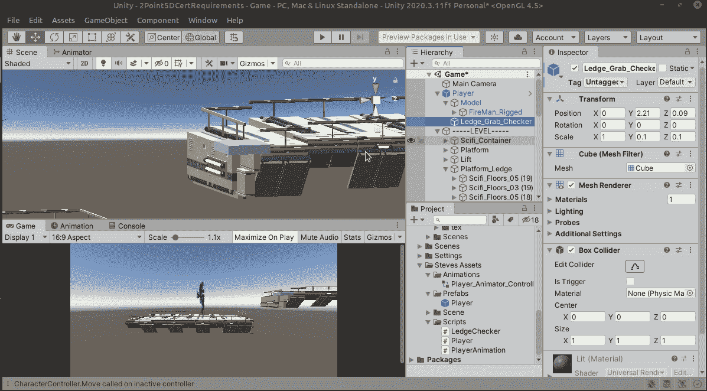

现在我们准备编码了！我们将首先为 LedgeChecker 创建一个名为…LedgeChecker 的脚本。

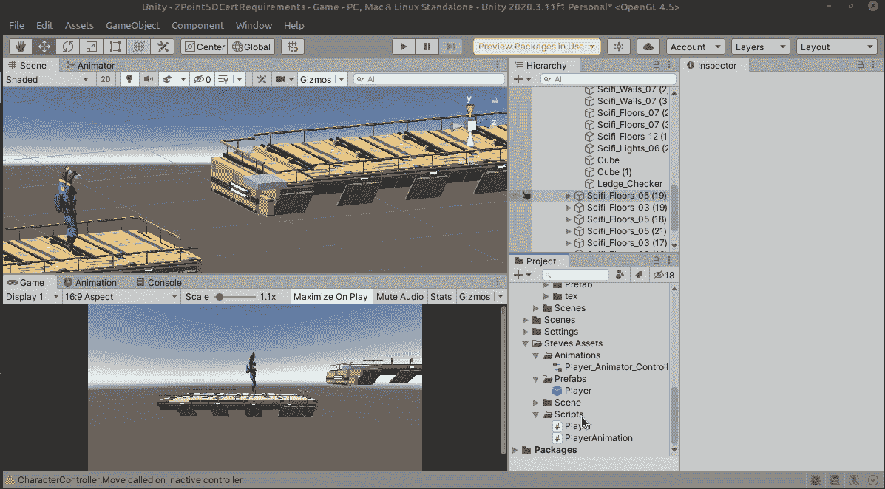

现在我们将使用 LedgeCheckers 触发碰撞器来检查标签“LedgeGrabChecker”，所以让我们为它设置一些东西。

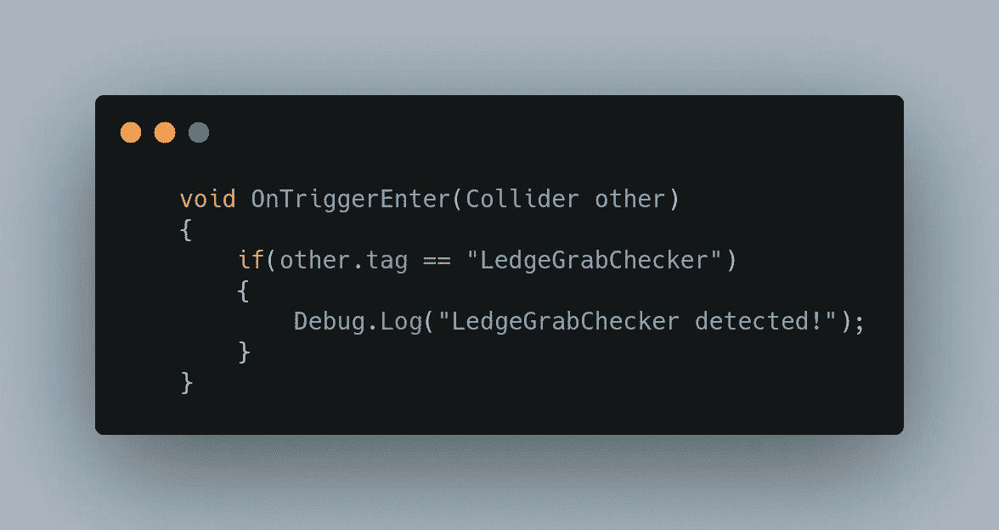

让我们看看它是否正常工作。

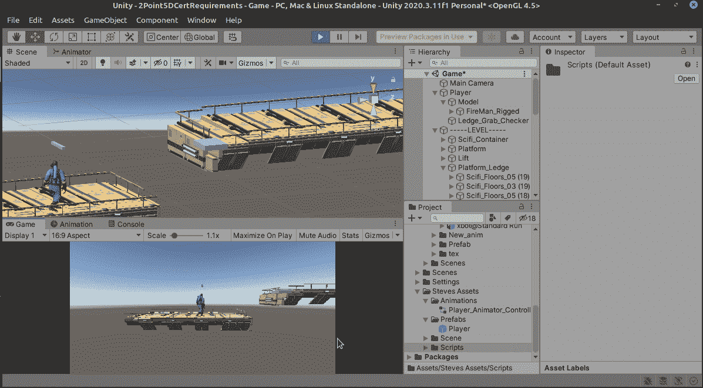

确实是！现在我们只需要做一些事情，阻止玩家摔倒，播放窗台动画！

第一部分非常简单，我们可以禁用角色控制器，但我们无法在 ledge_checker 脚本中做到这一点，我们必须从播放器脚本内部完成它，所以让我们创建一个公共函数，ledge_checker 可以调用它来完成我们需要的一切，在播放器脚本内部，我们将添加此函数:

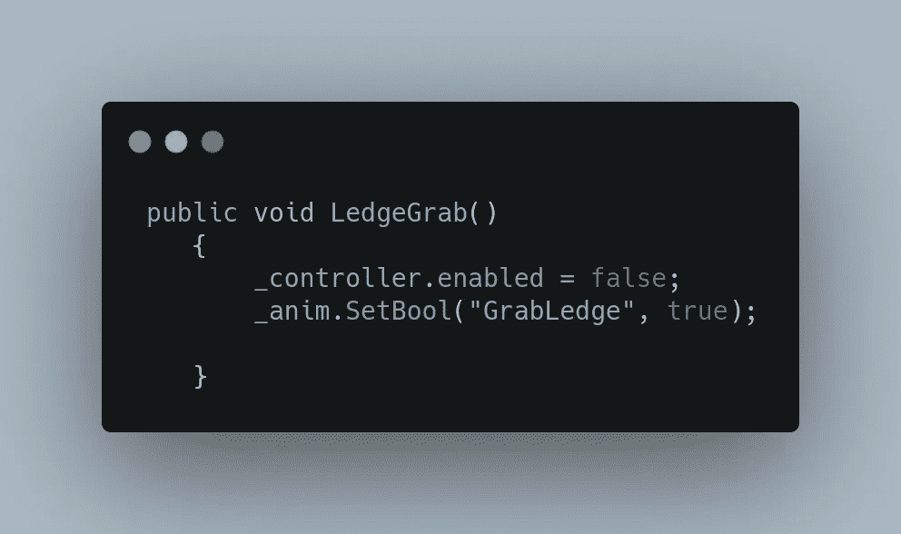

相当简单！我们已经有了一个角色控制器，所以我们只需用 _controller.enabled = false 禁用它；。_anim 持有者也已经看到了一些奔跑和跳跃的动作，所以让我们用昨天设置的 bool 给它加上悬挂！

现在我们已经设置好了 LedgeGrab 函数，让我们回到 LedgeGrabChecker 脚本并在我们的触发器中访问它。

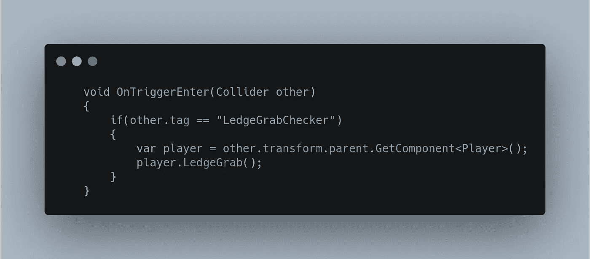

现在我们可以检测 LedgeGrabChecker，我们将把触发检测中的“其他”玩家放入一个容器中。注意，我们使用了父元素，因为我们的 LedgeGrabChecker 立方体是播放器的子元素，所以如果我们想要播放器脚本，我们需要访问父元素。一旦我们这样做了，我们就运行我们刚刚编写的 LedgeGrab 函数来禁用角色控制器并运行抓取壁架动画。所以我们来试试吧！

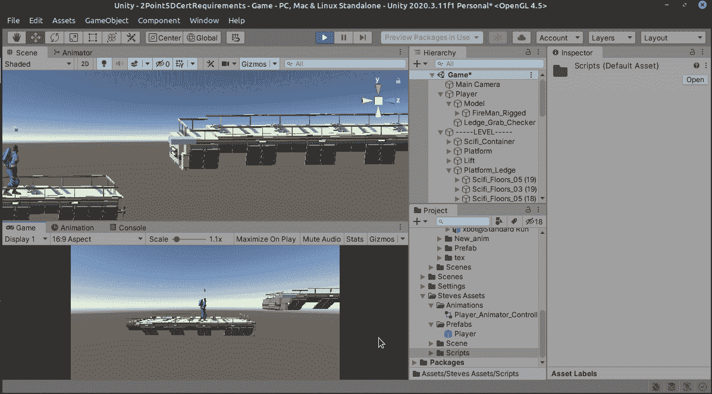

漂亮！！！

让我们再实现几个动画命令来加强我们的逻辑。

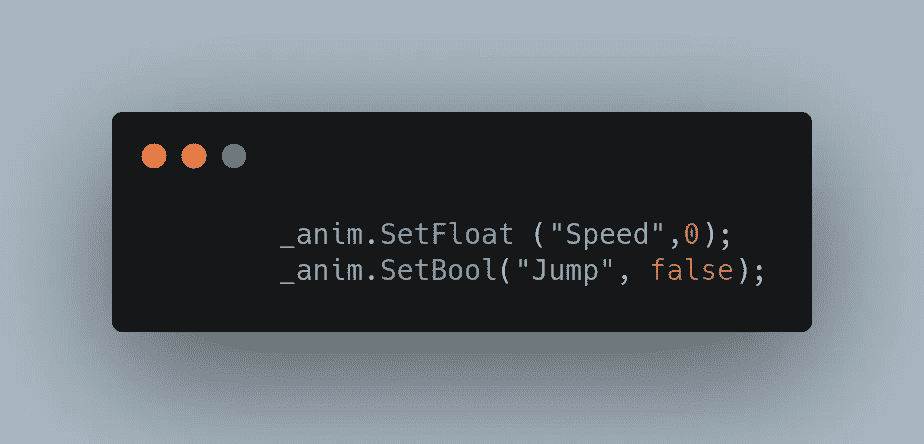

这将导致一个小故障，并使播放器返回到空闲状态，所以让我们通过添加一个从 running jump 到 idle 的条件来解决这个问题，这就是 add GrabLedge = false。

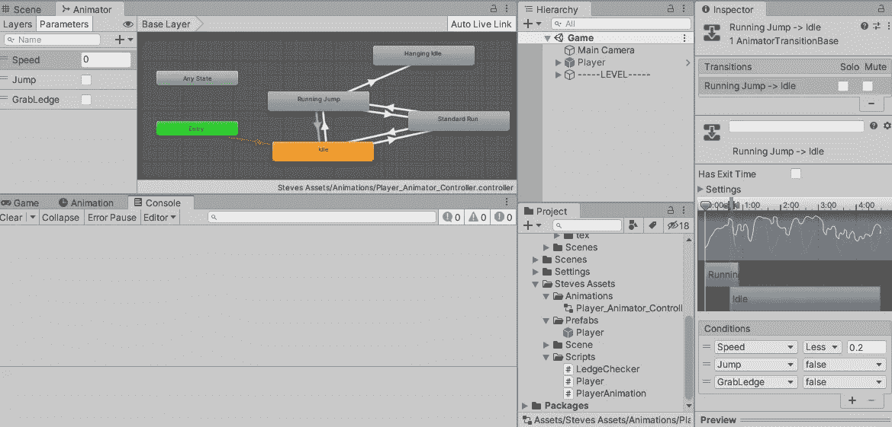

太好了！现在一切都好了！一个小问题，手不太在窗台上，用一点额外的幕后魔术，我们可以让它看起来“正确”。首先，在玩游戏时，当玩家挂在壁架上时抓住他，然后把他带到看起来不错的山脊附近，然后写下 x、y 和 z 轴。

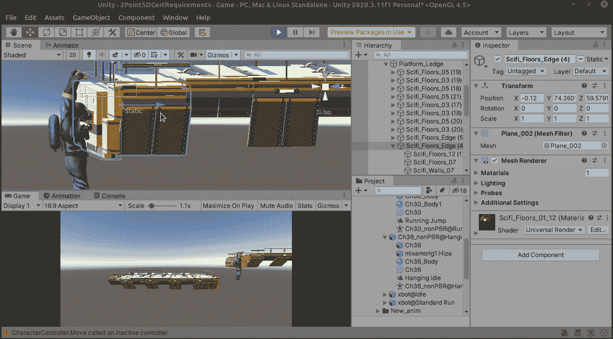

接下来，让我们回到 LedgeGrabber 脚本，我们将创建一个名为 _handPos 的新 Vector3 变量。

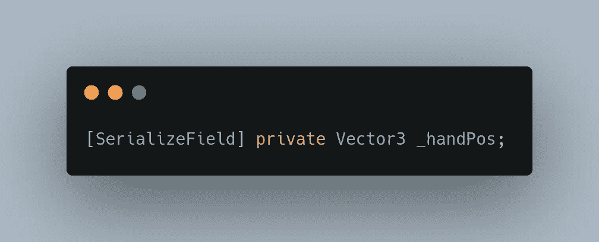

这将有助于模块化任何平台，玩家可以通过调整每个平台上的手的位置来攀爬。

因此，让我们在检查器中将我们记下的数字输入这个变量。

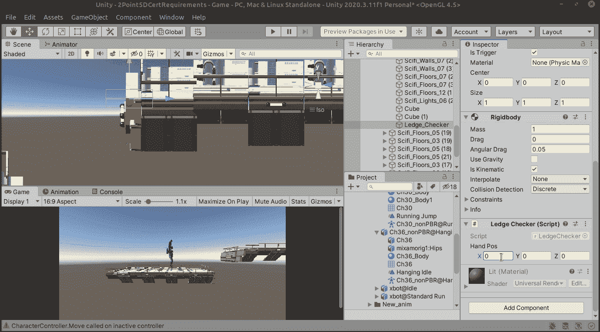

现在我们将把这个变量从 LedgeChecker 传递给播放器。

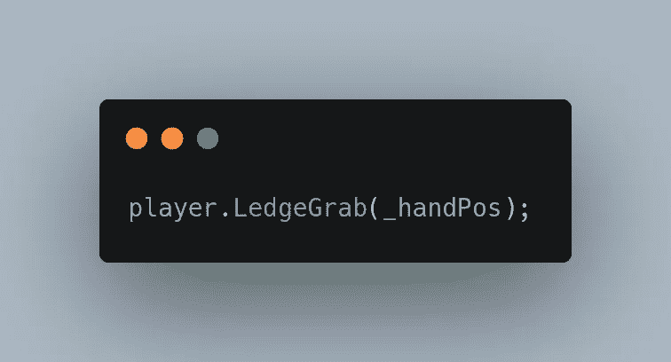

在玩家脚本中，让我们将玩家的位置移动到通过 _handPos 传送的位置。

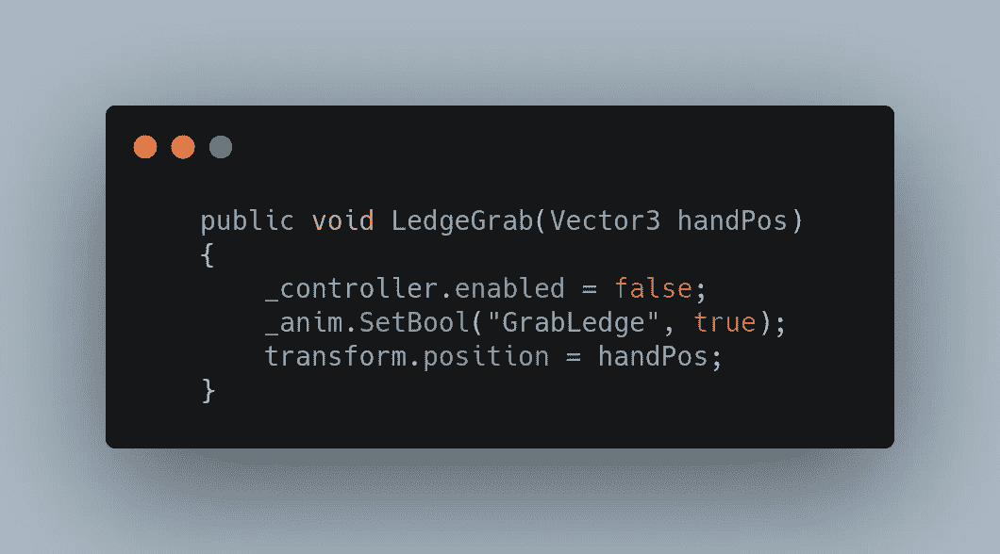

看起来不错！现在让我们看看它的实际效果！

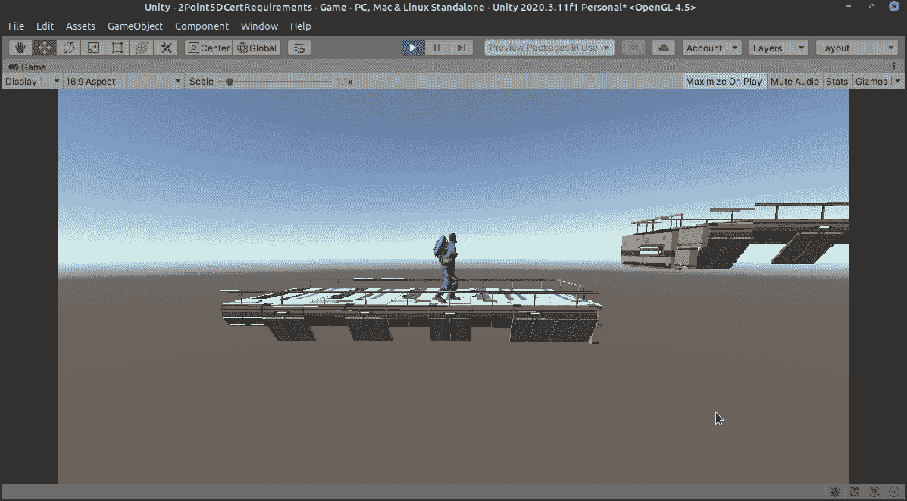

紧紧的！

明天我们将让玩家爬上平台！