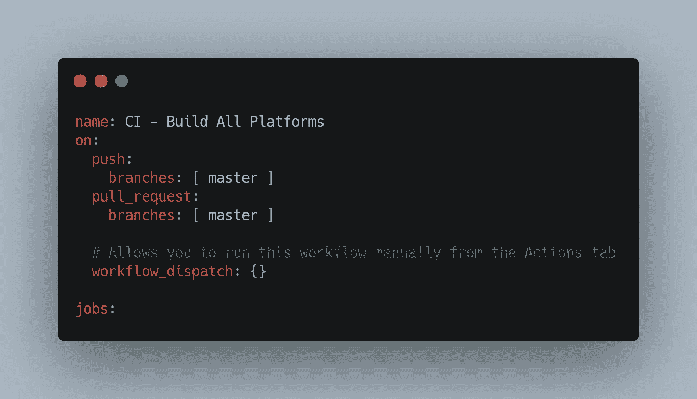
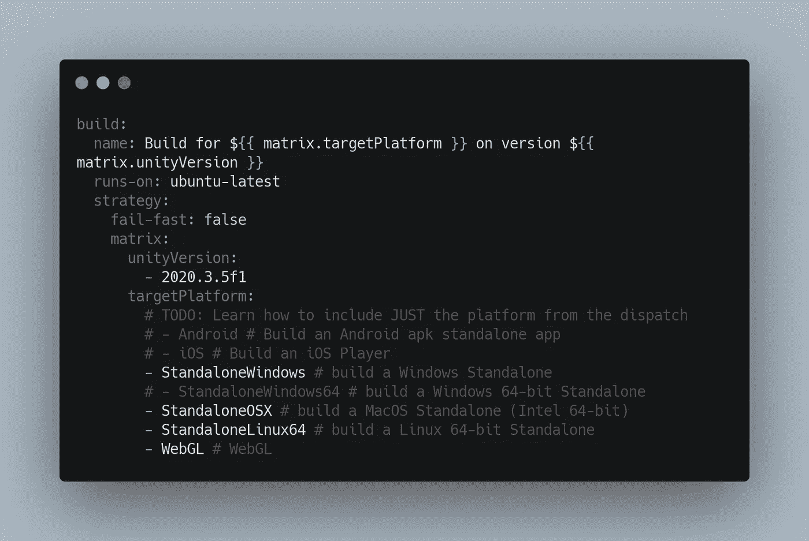
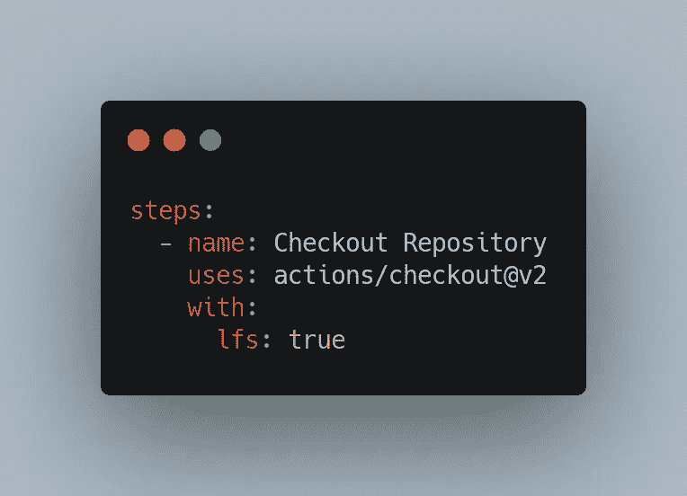
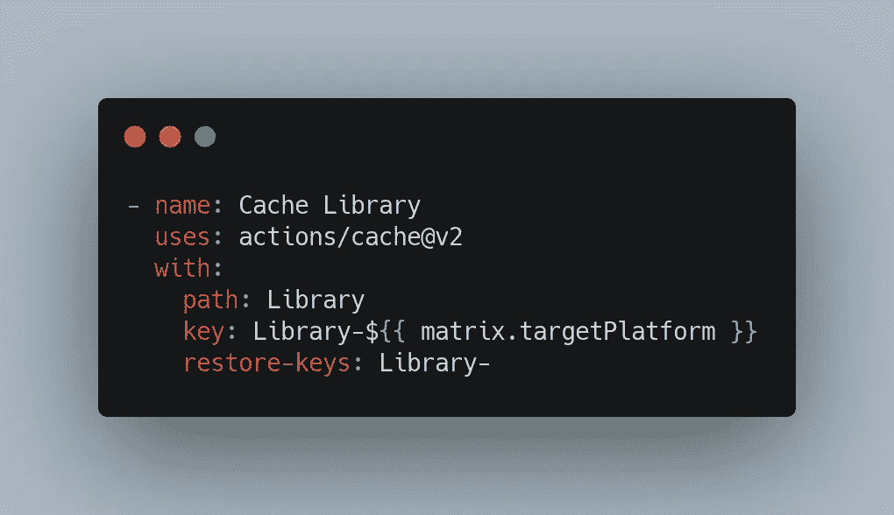
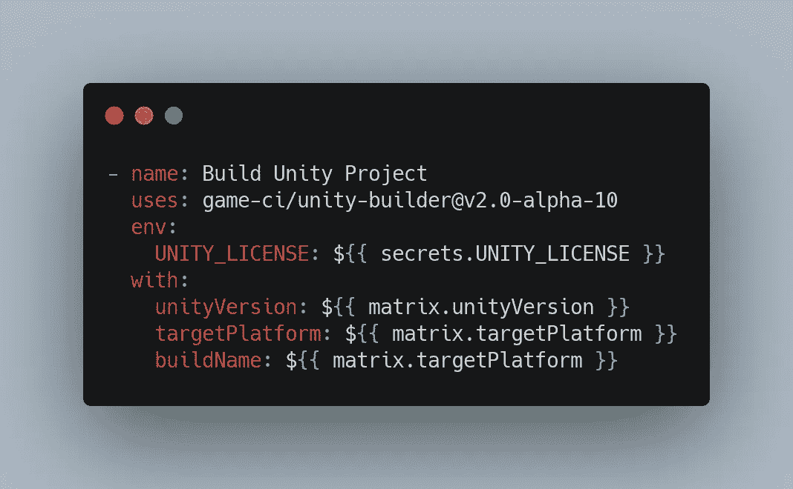
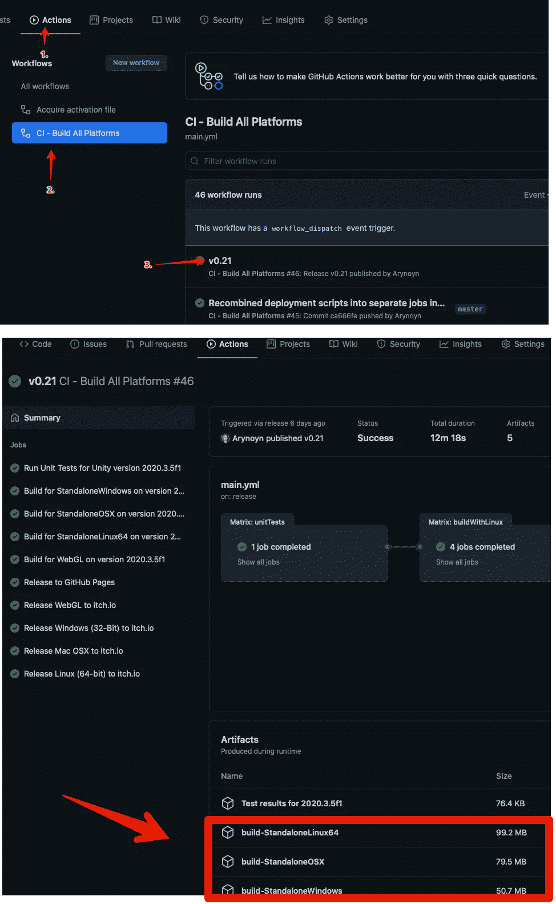
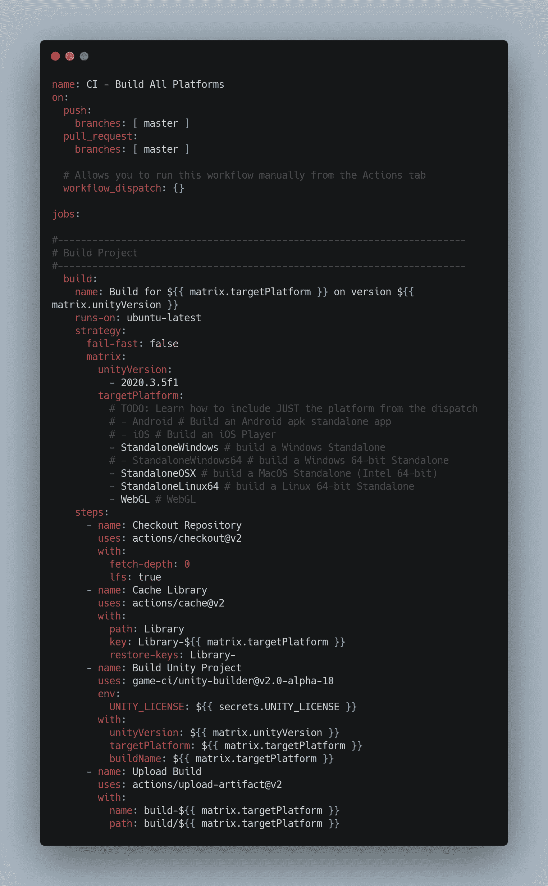

# 实施工作流程

> 原文：<https://medium.com/nerd-for-tech/implementing-the-workflow-3312649ec9a7?source=collection_archive---------16----------------------->

## 设置与 Unity 和 GitHub 操作的持续集成—第 3 部分

上一次，我们查看了如何将我们的第一个工作流导入 GitHub，并使用它来获取 Unity 许可文件，我们将该文件存储在我们的 GitHub secrets 中。今天，我们将讨论实现构建工作流的细节。

## 设置构建工作流

建立我们的构建工作流的过程有几个步骤。

1.  在我们的。github/工作流文件夹
2.  添加名称、打开和作业工作流程步骤
3.  定义我们将要运行的平台和 Unity 版本。
4.  将检出、缓存、构建器和上传步骤添加到我们的作业中
5.  将文件签入到我们的主分支(根据您的存储库工作流，这可能需要将其签入到功能分支，然后请求适当的“拉”请求和批准，以便在文件显示在“操作”选项卡中之前将文件发送到主分支)。

注意:确保你已经在 Unity 的构建设置中包含了游戏场景，否则什么都不会构建，你会像我一样感到困惑。

## 创建我们的文件和顶级属性

首先，我们创建我们的文件，在这种情况下，我们只是将它命名为 main.yml。记住制表符和间距在 YAML 文件中很重要。

name 属性是不言自明的，它将显示在 GitHub 上的界面中。设置属性上的**,以便该工作流将在代码被推入主分支或针对主分支完成拉请求时触发。最后，我们添加一个空的 **workflow_dispatch** 节点，这样我们就可以在需要的时候手动触发这个工作流。然后我们用关键字**工作**开始工作列表。接下来我们将依次检查每一项工作。**

> **注意**:我仍然使用“主”分支作为我的主要分支。GitHub 现在的默认设置是“Main ”,你可能需要调整上面的分支名称来适应你的设置。此外，在[https://docs . GitHub . com/en/actions/learn-GitHub-actions/introduction-to-GitHub-actions](https://docs.github.com/en/actions/learn-github-actions/introduction-to-github-actions)查看 GitHub 文档，了解触发工作流文件时的其他选项和自定义方式。

## 定义平台和 Unity 版本

在构建定义的开始，在 **jobs** 标签下，我们需要定义一些作业级属性。下面是我们需要定义的内容:

我们的作业定义从作业的标识符开始，在我们的例子中是 ***构建*** 。在此之下， **name** 属性完成了您所期望的任务，并提供了一个可读版本的作业名称，用于在 GitHub 界面中显示。接下来我们有了**运行**关键字。这为虚拟机定义了平台，该平台

作业将在上运行，在我们的例子中，我们将在基于 Linux 的 Ubuntu 虚拟机上运行作业，该虚拟机具有 GitHub 提供的虚拟机中构建的最新版本的映像。

下一部分是我们的**战略**部分。这一部分提供了我们希望我们的作业如何运行的详细信息。我们的**策略**部分的第一个选项是**快速失效**。这个选项告诉我们的运行程序，也就是虚拟机和自动化软件的名称，如果任何一个步骤失败，就停止运行整个作业。默认情况下，此选项是打开的，但在这里我们将其关闭，因为我们要将此作业配置为多次运行，针对我们要构建的每个操作系统和 unity build 版本运行一次。我们不希望一个失败的作业停止所有剩余的作业。

我们的**策略**部分的最后一部分是**矩阵**部分。在这一部分中，我们可以定义选项数组，我们的 runner 将遍历这些选项并为其创建单独的运行。在我们的例子中，运行程序将遍历我们选择的每个 unity 版本，由 *unityVersion* 标签下的列表指示，并为 *targetPlatform* 标签下的选项数组中列出的每个版本运行构建。出于我们的目的，我们只使用一个 Unity 版本，但我在**矩阵**中指定了它，因为我们构建步骤使用的默认 Unity 版本与我想要构建的版本不同。我还注释掉了一些我目前不想构建的构建平台，但我没有删除它们，因为我将来会想用它们来构建。我们用“#”符号注释掉 YAML 的行。

## 检验

随着矩阵配置和基本工作信息的建立，我们现在需要开始定义我们的步骤。我们需要执行的第一步是在虚拟机上签出我们的存储库的副本，以便我们使用。GitHub 为此提供了一个动作供我们使用。

结帐动作

我们从 steps 关键字开始，然后是第一步定义。同样，请记住制表符和空格与**名称**关键字旁边的“-”符号同样重要。

与该文件中的其他部分一样，我们的步骤包含一个用于在 GitHub 界面中显示的 **name** 属性。这一步之后是**使用**关键字，它包含我们想要使用的另一个回购的动作的位置。在这种情况下，是 GitHub 提供了检查我们的存储库的动作。最后，带有的**部分为结帐操作提供了一些配置选项。**获取深度**告诉动作要获取多少提交，在本例中“0”表示所有分支和标签的所有历史。 **lfs** 选项定义是否下载 Git-lfs 文件。因为构建游戏经常需要大的资产文件，所以我将这个设置为真，并确保我的回购在创建时使用 LFS。**

## 隐藏物

因为我们正在运行多个构建，每个 Unity 版本的每个平台一个，所以我们想要缓存我们的库文件夹，以便在构建之间重用。库文件夹通常会非常大，并且不会因平台而异。缓存每个 Unity 版本的文件夹可以帮助我们节省大量宝贵的构建时间。

缓存操作

这一步的结构，实际上是大多数步骤，看起来与结帐步骤相似。我们提供了一个人类可读的**名称**，我们使用 **uses** 关键字来定义另一个 repo 要运行的动作，我们使用**和**来提供该动作的参数。这个动作是 GitHub 提供的另一个动作。我们提供了我们想要缓存的文件夹的**路径**，我们想要引用缓存版本的**键**，以及 **restore-keys** 属性，它是一个有序的键列表，如果操作在缓存中没有找到所请求文件夹的副本，就可以使用它。

## 建设

这是我们工作的主要部分。该作业使用由[游戏设置的作业运行器。CI](https://game.ci) 安装 Unity 的无头副本，并根据**和**部分设置的参数执行构建。

构建操作

这个动作是我们将 GitHub 秘密和**矩阵**变量投入工作的地方。我们提供了我们在上一篇文章中构建并存储在 GitHub Secret 中的 Unity 许可证，以便在 runner 上安装 Unity 得到许可并正常运行。然后，我们使用我们的矩阵变量来提供 Unity 版本、目标平台，并基于当前执行的参数为运行程序的每次执行构建一个构建名称。

注意:我使用的是游戏提供的 Unity Build 动作的 alpha 版本。CI，因为在编写 MacOS build 时需要 alpha 版本的特性，这些特性还没有合并到 Builder 动作的主存储库中。这只对那些目标是在 MacOS 的当前版本 Big Sur 上运行的 MacOS 版本是必要的。更多关于建造者行动的信息请查看[游戏。CI](https://game.ci) 的官方文件位于 https://game.ci/docs/github/builder

## 上传

现在我们已经执行了一个构建，我们希望能够访问从每个构建中生成的文件。为此，我们需要上传矩阵每次迭代的文件，GitHub 称之为**工件**。这些生成的工件与构建存储在一起，并且可以从 actions 选项卡上包含每次操作运行结果的屏幕中访问。默认情况下，上一步中的构建器动作将其构建输出到一个名为 build 的文件夹中，然后我们提供了一个*构建名*，它与来自策略**矩阵**的*目标平台*一致。因此，我们根据这些参数提供上传步骤的位置。

上传操作

工件被列在 GitHub Actions 选项卡上的 Action run 结果下面(一旦动作在存储库和 operating 的默认分支中)。

## 完整的文件

以下是完整文件的内容供参考

完成的配置项文件

## 签入文件并触发生成

现在我们的文件已经完成，因为我们的管道的持续集成部分已经完成，我们需要将它登记到我们的存储库中，并确保它在我们的主分支中结束(如果您在团队中工作或者在您的存储库中遵循该模式，这可能需要一系列的拉请求、批准和合并)。一旦它在主分支上，对主分支的任何推或拉请求都将触发这个工作流。

## 下次吧！

这就是我们构建管道的持续集成部分！虽然在我们构建之前运行单元测试作为集成管道的一部分是可能的，事实上也是推荐的，但是单元测试本身就是一个完整的主题。请继续关注这个空间，以便将来撰写关于单元测试的文章，但是这超出了本系列文章的范围。下次我们将开始考虑在 GitHub actions 中添加 CI/CD 管道的持续交付部分！如果你喜欢这篇文章，或者想在我的旅程中与我同行，请在[gamedevchris.medium.com](#https://gamedevchris.medium.com)跟随我。