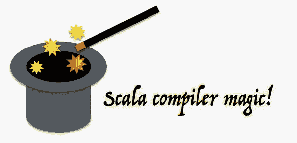

# Scala 中的隐式转换和参数

> 原文：<https://medium.com/nerd-for-tech/implicit-conversion-and-parameters-in-scala-ab1c4b3b6615?source=collection_archive---------7----------------------->

隐式定义是指如果有任何类型错误，编译器可以插入到程序中的定义。换句话说，这是避免代码中某种错误并继续程序执行的最终方法。考虑例子 *a+b* 如果 *a* 和 *b* 不兼容会发生什么，当然编译器会抛出错误。但是，如果编译器尝试是否有任何方法可以将 *a* 转换为类型，从而不会出现任何类型不匹配，例如*将 a+b 转换为 convert(a) + b* ，这将非常好。

这正是隐式所做的，它检查是否有任何方法来转换类型，以便可以避免可能的错误。编译器遵循一组应用隐式转换的规则。



**隐式转换规则**

*   **只有标记为隐式的定义才可用**

在上面的例子中，为了应用 convert(a)方法，必须有这样一个用关键字 implicit 定义的方法。

```
**implicit** **def** intToString(x**:** **Int**) **=** x.toString
```

如果在代码的给定上下文中有被标记为隐式的方法，编译器会自动地选择它，然后执行转换。

*   **给定的隐式必须在给定的范围内**

Scala 编译器只会考虑给定范围内的隐式转换，在上面的例子中要应用 convert 方法你必须把它带入程序范围。为了使用库中的隐式方法，我们必须首先显式导入它。例如

```
**import** **scala.preamble._**
```

导入包 *scala.preamble* 后，我们可以使用包内定义的所有隐式。在某种程度上，我们将定义的隐含性引入到当前的执行环境中。

*   **一次一个**

如果编译器试图解决一个隐式问题，就不可能将另一个隐式问题带入执行环境。

*convert 1(convert 2(x))+y*

这样的隐式转换是不可能的，因为 *conver2(x)* 正在进行中。

*   **每当代码在编写时进行类型检查，都不会尝试隐含**

如果代码已经运行良好，编译器将不会试图改变它，这条规则也可以采用，因为我们总是可以用显式代码隐藏隐式代码。

在程序中有三种使用隐式的方法，它们是*到预期类型的转换，选择和隐式参数接收者的转换*现在让我们逐一检查每一种方法。

**1-转换为预期类型**

如果编译器发现类型 X，但需要将其转换为类型 Y，那么编译器将检查任何隐式函数，如果没有这样的函数，它将抛出一个错误。

```
scala> **val** k**:Int** = **3.6**
<console>:11: error: type mismatch;
 found   : Double(3.6)
 required: Int
       val k:Int = 3.6
```

**解法**:定义一个隐函数将 double 转换为 Int。

```
scala> **implicit** **def** doubleToInt(x**:** **Double**) **=** x.toInt
warning: there was one feature warning; re-run with -feature for details
doubleToInt: (x: Double)Intscala> **val** k**:Int** = **3.6**
k: Int = 3
```

在上面的例子中，我们可以看到 double 类型自动转换成整数。这是因为在相同的上下文中有一个隐式函数 *doubleToInt* 。所以当我们把一个 double 类型赋给一个整数时

*应用 doubleToInt(3.6)，得到值 3。*

**2-转换接收器**

隐式类型转换可以应用于方法调用的接收者。

**模拟新语法**

```
**Map**(**1** -> "one", **2** -> "two", **3** -> "three")
```

在上面给出的例子中，你是否想过如何支持操作符 *- >* ！！！- >不是运算符，而是在 ArrowAssoc 类中定义的函数。

```
**package** **scala**
**object** **Predef** {
**class** **ArrowAssoc**[**A**](x**:** **A**) {
**def** -> [**B**](y**:** **B**)**:** **Tuple2**[**A**, **B**] **=** **Tuple2**(x, y)
}
**implicit** **def** any2ArrowAssoc[**A**](x**:** **A**)**:** **ArrowAssoc**[**A**] **=**
**new** **ArrowAssoc**(x)
...
}
```

当你写 1 -> "One "编译器会自动把 1 转换成 ArrowAssoc，这样就可以找到->方法并使用它。

**隐式类**

隐式类就是用 implicit 关键字声明的类。

```
scala> **case** **class** **Rectangle**(width**:** **Int**, height**:** **Int**)
defined class Rectanglescala> **implicit** **class** **RectangleMaker**(width**:** **Int**) {
     | **def** x(height**:** **Int**) **=** **Rectangle**(width, height)
     |}
defined class RectangleMakerscala> **val** myRectangle **=** **3** x **4**
myRectangle: Rectangle = Rectangle(3,4)
```

不存在像 x for int 这样的操作符，但是编译器会寻找到 int 的隐式转换，然后它会找到隐式类 *RectangleMaker* 和 *RectangleMaker* 中的方法 x。

**3-隐式参数**

我们定义了一个 PreferredPrompt 类，以及一个内部带有 greet 方法的对象 Greeter。

```
scala> **class** **PreferredPrompt**(**val** preference**:** **String**)
defined class PreferredPromptscala> **object** **Greeter** {
     | **def** greet(name**:** **String**)(**implicit** prompt**:** **PreferredPrompt**) **=** {
     | println("Welcome, " + name + ". The system is ready.")
     | println(prompt.preference)
     | }
     | }
defined object Greeter
```

现在我们可以显式地提供提示值，如下所示

```
scala> **val** bobsPrompt **=** **new** **PreferredPrompt**("relax> ")
bobsPrompt: PreferredPrompt = PreferredPrompt@1218e12scala> **Greeter**.greet("Bob")(bobsPrompt)
Welcome, Bob. The system is ready.
relax>
```

如果我们需要编译器隐式地为 *PreferredPrompt* 提供值，我们必须定义一个 PreferredPrompt 类型的预期类型变量，如下所示。

```
**object** **JoesPrefs** {
**implicit** **val** prompt **=** **new** **PreferredPrompt**("Yes, master> ")
}
```

然后导入到 *JoesPrefs* 把它带进执行的上下文中。编译器将在当前执行的上下文中寻找一个隐式值，如果找到，编译器将使用它，否则将抛出一个错误。

```
scala> **import** **JoesPrefs._**
import JoesPrefs._scala> **Greeter**.greet("Joe")
Welcome, Joe. The system is ready.
Yes, master>
```

**调试暗示**

隐式是 scala 中非常强大的特性，但有时很难做到正确。现在让我们看一些关于调试隐含错误的技巧。

```
scala> **val** chars**:** **List**[**Char**] **=** "xyz"
<console>:17: error: type mismatch;
 found   : String("xyz")
 required: List[Char]
       val chars: List[Char] = "xyz"
```

现在，为了调试错误，让我们显式地提供 wrapString。

```
scala> **val** chars**:List**[**Char**] **=** wrapString("xyz")
<console>:17: error: type mismatch;
 found   : scala.collection.immutable.WrappedString
 required: List[Char]
       val chars:List[Char] =wrapString("xyz")
```

现在我们得到了一个错误，wrapString 的返回类型与 chars 的类型不匹配。如果我们在隐式应用函数后没有得到任何错误，那么我们可以推断发生了违反作用域规则的情况(作用域内不存在隐式方法)。