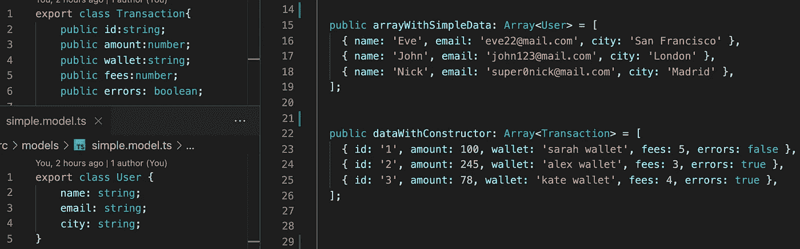
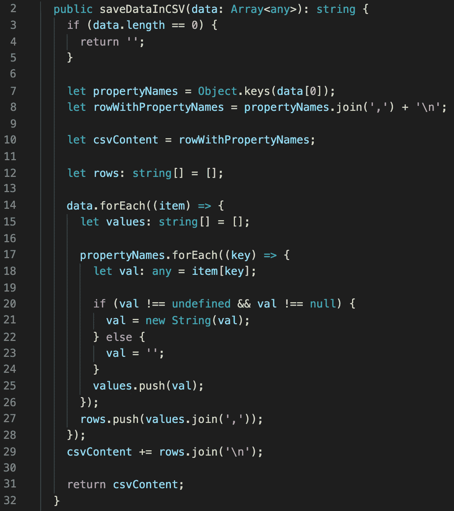
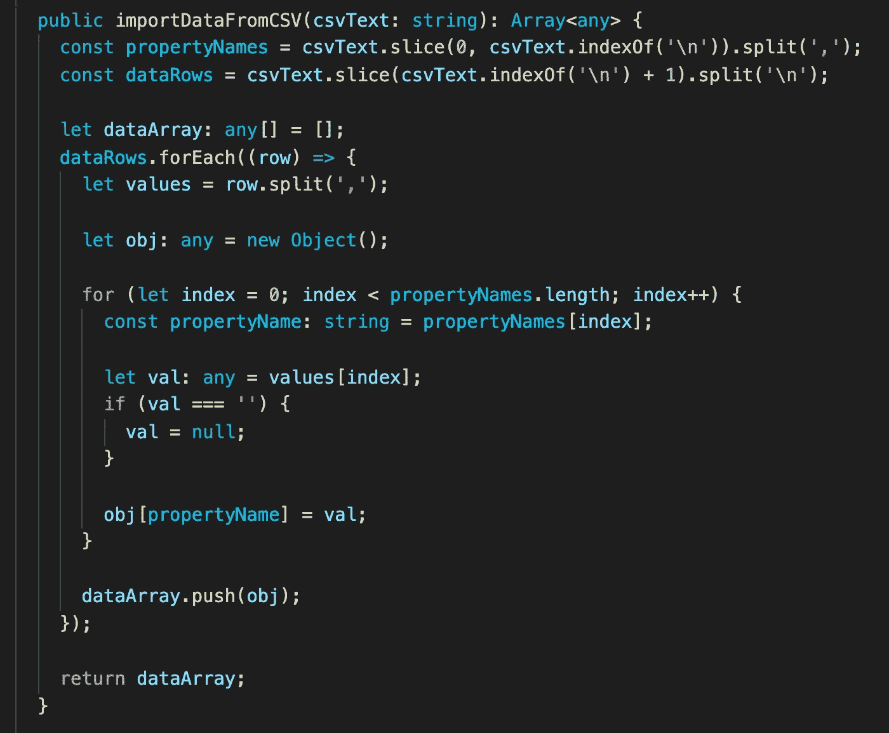
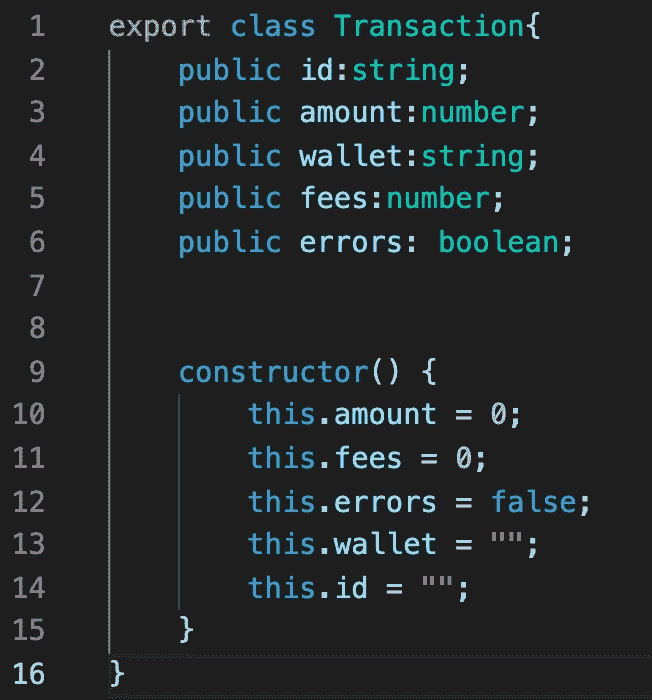
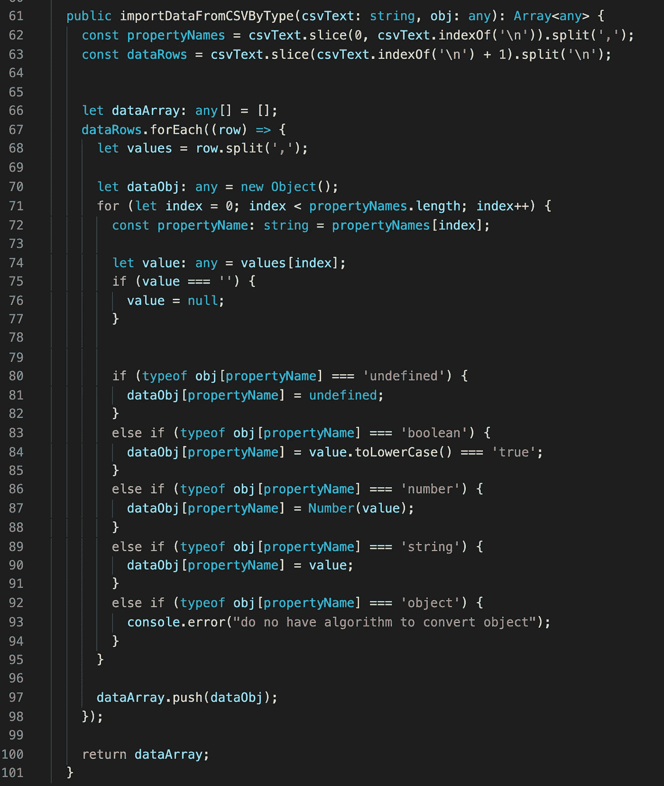
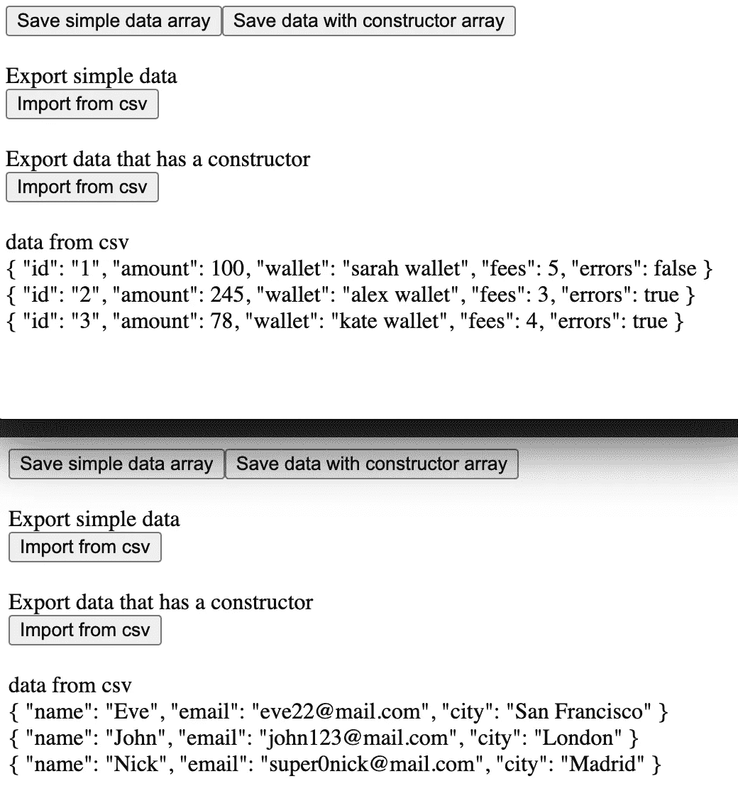

# 以角度格式导入和导出 CSV 格式的数据。

> 原文：<https://medium.com/nerd-for-tech/import-and-export-data-in-csv-in-angular-3c004f502d39?source=collection_archive---------0----------------------->

在本文中，我们将创建一个在 CSV 中导入和导出数据的算法。我们有两个模型数组，这些模型将被导入到一个 CSV 文件中。

以 CSV 格式保存数组。我们需要从数组中的第一个对象获取所有属性名。这些名称成为 CSV 文件第一行中的列名。然后，我们需要从数组中的每个对象获取所有属性值。每个对象都是一行，值之间用逗号分隔。

显然，当我们导出时，我们会反转一个算法。我们将文本分成行，然后按值划分。

但是我们有一个小问题。当我们在 CSV 中保存一个数组时，我们将每个对象属性转换成一个字符串。当我们从 CSV 导入时，每个值都是一个字符串。如果值必须是数字或布尔值呢？怎样才能定义正确的类型？

我们可以在我们的类型中创建一个构造函数。这个构造函数会给我们关于属性类型的信息。

我们将在导出数据的新方法中使用的类的构造函数。此方法将确定类的属性类型，并将值转换为正确的类型。

因此，我们可以导入和导出简单和复杂的类型。

如果你需要仔细看看这个项目[，这里是链接](https://github.com/8Tesla8/angular-csv)。

*原载于 2022 年 3 月 6 日*[*【http://tomorrowmeannever.wordpress.com】*](https://tomorrowmeannever.wordpress.com/2022/03/06/import-and-export-data-in-csv-in-angular/)*。*