# 使用超级查询将汇率导入 Excel 第 1 部分

> 原文：<https://medium.com/nerd-for-tech/import-currency-rates-into-excel-7a3c08e45482?source=collection_archive---------3----------------------->

Excel 中的 REST API

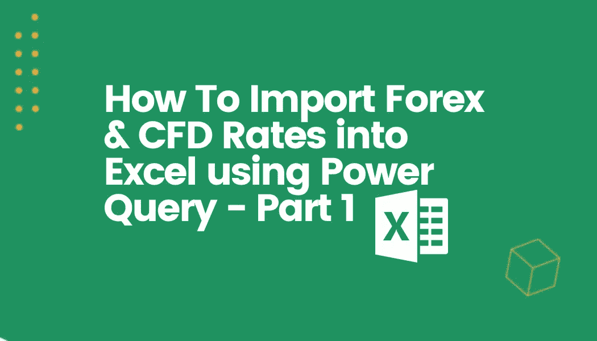

我们相信所有人都可以访问外汇数据，因此为了帮助 Excel 用户访问汇率，我们决定编写一个简单的教程。您将学习如何通过 Excel 中的 REST API 导入和更新实时外汇汇率。本教程不需要任何编程知识，对于任何对 excel 有基本理解的人来说，都应该足够简单。

如果您对 Excel 的 power query 不感兴趣，而是想要一个简单的插件，请阅读[我们的 Excel 插件教程](https://khanna-rahul.medium.com/import-live-forex-and-cfd-data-into-excel-using-an-add-in-837688eb3621)。

在我们开始之前，你需要打开一个 Excel 电子表格，然后[注册](https://marketdata.tradermade.com/signup)我们的 API。别担心，只需要几秒钟。

我们开始吧！

## 第一部分

第一步

在电子表格中，单击数据，然后单击来自 web(从 Web 导入数据)，如下所示。

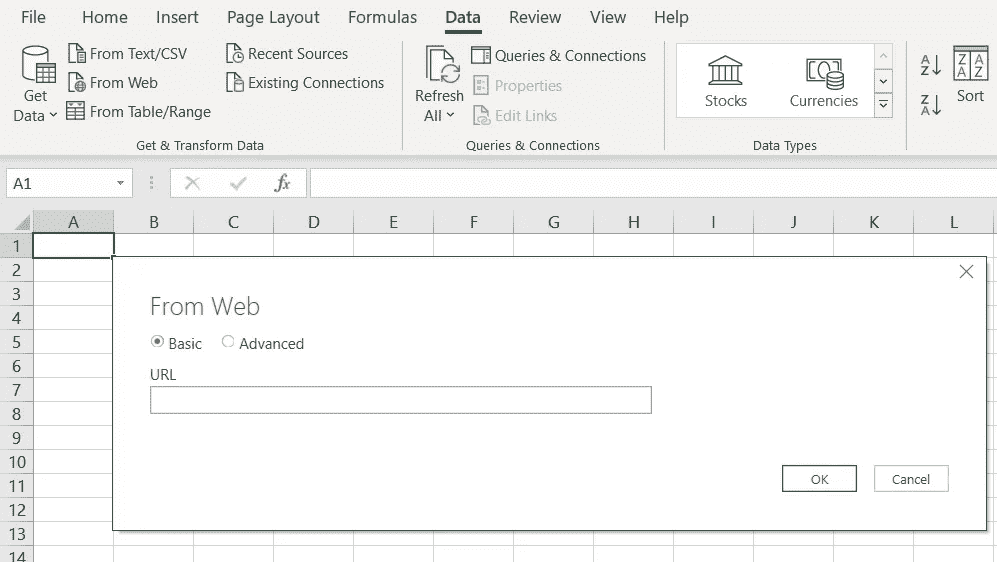

现在[首先登录](https://marketdata.tradermade.com/login)，然后访问我们的[文档页面](https://marketdata.tradermade.com/docs/restful-api#live_rates)，从实时端点复制 URL，如下所示。

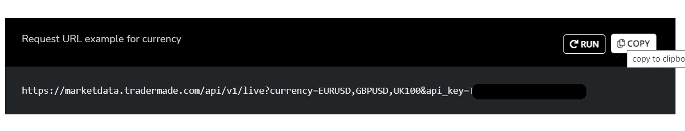

你也可以跟着这个[教程做视频](https://www.youtube.com/watch?v=PUUwaHt75rw)。

第二步

一旦你复制了网址，只需将它粘贴在 excel 的方框中，然后按确定。

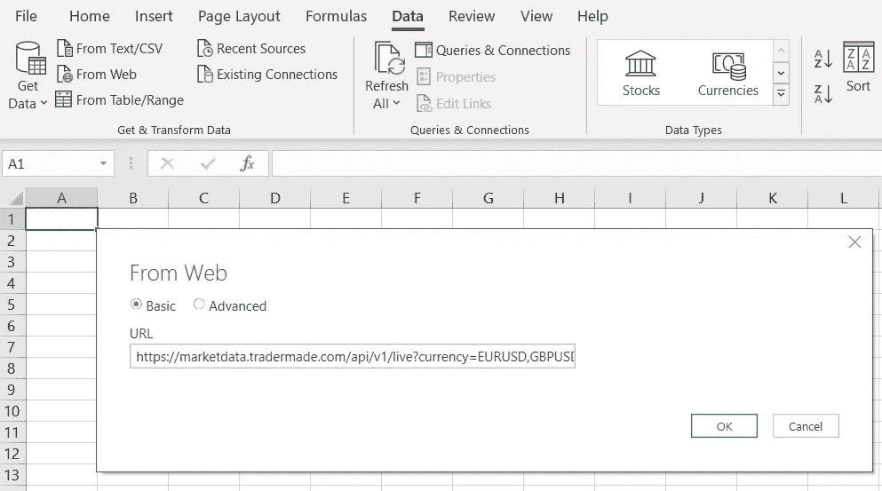

第三步

单击“确定”后，您将被转到另一个框，只需右键单击“列表”(在“报价”旁边),然后单击“向下钻取”,如下所示。

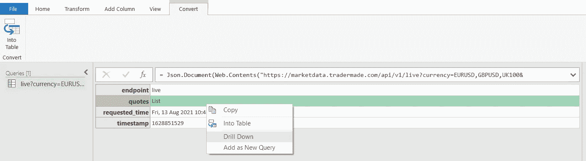

第四步

单击后，您将再次被重定向，这次再次右键单击列表，然后单击“转到表格”(如下图所示)。将出现一个框，只需在该框上单击“确定”。

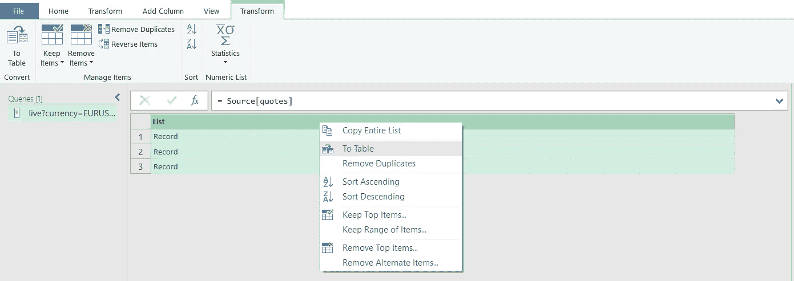

第五步

在接下来的页面上，单击“列 1”右侧带有两个箭头的框。取消选中“使用原始列名作为前缀”框，然后按“确定”。

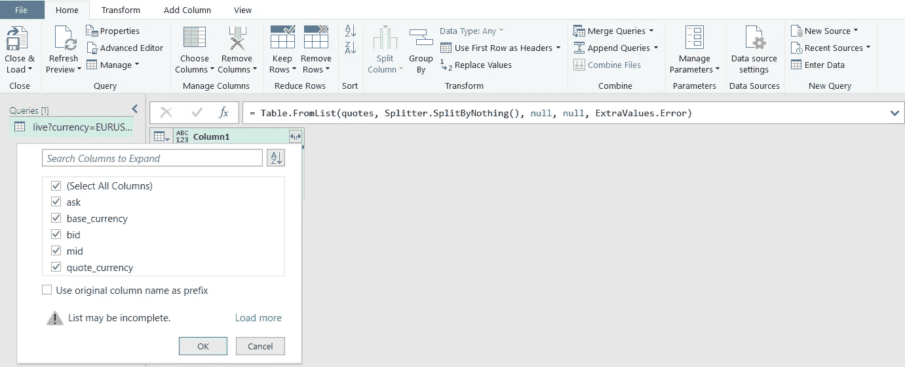

第六步

现在，您将在框中看到实时价格，只需点击左上角的关闭和加载。

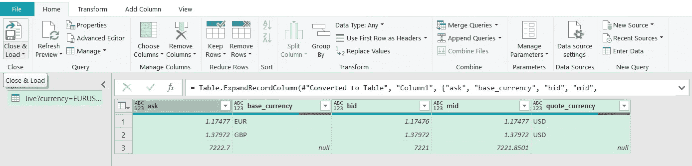

瞧啊。现在，您在 Excel 电子表格中有了实时汇率。你所需要做的就是刷新这些利率，以获得最新的价格。

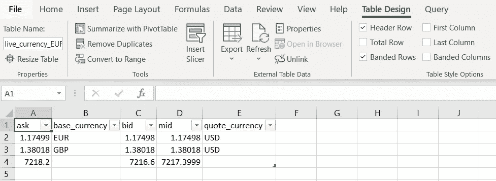

尽管在 excel 中有外汇汇率很好，但我们仍然没有做到，因为当我们需要不同的汇率时，我们需要改变一些东西。不要担心，因为我们将展示这是相当容易做到的，但是在我们开始之前，最好将我们对 API 的请求进行分解，以便了解将来如何改变它。

## 第二部分

如果您还记得，我们只是在步骤 2 中从 docs 页面复制粘贴 URL，但是，除非我们了解 URL 的内容，否则我们无法更改我们的请求，因此也无法更改表中的数据。以下示例显示我们请求欧元兑美元、GBPUSD 和 100 英镑:

" market data . trader made . com/API/v1/live？**货币**=欧元美元、GBPUSD、英国 100&**API _ key**= your-API-key "

我们可以通过简单地做以下事情来改变这一点:

“market data . trader made . com/API/v1/liv[e](https://marketdata.tradermade.com/api/v1/live)？**货币**=美元兑日元，欧元兑英镑，欧元兑日元，美元兑瑞郎&**API _ key**= your-API-key "

我们添加了美元兑日元、欧元兑英镑、欧元兑日元和美元兑瑞士法郎，数据返回将与之匹配。

既然我们已经了解了什么需要改变，那么让我们来看看实际情况。双击电子表格右侧查询和连接下的活动连接，如下所示。

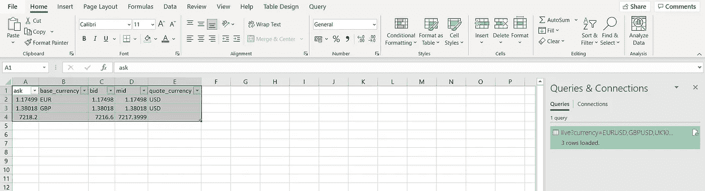

一旦查询窗口打开，只需导航到查看并点击高级编辑器。

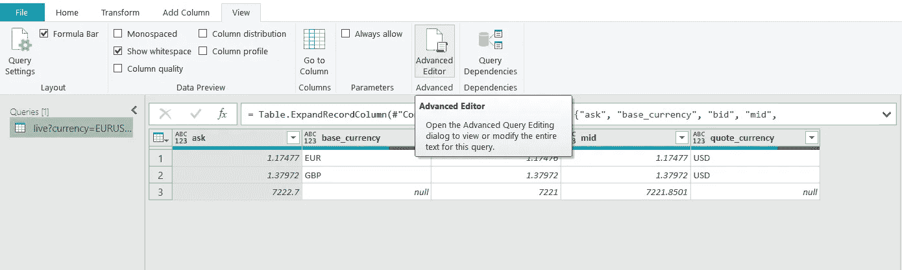

在高级编辑器中，只需用新的货币字符串替换旧的货币字符串，然后按 Done，如下所示。

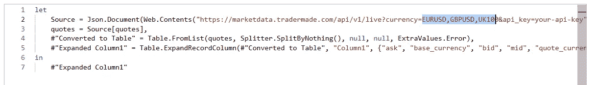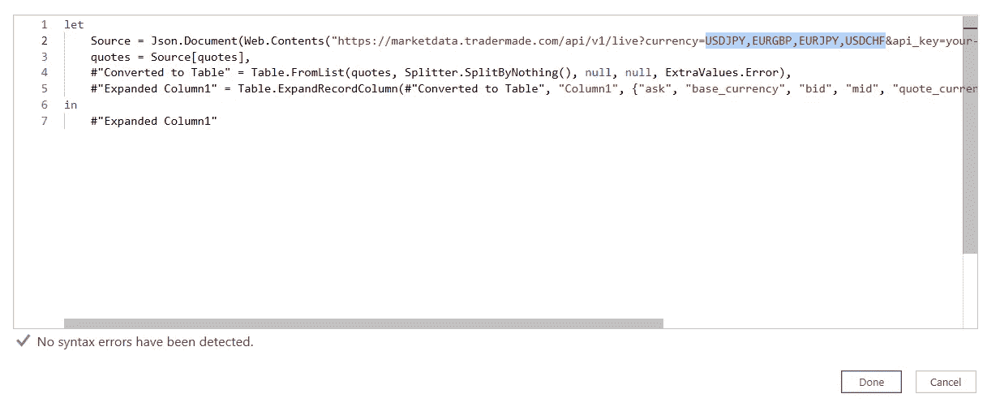

如果你不喜欢事物的顺序，你也可以通过拖拽来重新排列你的列。完成后，只需点击主页按钮，然后点击关闭并保存，您将在电子表格中有新的费率。

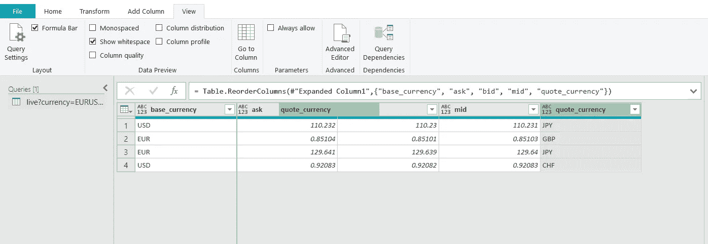

如您所见，费率已更新，列已重新排列。就这么简单。

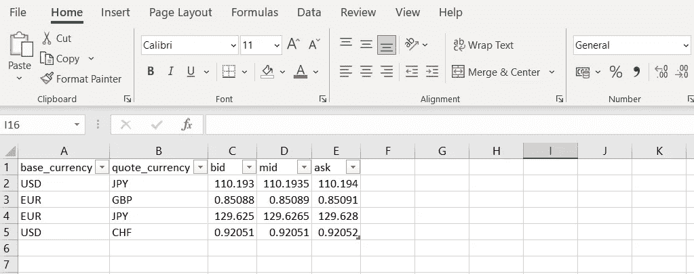

您可以做许多其他事情来使事情变得动态，比如直接从电子表格中更改请求，但这是本系列的下一篇教程— [*使用 Power Query 将货币汇率导入 Excel 第 2 部分*](/nerd-for-tech/import-currency-rates-into-excel-with-power-query-part-2-4f256c725844) *。*正如我们所知，接受新概念可能会让人不知所措。我们还将在下一个教程中介绍历史外汇数据。我们希望本教程将在让非程序员使用外汇数据方面大有帮助。如果您有任何问题，请联系。