# 使用超级查询将汇率导入 Excel 第 2 部分

> 原文：<https://medium.com/nerd-for-tech/import-currency-rates-into-excel-with-power-query-part-2-4f256c725844?source=collection_archive---------6----------------------->

在教程的第 2 部分，我们将展示如何使用 power query 动态地将实时和历史汇率导入 excel。您将能够更改单元格中的值来获得更新的费率。如果你是第一次阅读本教程，我们建议你先阅读 [*“使用超级查询将汇率导入 Excel 第一部分”*](https://tradermade.com/tutorials/import-currency-rates-into-excel/) 。

或者，你也可以阅读我们的教程 [*如何使用我们的插件*](https://tradermade.com/tutorials/how-to-import-live-forex-cfd-data-in-excel-using-our-add-in) 将汇率导入 Microsoft Excel。文章还附有一段视频。

我们开始吧！

## 第一部分

第一步

[登录](https://marketdata.tradermade.com/login)您的账户，导航至[文档](https://marketdata.tradermade.com/docs/restful-api#historical_rates)页面，从历史利率端点复制 URL，如下所示。

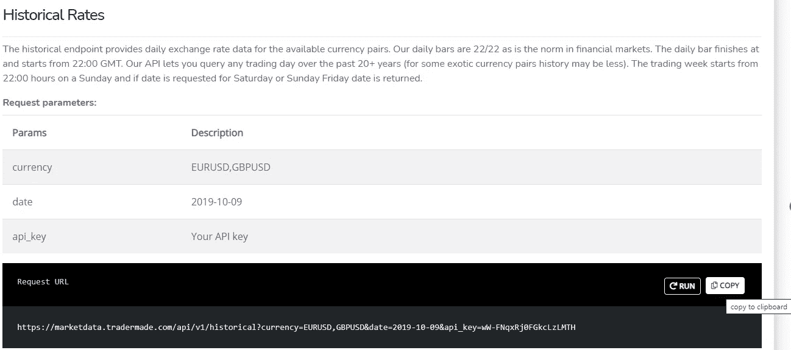

第二步

现在打开一个 Excel 工作簿，在电子表格中单击数据，然后单击从 web(从 Web 导入数据),粘贴我们刚才复制的 URL，如下所示，然后单击确定。我们刚刚复制的 URL 有三个参数，我们需要提供这些参数来获取历史数据——其中两个我们将在本教程的后面部分进行动态处理——第一个是货币:欧元兑美元和 GBPUSD；第二个是日期:2019–10–09，第三个是 api_key:您的 api_key。

第三步

一旦您按下 ok，一个编辑器窗口将出现，只需双击报价旁边的“列表”,如下所示。

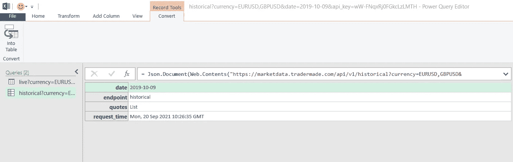

第四步

在转换窗口中，右键单击列表，单击“到表”，然后单击“确定”。

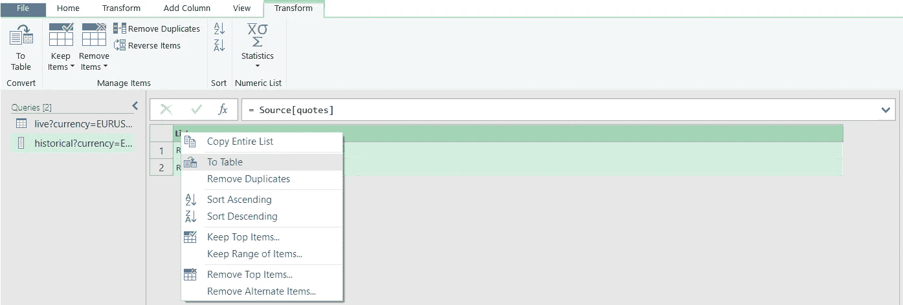

第五步

如下所示，单击第 1 列旁边的双箭头按钮，取消选中“使用原始列名作为前缀”，然后单击“确定”。

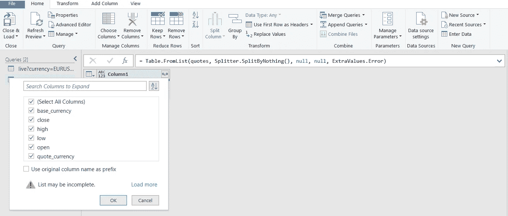

第六步

现在按下左上角的“关闭并加载到”,如下所示。

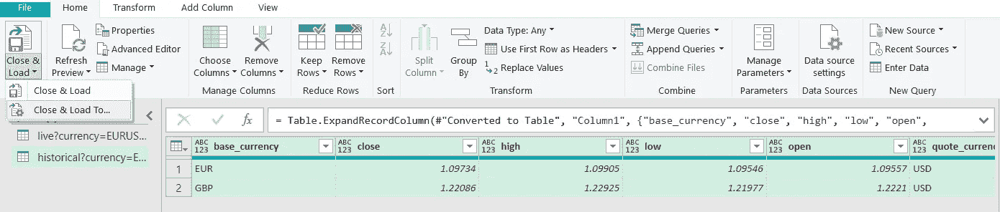

第七步

现在选择一个单元格，我们已经选择了单元格 F1，如下所示，然后按 ok。

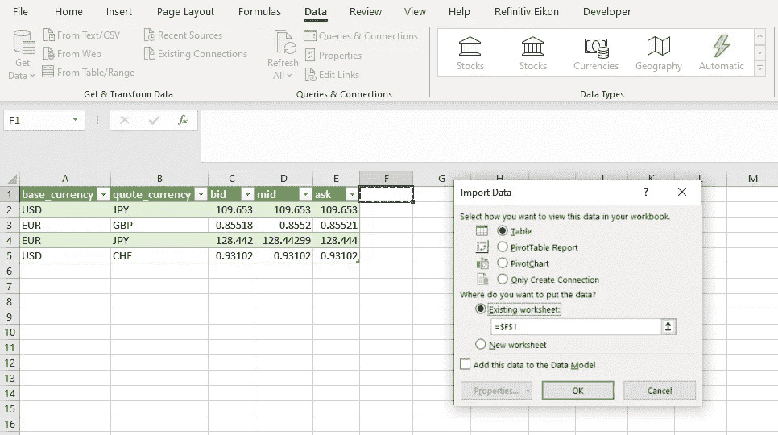

第八步

您现在可以看到，我们在所需的单元格中获得了历史汇率。

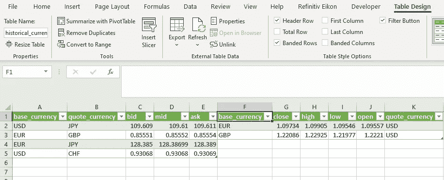

现在我们已经获得了我们所请求的数据，我们希望能够更改电子表格中的单元格，并更新上面的列。让我们看看如何做到这一点。

## 第二部分

第九步

我们将插入如下所示的新列，并用我们需要的货币名称更新单元格 A2 到 A5。在单元格 A1 中，我们将使用函数 TEXTJOIN("，"，False，A2:A5):该公式只是以我们要求的格式连接货币，以请求实时和历史外汇数据，无需担心随着我们的发展，它的使用方式将变得显而易见。

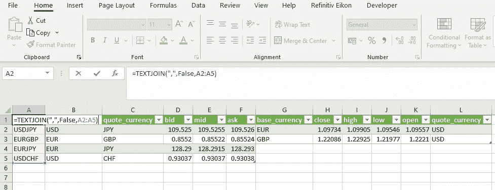

第十步

现在只需点击单元格 A1，并在方框中填写“货币”,如下所示。

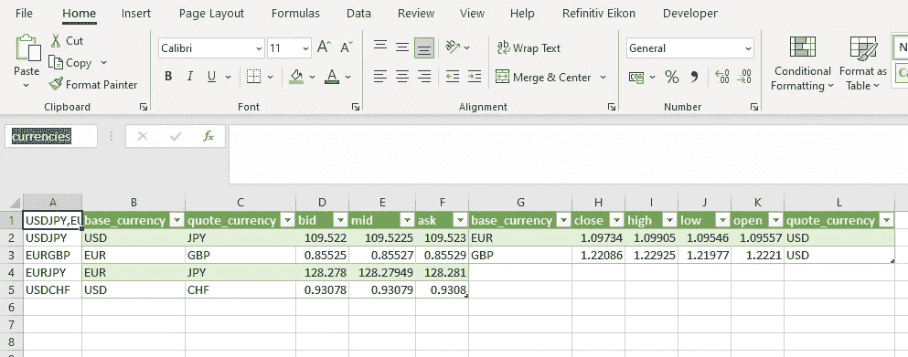

步骤 11

现在，右键单击查询和连接下的实时查询，然后单击编辑。

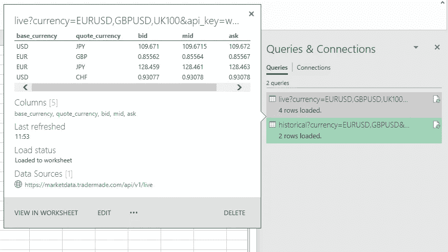

步骤 12

现在点击高级编辑器后面的视图选项卡。

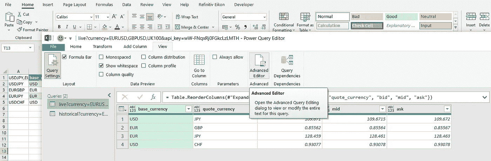

第十三步

看下面的图片，修改代码看起来有点吓人(对非程序员来说),但是不要担心，这很简单。我们将通过以下代码定义一个货币列表:

货币列表= Excel。current workbook(){[Name = " currences "]}[Content]{ 0 }[column 1]，

简单地复制粘贴上面的行，如下所示。上面的代码只是从 excel 工作簿中获取数据，其中的列名为“货币”。现在，只需将货币名称更改为“& currency_list &”，并单击如下所示的完成，然后从文件标签中关闭并加载。现在，您将拥有可以在电子表格中更改的实时汇率。

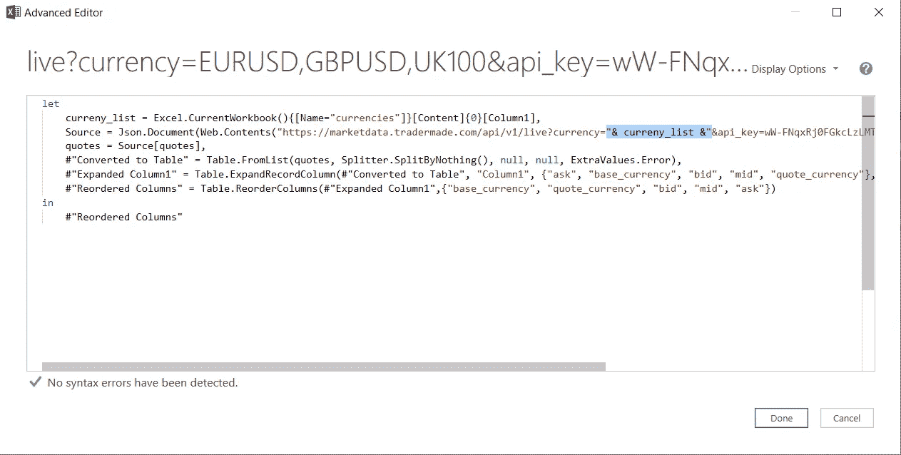

步骤 14

现在，我们还将更改历史数据查询，以获取与我们请求的实时汇率相同的货币的每日汇率。简单的点击编辑如下所示。

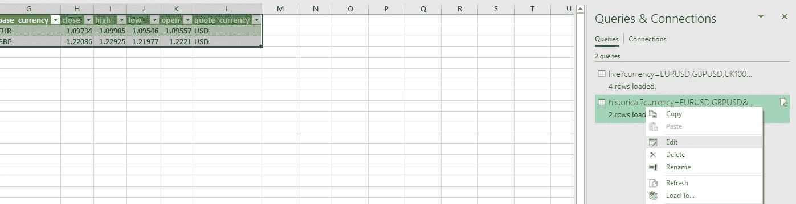

第十五步

现在，在中单击“视图”选项卡，然后单击“高级编辑器”,就像我们在步骤 12 中所做的一样。按照步骤 13 中所示的相同过程，单击“完成”,然后单击“文件”选项卡中的“关闭并加载”。

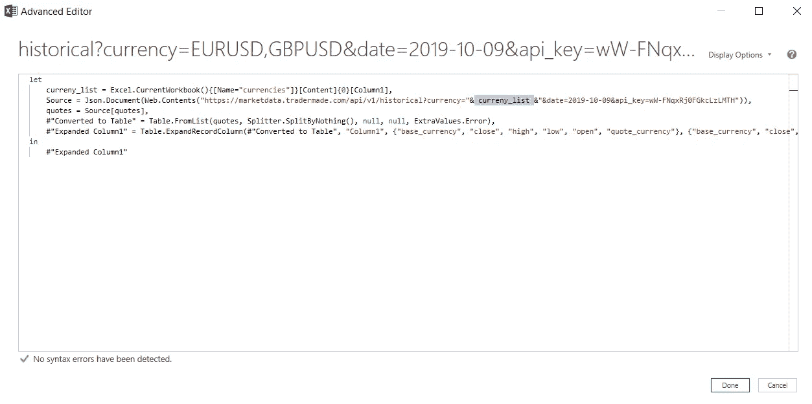

第十六步

我们现在可以看到美元兑日元、欧元兑美元、欧元兑日元和美元兑瑞郎的历史 OHLC 数据更新，就像实时数据的货币一样。然而，我们还没有确定我们希望看到历史利率的日期。如果您还记得我们在步骤 2 中最初的历史数据请求，我们请求的是 2019 年 10 月 9 日的数据。如果我们想获得今天所有货币的数据会怎么样？好吧，让我们看看如何做到这一点。

插入另一列，将 A1 命名为 date_time，并在单元格中键入=TEXT(TODAY()，“yyyy-mm-dd”)，如下所示。

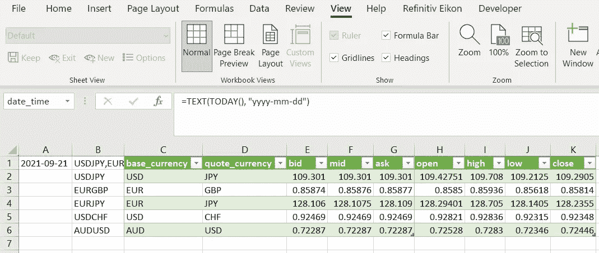

步骤 17

现在，按照步骤 14 和 15 打开高级编辑器，这次我们将通过以下代码定义一个“dt”:

dt = Excel。current workbook(){[Name = " date _ time "]}[Content]{ 0 }[column 1]，

正如我们在步骤 13 中所做的那样，只需如下所示复制粘贴上面的行，并将源中 URL 中的 2019–10–09 替换为“& dt &”，然后单击“完成”。

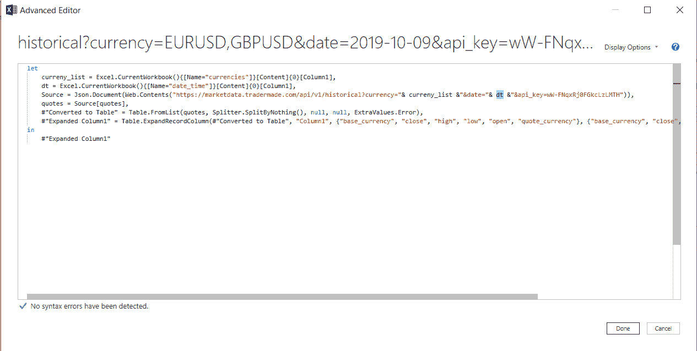

您现在可以看到，我们在单元格中有我们选择的货币和我们请求的日期的实时和历史汇率。

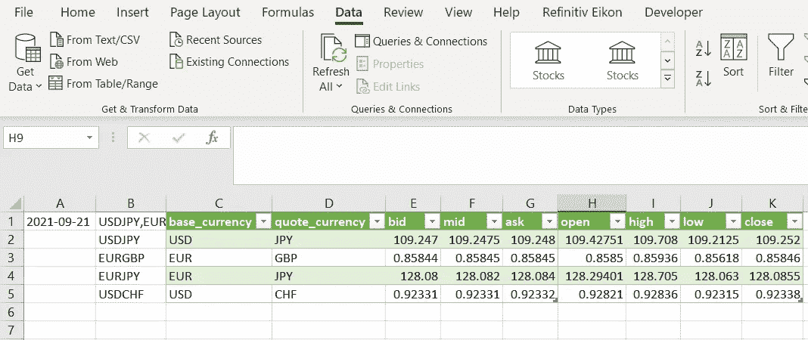

现在，您可以随时请求费率和刷新数据。您甚至可以将每个查询的刷新率设置为每分钟一次。

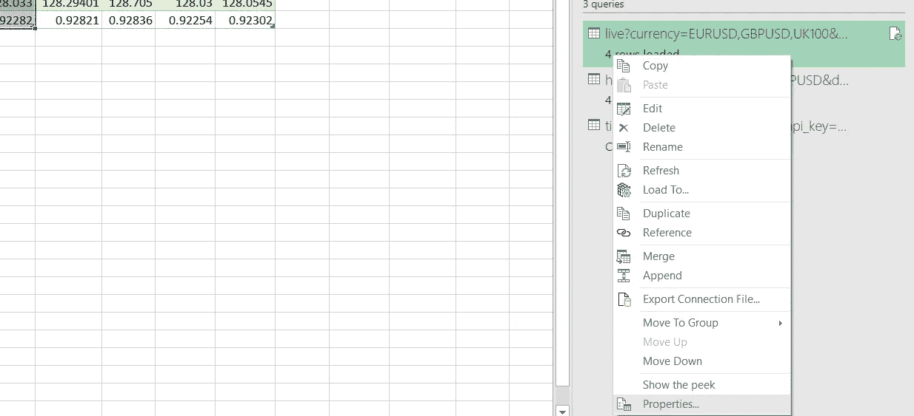

步骤 18

只需右键单击上图，然后根据需要设置刷新率。我们每一分钟刷新一次，如下所示。

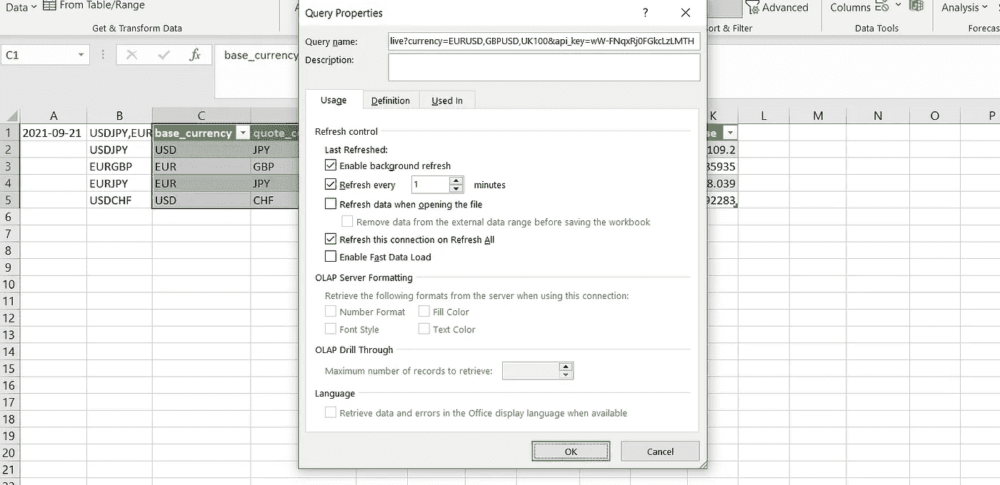

您可以随意刷新。对于免费计划，我们建议在 30 天内使用 12 小时的基础上，每小时刷新一次。如果您需要更频繁的刷新率，您可以随时从您的[仪表盘](https://marketdata.tradermade.com/myAccount)升级您的计划。如果您有任何问题或需要任何帮助，请不要犹豫[联系我们](https://tradermade.com/contact)。我们总是对定制的要求持开放态度。