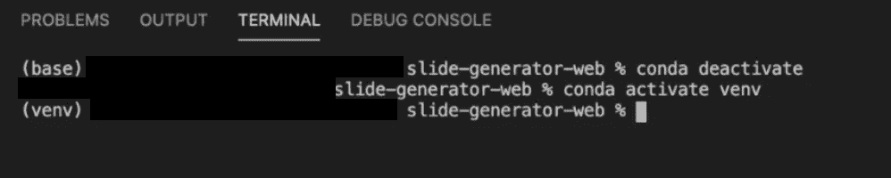
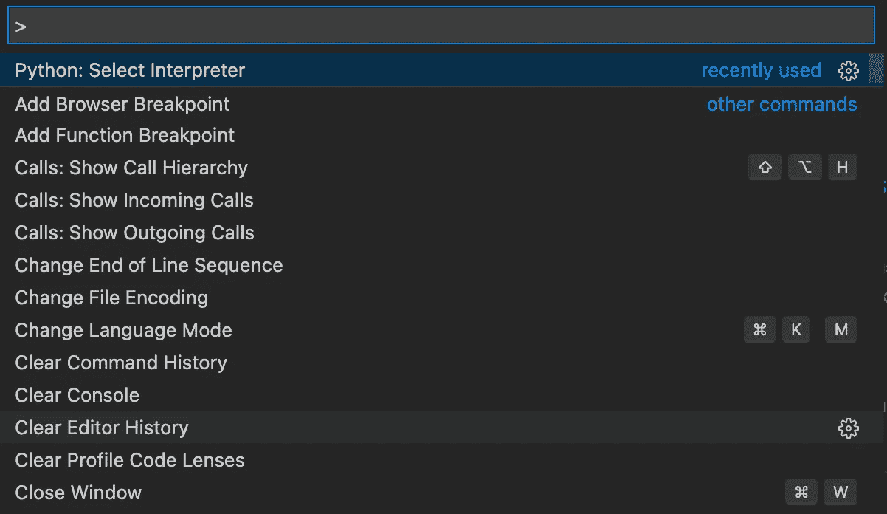
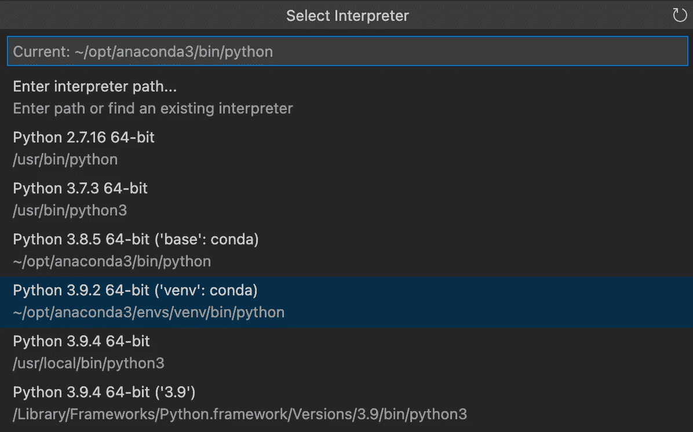

# Python 中的导入错误:VS 代码没有名为“Module_Name”的模块

> 原文：<https://medium.com/nerd-for-tech/import-errors-in-python-no-module-named-module-name-for-vs-code-887d1f78cf02?source=collection_archive---------0----------------------->


您可能在 python 中遇到过可怕的导入错误，如下所示:

```
No module named ----- 
```

这实际上是一个简单的错误，您可以立即修复。这通常是一个可以通过 Visual Studio 代码进行的简单修复。

在此之前，我强烈建议您使用 Anaconda 这样的虚拟环境来管理您的所有软件包。

首先，打开 visual studio 代码，在您的终端中检查您是否在虚拟环境中。您可以通过键入“conda activate(虚拟环境名称)”进入您的虚拟环境。如下所示。



但是正如您所看到的，即使您已经进入了虚拟环境，python 解释器仍然指向您的基础环境，而不是您的虚拟环境。如下所示。


如果是这样，在 Windows 中按住“Ctrl+Shift+P ”,或者在 Mac 中按住“Command+Shift+P ”,在 Visual Studio 代码中打开上下文菜单。在那里搜索“Python:选择解释器”



在这里，您可以选择项目当前指向的 python 解释器。因为它指向了 conda 基础环境，所以您可以选择您为项目安装软件包的虚拟环境。在这种情况下，它是“Python 3.9.2 64 位(' venv': conda)”，如下所示。



一旦你选择了它，你会看到你的解释器已经指向了你的虚拟环境。


所以你有它。一旦您运行您的项目，一切都将运行良好，没有更多的导入错误，你将不得不担心。

作者:迪尔米·科特基