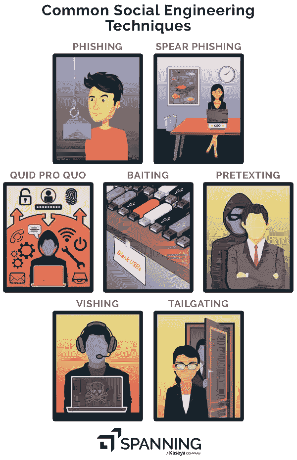
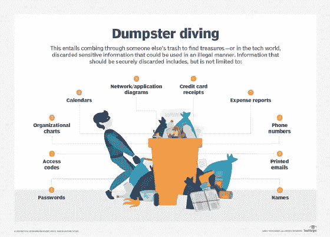
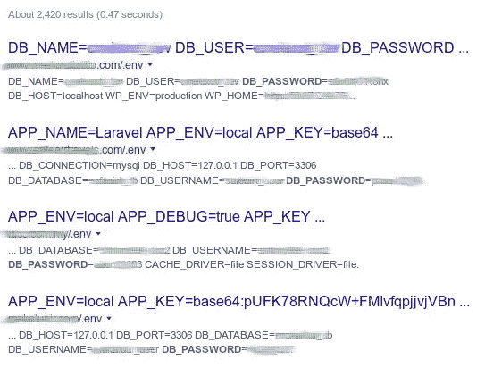
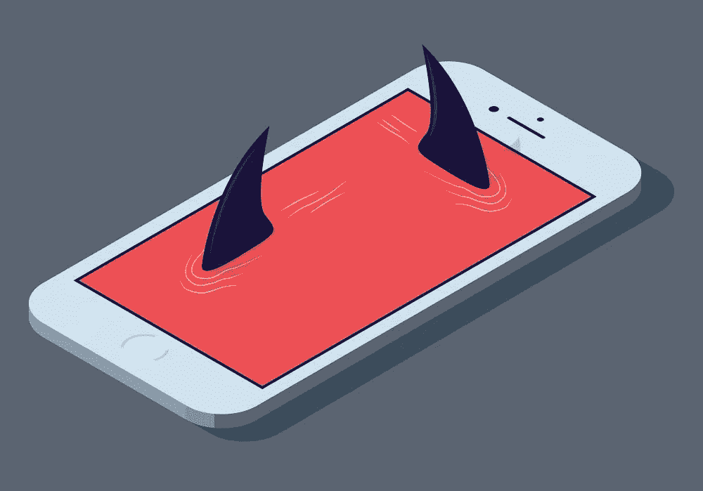

# 没有电脑的黑客(没有技术黑客)

> 原文：<https://medium.com/nerd-for-tech/importance-of-security-1-hacking-without-computers-c4c3c753e38a?source=collection_archive---------8----------------------->

图 1:说明性的。一名黑客闯入了一台电脑。(gorodenkoff via iStockPhoto)

> “我们用一根电线和一块毛巾打败了数百万美元的保安”——约翰尼·龙

黑客通常不会使用高科技电脑和黑客工具来访问网络或获取敏感信息。还有其他方式，如社会工程技术(**肩冲浪，伪造徽章和制服，伪装**等。).不，技术黑客并不是一个新想法。但问题是黑客们仍然将它用于恶意目的。

**约翰尼·龙**是一名安全专家，以非技术黑客闻名。我建议你读一读他的书**“无技术黑客——社会工程、翻垃圾箱和肩部冲浪指南”**，因为他在书中解释了他是如何使用简单的无技术黑客闯入高度安全的建筑的。此外，如果你没有时间读这本书，可以看看他主持的这个讲座**“非技术黑客——没有电脑的黑客**”,以更好地了解非技术黑客。完全值得花时间。

## **社会工程**

社会工程是从心理上操纵人们执行行动或透露他们的机密信息。

**现在让我们讨论一些社会工程技术**。

## 托辞

借口是一种创造情景的方式，以说服受害者透露他们不应该透露的信息。伪装经常被用来对付保存客户信息的企业，如银行、信用卡公司、公用事业提供商和运输部门。通过在电话上模拟客户端，攻击者将向组织请求信息。

由于物理识别的困难，公司必须依靠其他方法来识别他们的客户。这些替代技术经常需要验证个人信息，如出生日期或账号，这些信息可以在社交媒体上或通过翻垃圾箱找到。

## 肩部冲浪

肩部冲浪(来源:[https://www.pinterest.co.uk/pin/6580181](https://www.pinterest.co.uk/pin/6580181))

肩窥是指当某人在公共场合使用笔记本电脑、自动取款机或其他电子设备时，通过从你的肩膀上窥探来窃取你的个人数据。当你在公共场所分享个人信息时，肩扛冲浪随时可能发生。肩部冲浪者不会离你很近，也不会看你的设备屏幕。相反，他们站在安全的距离之外，当你在键盘式自动取款机或你的个人设备上输入数字时，检查你的手指运动。

**防止肩部冲浪的步骤:**

如果你不得不一直躲在墙后，尽量避免在公共场合输入密码。使用自动取款机时，用手遮住身体。然而，这些可能无法 100%保护你。所以要时刻注意肩部冲浪者。

## 翻垃圾箱

翻垃圾箱(来源:[https://searchsecurity.techtarget.com/](https://searchsecurity.techtarget.com/)

> “在没有无线设备的情况下，从停车场的公司网络中窃取敏感数据，也就是翻垃圾箱”——约翰尼·龙

有时候，要找到一个人或一个组织的敏感数据，你不必闯入。有时候你只需要看看垃圾箱。

**翻垃圾箱是在个人或商业组织的垃圾中寻找可用于网络攻击的信息的过程**。攻击者可以在垃圾箱里安装一个摄像头来拍摄垃圾箱里的任何东西。

翻垃圾箱的人可以找到**财务报表、政府记录、医疗账单、签名等。仅仅通过受害者的垃圾。这些信息可以用来使社会工程更有可能成功。
因此，你可以**在垃圾箱附近安装一个摄像头，粉碎任何机密文件，锁上垃圾箱，并意识到你处理了什么**。**

匹兹堡行动新闻 4

## 1.开车紧跟

这是溜进大楼的一个非常快速的方法。尾随是指未经授权的人在授权用户后面进入安全区域。你只需要随大流。这也被称为捎带。这也可能发生在门没有正确关闭或门关闭缓慢时，这给攻击者留下了可乘之机。

## 谷歌黑客

公开可用的列表。env 文件(来源:[https://securitytrails.com/](https://securitytrails.com/))

大多数人只知道谷歌是一个搜索网站、图片、视频等的搜索引擎。但是如果你足够聪明，在搜索时使用高级查询，你就可以公开地找到 web 服务器中的大部分敏感信息。发生这种情况是因为，当一些软件工程师错误地将敏感数据公开在服务器上时。

这种技术也被称为**谷歌多金**。使用谷歌进行查询，运营商可以在搜索结果中轻松显示**暴露的关键目录、易受攻击的文件和服务器，以及包含用户名和密码的文件**。

在结束这篇文章之前，让我们再谈一件事。

## 你的数据暴露在社交媒体上的危险

来源:https://www.corporatecomplianceinsights.com/

当你在脸书与朋友分享照片，或者你的同学用#Classof2020 这样的标签来标记你的毕业典礼照片时，你可能不会太在意。

然而，问题是当发布一张与朋友的照片时，因为它代表了你的联系和关系。如果你和你的同事分享一张图片，它会揭示你的工作场所，让你很容易找到你在哪里工作。

此外，当你分享一张带有标签的照片时(正如我之前所说的)，它会暴露你的毕业年份和学校名称，回答一个最常见的安全问题:“你上的是哪所高中？”

这只是几起事件。还有更多。

 [## 2 亿脸书、Instagram 和 Linkedin 用户的抓取数据被曝光

### 中国初创企业 Socialarks 遭遇大规模数据泄露，暴露了超过 400GB 的个人数据，包括…

www.securitymagazine.com](https://www.securitymagazine.com/articles/94327-million-facebook-instagram-and-linkedin-users-scraped-data-exposed) 

## 那么如何在社交媒体上保持安全呢？

1.  将你的个人资料设置为私有——不要将所有内容都公开。想好你发布的内容和你想让谁看到它。
2.  小心可疑信息——小心类似于*“天哪，看看你的这张照片……”*或*“你看到他们是怎么说你的了吗？”*在点击此类信息附带的任何链接之前要小心。
3.  避免大风险——不要通过社交媒体分享任何私人照片或视频。
4.  保护你的身份——不要在社交媒体上暴露电话号码、地址、银行信息、信用卡信息等细节。
5.  识别虚假账号——并不是社交媒体上的每个人都是他们声称的那个人。请小心将谁添加为您帐户的好友。

## 参考

 [## 肩冲浪(计算机安全)-维基百科

### 在计算机安全中，肩窥是一种社会工程技术，用于获取诸如…

en.wikipedia.org](https://en.wikipedia.org/wiki/Shoulder_surfing_%28computer_security%29)  [## 什么是翻垃圾箱？

### 在别人的垃圾里寻找宝藏。在信息技术(IT)的世界里…

searchsecurity.techtarget.com](https://searchsecurity.techtarget.com/definition/dumpster-diving)  [## 什么是尾随？-梅森安全访问

### 尾随(也称为捎带)是当今影响企业的最广泛的安全漏洞之一…

www.meesons.com](https://www.meesons.com/what-is-tailgating/)  [## 什么是翻垃圾箱？

### 在别人的垃圾里寻找宝藏。在信息技术(IT)的世界里…

searchsecurity.techtarget.com](https://searchsecurity.techtarget.com/definition/dumpster-diving)  [## 翻垃圾箱——通过教育获得安全

### 使用社会工程技术，这些信息在利用 pentest 时会很有用。垃圾箱潜水员是…

www.social-engineer.org](https://www.social-engineer.org/framework/information-gathering/dumpster-diving/)  [## 谷歌黑客-维基百科

### 谷歌黑客，也称为谷歌多金，是一种黑客技术，使用谷歌搜索和其他谷歌应用程序…

en.wikipedia.org](https://en.wikipedia.org/wiki/Google_hacking)  [## 在社交媒体上保持安全

### 大多数人使用社交媒体与朋友保持联系，并从中获得乐趣。然而，也有人不按…来玩

www.kidscape.org.uk](https://www.kidscape.org.uk/advice/advice-for-young-people/dealing-with-cyberbullying/staying-safe-on-social-media/)