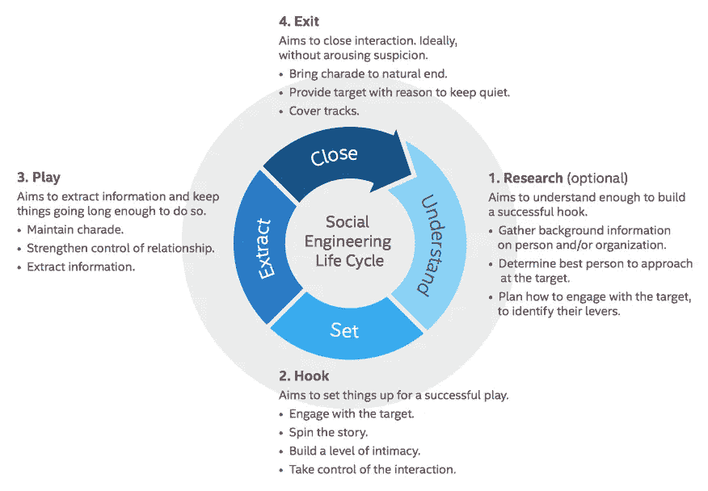
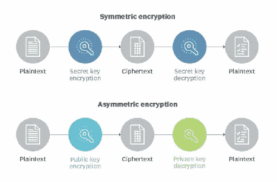
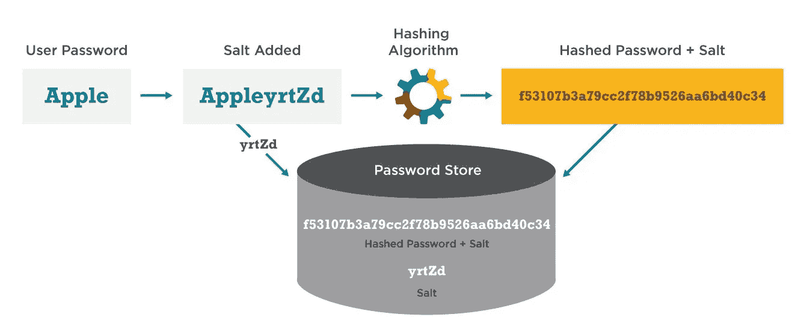

# 软件安全、应用安全、非技术性黑客攻击、加密和哈希的重要性

> 原文：<https://medium.com/nerd-for-tech/importance-of-software-security-application-security-non-technical-hacking-encryption-and-365c93def04e?source=collection_archive---------18----------------------->

软件安全、应用安全、非技术性黑客攻击、加密和哈希的重要性

**软件安全与应用安全**

*软件安全*

这是在开发阶段考虑的，其目的是开发更安全的应用程序，防止被窃取或劫持。

*应用安全*

软件安全性是一种用于描述软件的技术，这种软件的开发方式使其在部署后发生恶意攻击时仍能正常运行。

**非技术黑客和社会工程**

黑客可以通过使用社会工程攻击来访问系统或数据，而不是技术性的黑客技术。社会工程攻击被识别为，使用心理操纵来欺骗用户犯下与安全相关的错误。

社会工程攻击涉及一个或多个步骤。攻击者首先了解或收集有关个人/组织的信息。接下来，攻击者将试图找出一些有助于发起攻击的弱点。然后，攻击者将采取后续行动来破坏安全性，以授予对关键资源的访问权限，并泄露他/她想要的敏感信息。完成预定任务后，她/他会完美地结束互动，而不会引起怀疑。参见图 1。

图一。社会工程攻击生命周期。

下面定义了一些最常见的社会工程攻击；

*   恶意软件:通过强迫受害者相信他/她的计算机上安装了恶意软件来威胁受害者，如果他/她付款，恶意软件就会被删除。
*   伪装:使用虚假身份诱骗受害者提供他人/组织的信息。
*   视觉:用紧急语音邮件威胁受害者，他/她需要迅速采取行动，以保护她/他免受逮捕或其他风险。
*   诱饵:承诺受害者给予奖励的社会工程攻击。
*   网络钓鱼:包含欺骗性信息以窃取他人信息的电子邮件、消息或网站。

**加密 vs 哈希**

*加密*

这是一种将源代码转换成隐藏源代码含义的密码的方法。解密是加密的逆过程。加密和解密信息的概念称为密码学。用于加密和解密的公式被称为*密码*。有两种类型的密码，称为对称密码和非对称密码。

*   对称密码:这也称为密钥加密。这里，加密和解密都使用一个密钥。
*   不对称密码:这被称为公钥加密。这里，两个不同的密钥分别用于加密和解密。

图 2 说明了对称密码和非对称密码之间的区别。

图二。对称与非对称密码。

*散列法*

这是一种不可逆的方法，用于将任意大小的源数据/密码映射到固定长度的哈希中。哈希是一种方式，这意味着在密码学中，我们无法获得哈希的逆运算。通常，每个散列都是唯一的，这意味着同一源数据不能有两个散列值。哈希算法用于将源数据映射到哈希中。MD4、MD5 和 SHA 是目前使用的一些常见哈希算法。

*腌制*

这里，一个唯一的文本被添加到密码的末尾或开头，并创建一个不同于前面方法的散列。之后，产生的散列和添加的文本被存储在数据库中。这里增加的文字叫做*盐*。假设当有人需要登录时，那么存储的 salt 被添加到键入的密码中(在开头或结尾)，并运行相同的散列算法来获得结果散列。这将与存储在数据库中的哈希进行比较，如果匹配，则将授予系统访问权限。加盐方法为散列过程增加了额外的安全层。参考图 3。

图 3。加密与哈希。

**结论**

*   软件安全是使应用程序更加安全，不被窃取或劫持的过程。
*   应用程序安全性是一种用于防止应用程序在部署后受到恶意攻击的技术。
*   社会工程攻击可能导致在没有任何技术参与的情况下获得对系统的访问。
*   加密是一种将源代码转换成隐藏源代码含义的秘密代码的方法。
*   哈希是一种不可逆的方法，用于将任意大小的源数据/密码映射为固定长度。

**参考文献**

*   [https://gcn . com/articles/2013/12/02/hashing-vs-encryption . aspx](https://gcn.com/articles/2013/12/02/hashing-vs-encryption.aspx)
*   [https://search security . techtarget . com/definition/asymmetric-cryptography](https://searchsecurity.techtarget.com/definition/asymmetric-cryptography)
*   [https://resources . infosecinstitute . com/topic/common-social-engineering-attacks/](https://resources.infosecinstitute.com/topic/common-social-engineering-attacks/)
*   [https://www . white hatsec . com/glossary/content/software-security](https://www.whitehatsec.com/glossary/content/software-security)