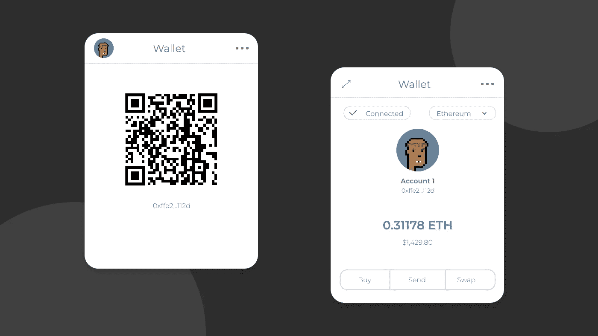

# 白标加密钱包的重要性

> 原文：<https://medium.com/nerd-for-tech/importance-of-white-label-crypto-wallets-11cbe6c65156?source=collection_archive---------1----------------------->

加密货币钱包在加密领域扮演着重要角色。它们安全地保存您的公钥和私钥，可以解锁您累积的资产，并允许安全的交易。加密货币生态系统中的任何人都必须有加密钱包来保存他们的密钥。目睹了钱包的重要性，许多企业已经开始推出具有先进功能的钱包来参与市场竞争。白标加密钱包也越来越受欢迎，因为它们可以方便地立即部署到外部世界。

## 什么是加密钱包？

与普遍的看法相反，加密钱包不像你口袋里的钱包那样包含任何加密货币。它只能保存您的公钥和私钥。它与存储你的资产的[区块链](https://www.leewayhertz.com/blockchain-development-company/)交互，监控你的余额，并允许发送和接收加密资产。你可以用它来进行定期购买，持有资产和代币进行长期投资，甚至使用冷藏设施。

## 白标加密钱包

白标产品和解决方案由第三方公司构建和部署，但另一家公司购买它们来重塑品牌和转售它们。你可以用一个[白标加密钱包](https://www.leewayhertz.com/whitelabel-crypto-wallet/)推出自己的加密钱包。这是一个随时可以部署的解决方案，您不必花时间从头开始开发钱包，它还可以降低您的劳动力成本。这是一款面向市场的产品，旨在满足最终用户的期望，并拥有吸引他们的先进功能。由于它们是现成的产品，大多数白标加密钱包拥有高端功能，有可能与其他钱包竞争。

## 白标加密钱包所需的功能

各种各样的白标加密钱包具有不同的特征，使它们与其他钱包区别开来。当公司制造白标加密钱包时，他们也研究用户的期望。因此，它们也是根据最终用户的需求和期望来制作的。把用户的需求放在首位可以帮助你获得更多的客户，提高客户忠诚度。因此，您需要考虑某些特性和功能，例如简化的用户界面、强大的安全性以及其他要包含在白标钱包中的功能。白标钱包的必备功能包括:

*   **多链多币兼容:**一个理想的加密钱包应该支持以太坊、币安、Avalanche 等知名区块链及其代币和货币。
*   **多平台支持:**兼容 iOS、android、桌面和浏览器扩展等多种平台的加密钱包可能会成为备受追捧的钱包。
*   **Web3 集成:**白标加密钱包应该具有帮助与其他 Web3 平台和 dApps 无缝集成的特性。
*   **生物认证:**利用指纹、人脸识别等生物认证的加密钱包有助于增强用户数字支付的便捷性和安全性。
*   **EVM 兼容性:**拥有一个 EVM 兼容的钱包意味着能够与基于以太坊的 dApps 和平台进行交互，许多平台都是 EVM 兼容的。
*   管理资产:一个好的加密钱包应该拥有健壮的密钥管理。它有助于跟踪用户的加密资产，并促进安全和可访问的交易。
*   **分类账支持:**与冷钱包或硬件钱包的兼容性使用户能够灵活地离线存储他们的私钥，从而提供额外的安全性。
*   **ERC-20/ERC-721 支持:**支持 ERC-20 或 ERC-721 令牌标准的钱包可以帮助用户发送和接收可替换和不可替换的令牌，并帮助跟踪他们的状态。

# 白标加密钱包如何让企业受益？

白标加密钱包是一个方便的解决方案，为企业不愿意建立一个从零开始的钱包。它也有助于专门从事某个特定领域的业务，但从技术角度来看缺乏这种能力。许多白标加密钱包是灵活的，可以根据企业的要求进行定制。总的来说，白标加密钱包为企业提供了以下好处:

*   低成本
*   较少时间
*   即时部署
*   高级功能

# 结论

[加密钱包](https://www.leewayhertz.com/whitelabel-crypto-wallet/)是 Crypto 和 Web3 不可避免的一个方面，使用户能够与市场和 DEX 互动，并帮助促进加密交易和投资。一个强大的加密钱包是至关重要的，在确定您的私人密钥的安全性和安全性，保护资产存储在区块链。

想要开发加密钱包的企业可以建立一个或者使用白标钱包。利用白标钱包可以削减你的额外开支，节省你的大量时间。由于它们是市场现成的产品，它有助于随时推出钱包。如果需要，您还可以根据自己的喜好对其进行定制。选择一个好的白标加密钱包可以帮助提高你的客户忠诚度，获得更多的客户。