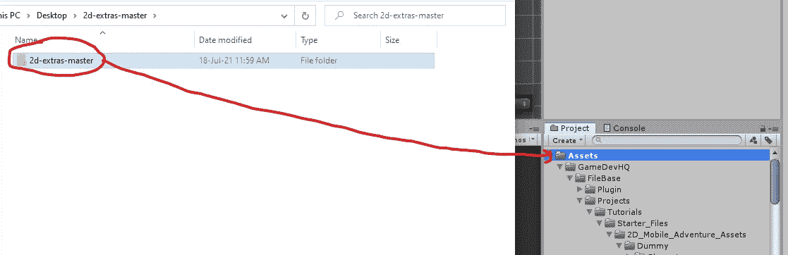
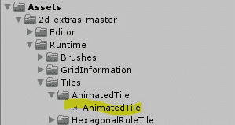

# 导入 Unity 2D Extras

> 原文：<https://medium.com/nerd-for-tech/importing-unity-2d-extras-e7097349ce64?source=collection_archive---------16----------------------->

**目标:**导入 Unity 2D Extras 软件包，让我们可以使用新工具，如动画互动程序。

我们将前往位于 https://github.com/Unity-Technologies/2d-extras[的 Unity Github。选择*代码*按钮，下载*。zip* 文件。](https://github.com/Unity-Technologies/2d-extras)

拔出*。压缩*文件，并将解压缩后的文件导入到您的 Unity 资产中。

我们现在可以访问*动画文件*脚本了。

