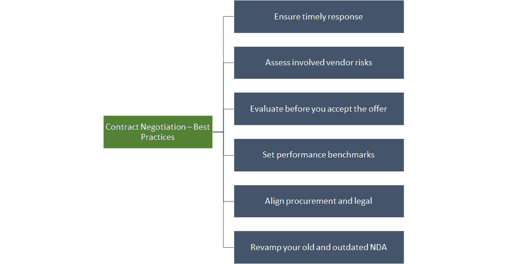

# 改善 ServiceNow | Aavenir 上的采购合同谈判

> 原文：<https://medium.com/nerd-for-tech/improve-procurement-contract-negotiations-on-servicenow-aavenir-5a929d2a6872?source=collection_archive---------7----------------------->

商业采购合同在其生命周期内顺利运行的情况很少。很多事情都可能出错，而你无法控制它。多种情况会影响您的采购流程，例如不受控制的价格上涨、交付问题、付款问题、市场中不可预见的波动、沟通失误或设备故障。虽然采购专业人员很难预测到可能出现的所有问题，但这些问题中的大多数都可以归因于糟糕的采购[合同](https://aavenir.com/glossary/what-is-contract/) [谈判](https://aavenir.com/glossary/negotiation/)实践。

> *IACCM 进行的一项独特的研究显示，在许多公司中，* [*谈判*](https://aavenir.com/glossary/negotiation/) *绩效改进被忽略、忽视或没有得到有效解决。没有* [*谈判*](https://aavenir.com/glossary/negotiation/) *过程的公司平均净收入下降了 63.3%。*

采购[合同](https://aavenir.com/glossary/what-is-contract/)谈判通常用于确定最佳价格和付款条件，以及交付和吞吐时间、关键性能指标、质量标准和其他因素。赢得采购谈判建立在保护利益相关者信息的策略平衡上，同时收集尽可能多的关于供应商优先事项、偏好和立场的情报。

今天，在许多行业中，权力的天平已经从买方转移到卖方。这是因为在大多数情况下，供应商通过降低成本或开发颠覆性技术淘汰了竞争对手。在其他情况下，对投入的快速增长的需求超过了供应，以至于供应商可以随心所欲地收费。因此，与供应商谈判采购合同需要技巧、策略和强大的供应商关系。

一个[合同生命周期管理](https://aavenir.com/glossary/contract-lifecycle-management/) (CLM)解决方案能否让您的采购[合同谈判](https://aavenir.com/contract-review-negotiation/)过程更加简单高效？对于更好的[合同](https://aavenir.com/glossary/what-is-contract/) [谈判](https://aavenir.com/glossary/negotiation/)来说，有什么可以遵循的最佳实践吗？

这两个问题的答案都是肯定的！我们先来了解一下那些最佳实践是什么！

当谈到[合同](https://aavenir.com/glossary/what-is-contract/) [谈判](https://aavenir.com/glossary/negotiation/)时，当务之急是设定明确的目标，确保签约双方意见一致，以避免因不同的解释而产生歧义和误解。确保就全部条款和条件达成一致，包括还款条款、截止日期和售后协助。

# 1.确保合同谈判期间的及时响应

在[合同](https://aavenir.com/glossary/what-is-contract/)谈判期间，始终确保及时响应。及时响应不仅有助于降低不良情况发生的几率，还能防止导致销售/协议的谈判脱轨。在热情洋溢的对话中迅速做出回应，并防止相关方转向其他选择，这一点至关重要。

# 2.涉及供应商风险的实践评估

标准的供应商风险包括拖欠付款、与表现不佳的供应商合作带来的声誉风险等。风险可能会根据外部环境而变化。因此，采购团队必须关注[合同](https://aavenir.com/glossary/what-is-contract/)规定和要求，以防止违反任何[合同](https://aavenir.com/glossary/what-is-contract/)法律和参与规避风险的活动。

# 3.接受提议之前先评估一下

[谈判](https://aavenir.com/glossary/negotiation/) 101，一个相当流行的[谈判](https://aavenir.com/glossary/negotiation/)战术，就是永远不接受第一个报价。不接受第一个报价可能会给人这样的印象，对方可能低估了他们的交易价格，或者他们可以从你那里得到更多的让步。这可能会给下一轮谈判增添趣味——无论如何，这对你来说不是好兆头，也不会留下持久的印象。这可能会改变他们对交易过程的看法(通常被视为孤注一掷)，导致出价不如之前理想。

# 4.设定绩效基准

不仅价格，质量也是最重要的。因此，为了防止供应商为了给你更低的价格而降低质量，实施供应商绩效评估来帮助控制质量。根据您的业务性质，度量的范围可以从及时性到生产率。

# 5.协调采购和法律职能

几十年来，商业利益相关者一直回避阅读合同并与之互动。“让我们把它送到法律部门”是商界和政府中一个众所周知的说法。太多的来回有时会减慢这个过程。

如果你组织的法律部门减慢了[采购过程](https://aavenir.com/glossary/procurement-process/)，在某种程度上，他们也在减慢你的业务。通常，买家比律师更了解相关方。律师是为了促进这一过程，而不是阻碍它。采购部门应该更明智地(并且有节制地)利用律师的时间。

这里有两个建议来实现这一点:1)让你的律师创建一个合同和条款的书。2)让您的法律部门定期与采购部门会面并接受培训。

# 6.更新您的旧的和过时的 NDA

在采购[合同](https://aavenir.com/glossary/what-is-contract/)谈判开始之前，通过在您现有的 NDA 中规划出[谈判](https://aavenir.com/glossary/negotiation/)空间来控制采购[合同](https://aavenir.com/glossary/what-is-contract/)谈判。采购专业人员可以利用 NDA 在实际谈判之前开始谈判。明智的做法是从商业[合同](https://aavenir.com/glossary/what-is-contract/)中精选出重要的部分，并将它们放置在 NDA。根据合同条款更新 NDA 有助于采购部门通过预先协商 NDA 来加快[合同](https://aavenir.com/glossary/what-is-contract/)流程。

# 在 ServiceNow 上管理与 CLM 的采购合同谈判

掌握采购[合同](https://aavenir.com/glossary/what-is-contract/)谈判[流程是多维度的。当与供应商谈判时，采购团队需要知道如何平衡和评估内部利益相关者的需求和观点。](https://aavenir.com/glossary/negotiation/)[合同](https://aavenir.com/glossary/what-is-contract/) [谈判](https://aavenir.com/glossary/negotiation/)是[合同管理](https://aavenir.com/glossary/what-is-contract-management/)中最重要的部分之一。

为了更好的[合同管理](https://aavenir.com/glossary/what-is-contract-management/)，寻找一个[合同](https://aavenir.com/glossary/what-is-contract/) [谈判](https://aavenir.com/glossary/negotiation/)工具，它是一个更广泛的[合同管理](https://aavenir.com/glossary/what-is-contract-management/)套件的一部分，最好是一个旨在处理文档生成、审批路由、电子签名、文档存储和[报告](https://aavenir.com/glossary/reporting/)的工具。借助智能 CLM 解决方案，您可以更好地与采购[合同](https://aavenir.com/glossary/what-is-contract/)工作流程协作。借助基于 ServiceNow 平台构建的人工智能[合同管理](https://aavenir.com/glossary/what-is-contract-management/)解决方案，可以更快地进行修订。有了现在构建的 Aavenir Contractflow，您和您的供应商可以更轻松地审查[合同](https://aavenir.com/glossary/what-is-contract/)。借助 ServiceNow 工作流，您可以轻松处理所有的[合同](https://aavenir.com/glossary/what-is-contract/)需求，而无需从一个软件跳到另一个软件，也无需一页一页地阅读您的合同。

[在 ServiceNow](https://store.servicenow.com/sn_appstore_store.do#!/store/application/5aa95f6c1b0a37404ba8ece03d4bcb5c/2.6.0?sl=sh) 实例上试驾 Contractflow 产品，通过简化的标记和[谈判](https://aavenir.com/glossary/negotiation/)，将您的[合同](https://aavenir.com/glossary/what-is-contract/)审批时间缩短 85%。

*最初发表于*[*https://aavenir.com*](https://aavenir.com/improve-procurement-contract-negotiations-servicenow/)*。*