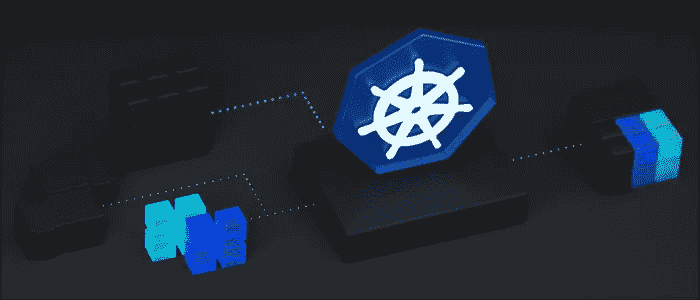

# 改进了节点故障时 Kubernetes 的反应

> 原文：<https://medium.com/nerd-for-tech/improving-kubernetes-reaction-when-nodes-fail-9ba6282630a?source=collection_archive---------14----------------------->



像 Kubernetes 这样的分布式系统被设计得很健壮，对故障有弹性，并且在这种情况下可以自动恢复，Kubernetes 在这方面做得很好。然而，由于各种原因，工作节点与主节点断开连接是很常见的，在这种情况下，您希望 Kubernetes 快速做出反应，以使系统在可用性和可靠性方面保持健壮。

默认情况下，您可能已经注意到，当一个节点关闭时，故障节点的 pod 仍会运行一段时间，它们仍会收到请求，而这些请求会失败。在我看来，这个时间必须缩短，因为默认情况下这个时间太长了。

为了了解 Kubernetes HA 在检测节点何时关闭方面是如何工作的，让我们描述一下 Kubelet 和控制器管理器之间的通信。

默认情况下，正常行为如下:

1.  根据`--node-status-update-frequency`的指定，Kubelet 定期向 apiserver 更新其状态。默认值为 **10s** 。
2.  控制器管理器每隔`–-node-monitor-period`检查一次 Kubelet 状态。默认值为 **5s** 。
3.  如果状态在`--node-monitor-grace-period`时间内更新，则控制器管理器认为 Kubelet 是健康的。默认[值](https://github.com/kubernetes/kubernetes/blob/release-1.21/pkg/controller/nodelifecycle/config/v1alpha1/defaults.go#L42)为 **40s** 。

# 失败

如果某个节点出现故障，工作流程如下:

1.  Kubelet 使用`--node-status-update-frequency=10s`向主节点发布其状态。
2.  一个节点死亡。
3.  控制器管理器将每隔`--node-monitor-period=5s`时间尝试检查由 Kubelet 报告的节点状态。
4.  控制器管理器将看到节点没有响应，并有一个宽限期`--node-monitor-grace-period=40s`，直到它认为节点不健康并将其设置为*未就绪*状态。
5.  Kube Proxy 将从所有服务中删除指向该节点内部的 pod 的端点，因此无法再访问故障节点中的 pod。

在这种情况下，会有一些请求错误，因为在**45 秒**后，节点被视为关闭并且*未就绪*之前，pod 将继续接收流量。

在 Kubelet 和控制器管理器中有许多参数需要调整。

# 快速更新和快速反应

为了提高 Kubernetes 对 down 节点的反应，您可以修改这些参数，因此如果将`-–node-status-update-frequency`设置为 **1s** (默认为 10s)，将`--node-monitor-period`设置为 **1s** (默认为 5s)，将`--node-monitor-grace-period`设置为 **4s** (默认为 40s)，则在大约 **4s 后，该节点将被视为 down。**这些数字会将反应时间从**40 秒**减少到**4 秒**。

# 测试 Kubernetes 快速反应

为了在测试环境中进行测试，我们可以使用[类](https://kind.sigs.k8s.io/)或任何其他工具创建一个 Kubernetes 集群。我们已经使用前面部分中指定的参数创建了一个自定义种类集群定义，以便我们可以测试实际的行为。

然后，我们在*控制平面*和*工作节点*中部署两个 Nginx pods。我们还在*控制平面*节点中用 Ubuntu 创建了一个 pod，这样我们就可以在*工作节点*关闭时测试 Nginx 的可用性。

为了测试 Nginx 的可用性，我们使用放置在*控制面板*和中的 Ubuntu pod 中的 curl 来访问服务，我们还从我们的终端观察属于 Nginx 服务的服务端点。

最后，为了模拟节点故障，我们停止了运行 *worker* 节点的 Kind 容器。我们还打印了节点停机时和节点被检测为*未就绪*时的时间戳

运行测试后，我们注意到节点在 12:50:22 停止运行，控制器管理器检测到它在 12:50:26 停止运行，这正是 4 秒钟后所预期的。

```
Worker down at 12:50:22.285
Worker detected in down state by Control Plane at
      time: "12:50:26Z"
```

我们从终端的测试中注意到了同样的行为。服务在 12:50:23 开始返回错误状态，因为流量被路由到故障节点。在 12:50:26.744，Kube 代理移除了指向故障节点的端点，服务可用性完全恢复。

```
...
12:50:23.115 - Status: 200
12:50:23.141 - Status: 200
12:50:23.161 - Status: 200
12:50:23.190 - Status: 000
12:50:23.245 - Status: 200
12:50:23.269 - Status: 200
12:50:23.291 - Status: 000
12:50:23.503 - Status: 200
12:50:23.520 - Status: 000
12:50:23.738 - Status: 000
12:50:23.954 - Status: 000
12:50:24.166 - Status: 000
12:50:24.385 - Status: 200
12:50:24.407 - Status: 000
12:50:24.623 - Status: 000
12:50:24.839 - Status: 000
12:50:25.053 - Status: 000
12:50:25.276 - Status: 200
12:50:25.294 - Status: 000
12:50:25.509 - Status: 200
12:50:25.525 - Status: 200
12:50:25.541 - Status: 200
12:50:25.556 - Status: 200
12:50:25.575 - Status: 000
12:50:25.793 - Status: 200
12:50:25.809 - Status: 200
12:50:25.826 - Status: 200
12:50:25.847 - Status: 200
12:50:25.867 - Status: 200
12:50:25.890 - Status: 000
12:50:26.110 - Status: 000
12:50:26.325 - Status: 000
12:50:26.549 - Status: 000
12:50:26.604 - Status: 200
12:50:26.669 - Status: 000
12:50:27.108 - Status: 200
12:50:27.135 - Status: 200
12:50:27.162 - Status: 200
12:50:27.188 - Status: 200
......
------
12:50:26.523
"kind-control-plane"
"kind-worker"
------
12:50:26.618
"kind-control-plane"
"kind-worker"
------
12:50:26.744
"kind-control-plane"
------
12:50:26.878
"kind-control-plane"
------
...
```

# 结论

从最近的结果来看，很明显，反应有了很大的改进。可以有不同的参数组合来满足特定的情况，您可能很想降低 Kubernetes 系统的值以更快地做出反应，但是要考虑到这种情况会在 etcd 上产生开销，因为每个节点都会尝试每 1 秒更新一次状态。例如，如果集群有 1000 个节点，每分钟将有 60000 个节点更新，这可能需要大型 etcd 容器，甚至需要用于 etcd 的专用节点。另外，如果你把这些设置得太小，会有一些风险。例如，短时间的临时网络故障会导致流量频繁转移。

总之，参数值完全取决于业务需求，如应用程序 SLA、集群资源利用率、基础设施提供商等。

我希望这有所帮助。一如既往，我感谢你的评论。