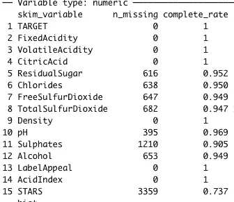

# 用 R 输入缺失数据

> 原文：<https://medium.com/nerd-for-tech/imputing-missing-data-with-r-a7f04692c895?source=collection_archive---------14----------------------->

## “不完整的数据导致不完整的结论。”(**亨利·h·内夫，** [**罗文的猎犬**](https://www.goodreads.com/work/quotes/3646120) **)**


照片由[米卡·鲍梅斯特](https://unsplash.com/@mbaumi?utm_source=medium&utm_medium=referral)在 [Unsplash](https://unsplash.com?utm_source=medium&utm_medium=referral) 上拍摄

在数据建模之前，我们必须实施的一种常见数据准备方法是缺失值的插补。在处理数据集时，我们经常会遇到可能缺少大量值的变量。如果这些值处理不当，从我们的数据推断可能是不准确的。

***为什么数据会丢失？***

在开始我们的案例研究之前，让我们试着理解“缺失”的一些原因:

1.  **完全随机缺失(MCAR):** 这里假设所有情况下缺失值的概率是相同的。因此，如果我们删除所有带有缺失值的案例，我们将不会导致偏差，但会丢失信息。
2.  **随机缺失(MAR):** 一个值缺失的概率取决于一个已知的机制。例如，某些群体不太可能比其他群体对社会调查做出回应。只要我们知道案例的组成员，我们就可以通过一些调整删除这些缺失的案例(Faraway，2014)。然而，有更好的方法来处理 MAR 问题，我们将在本帖中进一步讨论。
3.  **非随机缺失(MNAR):** 这种假设缺失值的概率取决于未观察到的变量或假设值。

我们下面的案例研究主要涉及 MAR。

# ***案例分析***


由 [Klara Kulikova](https://unsplash.com/@kkalerry?utm_source=medium&utm_medium=referral) 在 [Unsplash](https://unsplash.com?utm_source=medium&utm_medium=referral) 上拍摄的照片

我们将探索一个包含 12，795 种市售葡萄酒信息的数据集。数据集可以在我的 [Github](https://raw.githubusercontent.com/AtinaKarim/DATA_621/master/dataset.csv) 中获得。

以下是对数据集中感兴趣的变量的描述:

**目标:**购买例数
**酸度指数:**采用加权平均法检测葡萄酒总酸度的专有方法
**酒精:**酒精含量
**氯化物:**葡萄酒的氯化物含量
**柠檬酸:**柠檬酸含量
**密度:**葡萄酒的密度
**固定酸度:**葡萄酒的固定酸度
**高数字表明消费者喜欢标签设计。负数表明顾客不喜欢这个设计。许多消费者基于葡萄酒标签设计的视觉吸引力进行购买。更高的数字意味着更好的销售。
**残糖:**葡萄酒的残糖
**星级:**葡萄酒由专家团队评定等级。4 颗星=优秀，1 颗星= PoorA 高星数表明高销量
**硫酸盐:**葡萄酒中的硫酸盐含量
**总二氧化硫:**葡萄酒中的总二氧化硫||
**挥发性酸度:**葡萄酒中的挥发酸含量
**pH:** 葡萄酒的 pH**

**缺失值**

让我们运行下面的代码来检测数据集中的一些缺失值。

```
library(skimr)
skimr::skim(wine_train)
```



STARS 在所有变量中完成率最低(约 73%)。在这种情况下，可能缺少的价值是有待星级评定的葡萄酒品牌。

在本帖中，我们将尝试三种处理缺失数据的方法——删除法、均值/中位数估算法和线性回归估算法。

**删除**

```
deletedata <- na.omit(dataset)
```

这将删除具有一个或多个缺失值的观测的所有数据。然而，通过这种方法，我们正在丢失许多信息。或者，我们的代码也将丢失的变量重新编码为 0。

```
dataset2 <- dataset%>%
  mutate(STARS = replace_na(STARS, 0)) 
```

**均值、中值和众数插补**

```
library(imputeTS)
dataset3<- na.mean(dataset, option = "mean")   
dataset4 <-na.mean(dataset, option = "median")
dataset5 <-na.mean(dataset, option = "mode")
```

这是估算缺失数据的一种快速简便的方法。但是，这种方法减少了数据集中的方差并缩小了标准误差。此外，平均值容易受到异常值的影响(这不是我们关心的问题，因为 STARS 不是一个连续变量，它有固定的值)。

**线性回归**

我们将通过使用随机森林方法使用 R 中的 MICE 库进行预测来估算我们的数据。更多关于小鼠的插补方法可在[这里](https://www.rdocumentation.org/packages/mice/versions/2.25/topics/mice)找到。

```
library(mice)
dataset_mice <- mice(dataset, method = 'rf', m = 1)
```

如果插补模型是正确的，这是插补缺失数据的最佳方法。

# 估价

在我的下一篇文章中，我将稍微讨论一下这种情况下的数据建模，并评估哪一个结果给了我们最好的模型拟合。

我也在下面列出了所有帮助我写这篇文章的惊人资源。如果你想更深入地研究缺失数据和插补方法，请查阅它们。

## 引文

Swalin，A. S. (2018 年 1 月 30 日)。*如何处理丢失的数据*。走向数据科学。https://towardsdatascience . com/how-to-handle-missing-data-8646 b 18 db0d 4

统计解决方案。(2021 年 1 月 1 日)。*数据中缺少数值*。[https://www.statisticssolutions.com/missing-values-in-data/](https://www.statisticssolutions.com/missing-values-in-data/)

遥远的，J. J. (2014)。*带 R 的线性模型(统计科学中的 Chapman & Hall/CRC 文本)*(第二版。).查普曼和霍尔/CRC。