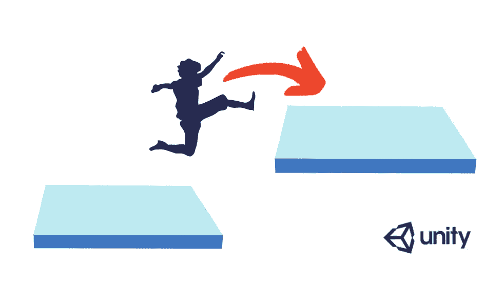

# 在 6 个步骤中，在 Unity 中增加一个双跳

> 原文：<https://medium.com/nerd-for-tech/in-6-steps-add-a-double-jump-in-unity-f2084b6a8a4d?source=collection_archive---------4----------------------->



这里的练习演示了在 Unity 中实现跳跃机制作为定制物理控制器的一部分。

跳跃任务非常类似于重力在这个项目中的作用。但是，y 方向得到的是正值，而不是负值。

按照这些步骤，可以很容易地编写一个跳转。

1.  创建一个私有变量来跟踪速度向量的最后一个 y 值。

```
private float _CacheYVelocity;
```

2.创建一个私有变量来添加选择的跳跃高度。

```
private int _jumpHeight = 50;
```

3.在检查玩家对象在地面上的位置的 if 语句中，添加下面的代码来捕获跳跃的空格输入。

```
if (_characterController.isGrounded == true)
       {
           if (Input.GetKeyDown(KeyCode.Space))
           {
               _CacheYVelocity = _jumpHeight;
           }
       }
```

到目前为止，一跳似乎已经到位。

> 为了实现双跳，需要另一个 bool 变量来知道玩家是否已经跳了一次。

4.创建私有变量。

```
private bool _jumped;
```

5.在上面的 if 语句中，将此标志设为 True。

```
if (_characterController.isGrounded == true)
       {
           if (Input.GetKeyDown(KeyCode.Space))
           {
              ** _jumped = true;**
               _CacheYVelocity = _jumpHeight;
           }

       }
```

6.在 else 部分，玩家被检查是否在空中，重新检查空间输入，并根据选择增加跳跃高度。

```
else
       {

           **if (Input.GetKeyDown(KeyCode.Space))
           {
               if (_jumped == true)
               {
                   _CacheYVelocity += _jumpHeight + 2; // *MyConfig*
                   _jumped = false;
               }
           }**

           _CacheYVelocity -= _gravity;
       }
```

应该就是这样了:)

这是最终的结果。

[](https://drive.google.com/file/d/12mRJ5KVCCPVswHCixJQAvis_np2VySao/view?usp=sharing) [## DoubleJumpPlayerMovement.mp4

### 编辑描述

drive.google.com](https://drive.google.com/file/d/12mRJ5KVCCPVswHCixJQAvis_np2VySao/view?usp=sharing) 

非常感谢