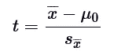
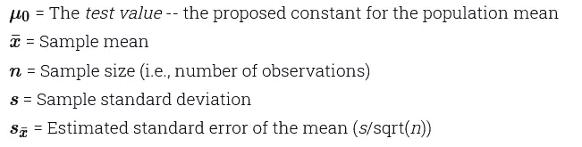
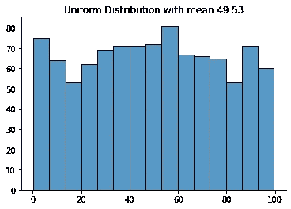
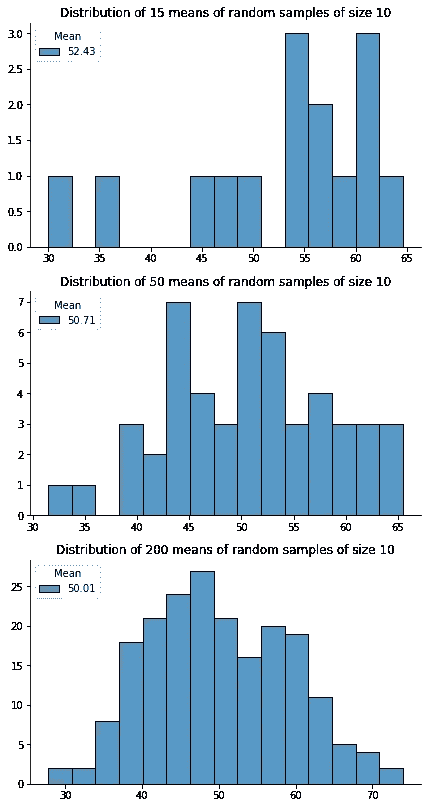
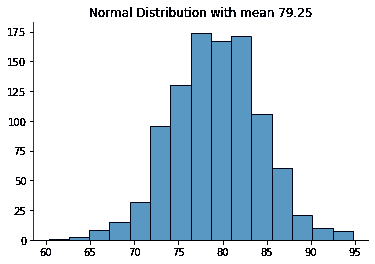
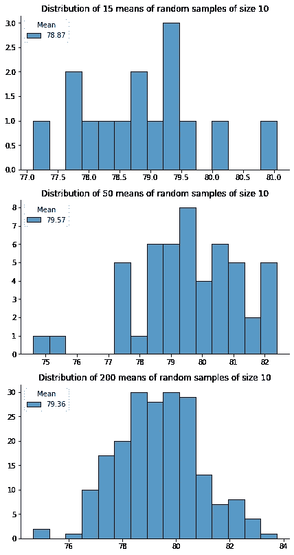
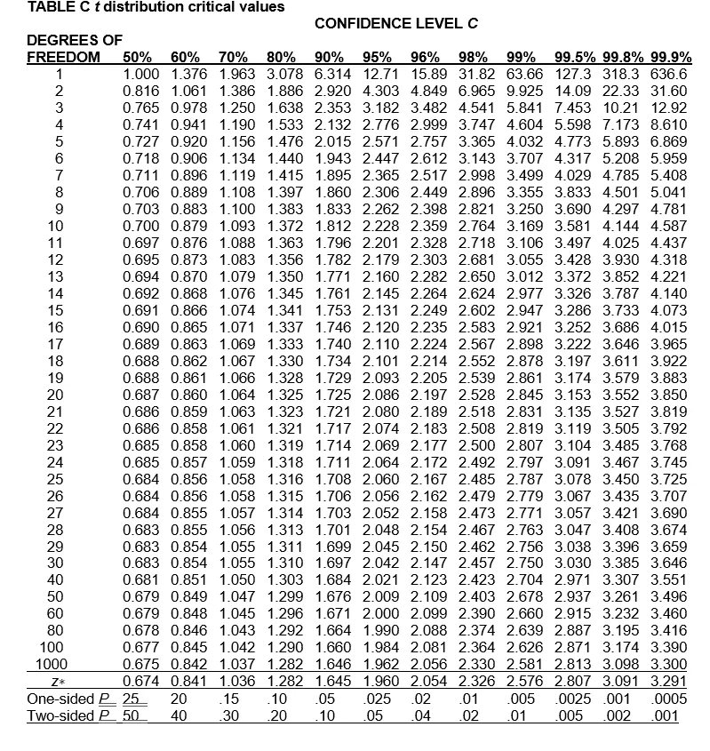

# 关于 T 检验的深入直觉

> 原文：<https://medium.com/nerd-for-tech/in-depth-intuition-about-t-test-8449b816dfa9?source=collection_archive---------9----------------------->

T 检验是一种强大的技术，可用于假设检验。几乎所有统计学家、分析师或数据科学家都知道这一点。T 检验属于一套基本的统计工具，对这种著名的技术发展深入的直觉将是非常有用的，因为它有助于更有信心地应用 T 检验。在本文中，我将尝试帮助您深入理解 T-test，并阐释其背后的逻辑。我是一个非常好奇的人，我不喜欢想当然地看待事情，相反，我会试着深入探究，看看事情为什么会这样。当我在数据科学项目的旅程中第一次遇到 T-test 技术时，我立即需要理解这个公式背后的逻辑:

为什么要从样本均值中减去总体均值来获得 t 统计量，这对我来说并不直观，但我决定做我的研究。经过进一步的探索，我意识到对 T-test 逻辑的理解需要理解它的基本构造块。

# 中心极限定理

中心极限定理的正式定义指出，如果您有一个均值为μ的总体，并从替换总体中抽取足够大的随机样本，则样本均值的分布将近似呈正态分布，均值等于总体均值μ。为了说明这一点，我使用 Python 导出了简单的视觉证明。让我们首先在均匀分布的情况下测试上述假设，在均匀分布的情况下，所有数字都有均等的机会被抽取。

我为此使用的均匀分布是从范围为[0，100]的一千个数字中生成的。让我们随机抽取 15 个、50 个和 200 个样本，每个样本 10 个数字，并可视化它们的均值分布。

正如所看到的，样本平均值越大，它就越接近正态分布，并且该分布的平均值就越接近总体平均值 49.53。

让我们在一千个平均数为 79.25，标准差为 5 的正态分布上测试中心极限定理。

使用相同的约束条件，我们抽取 15、50 和 200 个随机样本，每个样本 10 个数字，并可视化它们的均值分布。

同样的观察在这里似乎也是正确的。样本平均值越大，就越接近正态分布，并且该分布的平均值越接近总体平均值 79.25。

# 使用我们的“构建模块”来理解 T-test 背后的逻辑

把我们到目前为止学到的东西应用到一个实际例子中是很有用的。假设我们的任务是测试客户餐厅的新菜单在增加总收入方面有多有效。特别是，我们希望了解平均检查的变化是否具有统计显著性(术语统计显著性意味着这种变化很可能不是随机抽样的结果)。在新菜单推出之前，顾客桌的平均支票是 66.9 美元。这个数将是我们的人口平均数μ。新菜单推出后，我们进入数据库，随机抽取 100 份顾客支票。现在的平均支票是 81.3 美元，标准差是 8.47 美元，所以我们的样本意味着 **x̄** 是 81.3 美元。让我们使用以下公式计算 t 统计量

为了使文章简短，我将跳过计算部分。我得到的 t 统计值是 17.00。现在我们需要参考 t 表来确定获得该值的可能性。

我们的 t 统计量很大，并且没有出现在表中，因此，获得与总体均值有如此差异的样本均值的可能性极小。我们可以说，我们有 99.9%的信心，平均检查的变化在统计上是显著的，而不是随机抽样的结果。

我们正在进入这篇文章的要点，整个过程背后的直觉。让我们回到样本均值的分布。我们知道它是正态分布的，其平均值等于总体平均值。因此，在 t-统计量公式中求样本均值和总体均值的差，类似于求样本均值和样本均值分布的均值的差。因为样本均值的分布近似正态，所以它的值的概率就像任何正态分布一样被很好地定义。当 t-统计量的值很大时，样本均值远离样本均值的相应分布的均值，因此，我们研究的均值不可能来自样本均值的分布，并且从逻辑上推断样本不可能从总体中抽取。但是如果是从人群中抽取的，又怎么可能不是从人群中抽取的呢？答案很简单。在引入新菜单后，所有未来顾客支票的假设群体已经以某种方式改变，并且现在它不像更新菜单之前的旧支票群体。

我真心希望这篇文章能帮助你更好地理解 T 检验。感谢您的阅读！