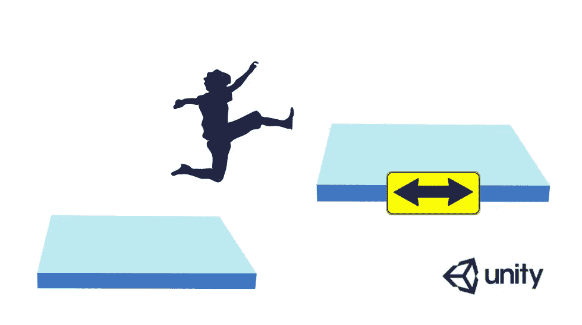
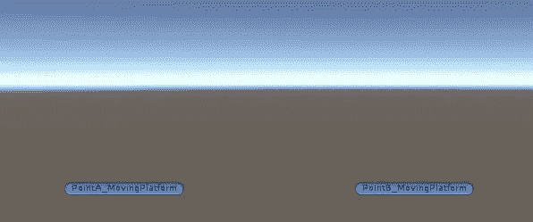
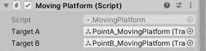
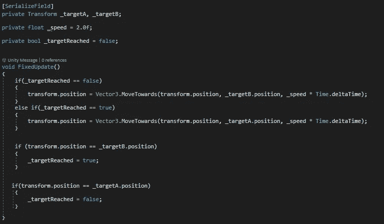
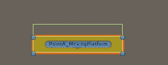
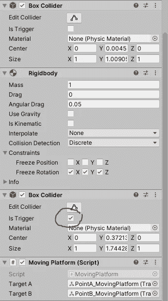
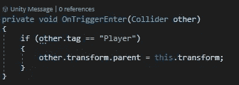

# 只需 4 个步骤，在 Unity 中制作一个模块化移动平台

> 原文：<https://medium.com/nerd-for-tech/in-just-4-steps-make-a-modular-moving-platform-in-unity-79cc7654c1a1?source=collection_archive---------2----------------------->

这里的练习演示了如何在 Unity 中实现一个模块化的移动平台。

首先，在一个平台游戏项目中，设置摄像机跟随玩家对象是非常必要的。为此，它只是一个简单的拖放。

一致

一旦主摄像机成为玩家对象的子对象，跟随机制就会就位。

移动到模块化移动平台，下面是手头的基本任务。

*   部署两个空对象以获取移动的位置参考。
*   编写代码在这两个对象之间移动。
*   检查玩家碰撞，使其随着平台移动，只要它停留在顶部。
*   一旦一切就绪，把移动平台做成一个预制的，这样它就可以以不同的方式使用了。

1.  部署两个空的游戏对象

一致

平台应在这两点之间移动。

2.运动的代码

*   创建一个新脚本，并将其附加到平台对象。
*   通过 inspector 获得对这两个空游戏对象的序列化引用。
*   使用固定更新方法，而不是常规更新方法，以避免玩家在平台上着陆时出现任何抖动。
*   在更新方法中，检查平台的当前位置，并相应地改变其路线。

这里有一个值得注意的 bool 的奇妙用法。

C#

3.检查碰撞以使玩家随平台移动。

*   为了让玩家随着平台移动，这里可以使用与本练习开始时让相机随着玩家移动相同的方法。简单地使平台成为 player 对象的父对象就可以完成这项工作。
*   因为碰撞正在被检查，所以需要添加另一个碰撞器，并且需要勾选“IsTrigger”。

一致

*   该代码要求添加 OnTriggerEnter 方法。

C#

*   同样，一旦玩家跳离这个平台，上面的动作必须反过来。

C#

4.让它成为一个预制的。

*   创建一个空的游戏对象并重置其变换位置。
*   拖动平台和目标点作为这个空对象的子对象。此外，将它们的变换位置设定为 0，0，0。(记下位置值，以便在预置过程结束后将它们放回需要的位置。)
*   最后，把它拖到预置文件夹中。
*   将变换位置重置回选择的值。

应该就是这样了:)

这是最终的结果。

 [## MovingPlatformSetup.mp4

### 编辑描述

drive.google.com](https://drive.google.com/file/d/1_xdSCLG_fvIc5DCIjPqUQSW2tLHREnND/view?usp=sharing) 

非常感谢