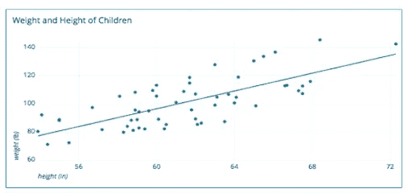

# 在机器学习中，相关性可能不总是等于因果关系

> 原文：<https://medium.com/nerd-for-tech/in-machine-learning-correlation-might-not-always-be-equal-to-causation-ed81f2e4c3d3?source=collection_archive---------4----------------------->

纳丁·沙巴纳在 [Unsplash](https://unsplash.com?utm_source=medium&utm_medium=referral) 上拍摄的照片

照片由[路易斯·里德](https://unsplash.com/@_louisreed?utm_source=medium&utm_medium=referral)在 [Unsplash](https://unsplash.com?utm_source=medium&utm_medium=referral) 上拍摄

机器学习和人工智能在包括制药、教育、零售和计算行业在内的不同行业中获得了大量需求。看一看机器学习方面的科学研究，人们可以瞥见在该领域引起兴奋的趋势。此外，斯坦福大学和哈佛大学等顶尖大学对制药行业的研究成果让医生预测某些疾病的几率变得更加容易。

数据可视化包括绘制图形和图形的交互式工具，确保人们理解输入机器学习模型进行预测的数据。此外，考虑输入机器学习模型进行预测的特征也同样重要。事实上，一些特征可能不是真正有用的，并且对算法生成的结果贡献很小。因此，在向模型提供数据之前，必须遵循适当的可视化技术，并理解特征之间的相关性。

在执行数据可视化时，很有可能机器学习的新手经常会错误地认为相关性等于因果关系。在进一步讨论之前，让我们先理解相关性的含义，然后，让我们转向因果关系。

**什么是相关性？**

在机器学习中，两个特征之间的相关性是它们之间存在某种线性的事实。换句话说，如果特征之间存在某种形式的关系，则称它们是相关的。例如，让我们以个人身高和体重之间的相关性为例。例如，如果一个人很高，那么他/她可能很重的几率也很高。当我们考虑不同的个体并记下他们的体重和身高时，我们可以从散点图中看到，各个特征之间似乎存在相关性。

图片来自[https://digitaschools.com/scatter-plot-python/](https://digitaschools.com/scatter-plot-python/)

在上图中，我们了解到身高和体重之间存在线性关系。

**什么是因果关系？**

当有两个事件发生时，这两个事件有可能非常相似。换句话说，我们说一个事件导致了其他事件的发生。例如，可能有云，也可能有雨。如果外面正在下雨，我们说是云导致了下雨。这两件事之间显然有关系。因此，我们说一个事件导致另一个事件分别发生。

为什么相关性不等于因果关系？

如果我们要检查人的身高和体重，我们将主要看到特征之间的正相关关系。但是说个子高会使人变重是不公平的。因此，相关性并不总是分别等于因果关系。可能还有其他因素导致个体体重增加，如地理位置、生活方式和饮食习惯。

总而言之，相关性可能不总是等于因果关系。在许多情况下，高度相关的特性可能不会因为一个特性而导致另一个特性发生。希望这篇文章能区分相关性和因果性。请随意分享你的想法。谢谢！