# 去神秘化的 Nullsafety 及其运算符

> 原文：<https://medium.com/nerd-for-tech/in-the-flutter-world-these-days-nullsafety-has-been-something-of-interest-and-i-decided-to-explore-5662c51972b0?source=collection_archive---------2----------------------->

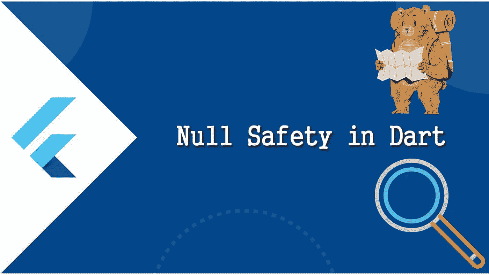

在最近的动荡世界中，nullsafety 已经成为一个有趣的东西，我决定探索它，并给出一个非结论性但有趣的观点，和我一起享受探索 nullsafety 的旅程。

空安全就是当你显式地声明一个特定的变量应该包含空，而任何其他不显式的变量(引用)都不会为空。健全的空安全，那么意味着，dart 将保证，如果您已经声明了一个变量或引用为不可空，它将永远不会为空。

在 null 安全之前，null 值(null 类型)是所有类型的子类型，这意味着默认情况下所有类型都包含 Null 作为可接受的类型，

这意味着 x 可以是包括 null 在内的任何整数，并且不为 x 赋值，默认为 null(默认为空值)(这是因为 dart 是静态类型的，它强制要求每个变量在使用之前都必须有一个类型，因此也必须有一个值)，但不幸的是，通常不为 null 定义超类型的方法和/或操作。

让我们以整数的加法运算为例。因为 x 是零

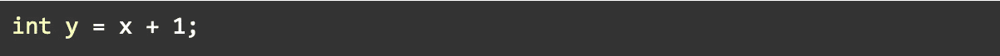

当您试图对空值执行整数运算时，会出现错误。这和许多其他失败的类型操作(因为操作是在 null 上执行的)是 null 的主要失败，有时这些错误通常是无意的，并且是一个麻烦，因为你只能在运行时(当应用程序正在使用时)发现它们。

因此，null 安全(我希望只有在我明确声明的情况下才拥有 null，其他地方都没有，并且如果在我的代码中无意中引入了 null，我会得到通知)。

***先说空安全。***

一旦你选择使用它，它会自动对你的代码执行规则，严格的规则类似于我们已经熟悉的“final”关键字。

***你不能只声明顶级变量(通常是全局变量)和静态字段而不实例化它们。***

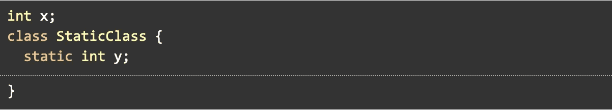

这将自动给你一个错误，告诉你初始化你的变量。这是因为 x 被告知它包含一个整数值，但它目前是空的，所以编译器对你撒谎尖叫。

有三种方法可以解决这个问题。

*   初始化 x，就像往常一样，给 x 加一个值，使你的陈述为真，然后继续你的生活

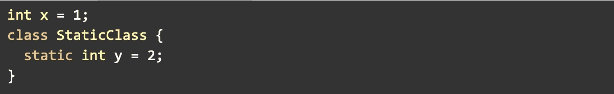

*   也许你现在真的没有 x 的值，但是你确定 x 永远不会为空，并且总是包含一个整数，那么你可以使用 late 关键字。这个关键字的意思是，x 将是一个整数，在使用它之前，肯定会被初始化。

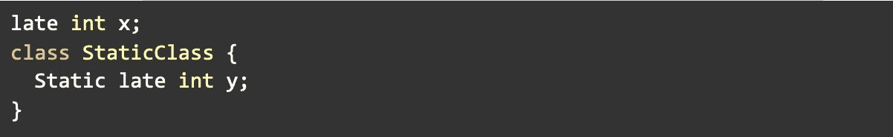

但是，如果您尝试使用它而没有对它赋值，编译器将不会捕捉到它，因为由于这些变量具有全局范围(或者可以从任何地方访问)，它不能完全确定您可能在代码中的某个地方初始化了该变量，所以您不会得到非常有用的指示错误的曲线，相反，dart 运行时分析器捕捉到它(当您运行代码时)并引发 LateError

如果你尝试类似

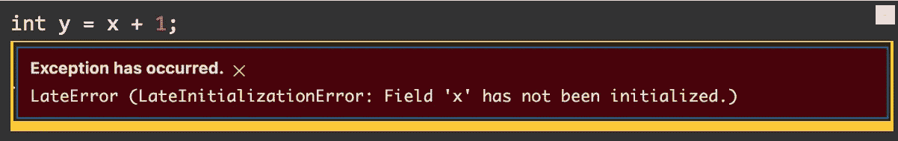

*   最后，也许您真的希望变量为空或可空(可空类型)，但现在 dart 不允许您这样做。有一个运算符，即“？”运算符，您可以将该运算符附加到某个类型，以指示该类型包含该类型的值或空值。

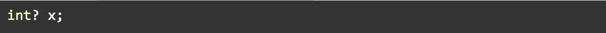

现在我们在代码中引入 null，我们需要一些方法来处理它，否则它会溢出并到达我们不希望的地方。请注意，引入这一点，意味着我们在一定程度上对代码中的空值负责，它很容易被运行时分析器忽略，所以请谨慎使用(至少我们不能 100%确定我们会跟踪它)，尽管 dart 有处理可空值的新规则，我们将在后面看到。

**我们已经谈到了顶级变量和静态字段，那么局部变量和实例字段呢？**

这些字段和变量对于实例化规则来说有点宽松，因为它们的作用域是某种约束，所以 dart 可以正确地检查变量，这意味着它很容易知道这些类的变量在使用之前何时尚未初始化，因此只能防止您在没有正确初始化的情况下使用它们

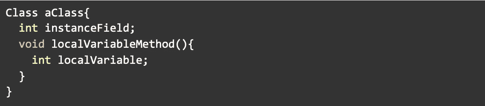

正如我们所看到的，这样做是非常有效的，因为看起来好像 dart 向这些变量添加了某种隐式的 late 关键字。通常，您在构造函数中实例化实例字段，这样 dart 知道至少在到达构造函数体之前，您将初始化它们，如果您不这样做并试图使用它们，您将得到曲线警告。对于局部变量，需要在使用前实例化它们。

为了确保代码中所有区域的空安全，我们不仅要关注变量，还有函数(事实上，函数也是变量，包含其返回类型的值)，所以如果返回类型是不可空的，那么只有确保它永远不返回空类型才有意义。因此，在定义返回类型时，要考虑上面提到的所有变量规则。

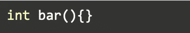

是有效的非空返回函数

如果一个函数只能返回一个空值，那么使用 void return(与之前的使用没有任何变化)

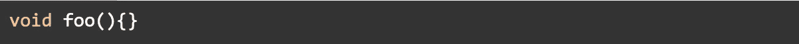

此外，对于可以返回 null 或类型的函数，请使用“？”接线员。

对于高级概念，有些函数并不意味着(显式地)返回任何东西，而是意味着永远不会显式地完成执行，例如，抛出错误的函数等，它在此处返回 never，read more。[不可达代码](https://dart.dev/null-safety/understanding-null-safety#never-for-unreachable-code)

处理每个函数的返回类型只是第一步，null 可以通过函数的参数引入到函数中。让我们从可选参数开始，作为引入 null 的第一点，可选参数像每个参数一样总是有一个默认值，当没有提供时，它默认为 null(在 null 安全之前)。

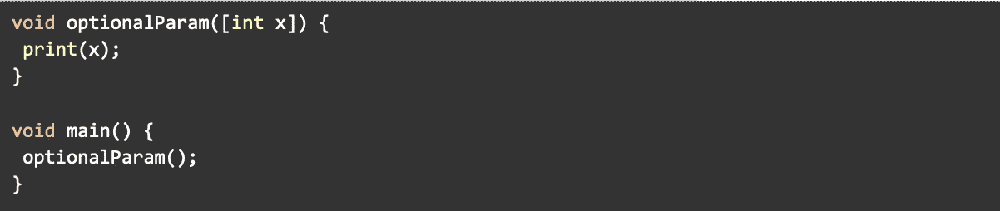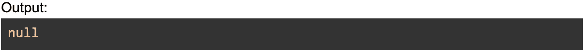

这完全没问题。但是现在有了 null 安全，您必须提供一个默认参数，因为 dart 注意到，很明显可选参数将引入 null。

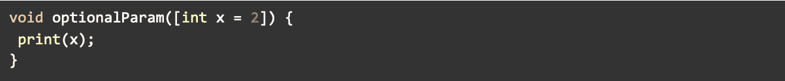

如果 x 没有被传递，您也可以通过添加“null type union operator”来强制要求 x 为 null 到类型。

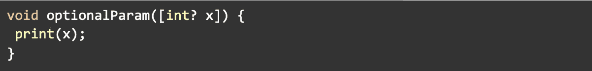

这解决了可选参数的问题。

我们还有另一个问题，关于命名参数，命名参数在默认情况下是可选参数，并经历与可选参数相同的问题，如果你不显式地提供默认值，它通常在空安全之前默认为空，而在空安全的情况下，这变成了一个错误。当然，您可以像处理所有可选参数一样处理它们。一种新的方法，强制要求参数是必需的，并强制要求必须向参数传递一个值。(在 null safety 之前，我们使用了 required 注释@required，现在它已被替换为 required 关键字

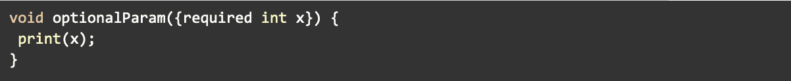

如果不提供 x 的值，就不能调用 optionalParam。

但是有些人真的可以恶作剧，决定传递一个 null 给 x，我们如何处理这个？我们不需要，dart 自动指出这一点，记住，null 不再是 int 的子类型，所以它不是一个可接受的参数，它更像是试图将一个字符串传递给整数 x，这没有意义，对吗？完美。

让我们看看 null 设法进入函数或控制流的点。例如，如果你在你的函数变量中，你已经明确声明它们可以是空的。

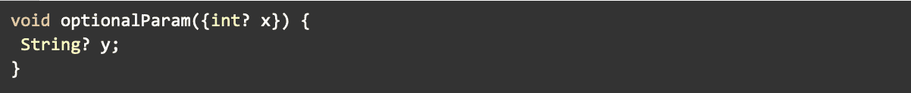

正如我们之前看到的，我们在 null 安全之前遇到的主要错误是，为底层类型定义的操作和方法不是为 null 定义的，当试图在 null 值上访问它们时会引发错误

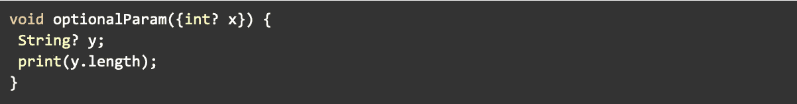

在 nullsafety 中引发错误，因为 y 可以为 null

让我向您介绍两个非常有用的操作符，它们帮助我们处理可空值。

*   null aware 运算符("？)出现在变量之后，运算符 ex "？.", "?[]", "?.."等等

因此，为了使上述工作正常进行

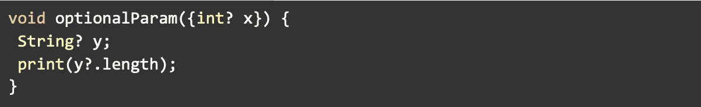

这只是意味着，如果 y 不为空，则返回长度，如果 y 为空，则默认为空。

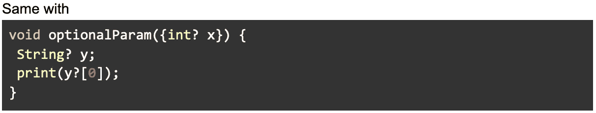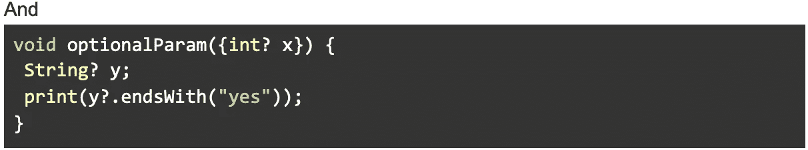

这仅仅意味着如果 y 不为 null，则返回索引 0 处的字母，否则返回 null，如果 y 不为 null，则返回结尾的布尔求值，否则返回 null。

*   我们有“价值意识操作员”“！”，它出现在变量之后，用于验证该变量在该实例中肯定不会为 null。

所以看上面的例子，如果我们知道 y 不为空，我们就可以替换“？”用“！”要强制 y 是指定的类型，不需要检查 null，继续操作。

“价值意识操作员”“！”当短路不是一个选项时非常有用。

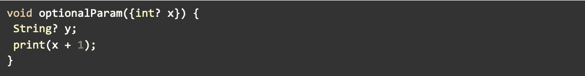

这就产生了一个错误，将 x 短接为 null 是没有意义的，因为 null 仍然不能与 1 相加，所以为了使 x + 1 有效，x 必须是一个整数。所以…我们应该只在确定 x 是 int 类型的值时才进行运算

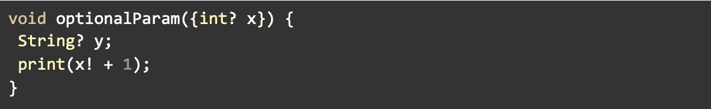

完美。我们的探索之旅到此结束，我希望这是一次愉快的旅程。

我希望这是对零安全的介绍，而不是全部的介绍。如果你需要知道更多关于什么是可能的，请不要犹豫去读更多。

希望下一部能见到你。