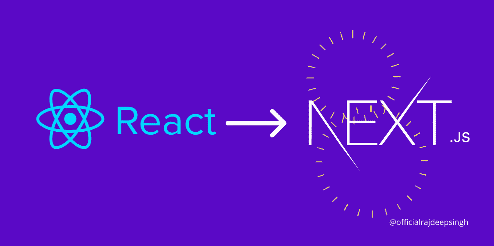

# 在哪种情况下我们需要将 reactjs 更新为 nextjs？

> 原文：<https://medium.com/nerd-for-tech/in-which-case-do-we-need-to-update-reactjs-to-nextjs-5e7ab6dbd995?source=collection_archive---------2----------------------->

## Nextjs

## 为什么我们需要将 reactjs 更新为 nextjs？

将 reactjs 更新为 nextjs

Nextjs 是 reactjs 世界中一个需求量很大的库，许多公司和个人都使用 nextjs 来做网站。Nextjs 有许多特性，吸引了新的公司和开发者，比如图像组件、内置 CSS 支持、SEO 支持等。

你用 nextjs 零配置启动一个网站。您不需要为您的 web 应用程序编写配置。

例如，当我们从 react 开始时，我们要求路由器在 reactjs 中打开不同的页面。在 reactjs 中实现路由后我们需要了解路由的基本概念，另一方面，在 nextjs 中路由是自动启用的。在 nextjs 中，您不需要为代码编写额外的一行。

为了理解 nextjs 中的更新概念，我举了一些例子。这个案例有助于更好地理解主题。我选择人们的问题作为人们在电子邮件和评论部分提问的案例。其次，当我是一个 nextjs 的新开发者时，我脑子里有一些疑问，其他人也问同样的问题。我将我的问题和人们的询问结合起来，并根据问题创建案例，这样每个人都能理解主题。在我花了很多时间和 nextjs 一起建立网站和 p .然后我发布，很多人也有类似的问题，所以我写了一篇文章。

## 对于一个新网站，应该用什么，nextjs 还是 reactjs？

对于新网站，我推荐使用 nextjs。但是如果你的公司很小，我会建一个网站来炫耀。你用网站告诉大家我公司有网站。你的网站对你来说不是很重要，你用网站来代表网站给客户看。以防你在网站上使用 reactjs。如果你使用 nextjs，它对未来是完美的。

## 我开始了一个新的博客；应该用 nextjs 还是 reactjs？

对于新博客，我坚定地说使用 nextjs。如果你有一个 reactjs 的旧博客，我建议把你的 reactjs 网站更新成 nextjs。

## 我有一个基于 reactjs 的旧公司网站。我们做什么呢

如果您的网站是基于静态站点生成的，那么您不需要在网站上进行服务器端呈现。我建议你不要更新你的网站。在你的网站上，一切都很好。

## reactjs 到 nextjs 的升级过程快速简单？

以我的经验来看，升级过程对公司和个人来说都不容易。假设你的网站很小，只有五个页面，没有任何 redux 功能。需要 3 到 5 天，取决于开发者。初级开发人员也需要花很长时间在你的网站上。

## 把 reactjs 转换成 nextjs 需要多少钱？

这是一个很棘手的问题，所以经常有人反复问我。答案基于你。我不知道你付给开发商多少钱来把 reactjs 网站转换成 nextjs 网站。

## 静态站点生成，应该用什么，gatsby.js 还是 nextjs？

两种 cms 都适合静态站点生成。你不要害怕盖茨比。如果不需要服务器端渲染，可以使用 gatsby.js 进行网站设计。然后 gatsby.js 对网站有好处。

## 以前的文章

 [## React 中有多少个钩子？

### 挂钩是在 React 中编写更少、更简洁代码的一种方式。

javascript.plainenglish.io](https://javascript.plainenglish.io/how-many-hooks-are-present-in-react-c97f0200a26a)  [## 如何在 React 中检查版本？

### 在 React 中用 import 语句、package.json 和 npm 或 yarn 检查版本。

javascript.plainenglish.io](https://javascript.plainenglish.io/how-to-check-the-version-in-react-5780fd2ced4b)  [## 如何在 Nextjs 中使用带有 CDN 的 Bootstrap 5？

### Bootstrap 5 是领先的 CSS 框架。您使用复制粘贴代码在 nextjs 中添加 Bootstrap 5。

medium.com](/nextjs/how-to-use-bootstrap-5-with-cdn-in-nextjs-e9b9c8fd35cd) 

## 结论

在我看来，reactjs 升级到 nextjs。这都是基于你的选择和思考。对于大公司来说，升级并不容易，因为网站有很多组件、redux 和另一个库要安装在你的应用程序中。当你更新你的网站时，确保你和你的队友头脑清晰。

你的网站不需要服务器端渲染，你的网站是基于 reactjs 的。我的意见是不要在你的网站上浪费钱。很好。如果你的网站对商业来说是必不可少的，你就在上面花钱，把 reactjs 转换成 nextjs，以获得更好的用户体验。

其次，你的静态站点生成网站是基于 gatsby.js 的。你的网站是好的，不需要转换为 nextjs。一切都很好。

如果您有任何疑问或需要我的帮助，请随时通过 official rajdeepsingh[@]Gmail . com 与我联系。也可以联系我，关注 [*Next.js 出版*](https://medium.com/nextjs) *。*

如果你喜欢我的文章，请随意喜欢并与他人分享我的文章。你还在推特上标签 [*官方 _ R _ 深度*](https://twitter.com/official_R_deep) *。*

 [## 拉吉迪普·辛格

### 我创建的这个网站是为了让初学者了解编程的基本概念。主要涵盖一个话题…

officialrajdeepsingh.dev。](https://officialrajdeepsingh.dev/)