# 增加或减少 Linux 中静态分区的大小

> 原文：<https://medium.com/nerd-for-tech/increase-or-decrease-the-size-of-static-partition-in-linux-a0c0b144c338?source=collection_archive---------17----------------------->


## Linux 分区

**分区**还允许您将硬盘分成独立的分区，每个分区都有自己的硬盘。**如果你运行多个操作系统，分区**特别有用。在 **Linux** 中，有很多强大的工具可以用来创建、删除和操作磁盘**分区**。

> *让我们开发实际的*

# 关闭虚拟机并增加磁盘大小

首先，关闭虚拟机并增加磁盘大小。在这里，我增加了磁盘或添加了两个大小为 30 GB 的新磁盘/dev/sde 和/dev/sdh。然后启动您的虚拟机并转到控制台。

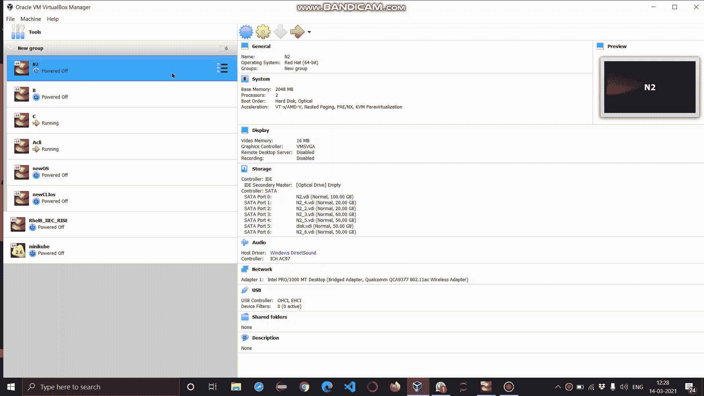

运行此命令查看磁盘

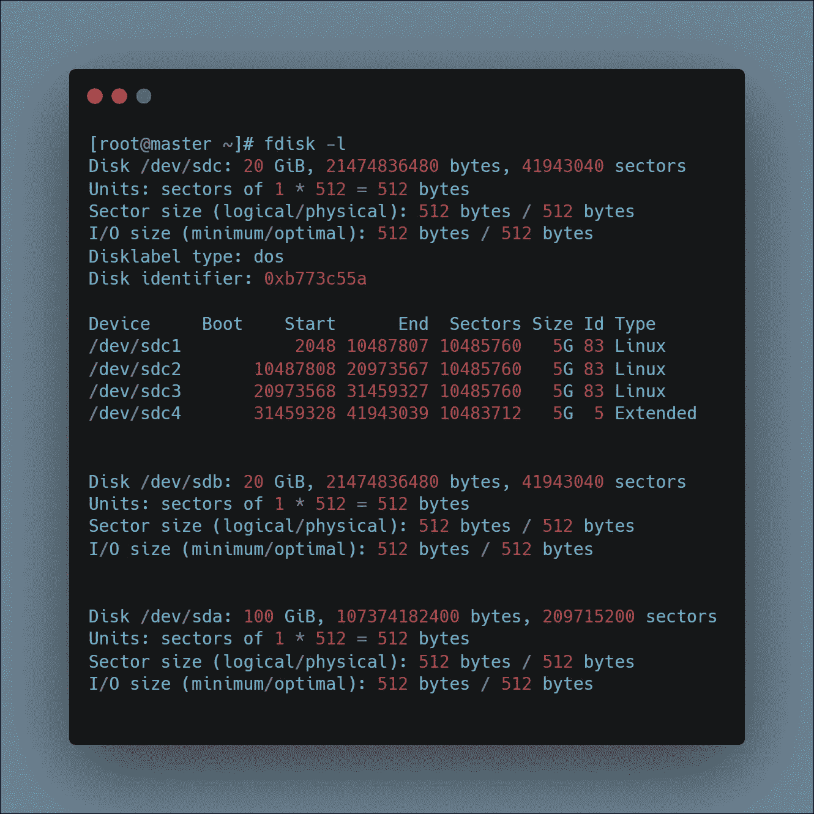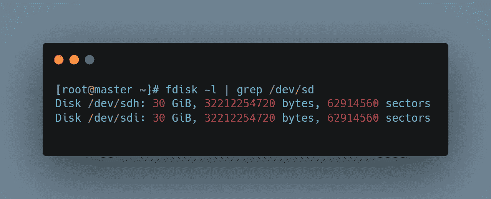

## 分区/开发/sdh 存储设备

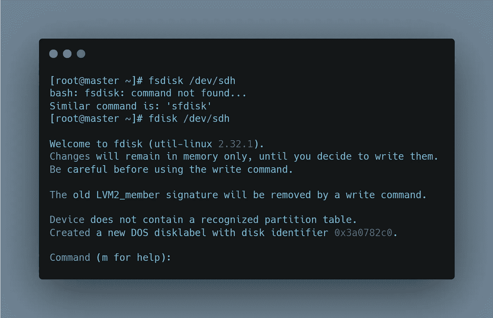

**添加分区**

```
>> fdisk <disk_name>-> press **n** to create new partition and press **p** to create sectors
-> press **p** to see partition
```

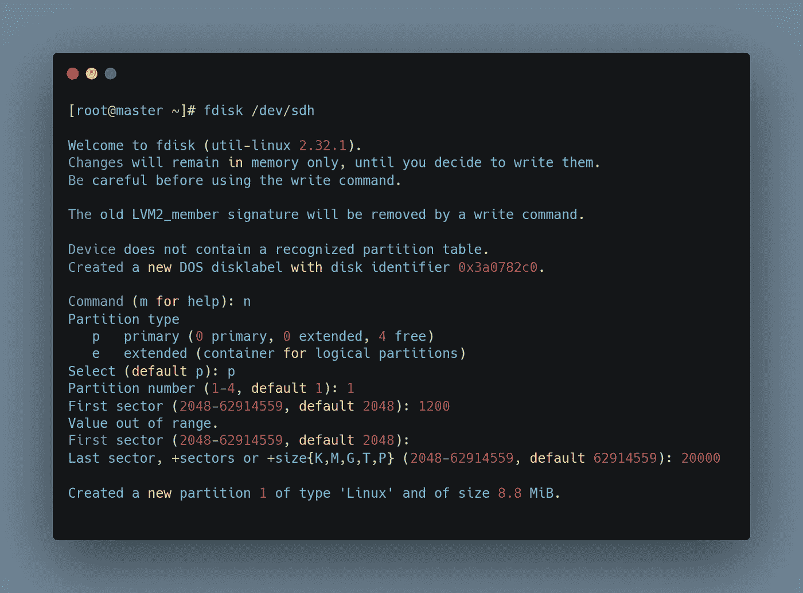

**显示分区**

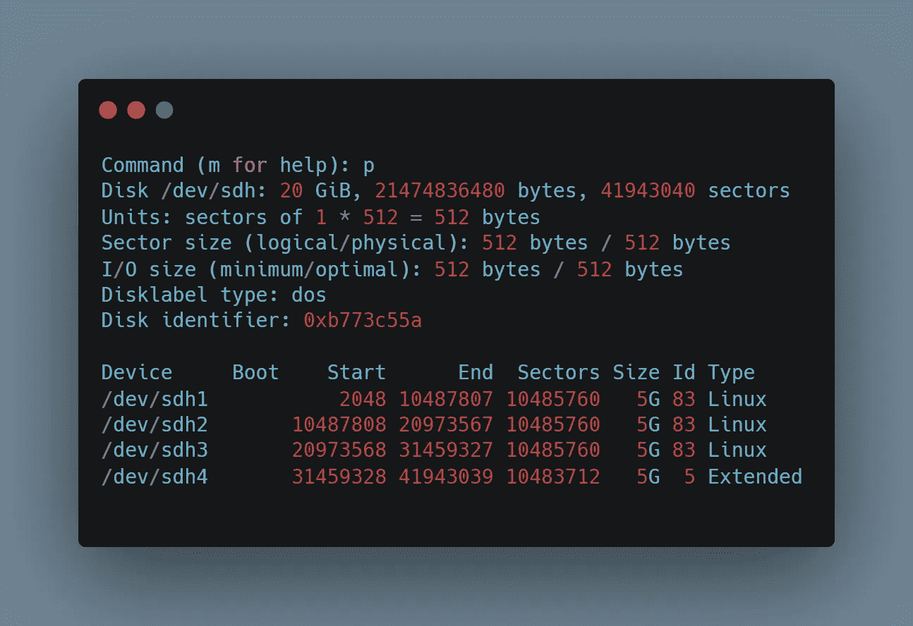

# 挂载分区并创建一个新文件

接下来，我们将把分区挂载到我们在操作系统上创建的名为“fs”的文件夹中。

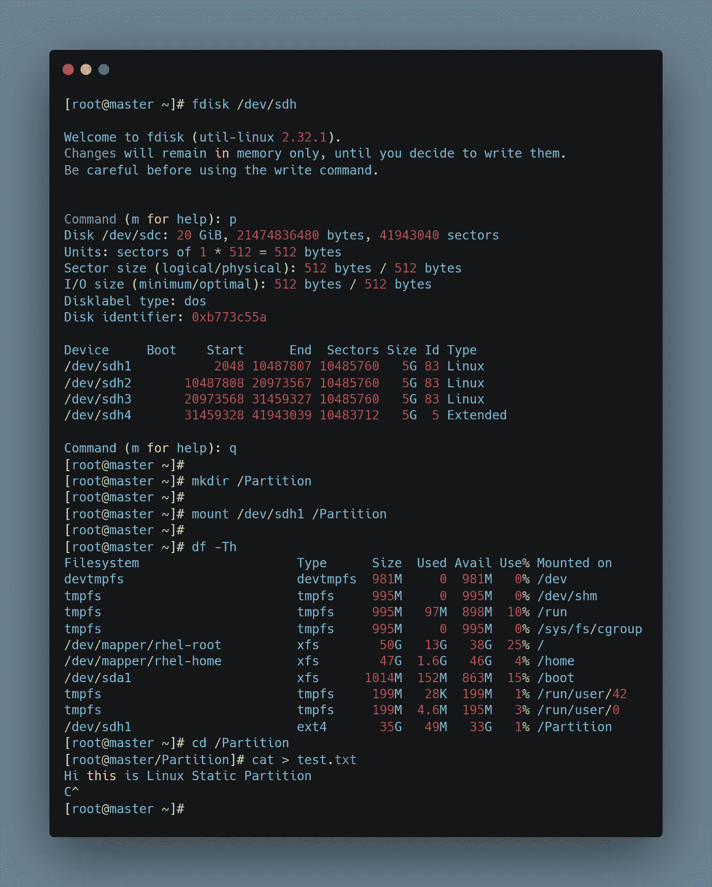

正如我们所看到的，我们已经创建并存储了一个文本文件“test.txt”。

# 增加静态分区的大小

现在，让我们看看如何增加这个静态分区的大小。

# 卸载分区

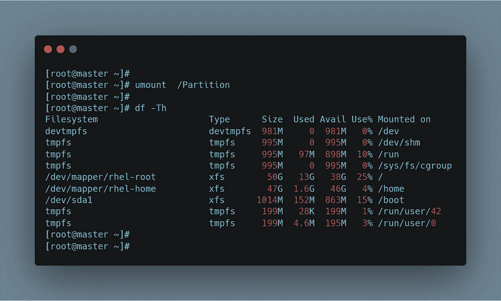

# 删除创建的分区

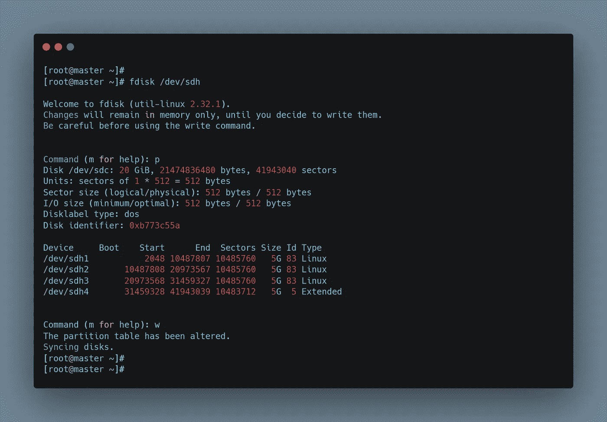

# 创建一个更大的新分区

让我们创建一个更大的新分区。我们将为/dev/sdh 创建一个 10Gib 的分区。

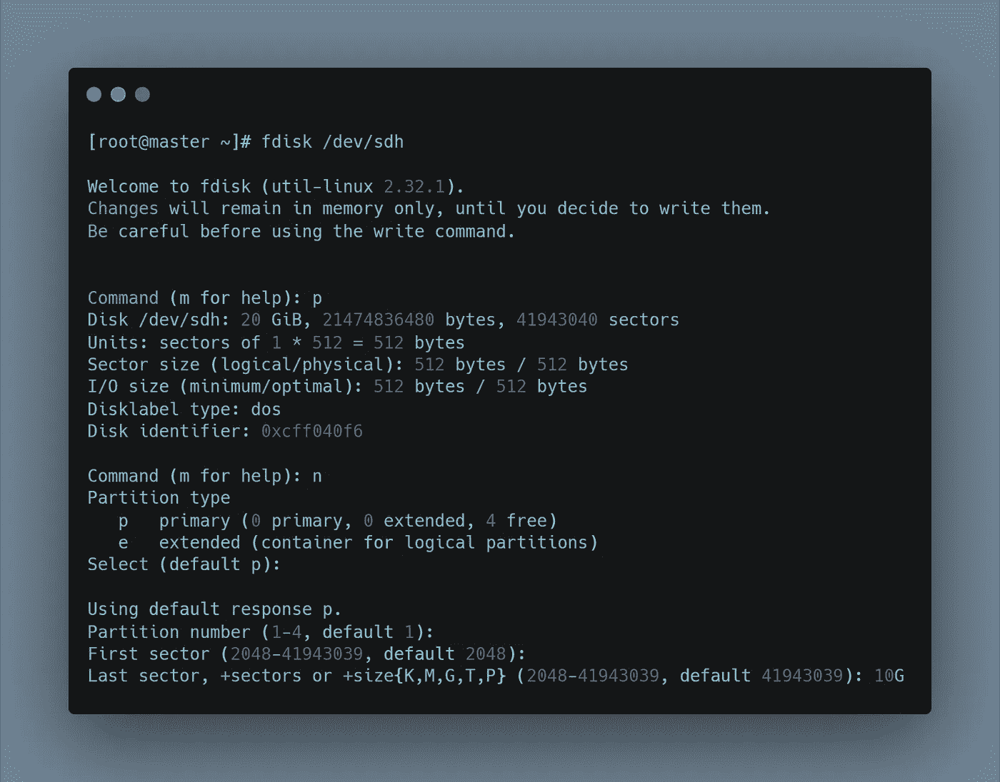

# 配置文件系统

现在让我们在文件系统上运行 fsck 命令&用 resize2fs 命令调整文件系统的大小。

*   e2fsck 用于检查 ext2/ext3/ext4 系列文件系统。
*   resize2fs 是一个命令行实用程序，允许我们调整 ext2、ext3 或 ext4 文件系统的大小。

```
>> resize2fs -f /dev/sdh1
```

# 重新挂载扩展分区

```
>> mount /dev/sdh1 /Partition
```

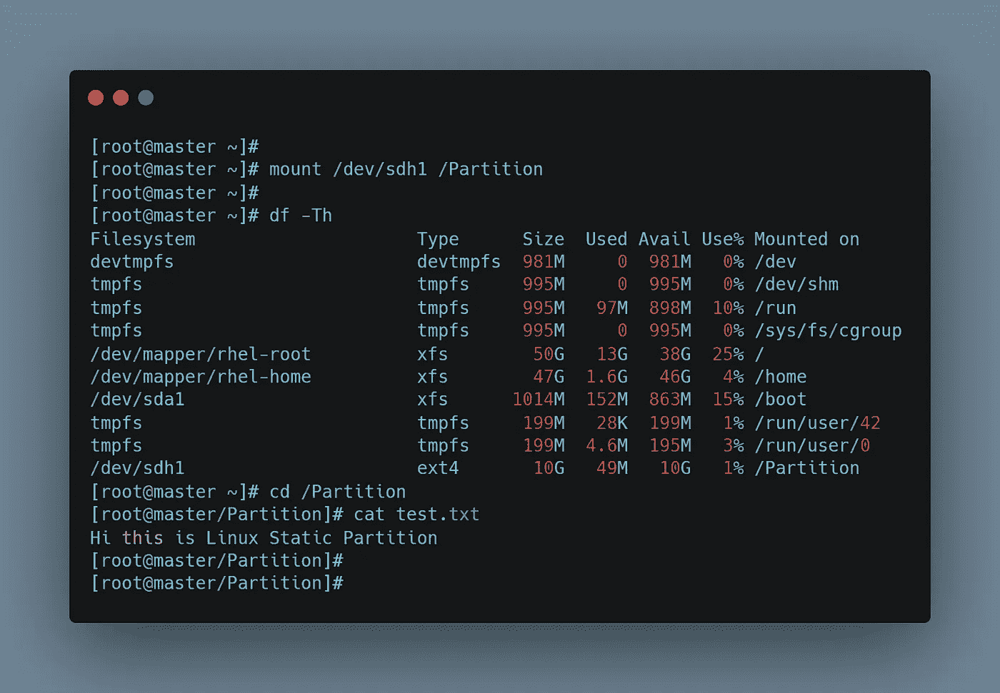

正如我们所看到的，之前创建的文件仍然可以访问。

# 减小静态分区的大小

现在，让我们看看如何减小这个静态分区的大小。

# 卸载分区


# 删除创建的分区


# 创建一个更小的新分区

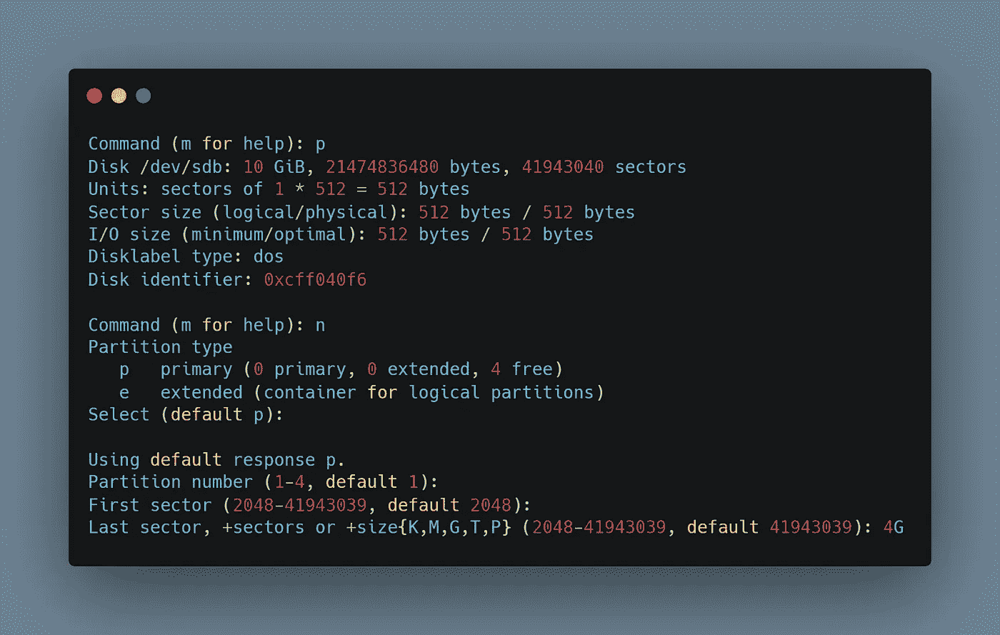

# 配置文件系统并重新挂载扩展分区

同样，我们必须在文件系统上运行 fsck 命令&用 resize2fs 命令调整文件系统的大小。

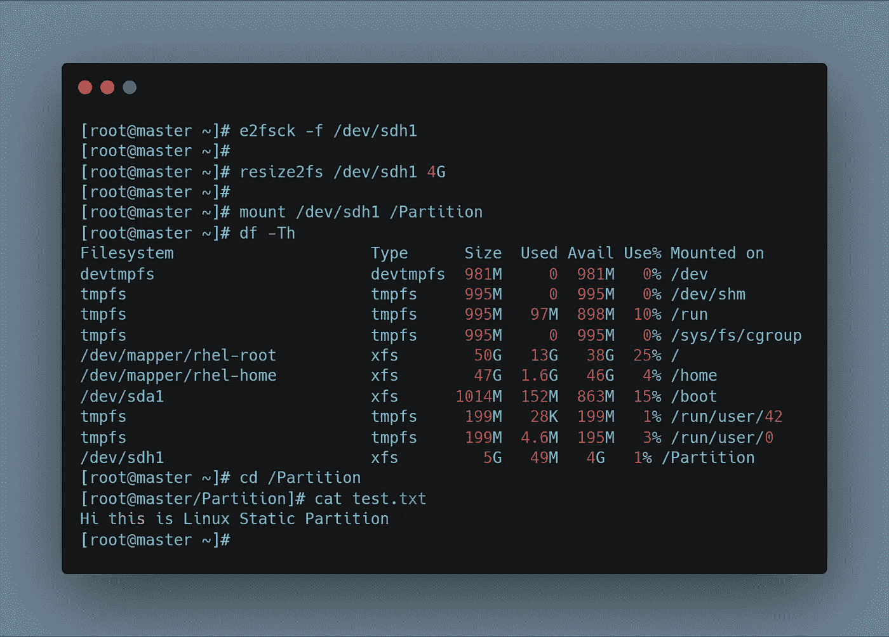

# 感谢阅读！！

# 继续学习！！继续分享！！

# 你可以通过以下方式联系我😅：

[*LinkedIn*](https://www.linkedin.com/in/vinodha-kumara-8a00bb1a8/)*[emailme](mailto:vinodhakumara2681997@gmail.com)*