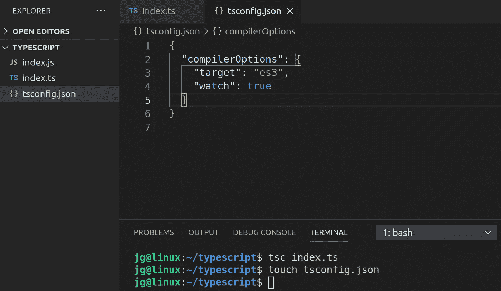
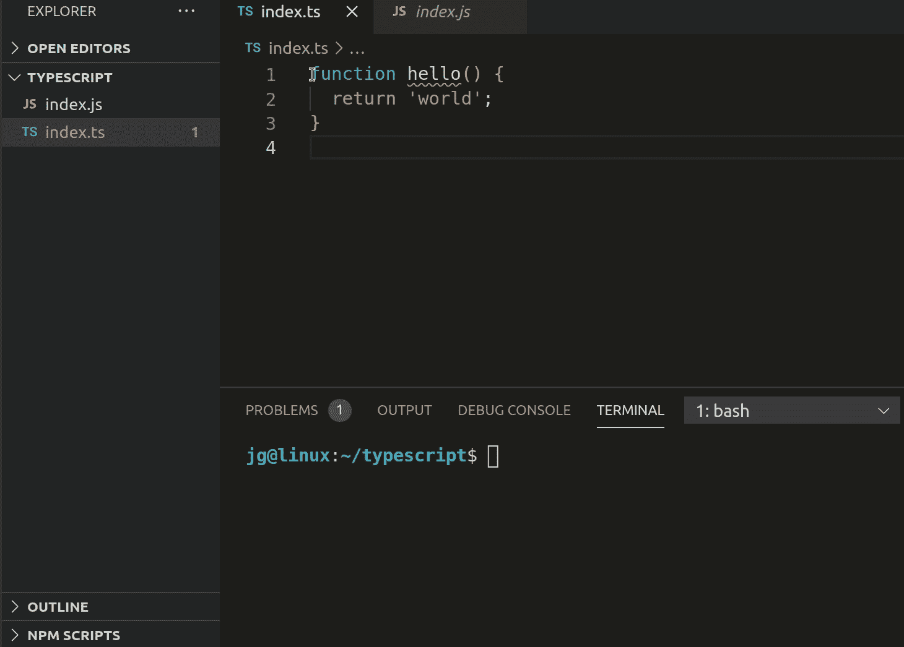
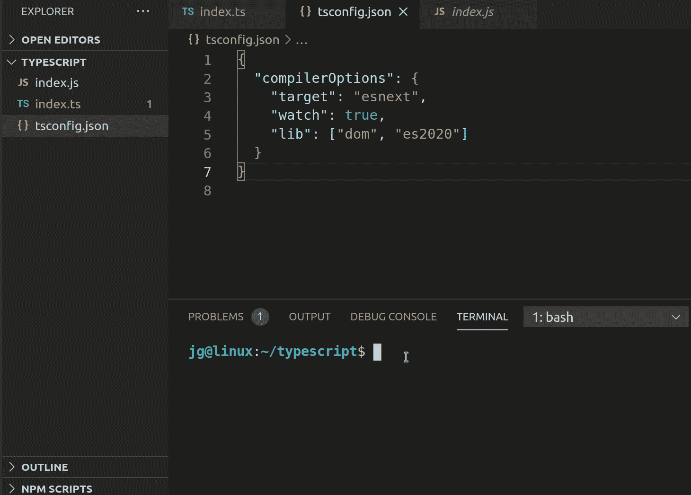
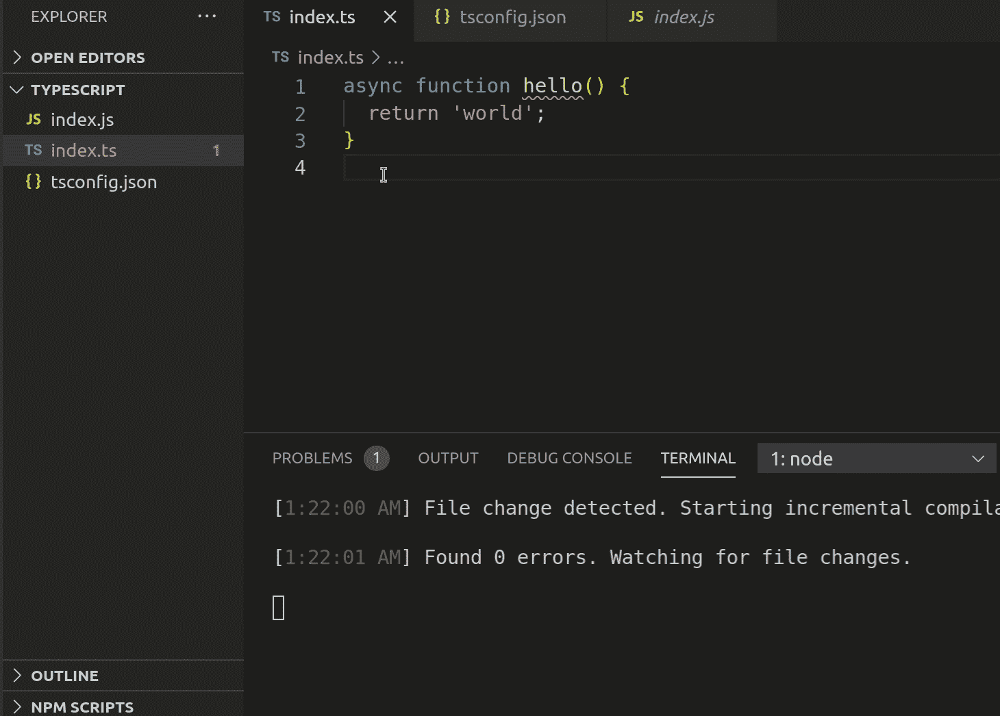

# 使用 TypeScript 提高您的生产力

> 原文：<https://medium.com/nerd-for-tech/increase-your-productivity-with-typescript-1c7bd3a00339?source=collection_archive---------12----------------------->

## 打字稿/生产力

## 微软创造的最好的免费东西

最初，我对 TypeScript 不屑一顾，因为我不熟悉强类型语言，而且我真的尽量避免编写任何不必要的代码。然而，我发现预先多写一点代码可以在以后获得很大的回报。

TypeScript 的设计和创建不仅仅是为了吸引后端开发人员进入前端，而是为了给每个人提供一个工具，让我们能够基于从其他语言学到的经验来创建健壮的代码。TS 的最大优势之一是您可以在 IDE 中自动获得工具。当您使用强类型的库或代码时；您的代码是自动编译和文档化的，因此您很少需要参考在线文档。此外，编译器可以提前捕捉 bug。

> 你愿意在开发过程中出现“愚蠢的”错误，还是在生产过程中出现疯狂的错误？—孔子-贝特曼- Reddit

TS 的另一个巨大优势是它是 JavaScript 的超级集合，所以如果你熟悉 JS，实际上没有学习曲线。任何有效的 JavaScript 都是有效的类型脚本，因此您可以逐步学习。

# T **自己试试**

要开始使用 TypeScript，您需要做的第一件事是全局安装它。

```
npm install -g typescript
```

这将使您能够访问运行 TS 编译器的“tsc”命令。默认情况下；TS 代码将被编译成 ES3。

在这个 gif 中，我创建了一个 index.ts 文件并运行“tsc”命令。编译器创建了一个 index.js 文件，其 js 等同于我在 TS 中编写的内容。在本例中，这两个文件完全相同。


TypeScript 编译器非常复杂，您可以传递给它许多选项来定制它的行为。您可以在命令行中传递这些文件，但是最好的方法是创建一个 tsconfig.json 文件。这种配置听起来令人望而生畏，但只有几个选项是你真正需要考虑的。



tsconfig.json 文件示例

“目标”是你的 TS 将被编译成的 JS 风格。在上图中你可以看到我选择了 ES3。我还将“watch”选项设置为 true，这将允许编译器自动监视更改，并在每次保存时更新 index.js。对于 DOM 和异步函数，目标是很重要的。在下一张 gif 中，您可以看到当您将一个异步函数编译到不包含异步功能的 ES3 时会发生什么。



我们可以通过使用“esnext”将 tsconfig 中的目标更改为最新版本来解决这个问题。在这里可以看到，在“target”更改为“esnext”之后，JS 已经用 async 进行了更新。你还会看到“lib”选项，我将在下面解释。



另一个重要选项是“lib”。它允许我们自动包含某些环境的类型，如 DOM 或 ES2020。这就是令人难以置信的 TypeScript 工具变得明显的地方。在下一个 gif 中，我将把 URL 类引入 index.ts，你可以看到我正在从 VSCode 中获取自动完成和智能感知，因为我已经在“lib”选项中包含了“dom”。



如果我们将鼠标悬停在类上，我们会得到完整的文档和任何错误消息，说明为什么这段代码不能运行。因此，如果您正在构建一个 web 应用程序，您会希望包含 DOM 库，它允许编译器使用所有本机 DOM 类编译您的代码，而不会出现任何编译错误。

就我个人而言，当我遇到从编译器得到的易读的错误消息时，我的 TypeScript“啊哈”时刻到来了。在另一篇文章中，我将深入探讨为什么这些错误消息很重要，以及如何开始用 TypeScript 编写漂亮的类型化代码。