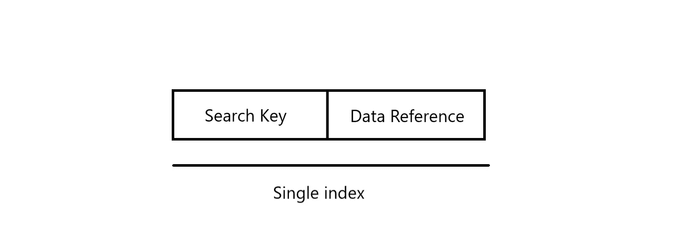
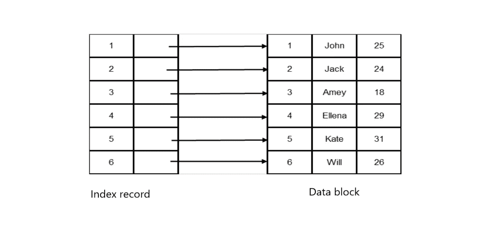
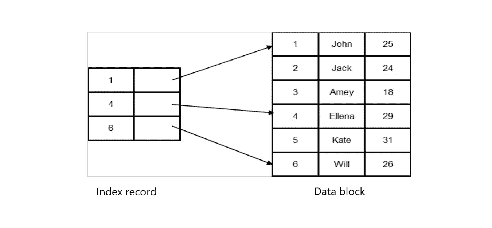
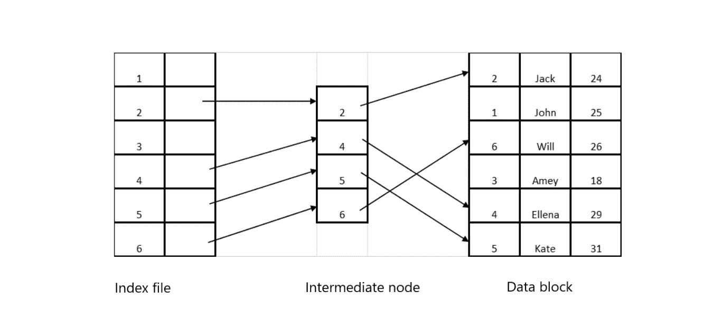
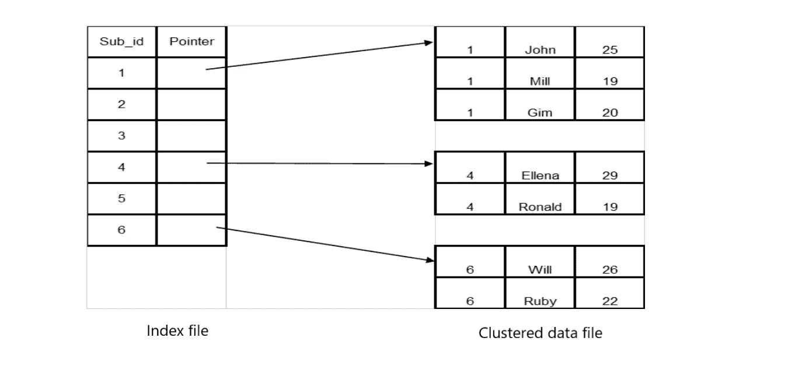

# 索引—数据结构

> 原文：<https://medium.com/nerd-for-tech/indexing-data-structures-aa7363693c40?source=collection_archive---------2----------------------->

礼遇:[精美免费图片&图片| Unsplash](https://unsplash.com/)

索引是一种数据结构技术，有助于加速数据检索。因为我们可以快速定位和访问数据库中的数据，所以它是数据库优化所必需的数据结构。索引最大限度地减少了处理查询时所需的磁盘访问次数。索引是作为这两列的组合创建的。

*   **第一列**是**搜索键**。它包含表的主键或候选键的副本。该列的值可以排序，也可以不排序。但是如果对值进行排序，就可以很容易地访问相应的数据。
*   **第二列**是**数据引用**或**指针**。它包含了磁盘块的地址，在那里我们可以找到相应的键值。

# 索引的类型

## 初级索引

主索引只有两列。第一列包含作为搜索关键字的主键值。第二列具有包含搜索键值的相应数据块的地址的指针。表格应该是有序的，索引文件中的记录和数据块之间有一一对应的关系。这是一种更传统但更快速的机制。

*   **密集指数**

有一个索引记录，其中包含一个搜索关键字和数据文件中每个搜索关键字值的指针。虽然密集索引是一种快速的方法，但它需要更多的内存来存储每个键值的索引记录。

*   **稀疏索引**

只有少数索引记录指向搜索键值。首先，索引记录通过指向数据文件中某个值的位置开始顺序搜索，直到找到搜索键值的实际位置。尽管稀疏索引很耗时，但它需要较少的内存来存储索引记录，因为它拥有较少的索引记录。

## 辅助索引(非聚集索引)

辅助索引中的列保存候选关键字的值以及相应的指针，该指针具有指向这些值的位置的地址。索引和数据通过中间节点相互通信。

## 聚集索引

该表在聚集索引中是有序的。当使用非主键创建索引时，我们将两个或更多列组合在一起，以获得唯一的值来唯一地标识数据，并使用它来创建索引。

指针指向整个集群。

## 多级索引

如果主索引不适合内存，则使用多级索引。当数据库增加时，索引也会增加。单级索引可能太大，无法存储在主存中。在多级索引中，主数据块分解成可以存储在主存中的更小的块。

*   B+树索引
*   b 树索引

# 结论

索引是一种重要的数据结构技术，可以用来以更有效的方式访问和检索数据。使用**搜索关键字**和**数据引用**创建一个索引。有不同类型的索引可用。**主索引**是一个有序文件，具有作为搜索关键字的主关键字字段和指针字段。主索引分为两种索引方式:**密集索引**、**稀疏索引**。**二级索引**(非聚集索引)是一个无序文件，其非主键字段作为搜索键和指针字段。**聚集索引**是具有非主键字段和指针字段的有序文件。**当主键不适合主存储器时，创建多级索引**。索引的缺点是我们需要在执行索引的表上有一个主键。

希望这篇文章会有所帮助。
*谢谢！！！*