# 印度新冠肺炎准备一年:Rajya sabha 的回答

> 原文：<https://medium.com/nerd-for-tech/india-covid-19-preparation-in-1-year-rajya-sabhas-answer-c903cfc5772f?source=collection_archive---------16----------------------->


到二月，我们宣布战胜了新冠肺炎。在 2 月 2 日的议会会议上，部长们被问及后 covid 时代的卫生基础设施，以及我们为下一波疫情做了怎样的准备？

## 拉杰亚·塞卜哈的回答

卫生和家庭福利国务部长 Ashwini Choubey 回答了 Rajya sabha 的一个未明确的问题。

> 未注明的问题是议员希望得到书面答复的问题，并被认为是由部长提交给议会的问题。因此，内务委员会不要求口头答复，也不能就此提出补充质询。

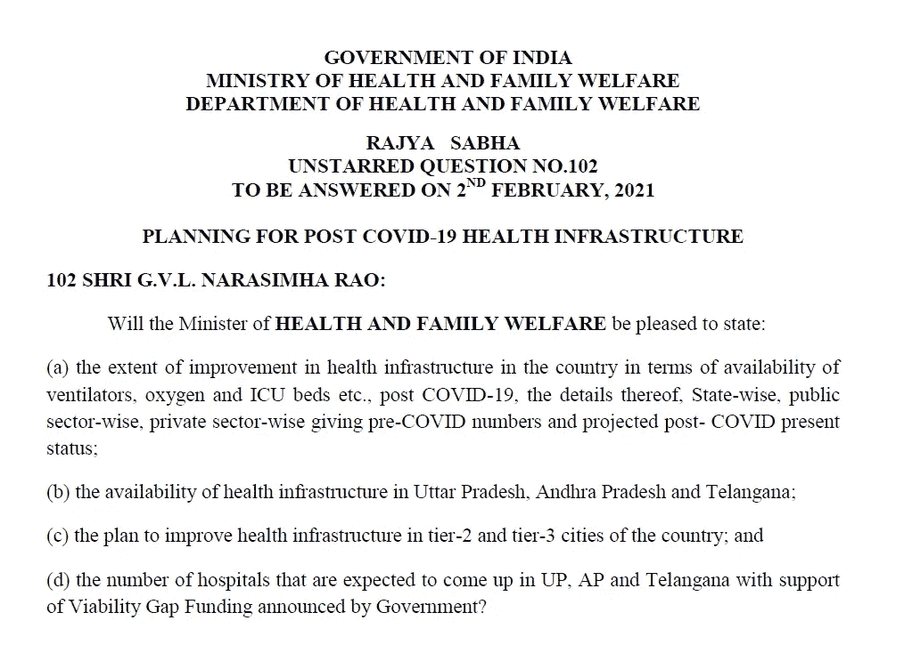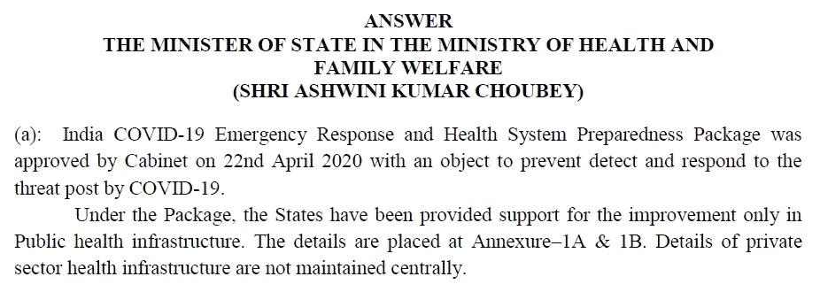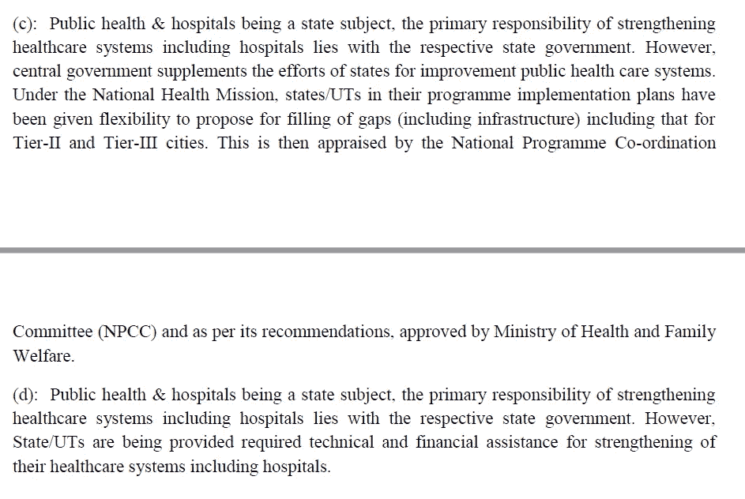

除此之外，他还分享了一些关于各州基础设施发展的数据。我们将利用这一点来分析所有州对科罗纳海啸的准备情况。你可以在这里找到数据[](https://pqars.nic.in/annex/253/A102.pdf)****并下载 pdf。我用在线工具把 pdf 转换成了 excel。****

## ****数据清理****

****打开您的笔记本并导入库。如果您对学习数据清理的过程不感兴趣，请忽略这一部分。****

```
**import pyforest
import pandas
from pandas import ExcelWriter
from pandas import ExcelFile
before_corona= pd.read_excel('A102.xlsx',sheet_name='page3')
after_corona=pd.read_excel('A102.xlsx',sheet_name='page4')
after_corona**
```

****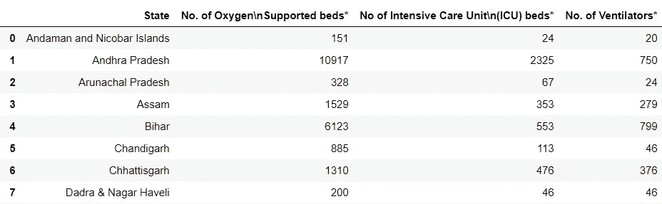****

****在这两个 excel 选项卡中，年份都没有提到，所以我将添加这一点，以便简化，并删除不需要的列。****

```
**before_corona["Year"]="2020"
after_corona["Year"]="2021"before_corona=before_corona.drop(columns =['Unnamed: 4'])**
```

****我们将重命名两个选项卡的所有列****

```
**before_corona=before_corona.rename(columns={"STATE":"State", "No. of Oxygen\nSupported beds*":"oxygen_beds","No of Intensive Care Unit\n(ICU) beds*":"ICU", "No. of Ventilators*":"Ventilators"})after_corona=after_corona.rename(columns={"No. of Oxygen\nSupported beds*":"oxygen_beds","No of Intensive Care Unit\n(ICU) beds*":"ICU", "No. of Ventilators*":"Ventilators"})before_corona**
```

****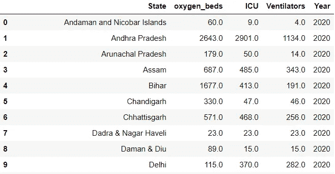****

****现在我们已经重命名了列，我们可以连接两个数据框并获得一个数据框。****

```
**preparation= pd.merge(before_corona, after_corona, on='State', how='inner')
preparation.info()**
```

****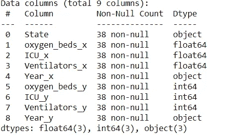****

****为了执行数学运算，我们必须将所有列的数据类型转换为 float。****

```
**preparation.Year_x.astype(float)
preparation.oxygen_beds_y.astype(float)
preparation.ICU_y.astype(float)
preparation.Ventilators_y.astype(float)
preparation.Year_y.astype(float)preparation["times_increase_oxygen"]=((preparation["oxygen_beds_y"]-preparation["oxygen_beds_x"])/preparation["oxygen_beds_x"])
preparation["times_increase_ICU"]=((preparation["ICU_y"]-preparation["ICU_x"])/preparation["ICU_x"])
preparation["times_increase_Ventilator"]=((preparation["Ventilators_y"]-preparation["Ventilators_x"])/preparation["Ventilators_x"])**
```

****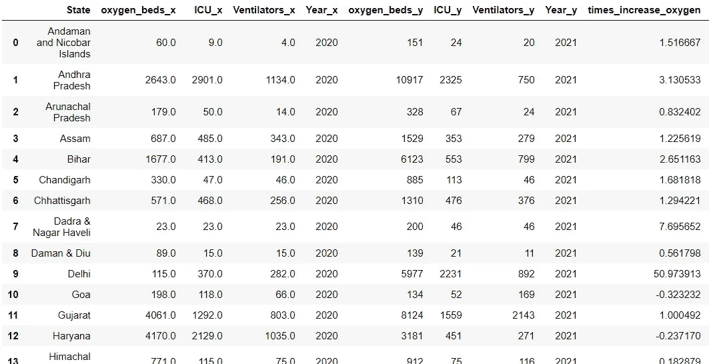****

# ****氧气床数量的时代变化****

****我将尝试计算设施增加的次数，以显示真正有效的状态。首先，我将查询变化最大的前 10 个州。****

```
**preparation.nlargest(10,['times_increase_oxygen'])**
```

****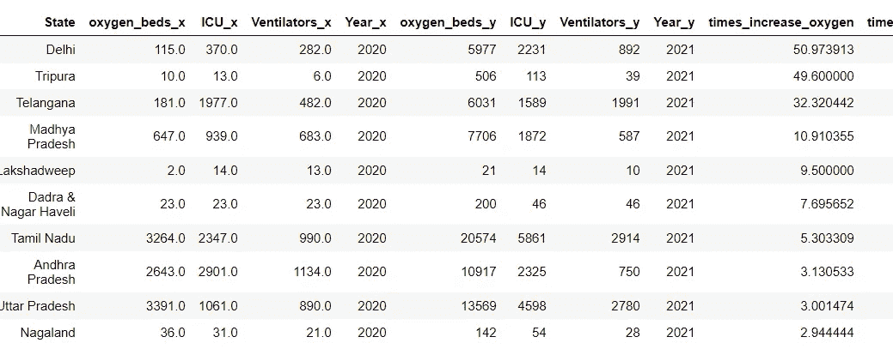****

```
**import plotly.express as px
fig = px.bar(preparation, x='State', y='times_increase_oxygen')
fig.show()**
```

****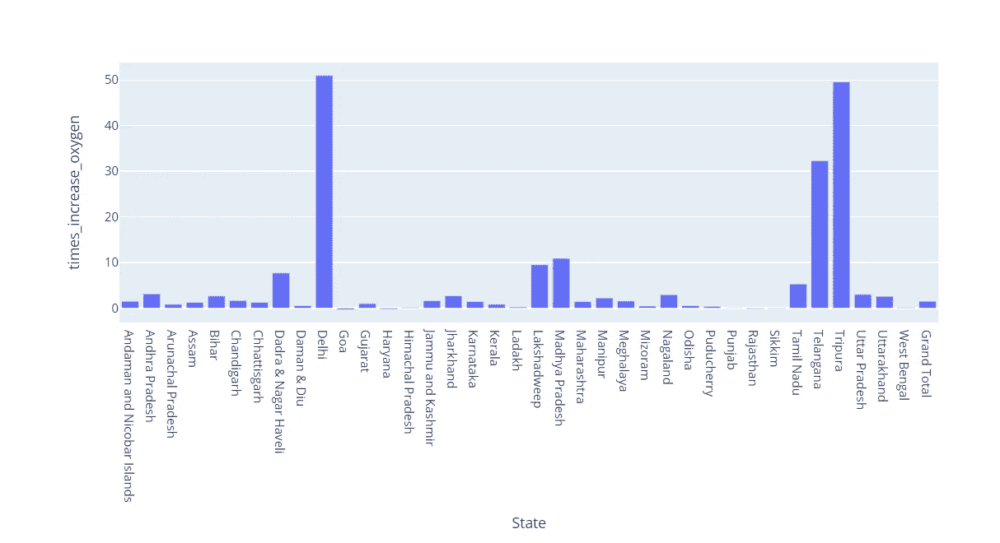****

******观察**:虽然德里的时代变化最大，但他们早期的基础设施却非常落后。泰米尔纳德邦有一个很好的数字，但他们在一年内增加了 5 倍。特里普拉邦是一个人口非常少的小邦。他们对基础设施的升级也令人印象深刻。旁遮普哈里亚纳邦和拉贾斯坦邦令人失望。****

# ****重症监护室数量的时代变化****

****除了氧气床，ICU 也是极其重要的救生设备。****

```
**preparation.nlargest(10,['times_increase_ICU'])**
```

****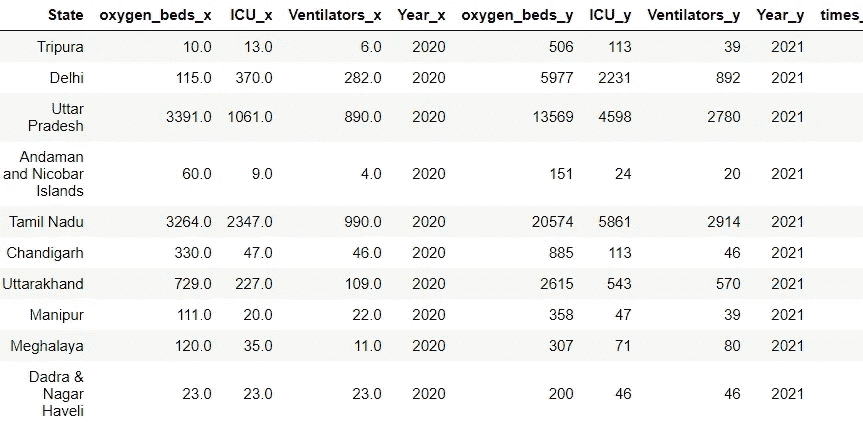****

```
**import plotly.express as px
fig = px.bar(preparation, x='State', y='times_increase_ICU')
fig.show()**
```

****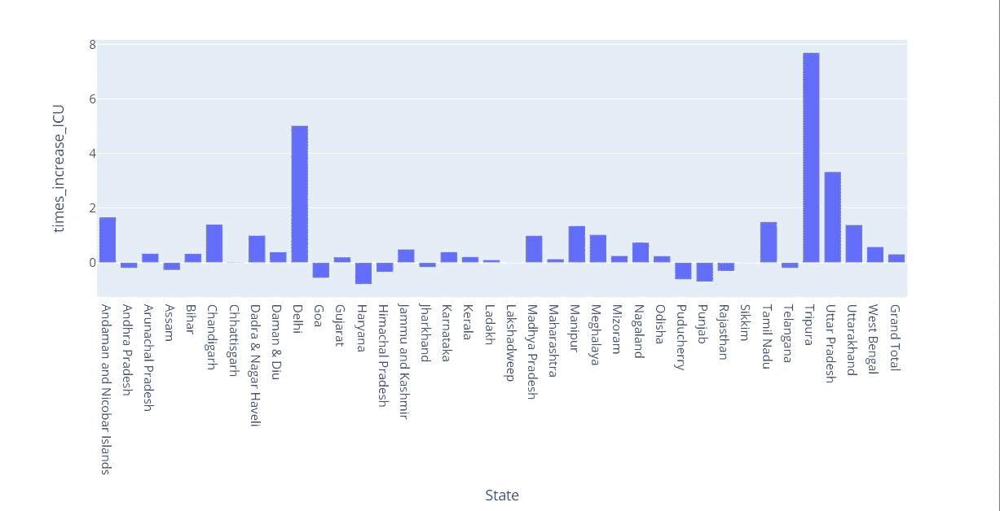****

******观察**:特里普拉邦再次表现出色。泰米尔人已经在这么做了，所以他们的升级也很可观。等等，旁遮普邦、拉贾斯坦邦和哈里亚纳邦是负面的？这是什么巫术？可悲！****

# ****呼吸机数量的时间变化****

```
**preparation.nlargest(10,['times_increase_Ventilator'])**
```

********

```
**import plotly.express as px
fig = px.bar(preparation, x='State', y='times_increase_Ventilator')
fig.show()**
```

****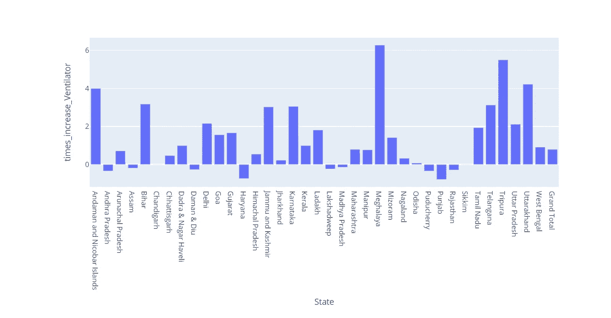****

****观察:梅加拉亚邦在这里做得很好，高居榜首。天啊，特里普拉邦又成为领袖了。旁遮普、拉贾斯坦邦、哈里亚纳邦再次处于不利地位。现有的(呼吸机和重症监护室)可能已经停止工作。****

# ****结论****

****特里普拉邦今天记录了 141 例病例，没有死亡。它们是目前每日接种率最低、疫苗接种率最高、死亡率最低的州之一。他们做得非常好。泰米尔纳德邦已经有很大的资源，但他们在一年内增加的方式是特殊的，应该得到承认。****

****旁遮普省的死亡率在印度是最高的，毫无疑问是过去一年中改善最差的。哈里亚纳邦和拉贾斯坦邦也对扩大基础设施感到失望。****