# 印度口音语音识别

> 原文：<https://medium.com/nerd-for-tech/indian-accent-speech-recognition-2d433eb7edac?source=collection_archive---------0----------------------->

*传统 ASR(信号分析，MFCC，DTW，HMM &语言建模)和 DNNs(自定义模型&百度 DeepSpeech 模型)对印度口音语音*

***礼遇*** *:* [*演讲与音乐技术实验室，IIT 马德拉斯*](https://www.iitm.ac.in/donlab/tts/index.php)

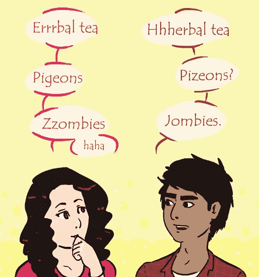

[图片由](http://icosa.hkbu.edu.hk/listening/english-accents/indian-accent/index.htm)提供

尽管印度英语口音讲话得到认可，但不带口音的发音仍是一个神话。不管种族偏见如何，我们的语言自然是由我们所说的方言形成的，而且印度方言数不胜数！那么，一台计算机如何破译来自印度不同邦的讲话，即使是来自其他邦的印度人也觉得难以理解？

**ASR(自动语音识别)**获取任何连续音频语音并输出等效文本。在这篇博客中，我们将从理论和实践两方面探讨语音识别中的一些挑战，重点是与说话人无关的识别。

ASR 的**挑战**包括

*   **音量的可变性**
*   **文字速度的可变性**
*   **扬声器的可变性**
*   **螺距的可变性**
*   单词边界:我们说话时没有停顿。
*   背景声音、观众说话声等噪音。

让我们在下面讨论的章节中解决上述问题。

以上研究的完整源代码可以在 [**这里**](https://github.com/AdroitAnandAI/Indian-Accent-Speech-Recognition) **找到。**

**语音识别中的模型**在概念上可以分为:

*   **声学模型:** **把声音信号变成某种**音标**表示法。**
*   **语言模型:**为**语言**存储了单词、语法和句子结构的**领域知识。**

# **信号分析**

当我们说话时，我们在空气中产生正弦振动。音高越高，振动越快，频率越高。麦克风将振动中声能转换成电能。

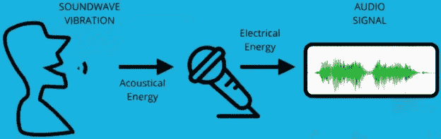

如果我们说“ **Hello World** ”，那么相应的信号将包含 2 个斑点

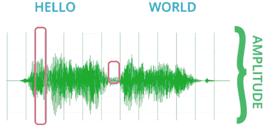

信号中的一些振动具有较高的振幅。振幅告诉我们声音中有多少声能

我们的语音同时由许多频率组成，也就是说，它是所有这些频率的总和。为了分析信号，我们使用分量频率作为特征。**傅立叶变换**用于将信号分解成这些分量。

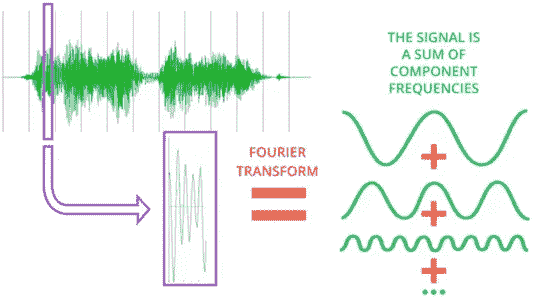

我们可以使用这种分离技术将声音转换成**声谱图**，其中垂直轴上的**频率**被绘制为**对时间**。阴影的强度表示信号的幅度。

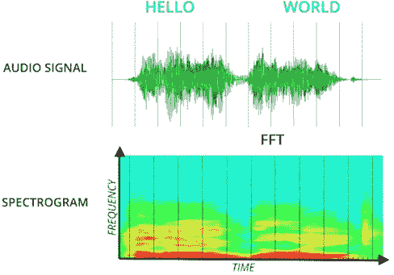

*hello world 短语的声谱图*

为了创建**谱图**，

1.  **将信号**分成时间帧。
2.  用 FFT 将每个帧信号分成**个频率分量**。
3.  每个时间帧现在用每个频率的振幅矢量表示。

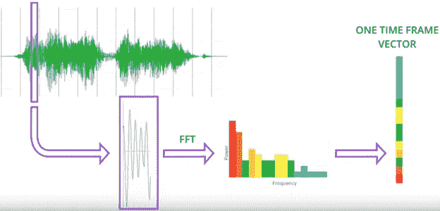

*一个时间帧的一维向量*

如果我们**按照向量的时间序列顺序**再次排列向量，我们就可以**得到声音成分的视觉图像，即声谱图**。

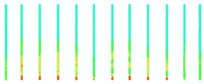

声谱图可以与原始音频信号在时间上对齐

接下来，我们将着眼于**特征提取**技术，它将**减少我们数据的噪声和维度**。

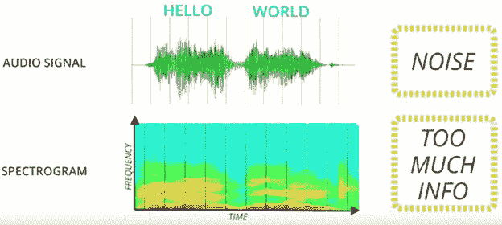

摄谱仪中编码了不必要的信息

# **用 MFCC 提取特征**

**梅尔频率倒谱系数分析**是使用**梅尔频率分析和倒谱分析将音频信号还原为基本语音成分特征。**频率范围缩小，并分成人类可以分辨的频率组。信号被进一步分离为源和滤波器，从而可以滤除与发音无关的扬声器之间的变化。

**a)**梅尔频率分析

只有人类能够听到的频率对于识别语音才是重要的。我们可以将声谱图的频率分成与我们耳朵相关的频段，然后**过滤掉我们听不到的声音。**

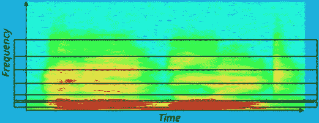

*黑线以上的频率将被过滤掉*

b) **倒谱分析**

我们还需要分离与说话者无关的声音元素。我们可以将人类声音产生模型想象为源和过滤器的组合，其中 T2 源是个人独有的，而 T4 过滤器是我们说话时使用的单词的发音。

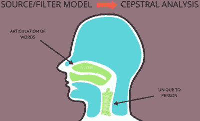

**倒谱分析**依靠这个模型来分离两者。可以用算法从信号中提取倒谱。因此，我们**去掉了个别**声带独有的语音成分，而**保留了声道发出的声音**的形状。

倒谱分析结合梅尔频率分析可以得到 12 或 13 个与语音相关的 MFCC 特征。 **Delta 和 Delta-Delta MFCC 特性**可以选择性地附加到特性集，有效地将特性数量增加一倍(或三倍)，最多可达 **39 个特性**，但在 ASR 中提供更好的结果。

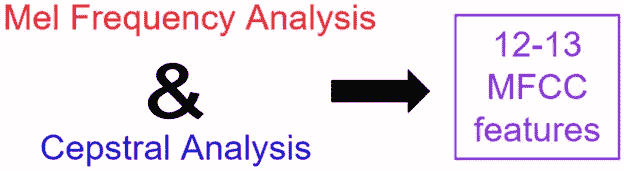

从而**MFCC(Mel-频率倒谱系数)**特征提取、

*   **降低了数据的维度**,并且
*   我们从系统的中挤出噪声

所以语音识别有 **2 个声学特征**:

*   **光谱图**
*   **梅尔频率倒谱系数(MFCC):**

构建管道时，您可以选择使用声谱图或 MFCC 特征。接下来，我们将从语言的角度来看声音，即我们听到的单词的语音。

**语音学**

语音学是对人类语言中声音的研究。语言分析用于将人类的单词分解成最小的声音片段。

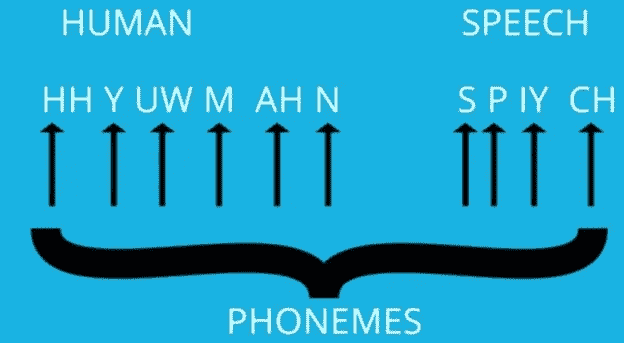

*音素定义不同的声音*

*   [**音素**](https://en.wikipedia.org/wiki/Phoneme) 是**最小的音段**，可以用来区分一个单词和另一个单词。
*   **字形**相反，是一种语言中书写的最小独特单位**。英语有 26 个字母加上一个空格( **27 个字素**)。**

不幸的是，我们**无法将音素映射到字形**，因为一些字母映射到多个音素&一些音素映射到许多字母。比如 C 字母在猫，聊天，圈子里听起来就不一样。

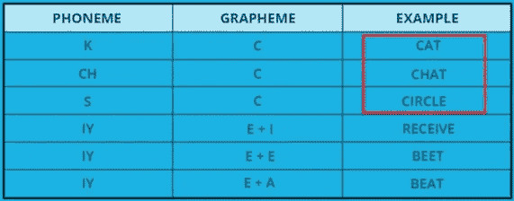

音素通常是语音和文本之间的有用媒介。如果我们能够成功地制作一个声学模型，将声音信号解码成音素，剩下的任务就是将这些音素映射到它们匹配的单词。这一步被称为**词汇解码，因为它基于数据集的词典或字典而得名。**

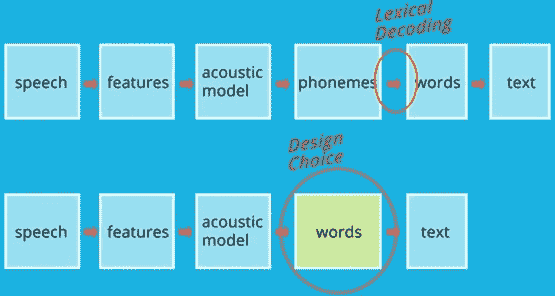

如果我们想训练有限的词汇，我们可以跳过音素。如果我们有一个很大的词汇量，那么首先转换成较小的单位，可以减少比较的总次数。

# **声学模型和时间带来的麻烦**

通过特征提取，我们解决了噪音问题以及说话者的可变性。但是我们仍然没有解决匹配同一个单词的可变长度的问题。

**动态时间弯曲(DTW)计算两个信号之间的相似性，即使它们的时间长度不同。**这可用于将新单词的序列数据与单词示例词典中最相似的对应词对齐。

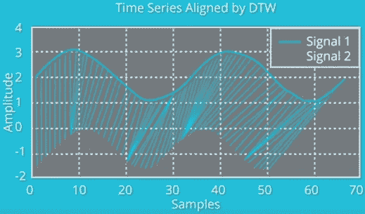

用动态时间弯曲映射的 2 个信号

# **语音中的隐马尔可夫模型**

hmm**可用于检测随时间变化的模式**。HMMs 可以解决时间可变性的问题，即同一单词以不同的速度说出。

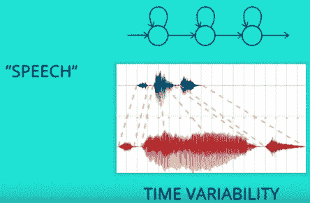

**我们可以用带标签的时间序列序列训练 HMM，为每个特定的声音单元创建单独的 HMM 模型**。这些单位可以是音素、音节、单词，甚至是词组。

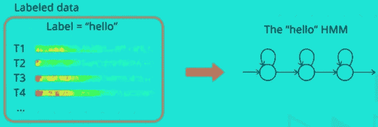

如果我们得到每个单词的模型，那么对单个单词的识别就归结为**对每个模型的新观察可能性**进行评分。

*单词“brick”在九种不同的发音组合中连续连接*

为了训练连续的话语，**hmm 可以被建模成对**。她的砖。这将增加维度。我们不仅需要每个单词的 HMM，还需要每个可能的工作联系的 HMM。

但是如果我们使用音素，对于大量的词汇来说，维度的增加并不像单词那样深刻。对于 40 个音素，我们只需要 1600 个 hmm 来考虑过渡。

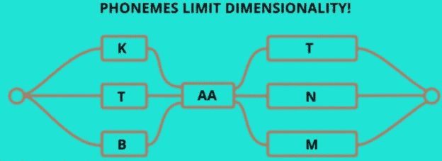

# **语言模型**

**语言模型**将语言知识注入语音识别中的文字转文本步骤，以解决拼写和上下文中的歧义。即哪些单词组合是最合理的。

例如，由于声学模型是基于声音的，因此我们无法区分类似的发音单词，例如，HERE 或 HEAR。由声学模型产生的单词可以被认为是许多不同单词的概率分布。每个可能的序列可以被计算为特定单词序列可能已经由音频信号产生的**可能性。**

如果我们有**声学模型和语言模型，**那么最可能的序列将是具有最大似然得分的所有这些可能性的组合。

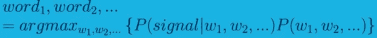

*来自信号的声学模型*来自语言信息的统计语言模型*

我们想要计算一个特定的句子在文本语料库中出现的概率。我们已经看到，一系列单词的概率可以从其历史的连锁概率中计算出来。**对于 N 元文法，我们用链式法则来近似序列概率。**

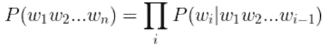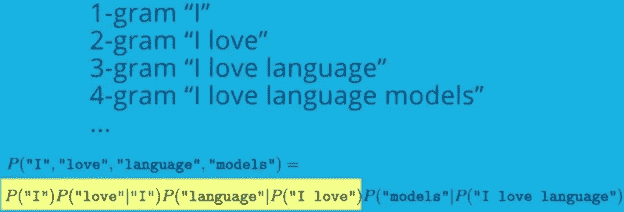

为了解决计算量过大的问题，我们使用 [**马尔可夫假设**](https://en.wikipedia.org/wiki/Markov_property) 来用更短的序列近似一个序列概率。

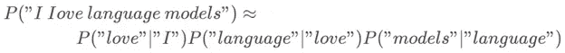

我们可以通过使用二元模型和单个令牌的**计数**来计算概率。

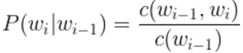

c 是计数函数

然后，我们可以对这些概率以及来自声学模型的概率进行评分，以**从序列选项中移除语言歧义**。

**为了总结上述语音到文本(STT)的过程，**

1.我们用 MFCC 从音频语音信号**中**提取特征**。**

2.使用一个 **HMM 声学模型**产生声音单元、音素、单词。

3.使用**统计语言模型，如 N-grams** 来理顺**语言** **歧义**并创建最终的文本序列。**使用对大量文本进行训练的神经语言模型**，可以对拼写和上下文的概率进行评分。

# **传统与最先进的** ASR

传统的 ASR 解决方案使用特征提取 hmm 和语言模型。由于 RNNs 还可以通过内存跟踪时间序列数据，**声学模型可以用 RNN 和连接主义者时间分类(CTC)层的组合来代替。**

**CTC 层解决排序问题**由于任意长度的音频信号，需要转换成文本。如果我们使用 DNNs，我们可能根本不需要特征提取或单独的语言模型。

根据百度的 **Adam Coates** 的说法，传统 ASR 的额外训练在某种程度上达到了峰值。与此同时， **DNN 解决方案在我们增加数据和模型规模时大放异彩，**尽管它们在小数据集上表现平平。

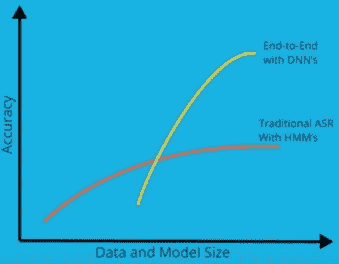

DNNs 在大数据和深度模型方面优于传统方法

让我们探索**如何用深度神经网络**设计声学模型，并比较它们的性能。

# 带有自定义模型的语音识别

下面是设计语音识别深度学习模型时架构考虑的**要点**。

*   **RNN 单位:**由于其在建模时序数据方面的有效性
*   **GRU 单位:**使用简单 RNN 解决爆炸渐变问题
*   **批量归一化:**减少训练次数。
*   **时间分布层:**寻找更复杂的模式
*   **CNN 层:** 1D 卷积层增加了额外的复杂度
*   **双向 RNNs:** 利用未来上下文，在两个方向上处理数据

**模式一:CNN + RNN +时间分布密集**

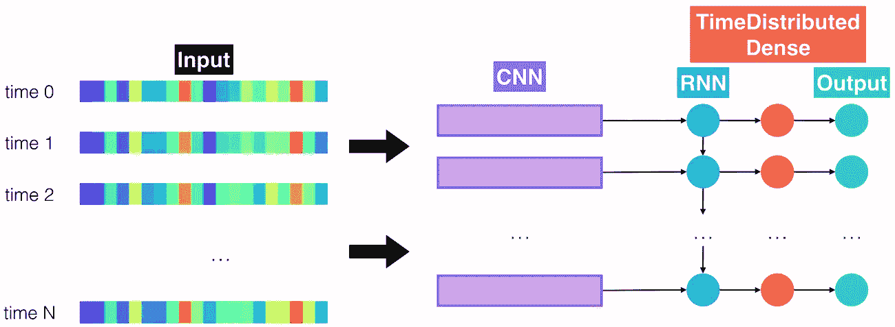

CNN + RNN +时间分布密集

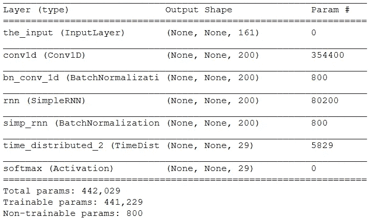

**模型 2:较深的 RNN +时间分布的密集度**

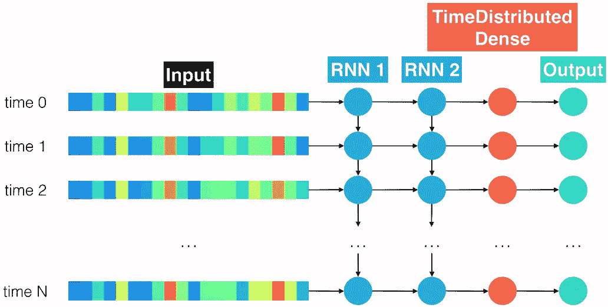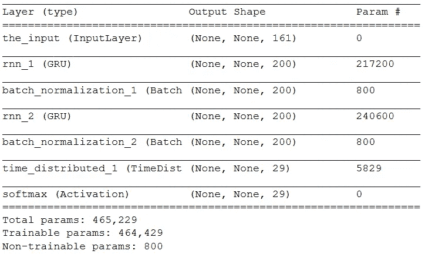

如果您将 GRU 单位改为 SimpleRNN 单元，那么由于**爆炸梯度问题**，损失可能变得不确定(NAN)。要解决这个问题，请使用**渐变剪辑**(将 SGD 优化器中的 **'** *剪辑规范* **'** 参数设置为较低值)

## 模型 1 和模型 2 的比较

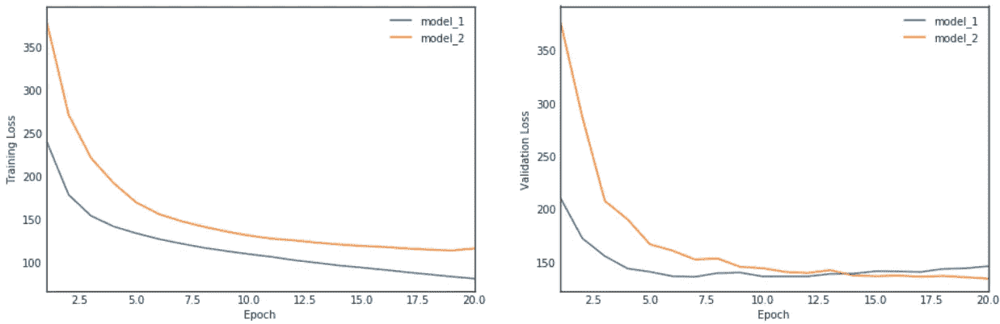

模型 1 (CNN)和模型 2 (RNN)的培训损失和验证损失

CNN 模型具有较低的训练损失，但具有较高的验证损失，这表明过拟合。**更深的 RNN 在验证损失方面表现更好，因为它们有助于更好地对序列数据建模。由于顺序输入的长度不多，双向 RNN 可能帮助不大。不过我们可以试一试。**

**模型 3:池化 CNN+深度双向 RNN+时间分布密集**

当我们结合从上述两个模型中学习时，这里我们将 CNN 与**更深的双向 RNN 联系起来，并添加最大池以避免过度拟合。**

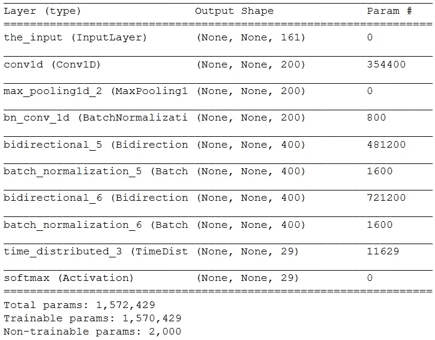

*由于我们引入了最大池层，对于 CTC 损失计算，CNN 输出长度减少了 50%*

正如您在[这里](https://github.com/AdroitAnandAI/Indian-Accent-Speech-Recognition/blob/master/vui_notebook.ipynb)的分析中所看到的，**型号 2(深 RNN)在所有 3 种型号中表现最好**。因此，从逻辑上讲，一个更好的模型架构应该包含更深层次的 rnn。

让我们看看我们的定制模型在训练 1-2 小时后的**输出:**

> **真实转录:**
> 当然我有我的期望，她有她的
> **预测转录:**
> 安做 af cors 我有 moixitations，她有她的
> 
> **真实转录:**
> 三十六人的伪立法机关
> **预测转录:**
> bo OS legeclejur nober thertysexemers

在进行词汇解码(音素到单词)和语言建模之后，转录的文本可以变得更有意义。但是为了得到最先进的模型，我们需要训练更大、更深的模型，这在单个 GPU 上需要花费 T2 3-6 周的时间。因此，谨慎的做法是**采取预先训练的模式&转移学习破译多种口音**，这是这篇博客的主要焦点。

# 印度口音语音识别

不同州的印度人说英语的口音不同。为了让模型识别这种口音变化，我们可以在具有来自许多州的**英语口语记录的语音数据集上训练预训练的语音模型。**在这里，我们转移学习**百度的 Deepspeech 模型**，并使用测试数据集分析识别改进。

*   从 **IITM 语音实验室**下载了 50+ GB 的**印度文 TTS** 语音数据库，其中包含来自 20+个州的 10000+个口语句子(男女母语者均可)
*   数据集包含音频及其描述。但是要将数据加载到深度语音模型，我们需要**生成包含音频文件路径、其转录和文件大小的 CSV** 。
*   将 CSV 文件分割成 **3 个部分** : test.csv、train.csv 和 valid.csv。

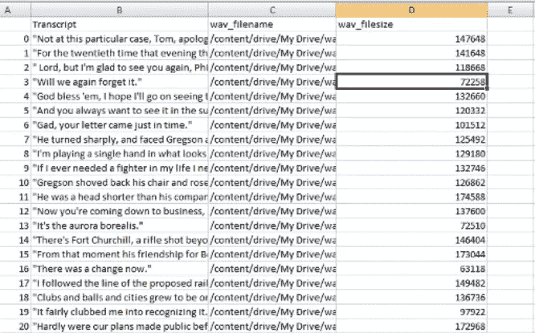

*   编写一个 **python 程序** **将所有音频文件的帧率**设置为 12000hz(深度语音模型要求)

*   从[这里](https://github.com/mozilla/DeepSpeech)克隆**百度 DeepSpeech 项目** 0.6.1
*   使用适当的参数执行 **DeepSpeech.py** 。

*   Export_dir 将包含您在 deepspeech.model()函数中加载的 **output_graph.pbmm** 。
*   **KenLM ToolKit** 用于生成 Trie 文件。它需要传递给深层语音解码器功能。
*   模型。**enableDecoderWithLM**(lm _ file，trie，0.75，1.85): lm_file 是。训练后的 pbmm 和 trie 是 KenLM 工具包的输出。
*   使用深度语音解码功能做 STT。

**比较印度口音英语模型和深度语音模型**

为了检查准确性，我们使用了 3 个指标: **WER** 、 **WACC** 和**蓝分**。

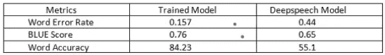

度量显示训练的模型对于印度口音英语表现得更好

让我们绘制上述指标，将印度口音语音数据(测试集)提供给 DeepSpeech 预训练模型和我们训练的模型进行比较。下图中的 3 个箱从左到右分别代表低、中、高精度。

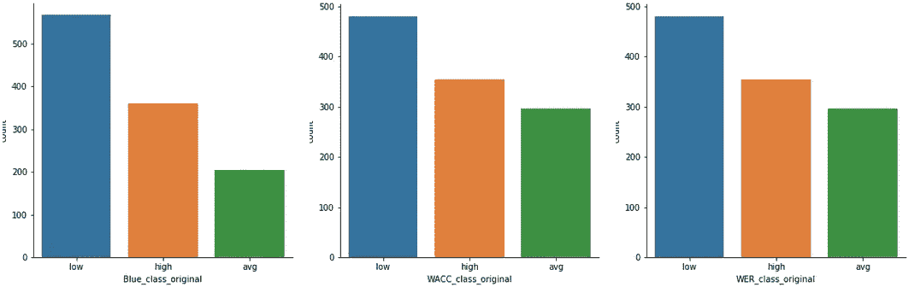

**DeepSpeech 基本模型**:在所有 3 个指标中，大多数数据点被归类为**【低准确度】**

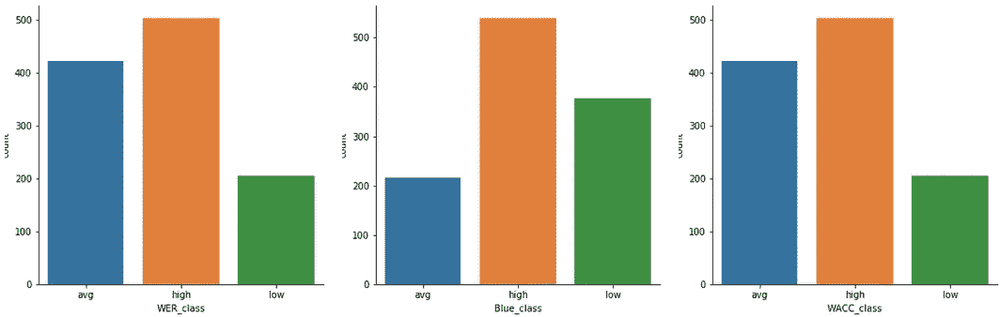

**训练模型**:在所有 3 个指标中，大多数数据点被归类为**“中等&高精度”**

以上描述证明了与 DeepSpeech 模型相比，**训练模型对于印度口音语音识别**表现得更好。

*   *Indic TTS 项目由 GOI 通信和信息技术部资助。*
*   *学分:使用印度语音数据集训练 DeepSpeech 模型是由我的实习生*[*Giridhar Kannappan*](https://github.com/GiridharKannappan/Voice-Based-Search-Engine)完成的

# 结论

我们已经看到**“倒谱分析”**分离出语音信号中的重音成分，同时在传统的 ASR 中进行特征提取(MFCC)。在最先进的**深度神经网络**中，特征是内在学习的。因此，我们可以转移学习一个预先训练好的具有多种口音的模型，让该模型自己学习口音特性。

我们已经通过对来自多个州的印度英语语音数据进行迁移学习百度的 DeepSpeech 预训练模型，证明了案例**。您也可以很容易地将这种方法**扩展到任何根语言或地区口音**。**

以上研究的完整源代码可以在 [**这里**](https://github.com/AdroitAnandAI/Indian-Accent-Speech-Recognition) **找到。**

***如有任何疑问或建议，可在此*** 联系我

**

*[图片由](http://www.bodhisutra.com/ideas/how-mother-tongue-influence-kills-your-communication-confidence/)提供*

# *参考*

*[【1】https://www.iitm.ac.in/donlab/tts/database.php](https://www.iitm.ac.in/donlab/tts/database.php)*

*[【2】https://www . uda city . com/course/natural-language-processing-nano degree-nd 892](https://www.udacity.com/course/natural-language-processing-nanodegree--nd892)*