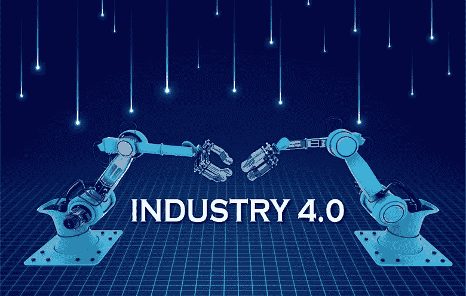

# 工业 4.0 与高压直流技术

> 原文：<https://medium.com/nerd-for-tech/industry-4-0-and-hvdc-technology-56cc6cfada82?source=collection_archive---------8----------------------->

# 介绍

高压直流(HVDC)电力系统使用直流电长距离传输大部分电力。高压直流输电线路成本更低，死亡事故与长距离电力传输的交流传输也不太相关。它连接具有不同速率和功能的网络。

# 描述

高压用于电力传输，以减少导线电阻中的能量损失。对于给定的传输功率量，电压加倍将带来相等的功率，而功率只有现在的一半。同时，电线内的热量造成的设施损耗与电流的平方成正比，电压加倍会使道路损耗降低 4 倍。尽管传输中的功率损耗也可以通过增加导体尺寸来降低，但是较大的导体更重且更贵。

高压可能不愿意用于照明或马达。因此，终端设备的传输电压必须降低。变压器习惯于改变交流输电线路的电压水平。变压器准备电压变化实用。交流发电机比使用 DC 的发电机组织得更好。通过看到 DC 的所有优点，这看起来 HVDC 线路比 AC 线路更有能力。然后，HVDC 变电站的初始成本非常高。他们的变电站设备相当复杂。因此，对于远距离传输来说，它比用交流电发电要好。但是，它被转换成 DC，然后再次转换回交流电，最终用于传输。该系统是经济的，并且还恢复了系统的有效性

# 高压直流输电系统是如何工作的？

通过使用整流器，交流电可以在发电站转化为 DC。在 HVDC 变电站或换流变电站中，线路的两端都放置整流器和逆变器。整流器端子将交流电转换为 DC，而逆变器端子将 DC 转换为交流电。

DC 随着架空线流动，在用户端，通过位于换流变电站的逆变器，DC 再次被转换成交流电。线路的发送端和接收端的功率是相同的。DC 被远距离传播，因为它减少了损失，提高了竞争力。

# 点对点系统

除了两个换流站和一条输电线路之外，一个系统称为“点对点系统”。也称为“双端 DC 系统”。同样，如果一个变电站有两个以上的换流站，并连接 DC 终端线路，它被称为多端 DC 变电站。

# 工业 4.0:世界上最长的输电线路

巴西的 2500 公里输电线路是一条 800 千伏高压直流输电线路，从贝洛蒙特水电站向巴西里约热内卢输电。

架空输电线路的输电塔高达 105 米，从亚马逊森林到巴西东南沿海，穿越了 80 个城市。2017 年 9 月开始运营。这条线路有两个相距 1000 公里的升压站，能够传输 4000 兆瓦的电力。

线路损耗低于 1 % —如果在交流电源模式下进行，那么在 2，500 公里的距离内，线路损耗可能为 25 %。

更多详情请访问:[https://www . technologiesinindustry 4 . com/2021/05/industry-4-0-HVDC-technology . html](https://www.technologiesinindustry4.com/2021/05/industry-4-0-hvdc-technology.html)