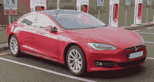
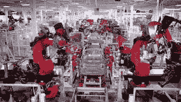

# 工业 4.0 和特斯拉

> 原文：<https://medium.com/nerd-for-tech/industry-4-0-and-tesla-bd54e655261f?source=collection_archive---------1----------------------->

# 介绍

特斯拉公司是美国电动汽车和清洁能源行业的巨头。它位于美国加利福尼亚州的帕洛阿尔托。特斯拉还制造从家庭到电网规模的电池储能。他们设计太阳能电池板、太阳能屋顶瓦、相关产品和服务。2020 年，特斯拉的电池电动汽车和插电式电动汽车销量第一，占据了 16%的插电式市场和 23%的电池电动市场。通过其子公司特斯拉能源公司，该公司开发并可能成为美国光伏系统的主要安装商。

[特斯拉能源公司是全球最重要的电池储能系统供应商之一](https://www.technologiesinindustry4.com/2021/07/industry-4-0-microsoft-cloud-computing-based-windows-365.html)，2020 年装机容量达到 30 亿瓦时。在本文中，我们将讨论特斯拉在营销和适应工业 4.0 方面的作用。

# 描述

*   显然，特斯拉可能是一家制造公司，但其服务内容正在快速增长。
*   与其他汽车制造商不同，该公司使用自己的分销渠道(如苹果商店的展厅)来调节销售体验。
*   这款车意味着(由于电动汽车技术)比传统的 ice 汽车需要更少的服务。
*   特斯拉同样通过每个接触点的客户服务来取悦客户。
*   他们通过这种远程升级使车辆随着时间的推移变得更好。
*   首先，与买家的车内接触点可能是车内一个巨大的类似 ipad 的仪表盘，与客户的手机同步。
*   现场内资产健康和运营的每个特征的本地传感为特斯拉提供了他们车队的前所未有的可见性。
*   例如，电池组内的电池管理有助于最大限度地提高其寿命和效用。
*   本地车载电脑可以像手机一样通过远程升级来重新配置汽车的无数功能。
*   所有这些都为智能汽车或智能产品做好了准备。
*   但是还有更好的。我们制造出来的产品可以带走自己的一生，成为“活产品”。
*   特斯拉车主醒来后发现，他们的汽车已经升级到拥有一套自动驾驶(autopilot)功能。
*   [自动驾驶](https://www.technologiesinindustry4.com/2021/07/industry-4-0-microsoft-cloud-computing-based-windows-365.html)可能是一项非同寻常的能力，它神奇地出现在整个车队的汽车售后服务中，由软件&驱动，远程激活。
*   类似地，在云中共享本地感知的信息允许机器学习软件不仅从一辆车的问题中学习，还可以使用整个车队的数据进行学习。
*   这允许能力的连续增量更新，并通过软件远程修复现场的故障，不仅仅是在一辆车中，而是在整个行业中。
*   同样，这减少了重复呼叫的必要性，简化了汽车服务。
*   特斯拉还拥有并运营高速公路上的超级充电站网络，并与酒店和其他机构合作，建设更大的目的地充电站网络。
*   收购太阳能服务公司 SolarCity。
*   特斯拉将更多地进入服务领域。
*   制造公司提供的这些服务将模糊多个行业之间的界限:能源和汽车/运输。
*   例如，电动汽车和固定电池内的能量存储能力的组合，以及充电的时间通常根据电网条件、太阳能产量等来安排。
*   此外，这些资产的集合通常用于提供电网平衡/辅助服务。

# 新计划

*   特斯拉在其新计划第二部分中概述了一个愿景，即从(电动)汽车制造商转变为管理电动汽车、太阳能光伏系统和存储的服务提供商，以提供令人信服的移动性、电动汽车体验和可再生能源服务。
*   它建议利用财务结构，并投资于特斯拉和太阳能城的营销资产。
*   它的电动汽车即服务、太阳能即服务、存储即服务、共享移动选项，并利用折旧特性和复杂的远程管理或自治功能超越能源和运输之间的界限。
*   目前，SolarCity 宣布了一项太阳能屋顶产品，可能会作为一项服务提供。所以一旦我们更换了屋顶，它就成了一项服务。

# 特斯拉是工业 4.0 质量的典范

*   [汽车工业在美国国内外都扮演着重要的经济角色。](https://www.technologiesinindustry4.com/2021/09/industry-4-0-and-kodak.html)
*   然而，在几十年的成功之后，由于持续的动力系统创新以及行业商业模式的转变，它现在面临着重大的生存挑战。
*   推动汽车变革的技术驱动因素包括传动系统的电气化，以及运输流程的数字化。
*   事实上，汽车开发过程非常复杂，并且随着建模、计算的可能性增加而变得更加多样化。和分析。
*   2019 年第十四届生态汽车和可再生能源国际会议部分描述了如何特别是在电动汽车领域，存在越来越多的模拟方法，处理推进系统、电源和热管理等领域。
*   近一半的美国机器人发货量是给汽车部门，而只有约 20%是委托给买方电子部门。
*   特斯拉可能是一家长期与机器人魔鬼搏斗的汽车公司，并且在这场斗争中处于更强大的对立面。
*   在特斯拉于 2017 年开始制造 Model 3 轿车之前，首席执行官埃隆·马斯克(Elon Musk)宣布，弗里蒙特工厂将比业内任何汽车制造工厂都更像一个长期工厂。
*   特斯拉将通过逐渐用机器取代人工来降低成本和提高效率。
*   这是一条崎岖不平的道路，但是从错误中获得经验和最终的优势。
*   看起来，人类工人和机器人之间的有效妥协让特斯拉脱颖而出。

更多详情请访问:[https://www . technologiesinindustry 4 . com/2021/09/industry-4-0-and-Tesla . html](https://www.technologiesinindustry4.com/2021/09/industry-4-0-and-tesla.html)