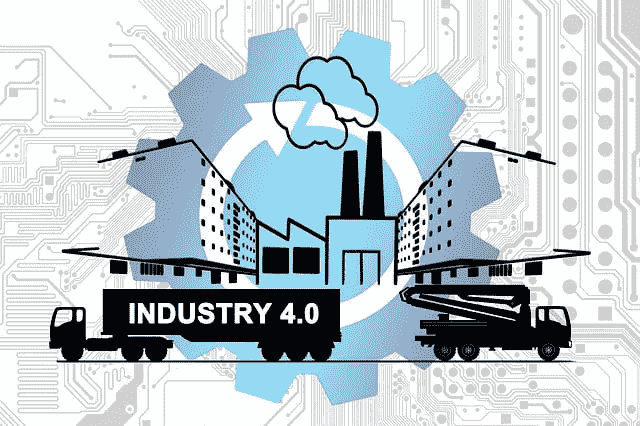
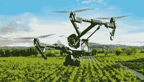
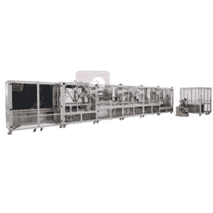
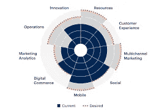

# 面向中小企业的工业 4.0

> 原文：<https://medium.com/nerd-for-tech/industry-4-0-for-small-and-medium-enterprise-c031b8976a53?source=collection_archive---------8----------------------->

# 介绍

中小型企业(SMEs)的工业 4.0 概念需要明确，因为工业环境近年来一直在变化。[工业 4.0](https://www.technologiesinindustry4.com/2020/11/how-to-learn-industry-4-0.html) 概念和技术的引入应扩展到完整的生产和供应链。基于[工业 4.0](https://www.technologiesinindustry4.com/2020/11/how-to-learn-industry-4-0.html) 原则的生产为取代传统结构创造了必要条件。

传统的生产结构是基于中央集权的决策机制和僵化的组织形式。这些结构被替换为:

*   柔性可重构制造和物流系统
*   分散和协作的决策机制
*   数字支持的流程。

中小企业已经成为多个经济体关注的焦点。事实证明，这些企业比大型跨国企业更具活力，因为它们具有灵活性、企业家精神和创新能力。中小企业只有采用中小企业定制的实施策略和方法，才能获得[工业 4.0](https://www.technologiesinindustry4.com/2020/11/how-to-learn-industry-4-0.html) 。

在本文中，我们将了解一些与在中小型企业中引入[工业 4.0](https://www.technologiesinindustry4.com/2020/11/how-to-learn-industry-4-0.html) 概念相关的理论模型。

# 描述

# 可持续农业中的智能技术

*   技术发展和数字化勾勒出提高资源使用绩效的可能边界。
*   智能农业减少了农业对环境的负面影响。
*   它增加了恢复力和土壤健康，并降低了农民的成本。
*   当谈到物联网应用时，与智能农业相关的不同挑战会扩展到多个农业生产系统。
*   解决方案之一是植物工厂来解决有关食物、资源和环境的问题。
*   已经开发了提高食品产量和质量的方法和途径。
*   通过减少资源消耗和环境恶化，可以提高产量。
*   植物工厂的潜在优势是提高经济和环境的可持续性。

# 智能物流中的 AI、ML 和深度学习

*   在智能物流的背景下，AI、ML 和 DL 技术的实施仍处于初始发展阶段。

以下方法可视为智能物流框架内有前途的领域。

*   机器设置的连续报告
*   机器状态
*   质量参数设置
*   预测性维护
*   决策支持系统
*   库存管理研究领域中的高级调度
*   流水车间问题
*   传统作业车间调度问题
*   生产过程优化
*   运营物流流程的改进

这对于整合不同的研究领域非常重要。比如说；

*   信息技术
*   物流
*   机械工程
*   工业工程
*   数学和统计学

# 智能制造装配系统

[工业 4.0](https://www.technologiesinindustry4.com/2020/11/how-to-learn-industry-4-0.html) 概念的一个重要部分是生产流程的完全数字化。这对提高中小企业的生产效率具有重要意义。我们必须使用快速数字化、数据存储和传输以及数据挖掘的适当技术。

**捕捉和传输数据**

通过下面的研究，我们可以更好地了解如何在智能制造装配流程中利用非接触式技术从生产过程中采集数据并将其传输到扩展的数字双 3D 模型。

*   使用 OPC UA 服务器应用用于数据同步的 OPC 技术。
*   OPC 服务器确保三个通信:
*   首先是数字孪生模型
*   其次是云平台
*   第三是 PLC 系统
*   定制的 OPC 服务器是用 Python 编程语言编写的。它是为此目的而设计和应用的。
*   物联网网关 MindConnect 用于向 MindSphere 云平台传输数据。
*   将三摄像机模块视觉系统应用于实验制造装配过程，分析装配零件的形状和表面，并测量其尺寸。
*   RFID 系统利用来自标签的 RSSI 信号来定位传送带上的零件。
*   RFID 门将唯一信息写入每个产品的主组件 RFID 标签。
*   因此，在实验制造装配系统中实现了智能识别系统。
*   此外，结合物联网通信技术对 MEMS 传感器数据采集进行了测试。
*   产品振动由集成的加速度计测量。
*   物联网数据通过 Node-Red 数据转换技术处理，并通过 Grafana 可视化界面导入 NoSQL 数据库。
*   独立的物联网通信技术 Sigfox 和 LoRaWAN 用于向云平台传输数据。

**发现**

*   当前可用的技术存在一些局限性。
*   关键的限制是云平台，因为它没有帮助存储定制的数字双胞胎。
*   它在数据传输中提供了大约一秒钟的最小延迟。
*   实现的实验性智能制造装配系统将为进一步的研究服务。
*   受过教育的学生和工人可以通过使用基于[工业 4.0](https://www.technologiesinindustry4.com/2020/11/how-to-learn-industry-4-0.html) 概念的先进技术来帮助发展中小企业的可持续生产。
*   数字化双胞胎在制造业中的应用是产品生命周期管理(PLM)确保可持续生产的必要条件。

# 基于成熟度级别的评估工具

中小企业有机会通过适应工业 4.0 概念获得新的竞争力水平。几家中小企业已经在尝试应用[工业 4.0](https://www.technologiesinindustry4.com/2020/11/how-to-learn-industry-4-0.html) 。尽管如此，仍然缺乏引入它们的特定工具。看看另一项研究。

*   展示了基于成熟度的中小企业评估模型。
*   该模型由文献分析确定的 42 个[工业 4.0](https://www.technologiesinindustry4.com/2020/11/how-to-learn-industry-4-0.html) 概念组成。
*   这些都在李克特等级 1 到 5 的范围内。
*   工业 4.0 概念的目标水平和重要性及潜力由用户评估。
*   收集的结果显示在开发的规范策略矩阵中。
*   工业 4.0 概念应立即实施，可能需要更多时间，或者因潜力较低而无法立即实施。
*   与现有模型相比，建议的评估模型显示出许多优势。
*   它提供了现有工业 4.0 概念的详细概述，对于中小企业来说非常容易采用。
*   通过对 42 个工业 4.0 概念中每一个概念的五个成熟度级别的简要描述，促进了成熟度级别的出现。
*   norm 战略矩阵中每个工业 4.0 概念的目标水平和潜力的出现和组合允许中小企业以非常系统的方式规划和安排[工业 4.0](https://www.technologiesinindustry4.com/2020/11/how-to-learn-industry-4-0.html) 的应用。
*   研究人员计划将这些数据用于更多的分析和基准功能。
*   评估模型将类似地显示中小企业在每个工业 4.0 概念中的位置，并与类似规模和相同工业部门的平均公司进行比较。

欲了解更多详情，请访问:[https://www . technologiesinindustry 4 . com/2021/12/industry-4-0-for-small-and-medium-enterprise . html](https://www.technologiesinindustry4.com/2021/12/industry-4-0-for-small-and-medium-enterprise.html)