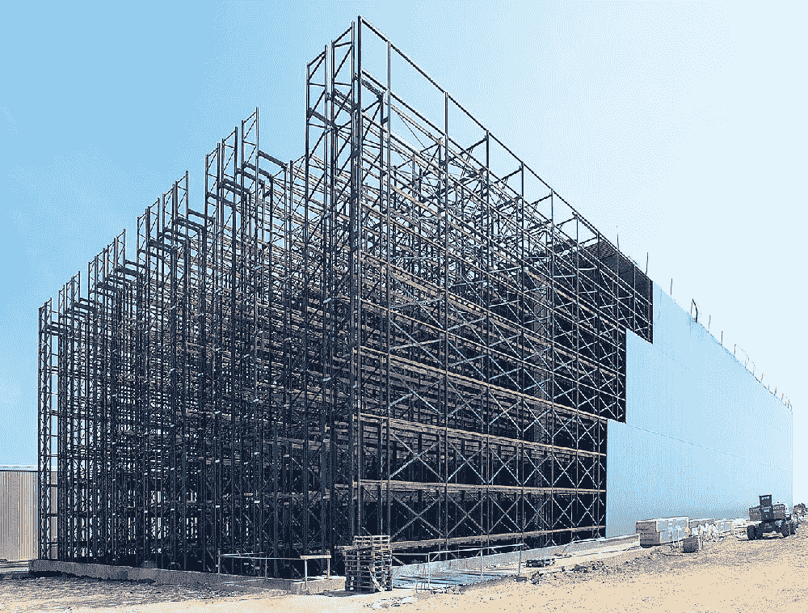

# 工业 4.0 —完全自动化的原材料和最终产品

> 原文：<https://medium.com/nerd-for-tech/industry-4-0-fully-automated-raw-material-end-products-40c32b0111be?source=collection_archive---------15----------------------->

# 介绍

马尔卡多纳的 interproveedora 公司 Dafsa 集团已投资 5000 万欧元，在 Segorbe (Castellón)的 Polygon 地区建设一个新的生产、加工和包装厂，该厂将分两期建设。该工厂预计于 2014 年建成，如果在参与该项目的不同服务公司内增加 300 个直接就业岗位和 200 个间接就业岗位，将创造 500 个就业岗位。

# 描述

生产、加工和包装多种产品的工厂在能源方面将是可持续的，并能以其在工业管理中的效率为特征。通过这种方式， [Group Dafsa 在一个占地 60.000 m2 的工厂中集中了一部分装配。](https://www.technologiesinindustry4.com/)在该船的 adecuación 内，将有 40 家开发、设备和设施领域的中小型企业参与，这些企业也将为 400 人提供工作，这将为该区域的 dinamización 在工作的融合中发挥重要的推动作用。

Dafsa 集团的新工厂将高度技术化，以加工和包装 100×100 的压榨果汁、果浆、浓缩果汁、牛奶果汁、各种类型的奶油、西班牙凉菜汤、ajoblanco、salmorejo 和天然原浆、冰沙和 orgeats，尽管该工厂也准备在必要时提供其他类型的参考。在船的一个区域将安装一个混合设备，允许了解各种不同成分的混合物。这些混合物用于生产高附加值的果汁、果汁和蔬菜、冰沙或软饮料，以及其他应用。

在这方面，Dafsa 集团总经理 José Luis Campillos 保证，由于 Mercadona 的支持，该公司已准备好实现一项投资，该投资将带来质和量的飞跃。Campillos 解释说:“新工厂的建立可能是 Dafsa 集团历史上的一个里程碑，因为它使我们的生产效率更高，特别是由于预测了 Mercadona 的增长，使我们达到了最佳状态”。总监还对 Segorbe 部分市议会在项目处理和开发过程中给予的支持表示感谢。

# 工业 4.0:全自动化原材料和成品仓库

通过观察 DAFSA 的自动化，人们可以想象它看起来像[科幻小说](https://www.technologiesinindustry4.com/)。

找到 YouTube 视频的链接:[https://www.youtube.com/watch?v=yma0hCQ4bqA&list = plbj 9 jygxruzdi 9 amlprtz 20 py 7 zet 1 isz&index = 3](https://www.youtube.com/watch?v=yma0hCQ4bqA&list=PLbJ9jyGXruZdI9aMlprTZ20PY7zet1isZ&index=3)这段视频展示了西班牙一家名为 DAFSA 的公司生产果汁的全自动化过程。仓库是完全自动化的，并使用人工智能软件技术以最有效的方式存储、检索和操作系统~令人惊叹的技术。

更多详情请访问:[https://www . technologiesinindustry 4 . com/2021/05/industry-4-0-fully-automated-raw-material-end-products . html](https://www.technologiesinindustry4.com/2021/05/industry-4-0-fully-automated-raw-material-end-products.html)