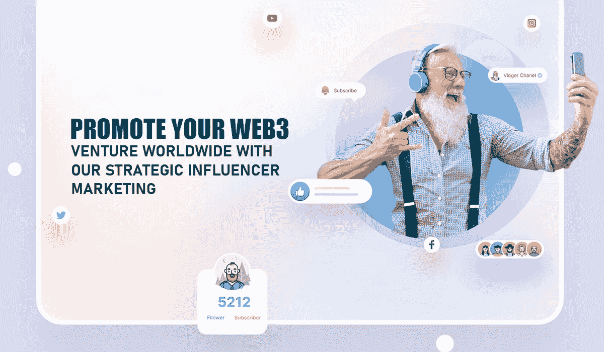
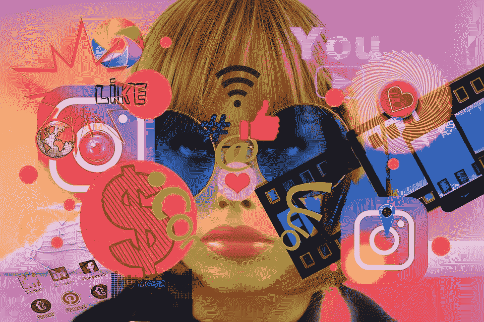

# 影响者营销策略:提升你的数字形象和投资回报率

> 原文：<https://medium.com/nerd-for-tech/influencer-marketing-strategy-to-boost-your-digital-presence-and-roi-c716e7fa350a?source=collection_archive---------8----------------------->

## 让我们更深入地研究影响者营销策略，以及它如何帮助你的 NFT。

影响者营销策略

你可能也看到了一些非常有趣的、有巨大潜力的非功能性测试没有被注意到。你有没有想过他们哪里出了问题？一个成功的 NFT 就是拥有一个有趣的利基、稀有或有趣的概念。真正让 NFT 成功的是有效的营销活动。特别是，NFT 影响者营销因其有效性和高转化率而变得越来越受欢迎。你是一个手里拿着一本非常有趣的 NFT 的 NFT 爱好者吗？然后，与合适的影响者一起推广它，这应该是您获得预期结果的前进方向。让我们更深入地研究一下 [**影响者营销策略**](https://bit.ly/3ML77JA) 以及它如何帮助你的 NFT。

## **NFT 影响者营销**

在这个数字时代，向在社交媒体上拥有强大粉丝基础的人推销你的 NFT，为你的 NFT 加油，这一点很重要。这可以帮助你的 NFT 有更广泛的接触和参与。NFT 影响者营销就是利用外部影响者来宣传你的品牌，并在你的潜在客户中传播你的 NFT。

## **如何识别合适的影响者？**

与合适的有影响力的人合作，可以在一夜之间增加你的 NFTs 的潜在客户和追随者数量。以下是如何为你的 NFT 找到合适的影响者，以增加你的 NFT 的吸引力。

## **研究:**

> 决定您希望在哪些平台上开展影响者活动，并相应地选择影响者。影响者必须在你选择的所有平台上吸引追随者。对各种平台中的顶级影响者进行研究，检查他们的分析，并检查他们如何吸引观众。

## **社交列表:**

> 社交列表是为你的项目寻找影响者的最好方法之一。通过社交列表，你可以了解行业趋势，并根据优势加以利用。在您的影响者活动规划阶段，这些见解可以派上用场。

## **太子花魁:**

> 根据预期投资回报和目标参与度选择影响者。根据预算决定你的影响者。拥有大量追随者的影响者通常比小影响者更贵。一个专业的影响者营销机构可以帮助你以相对较低的成本接触到顶级影响者。

## **顶级加密影响者**

贝普尔:迈克·温克尔曼是美国艺术家、平面设计师和社会评论家。他有大量的 NFT 爱好者作为追随者。

[**Snoop Dogg:**](https://en.wikipedia.org/wiki/Snoop_Dogg)**著名歌手、词曲作者。他是最新进入 NFT 空间的人。**

****Pranksy:** 顶级加密影响者之一，可能是业内最好的。他为许多开创性的 NFT 项目的成功做出了贡献，如《朋克》、《无聊的猿》等。**

**JRNY crypto: 托尼在 Youtube 上也被称为 JRNY crypto，他是数字空间中最优秀的追随者之一。**

## ****NFT 影响力营销公司如何帮助你？****

**我 **确定你的受众:**在找到合适的影响者之前，你需要找到你的目标受众。尽管 NFT 已经进入主流受众，但根据谁真正有购买 NFT 的动机来筛选受众还是很重要的。NFT 影响者营销公司可以帮助你更有效地识别你的潜在买家。**

**G **与影响者取得联系:**在为你的项目选择影响者之前，一家影响者营销公司会帮助筛选和分类适合你的 NFT 项目的影响者。他们可以根据你的预算和项目，通过大量粉丝追随小影响者，帮助你接触大影响者。**

**影响者拓展:一旦你列出了影响者的候选名单，营销公司就可以与他们取得联系，说服他们推广你的 NFT。营销公司中熟练的营销人员有能力为影响者创建有说服力的内容进行推广，作家创建可分享的书面内容，影响者将这些内容发布在他们的社交媒体个人资料上，以哄劝 NFT 爱好者。**

****关闭思路****

**近年来，对非功能性测试的兴趣和需求激增。被创造和铸造的非功能性食物的数量每天都在增加。可以肯定的是，这种对 NFTs 的狂热不会很快停止。但是，NFT 创作者需要从人群中脱颖而出，以实现他们的 NFT 的预期结果。NFT 影响者营销策略可以提升你在 NFT 市场的地位。如果您正在寻找在数字领域与顶级影响者一起推广您的 NFT，请立即咨询专业的 NFT 影响者营销机构，以帮助您开展营销活动。**