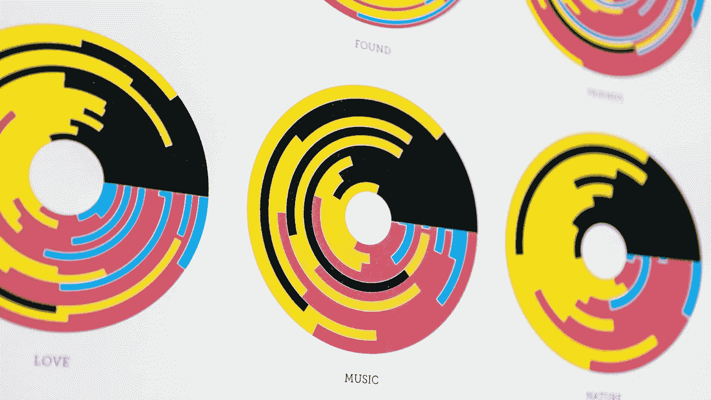
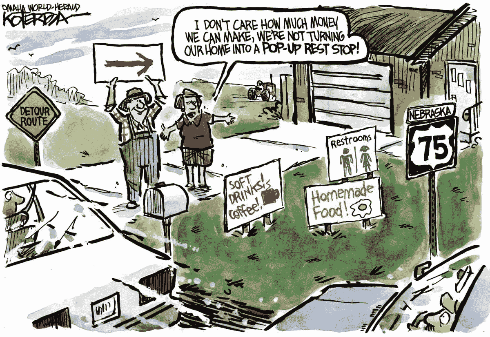

# UX 学科中的信息设计

> 原文：<https://medium.com/nerd-for-tech/information-design-in-ux-discipline-52d2e06f89d3?source=collection_archive---------9----------------------->

M [奥基特](http://mockitt.wondershare.com?utm_source=other_media_sites&utm_medium=social&utm_campaign=md&utm_term=medium_post&utm_content=post_md_md_en_20087918_2021-03-11)认为，有效的信息图不仅仅是数据和知识的图形化展示。它是一个独立的设计分支，旨在说明信息，考虑人类对信息感知的各个方面和标准，以确保与目标受众的有效沟通。

[信息设计](https://mockitt.wondershare.com/ui-ux-design/information-design.html?utm_source=other_media_sites&utm_medium=social&utm_campaign=md&utm_term=medium_post&utm_content=post_md_md_en_20087918_2021-03-11)是设计的一个分支，是对各种信息进行艺术和技术设计和呈现的实践，考虑了[人体工程学](https://mockitt.wondershare.com/ui-ux-design/ergonomics.html?utm_source=other_media_sites&utm_medium=social&utm_campaign=md&utm_term=medium_post&utm_content=post_md_md_en_20087918_2021-03-11)、功能性、[心理](https://mockitt.wondershare.com/ui-ux-design/psychology.html?utm_source=other_media_sites&utm_medium=social&utm_campaign=md&utm_term=medium_post&utm_content=post_md_md_en_20087918_2021-03-11)人类感知[信息的标准](https://mockitt.wondershare.com/ui-ux-design/information-visualization.html?utm_source=other_media_sites&utm_medium=social&utm_campaign=md&utm_term=medium_post&utm_content=post_md_md_en_20087918_2021-03-11)、信息呈现的视觉形式的美学以及其他一些因素。在信息设计中，传统的和新的设计原则被应用于将复杂的和非结构化的数据转换成有价值的、有意义的信息。[图像](https://mockitt.wondershare.com/graphic-design/graphic-design-images.html?utm_source=other_media_sites&utm_medium=social&utm_campaign=md&utm_term=medium_post&utm_content=post_md_md_en_20087918_2021-03-11)、符号[、颜色](https://mockitt.wondershare.com/ui-ux-design/ui-color-palette.html?utm_source=other_media_sites&utm_medium=social&utm_campaign=md&utm_term=medium_post&utm_content=post_md_md_en_20087918_2021-03-11)和文字传达思想、说明数据或可视化关系。

信息设计是在有序的信息结构下对信息的解构、呈现、解码或表达。它是信息重组的过程。利用文字、色彩、图形、图像、时间、亮度、材质、原材料等图形元素，充分调动和把握人的感官，清晰地表达自己的[内容](https://mockitt.wondershare.com/website-builder/website-content.html?utm_source=other_media_sites&utm_medium=social&utm_campaign=md&utm_term=medium_post&utm_content=post_md_md_en_20087918_2021-03-11)。这样就可以做到提醒、解释、书写，信息表达也可以更加流畅。

# 为什么需要信息设计？

如果你想在一个没有信息设计的世界里坐公交车或者火车，怎么知道车次？站台在哪里？我如何知道出发或到达的时间？如果没有红绿灯，司机该如何应对路口的情况？一些警告标志和颜色代码的出现使用户能够安全地定位和使用设备。他们能清楚地表明你需要什么，你不能做什么。我们可以根据提示进行操作，即使我们对设备或周围环境不熟悉。

# 日常信息设计实例

我国普遍认为信息设计是舶来品，与日常生活无关。事实上，恰恰相反:信息设计每天都在对数百万人的生活产生巨大影响。地铁导航、路标、指示牌、公共交通时刻表和路线、商店里的价签、银行卡对账单都是信息设计的典型例子。

信息设计师是为人们设计的专家。这意味着以一种可理解的、吸引人的、跨媒体的方式准备信息。我们从信息中构思、设计和开发积极的体验——信息体验——各种选修课补充了科学、设计和开发的基础知识。理论被应用在你自己的项目和综合实践学期中，因为你通过面向实践的工作学得最好。

信息设计师是全能人才——从主课开始，可以通过选修科目设置一定的优先级，比如[用户体验设计](https://mockitt.wondershare.com/ui-ux-design/ux-design-examples.html?utm_source=other_media_sites&utm_medium=social&utm_campaign=md&utm_term=medium_post&utm_content=post_md_md_en_20087918_2021-03-11)、[可用性工程](https://mockitt.wondershare.com/ui-ux-design/usability-engineer.html?utm_source=other_media_sites&utm_medium=social&utm_campaign=md&utm_term=medium_post&utm_content=post_md_md_en_20087918_2021-03-11)、[网页开发](https://mockitt.wondershare.com/web-design/web-designers.html?utm_source=other_media_sites&utm_medium=social&utm_campaign=md&utm_term=medium_post&utm_content=post_md_md_en_20087918_2021-03-11)，或者其他开设的主题。

# 信息图的多种用途

但是信息图和可视化到底能做什么，它们是为了什么目的而被创造的？早在 19 世纪，各种科学家就推动了图形表示的实践，并强调信息图有助于“一目了然”——读者只能通过文本非常缓慢且困难地掌握这种关系。今天的基本共识是，当统计数据可视化时，我们可以更快地阅读和解释它们。

与此同时，今天我们知道了更多的陷阱和错误来源——我们对信息图表潜力的看法已经变得更加不同了。[信息可视化的理论家](https://mockitt.wondershare.com/ui-ux-design/information-visualization.html?utm_source=other_media_sites&utm_medium=social&utm_campaign=md&utm_term=medium_post&utm_content=post_md_md_en_20087918_2021-03-11)不仅关注可视化的正确性(即，事实和数字关系是否被所选方法正确地表达了)，而且关注读者的感知过程或他们必须满足哪些先决条件才能理解信息图的问题(例如，在关键词“数据素养”下)。

## 信息图是讲述视觉故事的好方法

信息图表这样称呼自己是因为营销人员将它们作为一种链接方式。他们不再关注故事优先的方法，而是决定最合适的[内容](https://mockitt.wondershare.com/website-builder/website-content.html?utm_source=other_media_sites&utm_medium=social&utm_campaign=md&utm_term=medium_post&utm_content=post_md_md_en_20087918_2021-03-11)格式来呈现数据和信息。尽管如此，它已经成为一种建立简单联系的方式。

最重要的是信息图背后的数据和故事。尽管如此，当你直观地呈现它们时，这些故事可以被真实地实现和生动地看到，而不仅仅是发送新闻稿或链接到[博客](https://mockitt.wondershare.com/ui-ux-design/ux-blogs.html?utm_source=other_media_sites&utm_medium=social&utm_campaign=md&utm_term=medium_post&utm_content=post_md_md_en_20087918_2021-03-11)帖子。一个设计良好的信息图是一个强大的内容营销工具；但是，请确保这是讲故事的正确格式。

## 信息图可以共享。

信息图不仅易于链接，也易于分享。无论是社交，团队成员之间，甚至是博客帖子和文章，它们都是与他人分享信息的绝佳方式。事实上， [80%](https://thehhub.com/2020/02/03/importance-of-visual-content-on-social-media/) 的营销人员在他们的社交媒体营销中使用视觉资产，带有图片的推文比没有图片的推文获得了 18% 的转发。为什么不考虑把你的信息图剪成社交大小的卡片，在社交网络上分享呢？这是重新利用和促进内容进一步参与的好方法。

## 信息图表是一种优秀的销售工具。

记住关于人类大脑的统计数据。它的视觉效果比文字效果好？假设你是一个 [SaaS 品牌](https://www.wondershare.com/)，你在展示你的平台能做什么。为什么不把它可视化为信息图呢？信息图表不需要写过程、好处和可比性，但可以让潜在买家立即理解为什么他们应该在竞争中选择你。

## 信息图是可链接的。

信息图表被过度使用，因为它们已经成为一种很好的链接方式，通常是被动的。

## 信息图很容易理解。

不是每个人都有时间读长篇内容，也不是他们一直想要的。但是，绝对没有理由不使用信息图来补充其他内容。一个很好的例子就是我最近出版的指南《[如何创建完美优化的内容:16 个基本要素](https://www.searchenginejournal.com/seo-guide/anatomy-of-perfectly-optimized-content/)》。它有数千字，相当深入，但指南的摘要是一个易于理解的信息图。

因为它不仅可以形象化文本中提出的建议，还可以让读者直观地参考它，所以信息图为内容提供了背景。这样更容易理解和实现。

# 信息设计与 UX 的关系

信息设计师是为人们设计的专家。这意味着让信息变得易于理解、吸引人和跨媒体。我们从信息中构思、设计和发展积极的体验——信息体验。信息设计师是全能型人才——从主课开始，可以通过选修科目设置一定的优先级，比如用户体验设计、可用性工程、网页开发，或者其他提供的主题。这就是为什么对于好的 UX 设计来说，信息设计是非常重要的。

感谢您花时间阅读这篇文章。[了解更多关于摩奇特的信息](https://mockitt.wondershare.com/?utm_source=other_media_sites&utm_medium=social&utm_campaign=md&utm_term=medium_post&utm_content=post_md_md_en_20087918_2021-03-11)

我们为 UX 初学者创建了一个[终极指南](https://mockitt.wondershare.com/ux-beginner.html?utm_source=other_media_sites&utm_medium=social&utm_campaign=md&utm_term=medium_post&utm_content=post_md_md_en_20087918_2021-03-11)，它收集了来自多个 UXers 的知识、经验和建议。

订阅我们的[YouTube](https://www.youtube.com/channel/UCESxamaRS8nOGpWYvP1VSqA)脸书 insta gram

*原载于*[*https://mockitt.wondershare.com*](https://mockitt.wondershare.com/ui-ux-design/information-design.html?utm_source=other_media_sites&utm_medium=social&utm_campaign=md&utm_term=medium_post&utm_content=post_md_md_en_20087918_2021-03-11)*。*