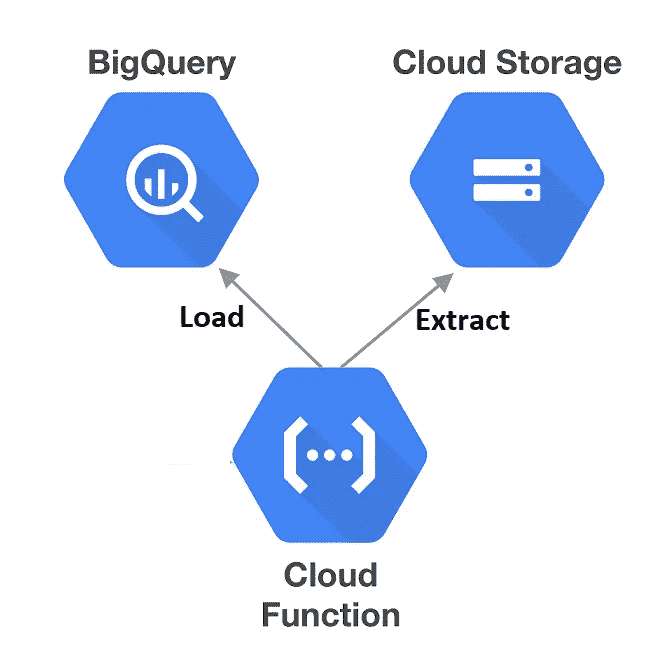
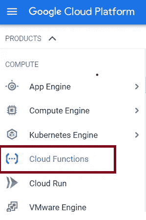
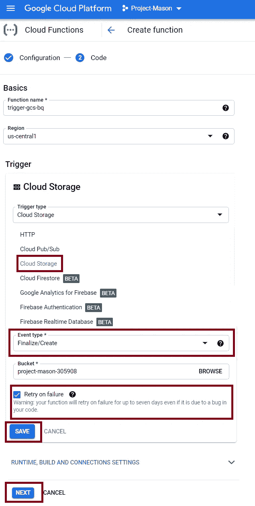
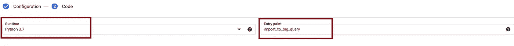
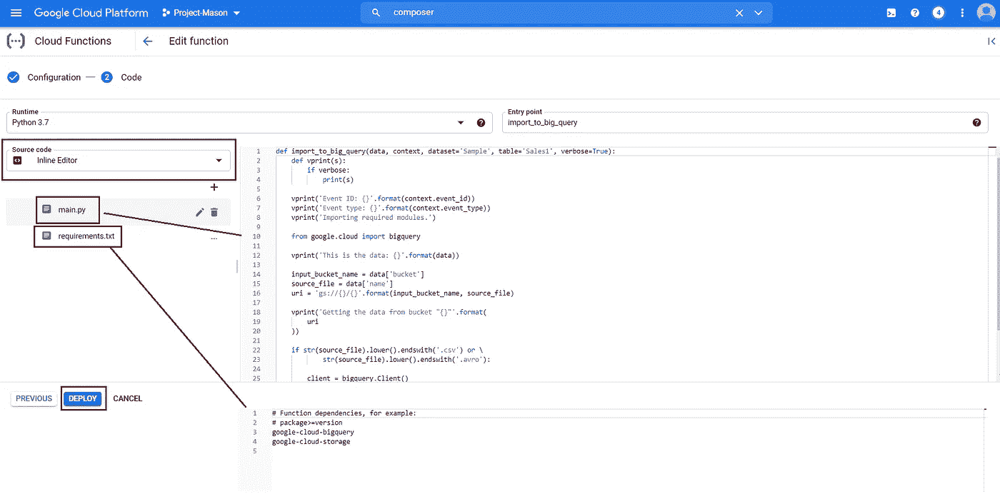
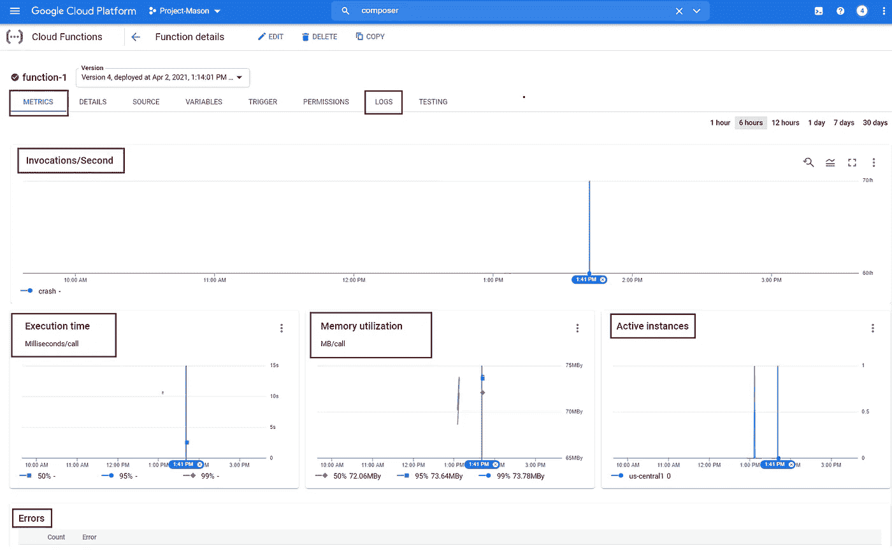

# 使用云功能将数据从 GCS 接收到 BQ。

> 原文：<https://medium.com/nerd-for-tech/ingest-data-from-gcs-to-bq-using-cloud-functions-abaca92514bf?source=collection_archive---------1----------------------->

如果你已经熟悉 **FaaS** (功能即服务)，那么**云功能**就不需要介绍了。

> Google Cloud Functions 是一个无服务器的执行环境，用于构建和连接云服务。使用云函数，您可以编写简单的、单一用途的函数，附加到从您的云基础架构和服务发出的事件上。当正在观看的事件被触发时，您的云功能被触发。您的代码在完全托管的环境中执行。不需要配置任何基础架构，也不需要担心管理任何服务器。

云函数可以用 Node.js，Python，Go，Java，.NET 和 Ruby 编程语言运行时。

云函数要么是基于 HTTP 的函数，要么是事件驱动的函数。根据您使用的运行时，事件驱动可以是后台函数或云事件函数。

在本文中，我们将编写、部署和触发**事件驱动函数**，特别是**后台函数**(使用 Python 运行时)，每当 GCS 中有新文件可用时，这些函数会自动将数据从**云存储加载到 BigQuery** 。

*   在我们开始之前，确保从**API 和服务**控制台启用**云功能**和**云存储 API**。
*   启用所需的 API 后，在导航菜单中，单击**云功能**打开主页。您可以在主页点击**创建功能**来创建一个新功能。

创建一个新功能包括两个步骤:**配置** & **代码**。

点击**创建功能**，首先您会看到一个配置屏幕，在这里您需要选择基本细节，如**功能名称、区域、触发类型等。**根据触发器类型，您还需要选择更多选项。例如，如果您的**触发器**是**云发布/订阅**，您需要从下拉菜单中选择一个云发布/订阅主题。

在本例中，我将选择**云存储**作为我的**触发器**，并从下拉菜单中选择 bucket。我还需要选择**事件类型**，在我们的例子中是**完成/创建**。

用户可以选择勾选**失败重试**框。将出现一条警告，告知复选框对触发器的意义。

您可以进一步选择设置运行时、构建和配置设置，对于本例来说，这些设置保持不变并保留默认值。

一旦在配置屏幕中选择了所需的一切，单击**下一个**导航到**代码**屏幕，在这里您需要选择**运行时**，在我们的例子中是 Python 3.7 和**入口点**(入口点是您想要在云函数中执行的函数的名称)。

在这个阶段，我们应该知道 Python 的**代码结构**需求。例如:

├──主页

└──要求. txt

`main.py`包含一个或多个我们打算执行的功能。

`requirements.txt`文件指定了这些函数执行的依赖关系。这也包括要安装的软件包。

一旦选择了所需的运行时，用户可以选择使用**内嵌** **代码编辑器**，或者从 **GCS** 等上传代码。创建一个函数。在我们的例子中，我选择使用内联代码编辑器。一旦根据需要定义了代码和需求，您就可以**部署**该功能。

函数名旁边的绿色勾表示**部署**成功。

每当触发一个新的 CSV 文件时，从 GCS 加载数据到 BQ 的云函数现在已经准备好了。

一旦执行了该功能，您就可以通过选择正确的版本进入功能屏幕来监控性能、错误、指标和日志。

你也可以使用**多个云函数**来执行提取-转换-加载。

**代码信用**:

[https://gist . githubusercontent . com/mka hn5/5d2d 569209 f 39 f 72d 089 a68d 767 de 57 b/raw/19f 4440 BF 2 e 8 ee 22 B3 ca 757591 b 007d 7975672/main . py](https://gist.githubusercontent.com/mkahn5/5d2d569209f39f72d089a68d767de57b/raw/19f4440bf2e8ee2f22b3ca757591b007d7975672/main.py)