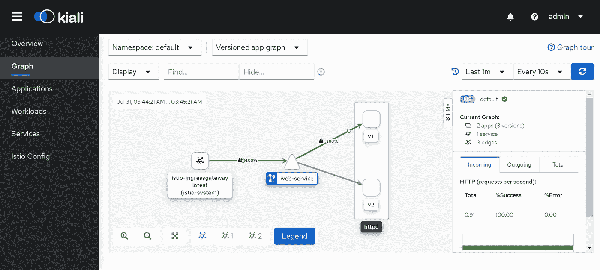

# Istio 中的入口网关

> 原文：<https://medium.com/nerd-for-tech/ingress-gateway-in-istio-bb9ab466a1a0?source=collection_archive---------1----------------------->

## 什么是 Istio 网关？

Istio 网关描述了在服务网格的任一侧运行的负载平衡器。Istio 网关有两种类型。

Istio 入口网关:控制进入网格的流量。

Istio 出口网关:控制网格外部的流量。

现在让我们用一个例子来理解这个东西。

我有两个版本的应用程序在我的集群中运行:版本 v1 和版本 v2。第一版可从 http:// <ingress-ip>/v1 获得，第二版可从 http:// <ingress-ip>/v2 获得。使用 Kubernetes Ingress 也可以实现相同的场景，但是当我们使用 Istio 网关时，我们可以利用丰富的 Istio 流量管理和安全功能，如请求路由、流量镜像、电路断开等。</ingress-ip></ingress-ip>

现在部署包含服务版本:v1 内容的网页的 Pod

现在部署一个具有新版本 v2 的新 pod。该 pod 将由 web-service 服务选择器选取。

通过 ClusterIP 服务公开您的 pod，因为我们将使用 Istio 入口网关向外界公开我们的服务。

现在，如果您将 web 服务卷曲，您可以看到 robins 对版本 v1 和 v2 的请求

> *【root @ master istio-medium】#****kubectl run curl-test—image = odise/busybox-curl—RM-it—/bin/sh-c " while true；做 curl 网络服务；睡眠 1；搞定"*** *<html><正文> < h1 >这是 V1 版！</h1></body></html>
> <html><body><h1>这是 V2 版！</h1></body></html>
> <html><body><h1>这是 V1 版！</h1></body></html>
> <html><body><h1>这是 V2 版！</h1></body></html>
> <html><body><h1>这是 V1 版！</h1></body></html>
> <html><body><h1>这是 V2 版！</h1></body></html>
> <html><body><h1>这是 V1 版！</h1>/body>/html>*

但是我们希望我们的版本:v1 应用程序在“http:// <ingress-ip>/v1”上提供服务，我们的版本:v2 应用程序在“http:// <ingress-ip>/v2”上提供服务。这可以通过使用 Istio 的 CRD 虚拟服务来实现。但是首先，让我们为我们的应用程序定义一个网关(负载平衡器)。这是通过使用 Istio 中的网关资源来完成的。</ingress-ip></ingress-ip>

**网关:**

**a)名称:指定网关的名称**

b)选择器:这些是应该应用配置的网关的标签。

c)服务器:这指定了服务器规格的列表。

d)端口号:网关应该监听的端口号。

e) port.name:应为端口指定的名称。

f) port.protocol:端口上暴露的协议。

g)主机:该网关暴露的主机。

与 Kubernetes 入口资源不同，网关配置不包括流量路由配置。相反，流量配置是在 Istio CRD 的 like VirtualService 和 DestinationRules 中进行的。让我们看看如何在 VirtualService 和 DestinationRules 中配置上述场景。

**虚拟服务:**

a)名称:指定虚拟服务的名称

b)主机:将流量发送到的目的主机。

c) http:它是 http 流量的路由规则列表

d) **gateway.name** :应该应用此配置的网关的名称。这应该与网关资源中给定的名称相匹配。

e) http.match.uri.prefix:基于前缀的匹配要匹配的 uri。

f) rewrite.uri:流量必须被重定向到的目标 uri。这类似于 nginx-ingress 控制器中的注释【nginx.ingress.kubernetes.io/rewrite-target**。**

f)子集:在相应的目的地规则中定义的业务应该被定向到的子集的名称

**目的地规则:**

a)名称:目标规则的名称

b)主机:流量发送到的主机。这里的主机是我们的 Kubernetes 服务的 DNS 名称

c)子集:代表服务的各个版本的命名集

d)子集名称:子集的名称

e)标签:用于选择窗格的标签图

现在让我们应用网关以及相应的 VirtualService 和 DestinationRules。

现在 curl 第一版 http:// <ingress_ip><ingress_node_port>/v1，第二版 http:// <ingress_ip><ingress_node_port>/v2</ingress_node_port></ingress_ip></ingress_node_port></ingress_ip>

Istio 中的入口网关

让我们使用 kiali 仪表板来实现同样的效果。我们将尝试使用前缀“/v1”只访问版本:v1。这应该只将请求路由到版本:v1。

> **istioctl 仪表板 kiali**

基于用户请求，流量仅被路由到版本:v1

万岁！！我们成功地在 Istio 中实现了入口网关，并且使用 Istio 入口网关实现了基于路径的路由。

# 先决条件

 [## Istio 服务网格简介

### 什么是 Istio 服务网格？

medium.com](/@pavan1999.kumar/introduction-to-istio-service-mesh-2bc68d2ffdac)  [## 如何使用 istioctl 安装 Istio

### 正如我在之前的文章中所讨论的，我们将致力于一些实时场景，在这些场景中，我们将能够…

medium.com](/@pavan1999.kumar/how-to-install-istio-using-istioctl-1557db1cd62d) 

# 被推荐的

 [## 使用 Istio 流量镜像对 Kubernetes 中的实时流量进行镜像

### 为什么需要流量镜像？

medium.com](/@pavan1999.kumar/mirroring-of-live-traffic-in-kubernetes-using-istio-traffic-mirroring-36f8c4d32fe8)  [## 伊斯蒂奥的 MTLS

### 通过插入现有 CA 证书在 Istio 服务网格中设置相互 TLS

medium.com](/@pavan1999.kumar/mtls-in-istio-970f0666b867)  [## Kubernetes 中使用 Istio 的加权路由

### 让我们假设您的客户正在使用您的应用程序的版本:v1。应用程序的新版本:v2 是…

medium.com](/@pavan1999.kumar/weighted-routing-in-kubernetes-using-istio-5d9bdb495032)