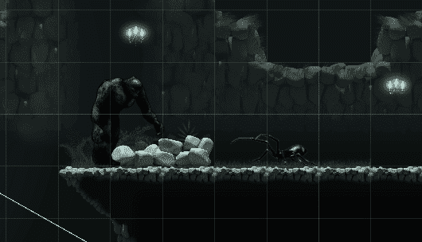
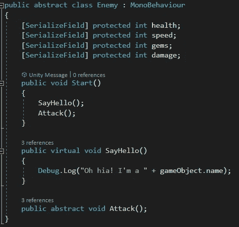
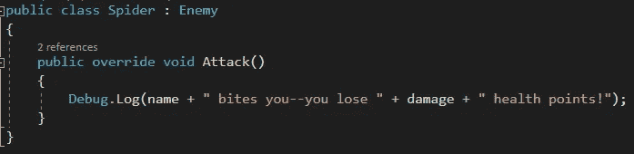
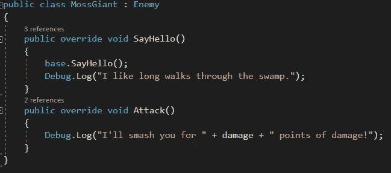
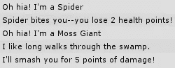

# C#中的继承

> 原文：<https://medium.com/nerd-for-tech/inheritance-in-c-fe16751f9f7d?source=collection_archive---------19----------------------->

**目的:**利用继承创建可重用代码。

我们计划在游戏中加入一些不同的敌人类型。虽然每个人的行为会有所不同，但他们会有一些共同点，如健康，速度和攻击方法。我们可以创建一个*抽象*敌人类，而不是为每个敌人输入这些属性。永远不会有一个普通的敌人；各种敌人类型都将*继承*敌人职业。

下面是我们的敌班。我们从四个参数开始，每个参数都设置为 *protected* ，这样从敌人继承的类可以使用它们，但是其他类不能访问它们。在我们的*开始*的方法中，每个敌人会*打招呼*然后*攻击*。 *SayHello* 方法是一个*虚拟*方法，这意味着任何继承敌人的类都可以原样使用它，或者它们可以实现自己版本的方法。*攻击*方法是*抽象*，因此继承类*必须*提供它们自己的方法版本。

这是我们的蜘蛛。它继承了敌人的代码，*覆盖了*的*攻击*方法。它会使用自己的*名*(蜘蛛)，可以使用从敌人那里继承来的*伤害*参数。

这是我们的苔藓巨人。他比我们的蜘蛛更爱说话。当他说你好的时候，他用“哦，你好！我是……”台词出自《敌人》中*基地* *SayHello* 方法，不过他还加了一句台词:“我喜欢在沼泽里长时间散步。”

这是我们开始游戏时蜘蛛和苔藓巨人的输出，它们的 *Start* 方法被调用:

