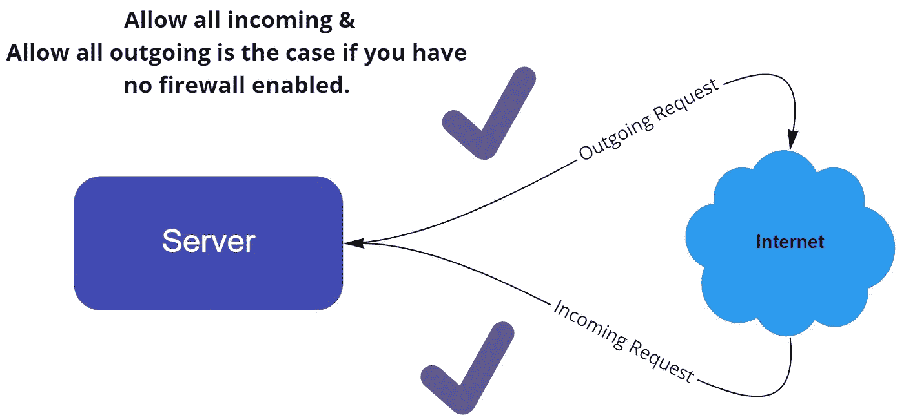
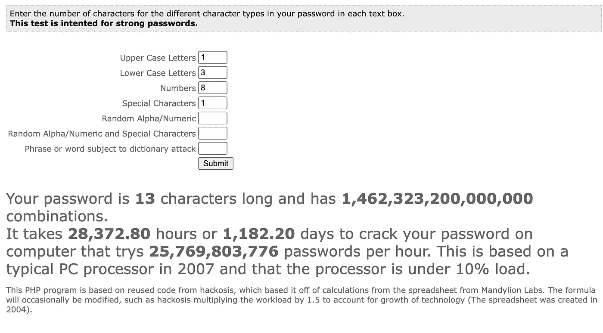
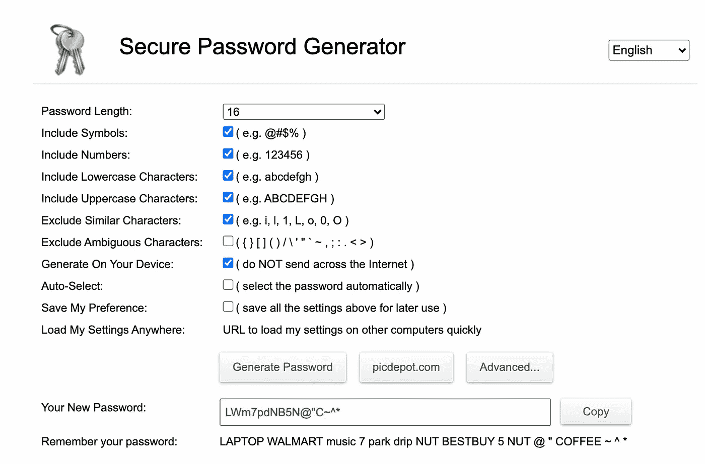
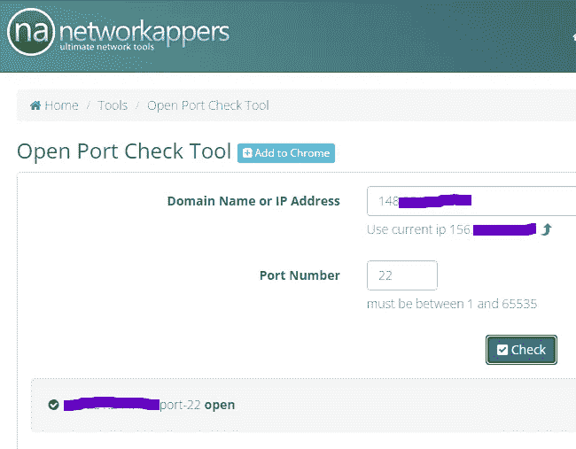
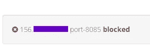
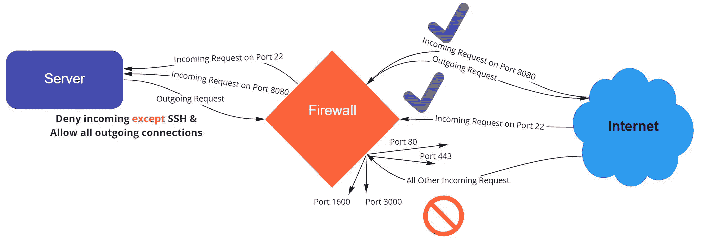

# 在 Ubuntu 云服务器上初始化防火墙

> 原文：<https://medium.com/nerd-for-tech/initializing-a-firewall-on-an-ubuntu-cloud-server-7e0d2c88f0be?source=collection_archive---------0----------------------->


## TLDR: 在本指南中，我将给出保护服务器的基本说明和解释。

👉**我不是网络安全专家👈**

让我们陷入…

当您启动远程实例时，防火墙被禁用，所有内容都是打开的，因为它们假设您需要打开所有内容来进行初始设置，这种设置如下所示。



你可以想象这是你能拥有的最不安全的设置，这种设置完全依赖于你的密码的强度，如果它不是一个强密码，它可能容易受到暴力攻击和许多其他类型的利用。

**旁注/兴趣点:**

你可以在谷歌上搜索“暴力计算器”，找到一个网站，让你知道你的密码有多强，以及破解密码需要多长时间。如果有人试图用暴力攻击你的登录，看看这个网站



**强密码是确保服务器安全不可或缺的第一步。**有很多网站可以帮助你设置一个强随机密码，这是我通过另一个谷歌搜索找到的一个。像下面这样的密码需要非常长的时间才能被暴力攻击。



为了建立防火墙，我们将使用一个非常简洁的包，叫做[简单防火墙](https://help.ubuntu.com/community/UFW) (UFW)。UFW 应该默认安装在 Ubuntu 服务器上。如果不是因为某种原因，可以用。

```
sudo apt install ufw
```

在那里，我们将需要阻止所有打开的端口，并为我们想要打开的端口创建例外，如**端口 22** 用于 **SSH 等。** 对我来说，我打开了端口 22 和端口 8080，因为我需要访问我的服务器，并且我还需要访问在端口 8080 上运行的应用程序。

首先，我们配置 UFW，然后打开它。我们这样做是为了避免被拒之门外。这听起来很明显，我知道，但相信我，你只需要一次被锁在门外的头痛就知道这是初始化防火墙的黄金法则。

因此，我将首先通过键入以下命令来关闭所有端口

```
sudo ufw default deny incoming
```

接下来，让我们添加 **SSH** 或**端口 22**

```
sudo ufw allow ssh
```

或者

```
sudo ufw allow 22
```

接下来，我想添加将在端口 8080 上运行的应用程序，您可以用同样的方式添加您的应用程序。

```
sudo ufw allow 8080
```

我想你明白了。

接下来，我们需要通过键入以下命令来激活 UFW

```
sudo ufw enable
```

祈祷你仍然能够进入你的服务器🤞

在任何时候，您都可以通过键入以下命令来查看防火墙的状态

```
sudo ufw status verbose
```

如果 UFW 关闭了，您将会收到如下消息

```
OutputStatus: inactive
```

应该有用吗

```
OutputStatus: active
Logging: on (low)
Default: deny (incoming), allow (outgoing), disabled (routed)
New profiles: skip

To                         Action      From
--                         ------      ----
22/tcp                     ALLOW IN    Anywhere
8080/tcp                   ALLOW IN    Anywhere
```

检查防火墙是否正常工作的一个好方法是测试它。

# **测试您的防火墙**

在写这篇文章的时候 [NetWorkAppers](https://networkappers.com/tools/open-port-checker) 有一个有用的工具来做这件事。你只需弹出你的 IP 地址和你想检查的端口。正如你所看到的，端口 22 是打开的，这意味着我可以 SSH 到我的远程服务器！🎉



然后挑另一个不该开的端口测试，我用的是 8085，被封了。如果你对此感兴趣，并且你想了解更多[谷歌渗透测试](https://www.google.com/search?q=Penetration+test+ports&sxsrf=APq-WBsAdKZLi0tbiB_3weReZ93oODD4cw%3A1648111197184&ei=XS48YoTyCuKEhbIPqd6SqAI&ved=0ahUKEwjElNXTrN72AhViQkEAHSmvBCUQ4dUDCA4&uact=5&oq=Penetration+test+ports&gs_lcp=Cgdnd3Mtd2l6EAMyBggAEBYQHjIGCAAQFhAeMgYIABAWEB4yBggAEBYQHjIGCAAQFhAeMgYIABAWEB46BwgjELADECc6BwgAEEcQsAM6CggAEEcQsAMQyQM6CwgAEIAEELEDEIMBOgUIABCABDoICAAQgAQQyQNKBAhBGABKBAhGGABQhwRY5RJg7BNoAXABeACAAYcCiAGLCpIBAzItNZgBAKABAqABAcgBCcABAQ&sclient=gws-wiz)。



下面是一个很好的视觉形象，展示了我们在这里已经取得的成就，以及你们将会得到什么。



恭喜你有了一个基本的工作防火墙，希望你能有所了解。

有更多的设置和首选项可以用来“增强”你的安全性，其中一些可以在 UFW 配置文件中找到。

```
sudo nano /etc/default/ufw
```

还有一些可以通过 CI 或第三方软件包实现，例如

1.失败班
2。禁用根用户
3。公钥认证
4。地理封锁
5。反向代理:我使用 Nginx，但 Traefik 最近似乎很流行。
6。Cloudflare CDN
7。将 SSH 移动到不同的端口

为了提高服务器安全性，我强烈推荐以上所有方法。

注意安全祝你好运✌