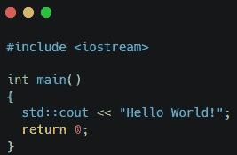
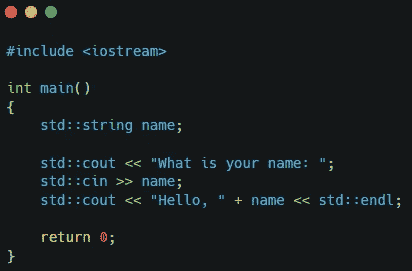

# C++中的输入和输出

> 原文：<https://medium.com/nerd-for-tech/input-and-output-in-c-e3199dbeeb07?source=collection_archive---------3----------------------->

要在 C++中向控制台输入和输出信息，您将使用标准输入输出流(iostream)库。

**输出**

为了输出信息，您将使用代码 std::cout。这段代码引用了标准输出流。在大多数情况下，输出设备是显示屏。

这里有一个经典 Hello World 的例子！程序。

**输入**

要输入信息，您将使用代码 std::cin。这段代码引用了标准输入流。在大多数情况下，输入设备是键盘。

这是一个示例程序，要求用户输入他们的名字，然后显示一个问候。

