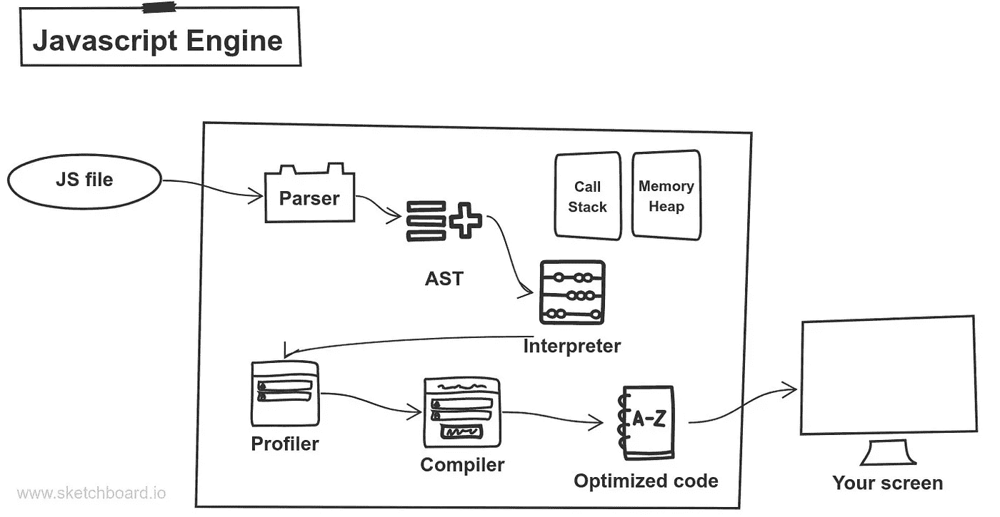

# V8 发动机内部

> 原文：<https://medium.com/nerd-for-tech/inside-the-v8-engine-b81aff3eecdb?source=collection_archive---------7----------------------->

谷歌 V8 引擎

# **定义**

*   (AST)或"**A**b 抽象**S**yn tax**T**REE "--是一种将编程语言的**语法**表示为类似分层**树**的结构的方式
*   **性能分析**(“程序性能分析”、“软件性能分析”)是一种动态程序的形式，用于测量程序的空间(内存)或时间复杂度、指令或函数调用的频率和持续时间
*   **编译器**是一种独特的程序，它处理用特定编程语言编写的语句，并将它们转换成机器语言或计算机处理器使用的“代码”。
*   **词汇**——与常用术语的意思非常匹配。正如它的另一个名字所暗示的，这是人们可能在字典中找到的那种定义。

对于那些不知道 v8 引擎是什么的人来说，它本质上是解释或编译 JavaScript 的引擎。值得注意的是，v8 发动机并不是唯一的发动机。V8 引擎只是 Google 和 NodeJS 碰巧用的一个。要查看更多关于什么浏览器使用什么引擎的信息，请点击[此处](https://en.wikipedia.org/wiki/JavaScript_engine#:~:text=A%20JavaScript%20engine%20is%20a,executes%20JavaScript%20(JS)%20code.&text=JavaScript%20engines%20are%20typically%20developed,via%20the%20Document%20Object%20Model.)。

*V8 发动机的五个基本步骤*。

1.  句法分析程序
2.  大西洋时间
3.  解释者
4.  仿形铣床
5.  编译程序

当我们运行一个 JavaScript 文件时，代码被分解成令牌；你可能听说过 ***词法分析*****乐兴，或者分词器**这些术语。词法分析就是根据关键字的含义或代码试图做什么，将代码分解成记号的过程。这些我们称之为**令牌**的令牌随后形成了一个 **AST** ，如果你想查看，还有一个有趣的工具可以让你查看 [AST](https://astexplorer.net/) 。

一旦 AST 完成，代码将被推送到解释器，并被扔进编译器或分析器。不过 V8 引擎使用的是 **JIT** (Just-In-Time)编译器。JIT 编译器实际上根本不是编译器，也不是解释器。可以认为它更像是两者的混合体。JIT 编译器允许我们在运行时执行代码，而不是在代码运行之前执行它。使用 JIT，我们得到了大量的优化，使编译器和分析器能够更好地优化字节码，从而更有效地工作。需要注意的是，*字节码*不是*机器码*。字节码需要通过 v8 引擎操作，由虚拟机或 JS 引擎直接执行。

一个常见的误解是 JavaScript 是一种解释型语言。您可能听说过这样的话，“JavaScript 是一种解释型语言”，但情况并非总是如此。您可以使用 JS 引擎创建一个 JavaScript 实现，该引擎只在您想编译时才编译。我不是说它会有任何优化的影响；这只是一个有趣的事实。它能做的是帮助你在更深的层次上理解 JavaScript。

