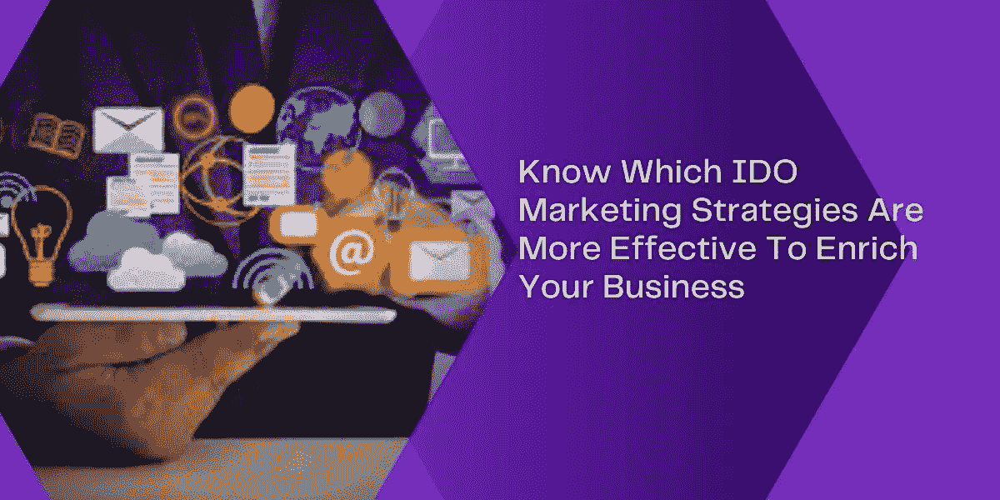

# 洞察有效的 IDO 营销策略，以获得更好的业务范围

> 原文：<https://medium.com/nerd-for-tech/insights-into-the-effective-ido-marketing-strategies-for-better-business-reach-a5c0ce0a4e34?source=collection_archive---------7----------------------->

在数字时代，区块链、cryptos 和 NFT 已经成为主流。然而，不可否认的事实是，与这些相关的项目数量正在激增。然而，项目业主很难接触到目标受众，并为他们与区块链有关的项目或业务筹集资金。这是 IDO 营销服务变得突出的时候，因为公司开始提供 IDO 营销策略。项目所有者或初创公司可以利用这一点，在目标受众中扩大业务范围。这个博客会让你知道一些有效的&最佳 IDO 营销策略。请继续阅读，获得真知灼见！

## 💡**首次公开募股(I do)——是关于什么的？**

让我们以对 IDO 筹款机制的充分了解来开始这篇博客。筹资机制将被用来扩大企业或初创公司的业务范围，让它们的项目在目标受众中引人注目。有几种筹款机制在数字领域很流行。它们是首次硬币发行(ICO)、首次交易所发行(IEO)、证券代币发行(STO)和首次 Dex 发行(IDO)。

其中，IDO 是他们中大多数人可能更喜欢的最新筹款技术。这是因为它克服了其他三种筹资方式的局限性，这是不容置疑的事实。然而，通过有效的 IDO 营销策略，将目标受众转化为潜在投资者是完全可以实现的。对项目感兴趣的投资者可以购买 IDO 代币。

## 💡简单介绍一下 IDO！

IDO 是 Initial Dex Offering 的首字母缩写，是最主要、最有效的筹资机制。这带来了一些额外的好处，比如交易快捷、流动性高，以及上市代币的成本较低。

当项目启动 IDO 时，这明显意味着项目可以通过在分散式交易所中启动硬币或代币来筹集资金。发行后，感兴趣的投资者可以投资代币。这就是最佳筹款模式(IDO)的运作方式。

 [## Coinlist 克隆——开发一个类似 Coinlist 的加密货币交易所

### 在过去的几年里，加密货币的统治地位已经相当高，尤其是在过去的两年里…

www.appdupe.com](https://www.appdupe.com/blog/coinlist-clone/) 

## 💡**适合企业的 IDO 营销策略**

正如你所知，IDO 的筹资机制，这里有一些方法，项目业主可以达到目标受众，以筹集资金，并大大提高业务。看看 IDO 的营销策略吧！

> 比别人认为安全的风险更大。梦想比别人认为的更实际。

🔖**创建登陆页面&推广博客**

登陆页面只不过是一个网页。通过网页的直观和用户友好的界面，提供关于项目和硬币/代币的每个角落和细节是非常有效的。确保提到的细节是相关的和原创的。

而且，要注意的一个关键点是，一个单独的网页就足够了，并确保定期更新博客。“内容为王”这句话用在这里再合适不过了。这意味着内容营销对于更好的接触是如此有效。

🔖**社交媒体营销**

社交媒体渠道确实限制了加密货币的推广。虽然，项目相关的推广可以做。这对于最大化曝光是相当有帮助的。你可以选择的更好的社交网站是脸书、LinkedIn、Instagram 等。最重要的是，随着用户数量突破 1.4 亿，如今不和谐营销已经变得非常突出。

🔖**发布新闻稿**

在认证平台上发布新闻稿为更好的品牌传播开辟了道路。确保发布的信息准确、翔实、新颖。最重要的是，这不应该太冗长。

🔖**影响者营销**

现在已经太普遍了，似乎是一种要进行的非正式的营销方式。此外，选择合适的影响者是必不可少的，因为这将在接触合适的人群方面发挥重要作用。

除了上面提到的四种 IDO 营销策略，这里还提到了一系列其他行之有效的策略。

*   电子邮件营销
*   联盟营销
*   社区参与
*   按链接付费
*   视频营销

> 想法是商品。它们的执行是不公平的。–迈克尔·戴尔

💡**总结**

无论你的项目或生意有多有价值，你的项目都有可能不被注意到。因此，执行最佳的 IDO 营销策略是非常必要的。为了选择最佳策略并扩大你的筹款业务范围，请联系 IDO 营销公司或机构。通过检查投资组合，确保选择最合适的&。