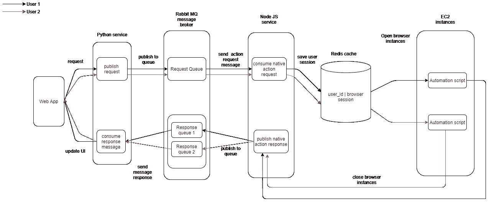

# 使用 Python Node JS 和 RabbitMQ 的 Instagram Bot

> 原文：<https://medium.com/nerd-for-tech/instagram-bot-using-python-node-js-and-rabbitmq-5c8f61d17523?source=collection_archive---------0----------------------->

我正在开发一个应用程序，需要实现 Instagram 的行动，能够喜欢/不喜欢帖子，关注/不关注用户，并为帖子添加评论。我的实现的主要目的是用户应该能够使用 REST API 执行操作。由于 Instagram API 不支持上述操作，我们不能在我的实现中直接使用它们的端点。所以我设计了一个 Instagram bot 来使用 REST API 在服务器端执行这些操作。在这里，我将使用 Node JS [木偶师](https://www.npmjs.com/package/puppeteer)作为自动化工具，使用 [RabbitMQ](https://www.rabbitmq.com/) 作为消息代理在 Python & Node JS 和 REST API 实现之间进行通信，我使用 Python Flask。

Puppeteer 是一个节点库，提供高级 API 来控制 chrome 或 chrome，我们可以在浏览器中手动做的大多数事情都可以使用 puppeteer 来完成。

RabbitMQ 是一个广泛部署的开源消息代理或队列管理器，它为我们的应用程序提供了一个发送和接收消息的公共平台。

下面是我的实现图。

所以让我们开始吧。

**先决条件:**

*   节点 JS 的基础知识
*   Python 的基础知识

**设置 Python 消息代理:**

我已经使用 python [pika](https://pika.readthedocs.io/en/stable/) 库实现了消息队列。由于 AMQP 是一种双向 RPC 协议，客户端可以向服务器发送请求，服务器可以向客户端发回请求，因此 Pika 在其每个异步连接适配器中实现或扩展了 IO 循环。

所以我从 python 中实现了 message publisher，而`instagram_action_publish()`正在 REST API 中调用以将消息发布到队列中。因此，这里 web 应用程序调用从 python Flask 编写的 REST API，并将消息发布到队列。

**设置节点 JS 项目:**

我已经使用了`npm-init`来初始化节点服务，创建了`app.js`并执行了`node app.js`命令来测试应用程序。然后使用`npm i puppeteer npm i puppeteer-extra npm i puppeteer-extra-plugin-stealth` 为自动化脚本安装木偶师，使用`npm i amqp-connection-manager`安装 [RabbitMQ](https://www.npmjs.com/package/amqplib) 。这是一个关于 amqplib 的包装器，它提供了自动重新连接。

在这之后，我已经决定了下面的文件夹结构。

*   `app.js`
*   `messageBroker/publishers/publisher.js`
*   `messageBroker/subscribers/subscriber.js`
*   `bot/instagramFunctions.js`
*   `bot/config/instagramConfig.js`
*   `nativeActions/instagramActions.js`

下面是 app.js 代码实现，它集成了 log4js 来配置日志，并在这里订阅消息队列。

然后，下一步实现消息队列订阅者订阅从 python 服务发布的消息，并分别调用每个 Instagram 操作。在这里，我已经在环境变量中配置了 Rabbitmq 参数和订阅队列 id。

然后，我编辑了 instagramConfig.js 文件，为 Instagram UI 元素和网络调用添加了选择器和其他配置，如下所示。

然后，我编辑了 bot 文件夹中的`instagramFunctions.js`文件，为动作单独添加了自动化脚本。

**步骤 01 :**

作为第一步，添加了导入木偶库的`initPuppeteer()`方法，启动浏览器并创建一个新页面，同时设置浏览器的宽度和高度。

第二步:

在这一步中，我们将添加一个`visitInstagram()`,它访问 Instagram 网站并等待，直到网络空闲，并等待它出现登录界面，并执行如下登录操作。

我设置了随机超时来等待操作，因为如果操作太快，我们的机器人将很容易被 Instagram 检测到，这可能会导致我们的帐户被阻止或列入黑名单。

在这里，我通过评估 HTML 页面来选择 UI 元素，因为 Instagram 中的选择器经常变化。

**步骤 03 :**

在这一步中，我们将添加一个`likepost()`,它使用 post url 访问 Instagram post，并等待直到网络空闲，等待直到它看到 post，并执行类似的操作和撤销类似的操作，如下所示。

在这个场景中，我在 HTML 内容中使用了 aria-label 来查找 like `span > svg[aria-label = “Like”]` 和 like `span > svg[aria-label = "Unlike"]`按钮。

在这里，我需要验证 Instagram 网络调用是否成功，并通过使用 puppeteer 拦截类似的动作后端 API 调用返回有效的 Json 响应，如下所示。因此，我们可以截取并获取 API URL、Json 响应和响应状态。

同样，我为关注/取消关注用户执行了类似的操作，并对帖子发表了如下评论。这里我将添加`instagramFunctions.js`的完整代码实现

这里我添加了`instagramActions.js`的完整代码实现

然后，发布者使用将响应发布回 python 服务，如下所示。

在 python 服务中，它将使用如下所示的响应消息，并将响应发送回 web 应用程序。

这种解决方案有局限性，因为

Instagram 经常更换 UI 元素选择器，因为我已经对页面进行了评估，以找出可见文本内容并执行点击操作。但是也存在改变终端用户可见文本内容的风险。所以我们需要维持我们的解决方案。

木偶师模块使用 chromium 浏览器将机器人作为自动化脚本来执行。假设用户将通过 Instagram 凭据登录，并执行多个操作。但是用户不能同时执行这些操作，这会导致 chromium 浏览器崩溃。所以用户需要等待，直到它完成前一个动作。

如果单个用户需要并发执行，我们需要处理许多后端服务器来运行脚本。所以会花更多的钱。

存在安全问题，好像用户在短时间内尝试了很多动作，Instagram black 将用户列入名单。

使用木偶师，当前单个动作的响应时间约为 4-6 秒。假设分配给特定实例的 10 个用户并行发布操作，响应时间将增加到平均 20 秒。这是因为 chromium web 浏览器实例占用了大量内存，这些实例是为了运行这些操作而创建的。