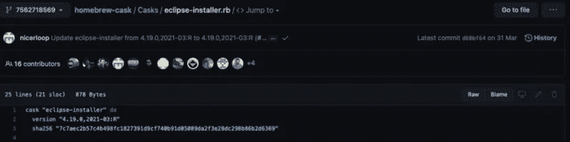

# 用 Ansible 和 Homebrew 安装旧版本的应用程序

> 原文：<https://medium.com/nerd-for-tech/install-old-versions-of-apps-with-ansible-and-homebrew-9ba612fa6679?source=collection_archive---------10----------------------->


乔恩·帕里在 [Unsplash](https://unsplash.com?utm_source=medium&utm_medium=referral) 上的照片

有时，会有新的软件发布，对您的 IT 基础架构有新的要求，这不是几个小时或几天就能改变的。有时，这些基础设施的改变比仅仅使用稍微旧一点的版本更难实现。

在我的案例中，我遇到了问题，我需要在我的 MacBook 上安装 Eclipse Neon。我们的 Eclipse Neon 需要 Java8 才能运行，不能与 java9 或更高版本一起工作。问题是，安装和配置 Eclipse Neon 的 eclipse-installer 在其最新版本中至少需要 Java11。这是一个问题，因为我的基础设施上只安装了 java8。

# 用自制软件安装旧版本

有很多不同的方法可以用自制软件获得旧版本的软件。

## Brew 搜索

这可能是获取软件版本的最简单的方法。问题是，并非每个软件在自制软件中都有不同的版本。

要使用 Homebrew run 的这一功能:

```
brew search YOUR_DESIRED_SOFTWARE
```

对于 Ansible，返回的信息如下所示:

```
==> Formulae
ansible ✔                                ansible@2.8
ansible-cmdb                             ansible@2.9
ansible-lint                             terraform-provisioner-ansible
==> Casks
ansible-dk
```

有趣的部分是 ansible@2.X。您可以通过运行以下命令下载 ansible 的这些特定版本:

```
brew install ansible@2.8
```

正如你所看到的，在自制软件中并没有太多不同的版本，通常情况下，它只会使用最新的版本。

如果你想要的版本不在自制软件上呢？

## 使用旧公式

由于家酿大多使用应用程序的最新版本，在 git 时间线的某个点上，应用程序的期望版本是最新的，因此在家酿中是可用的。

**但是你如何利用这一点呢？**

1.  在 gitHub 上找到你想要的软件。确保你去了正确的仓库，如果它是一个木桶或一个配方，它会有所不同。在我的例子中，我想获得 4.16 版本的 eclipse 安装程序。
2.  找到。rb 文件并转到 GitHub 的历史部分。



3.找到具有您想要的版本的最后一个提交，并复制提交 ID。

4.复制提交哈希并用“git checkout ID”签出提交

5.运行“brew install eclipse-installer”

6.运行“git checkout origin/master”回到最新版本。

7.如果您的应用程序是一个公式而不是一个木桶，您可以用以下内容来固定它的版本:

```
brew pin YOUR_DESIRED_SOFTWARE
```

我希望这篇文章对你有用😄

# 反射

# 什么进展顺利？

通过自制软件安装效果很好。此外，改变到一个旧的家酿版本是非常直接的。

# 有哪些需要改进的地方？

我在开始时遇到的唯一问题是，我没有找到正确版本的 git commit。在 github 上搜索了几分钟后，我找到了它。