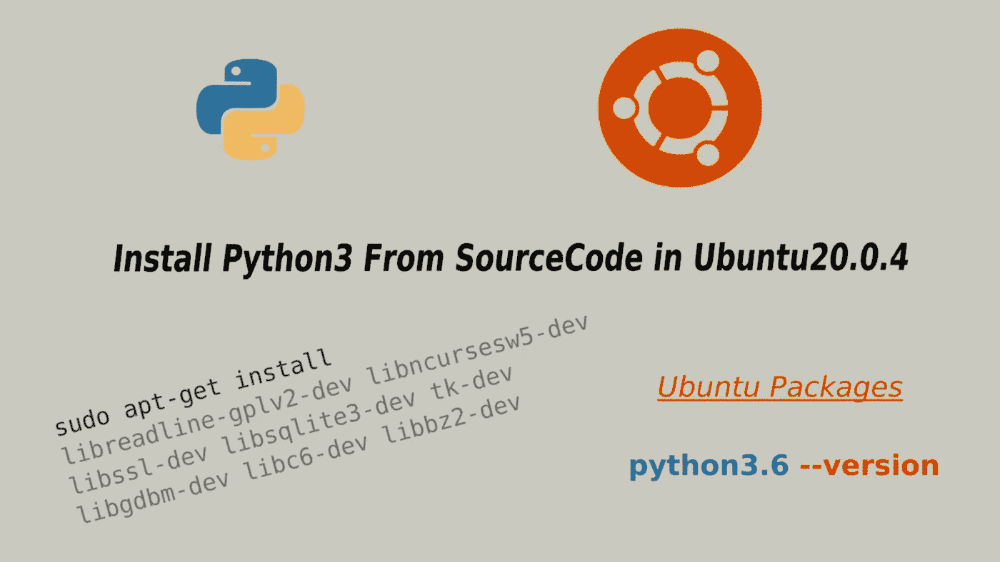

# 在 Ubuntu20.0.4 中从源代码安装 Python3

> 原文：<https://medium.com/nerd-for-tech/install-python3-from-sourcecode-in-ubuntu20-0-4-88e0ab92ad78?source=collection_archive---------4----------------------->



Python 是一种功能强大的编程语言，默认安装在 Ubuntu 操作系统中。如果你想安装一个不同版本的 Python，那么你有两个选择，要么你可以从 apt-get 这样的库安装它，要么你可以从源代码安装它。但是并非所有 Python 版本都可以在这些存储库中获得。因此，对于某些版本，您需要从源代码安装它，这是我们接下来要做的。

首先，我们将看看如何从 **apt-get** 存储库中安装 Python。

```
ubuntu:~$ sudo apt-get update
ubuntu:~$ sudo apt-get install python3
```

它将安装最新版本的 Python 3。如果你想安装一个特定版本的 Python，那么首先你可以检查它，无论它在存储库中是否可用。假设您想要安装 Python3.6 的子版本，然后运行下面的指令来检查存储库中可用的子版本。

```
ubuntu:~$ apt-cache madison python3.6#output
python3.6 | 3.6.15-1+focal1 | http://ppa.launchpad.net/deadsnakes/ppa/ubuntu focal/main amd64 Packages
```

您可以从上面的输出中观察到 Python3.6.15 版本是可用的，您可以使用带有 **apt-get** 的指定版本来安装它。

```
ubuntu:~$ sudo apt-get install python3.6
```

使用以下命令检查安装的 Python3.6 版本。

```
ubuntu:~$ python3.6 --version#output
Python 3.6.15
```

现在，我们将看看如何从 python 的源代码安装 python。我们以 python3.6.9 为例，但是你可以按照同样的过程安装任何版本。

首先，更新本地存储库，然后安装从源代码构建包所需的基本依赖项。

```
ubuntu:~$ sudo apt-get update
ubuntu:~$ sudo apt-get install build-essential
```

安装 Python 所需的以下包

```
ubuntu:~$ sudo apt-get install libreadline-gplv2-dev libncursesw5-dev libssl-dev libsqlite3-dev tk-dev libgdbm-dev libc6-dev libbz2-dev
```

接下来，您将了解上面安装的软件包

**libreadline-GPL v2-dev:**Readline 库有助于跨需要提供命令行界面的离散程序的用户界面的一致性。

libncursesw5-dev : 这是 ncurses 的支持库，是另一个库。ncurses 是一个提供应用程序编程接口的库，允许程序员以独立于终端的方式编写基于文本的用户界面。

libssl-dev: 它是 Openssl 的一部分，实现了 SSL 和 TLS 加密协议，用于互联网上的安全通信。

**libsqlite3-dev:** SQLite 是一个实现 SQL 数据库引擎的 C 库。与 SQLite 库链接的程序可以访问 SQL 数据库，而无需运行单独的 RDBMS 进程。

**tk-dev:** 它是一个跨平台的图形化工具包。

libgdbm-dev: 这是一个使用可扩展散列的数据库函数库。

**libc6-dev:** libc6 包含动态链接器用来运行用 C 库构建的软件的文件。

**libbz2-dev** 是一款高质量的块排序文件压缩库开发。

现在从[python.org](https://www.python.org/downloads/)下载所需版本的 Python 源代码，或者你也可以使用下面的下载路径从命令行下载。

```
ubuntu:~$ wget https://www.python.org/ftp/python/3.6.9/Python-3.6.9.tgz
```

下载完成后，用 tar 解压，tar 的**代表磁带存档，**用来创建和解压存档文件。

```
ubuntu:~$ sudo tar xzf  Python-3.6.9.tgz
```

更改目录并运行配置。

```
ubuntu:~$ cd Python-3.6.9/
ubuntu:~/Python-3.6.9$ sudo ./configure --enable-optimizations
```

“ **—启用优化”**标志将启用配置文件引导优化(PGO)和链接时间优化(LTO)。

这个过程需要一些时间。这个过程最终完成后，执行下面的命令。

```
ubuntu:~$ sudo make altinstall
```

**altinstall** 将安装指定版本，不会覆盖已经安装的默认版本。

检查安装的 Python 版本

```
ubuntu:~$ python3.6 --version
```

就是这样。现在享受用 Python 编码的乐趣吧。

[](https://sohaibanser.medium.com/subscribe) [## 每当 Sohaib 发布时收到一封电子邮件。

### 每当 Sohaib 发布时收到一封电子邮件。注册后，如果您还没有中型帐户，您将创建一个…

sohaibanser.medium.com](https://sohaibanser.medium.com/subscribe)