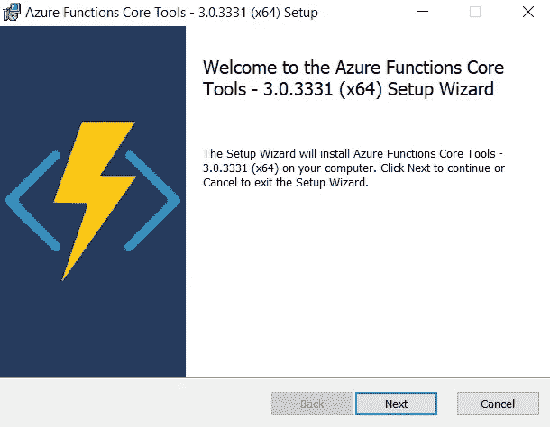
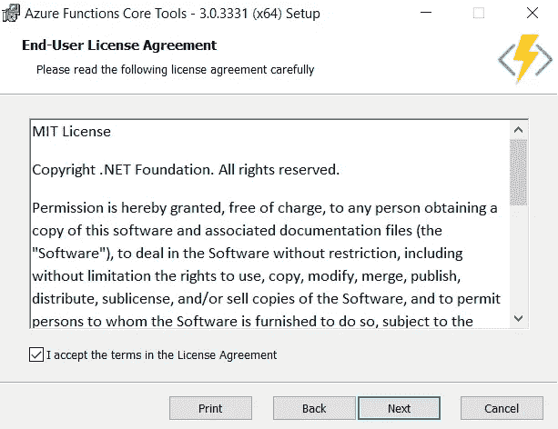
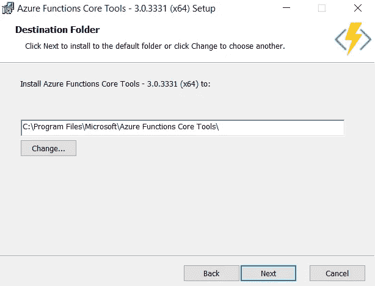
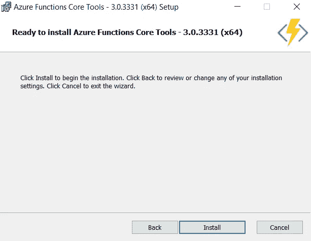
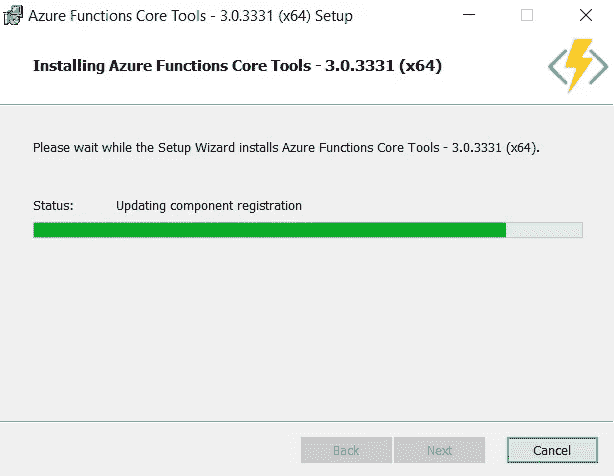
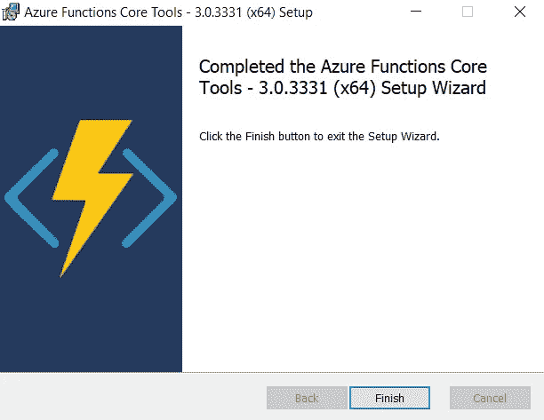

# 安装 Azure Functions 核心工具

> 原文：<https://medium.com/nerd-for-tech/install-the-azure-functions-core-tools-f99da8b77837?source=collection_archive---------5----------------------->

## 在 Windows 10 中安装 Azure 功能核心工具的步骤

沙哈达特·拉赫曼在 [Unsplash](https://unsplash.com?utm_source=medium&utm_medium=referral) 上拍摄的照片

[Azure Functions 核心工具](https://www.npmjs.com/package/azure-functions-core-tools)包括一个支持 Azure Functions 运行时的相同运行时版本，你可以在本地开发计算机上运行。它还提供了创建函数、连接 Azure 和部署函数项目的命令。

# 先决条件

*   一个 Microsoft Azure 帐户。

使用这个[链接](https://azure.microsoft.com/en-in/free/search/?&ef_id=Cj0KCQiA1pyCBhCtARIsAHaY_5f0sPbdUFAe5Kf2ljdq5RFL4gMXDz-o75fwJRuBq7jMLxnPA3JyXq4aAkL-EALw_wcB:G:s&OCID=AID2100054_SEM_Cj0KCQiA1pyCBhCtARIsAHaY_5f0sPbdUFAe5Kf2ljdq5RFL4gMXDz-o75fwJRuBq7jMLxnPA3JyXq4aAkL-EALw_wcB:G:s)创建一个免费的。

 [## 立即创建您的 Azure 免费帐户| Microsoft Azure

### 开始享受 12 个月的免费服务和 200 美元的点数。立即使用 Microsoft Azure 创建您的免费帐户。

azure.microsoft.com](https://azure.microsoft.com/en-in/free/search/?&ef_id=Cj0KCQiA1pyCBhCtARIsAHaY_5f0sPbdUFAe5Kf2ljdq5RFL4gMXDz-o75fwJRuBq7jMLxnPA3JyXq4aAkL-EALw_wcB:G:s&OCID=AID2100054_SEM_Cj0KCQiA1pyCBhCtARIsAHaY_5f0sPbdUFAe5Kf2ljdq5RFL4gMXDz-o75fwJRuBq7jMLxnPA3JyXq4aAkL-EALw_wcB:G:s) 

或者使用这个[链接](https://azure.microsoft.com/en-in/account/)创建一个。

 [## 登录 Azure -帐户和计费| Microsoft Azure

### 管理您的 Microsoft Azure 帐户。登录门户以配置您的服务并跟踪使用和计费情况。

azure.microsoft.com](https://azure.microsoft.com/en-in/account/) 

*   安装 [Azure CLI](https://docs.microsoft.com/en-us/cli/azure/install-azure-cli) 或 [Azure PowerShell](https://docs.microsoft.com/en-us/powershell/azure/install-az-ps) 来验证您的 Azure 帐户，以便能够从 Azure Functions Core Tools[发布到 Azure](https://docs.microsoft.com/en-us/azure/azure-functions/functions-run-local?tabs=windows%2Ccsharp%2Cbash#publish) 。

同样按照本[条](https://akhithababu.medium.com/azure-cli-tools-for-windows-56a45a5ac359)执行。

 [## 用于 Windows 的 Azure CLI 工具

### 安装或更新用于 Windows 的 Azure 命令行界面工具

akhithababu.medium.com](https://akhithababu.medium.com/azure-cli-tools-for-windows-56a45a5ac359) 

# 版本 3.x 和 2.x

工具的 3.x/2.x 版本使用 Azure Functions 运行时。网芯。该版本在所有平台上都受支持。NET 核心支持，包括 [Windows](https://docs.microsoft.com/en-us/azure/azure-functions/functions-run-local?tabs=windows#v2) 、 [macOS](https://docs.microsoft.com/en-us/azure/azure-functions/functions-run-local?tabs=macos#v2) 和 [Linux](https://docs.microsoft.com/en-us/azure/azure-functions/functions-run-local?tabs=linux#v2) 。

> 注意:您可以绕过安装的要求。NET Core SDK 通过使用[扩展包](https://docs.microsoft.com/en-us/azure/azure-functions/functions-bindings-register#extension-bundles)。( [Windows](https://docs.microsoft.com/en-us/azure/azure-functions/functions-run-local?tabs=windows%2Ccsharp%2Cbash#tabpanel_CeZOj-G++Q_windows) 、 [macOS](https://docs.microsoft.com/en-us/azure/azure-functions/functions-run-local?tabs=windows%2Ccsharp%2Cbash#tabpanel_CeZOj-G++Q_macos) 、 [Linux](https://docs.microsoft.com/en-us/azure/azure-functions/functions-run-local?tabs=windows%2Ccsharp%2Cbash#tabpanel_CeZOj-G++Q_linux) )

以下步骤使用 Windows installer (MSI)安装 Core Tools v3.x。有关安装 Core Tools v2.x 所需的其他基于软件包的安装程序的更多信息，请参见 [Core Tools 自述文件](https://github.com/Azure/azure-functions-core-tools/blob/master/README.md#windows)。

**根据您的 Windows 版本下载并运行核心工具安装程序:**

*   [v3.x — Windows 64 位](https://go.microsoft.com/fwlink/?linkid=2135274)(推荐。 [Visual Studio 代码调试](https://docs.microsoft.com/en-us/azure/azure-functions/functions-develop-vs-code#debugging-functions-locally)需要 64 位。)
*   [v3.x — Windows 32 位](https://go.microsoft.com/fwlink/?linkid=2135275)

# 设置 Azure Functions 核心工具

打开下载的文件。

出现一个新的对话框。

点击`Next`

勾选`I accept the terms in the License Agreement`框

然后点击`Next`

点击`Change`浏览并选择文件夹。

然后点击`Next`

时钟`Install`

等到状态栏变成绿色。

然后点击`Next`

点击`Finish`

结束了。

> 注意:如果你不打算使用[扩展包](https://docs.microsoft.com/en-us/azure/azure-functions/functions-bindings-register#extension-bundles)，安装[。用于 Windows 的 NET Core 3 . x SDK](https://dotnet.microsoft.com/download)。

# 参考:

 [## 使用 Azure 功能核心工具

### Azure Functions Core Tools 可以让你在本地计算机上从命令提示符或…

docs.microsoft.com](https://docs.microsoft.com/en-us/azure/azure-functions/functions-run-local?tabs=windows%2Ccsharp%2Cbash#install-the-azure-functions-core-tools)