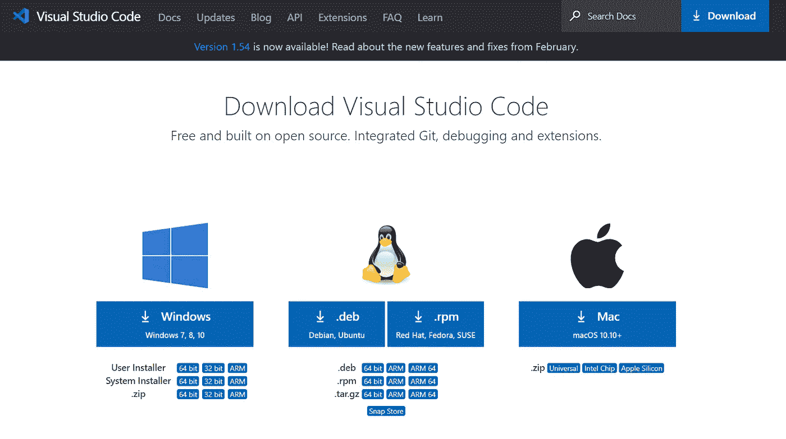
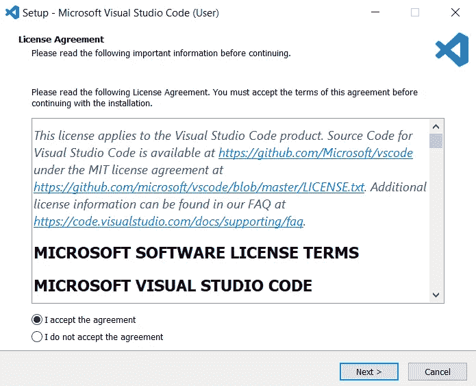
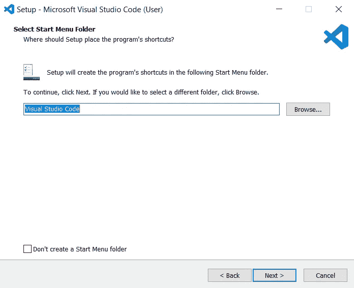
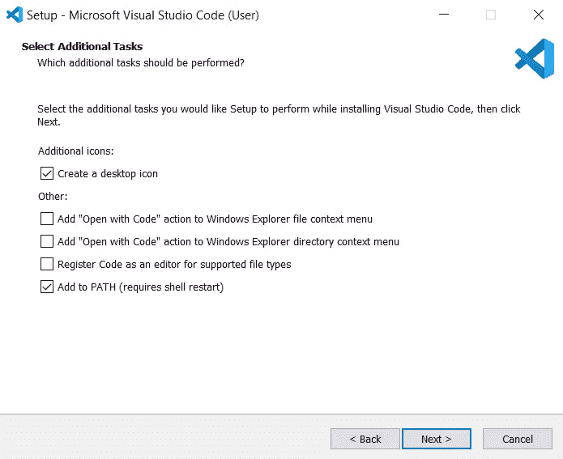
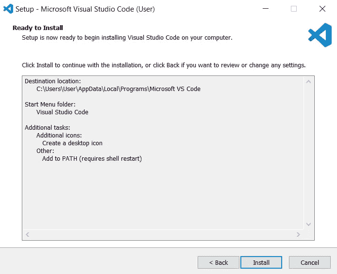
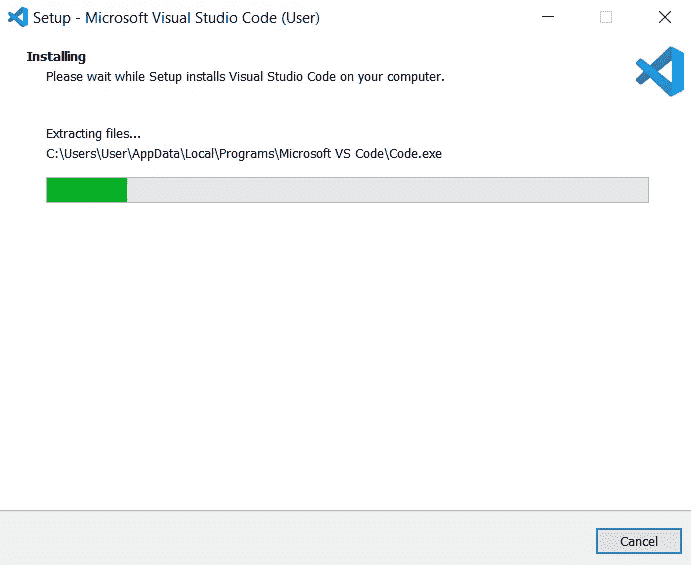
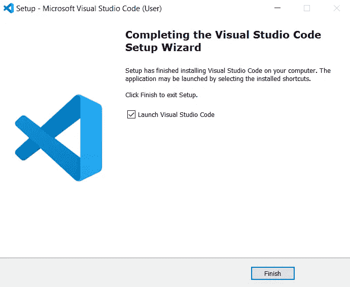
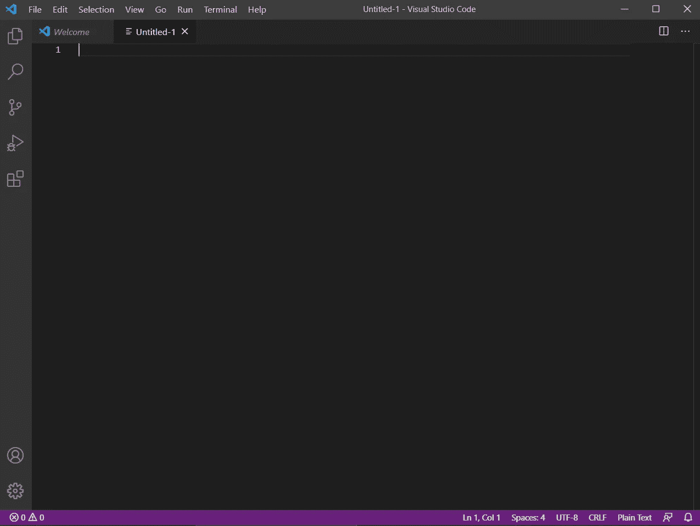

# 安装 Visual Studio 代码

> 原文：<https://medium.com/nerd-for-tech/install-visual-studio-code-fe3908c5cf15?source=collection_archive---------3----------------------->

## Windows 10 中安装 VS 代码的步骤。

照片由 [Cookie 在](https://unsplash.com/@cookiethepom?utm_source=medium&utm_medium=referral) [Unsplash](https://unsplash.com?utm_source=medium&utm_medium=referral) 上的 Pom 拍摄

> **从下面的** [**链接**](https://code.visualstudio.com/download) **下载可执行文件。**

 [## Visual Studio 代码-代码编辑。重新定义的

### Visual Studio Code 是一个重新定义和优化的代码编辑器，用于构建和调试现代 web 和云…

code.visualstudio.com](https://code.visualstudio.com/) 

> **点击** `**Download**` **选项。**

> **双击下载的文件。**
> 
> 现在出现一个对话框。
> 
> **选择**选择`**I accept the agreement**`
> 
> **然后选择** `**Next**`

> **点击浏览选择一个文件夹，或者按照默认路径。**
> 
> **然后选择** `**Next**` **。**

> **点击复选框，根据需要选择所需选项。**
> 
> **然后选择** `**Next**` **。**

> **选择** `**Install**` **。**

> **等待它安装完毕(绿色填充该栏)。**

> **点击** `**Finish**` **退出设置。选中复选框，立即启动 VS 代码。**

> **恭喜！VS 代码已成功安装到您的系统中。**
> 
> 现在出现了一个新的对话框。这是 VS 代码集成开发环境。
> 
> **点击新建文件打开一个新文件。**

> **全部搞定！**

> **快乐编码！**