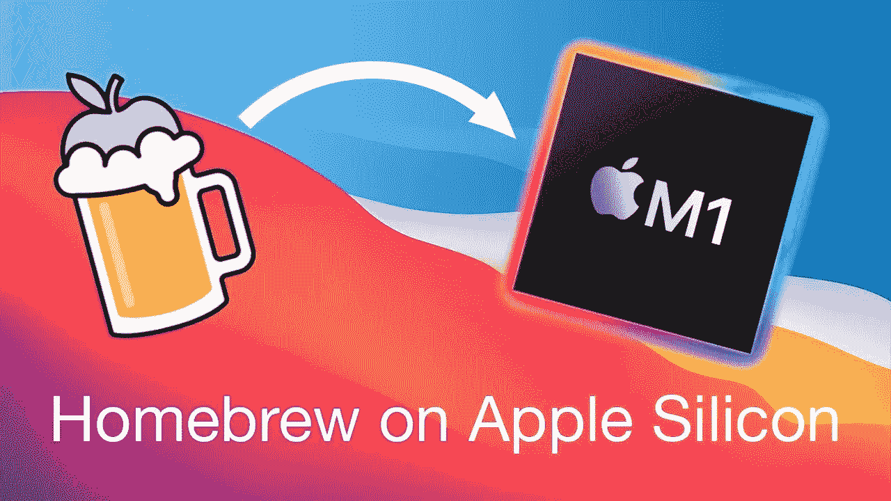

# 在 M1 Mac 上使用自制软件安装基于英特尔的软件包

> 原文：<https://medium.com/nerd-for-tech/installing-intel-based-packages-using-homebrew-on-the-m1-mac-3f88ede5d1f?source=collection_archive---------13----------------------->



我最近得到了新的苹果硅 Mac(又名 M1 mac)，这意味着必须处理购买第一代产品的痛点。虽然事情正在慢慢改善，但在使用第一代产品时，仍然有许多问题。对我来说，用自制软件在 M1 mac 上安装基于英特尔的软件包就是这样一种痛苦。

我喜欢 M1 mac 的性能，但使用自制软件安装软件包和软件并不像我希望的那样简单。你可能知道，M1 MAC 电脑运行的是 64 位 ARM 处理器，相对于旧的英特尔处理器。所以默认情况下，不支持 ARM 的包不能安装。幸运的是，苹果发布了 Rosetta 2，它充当了为英特尔 MAC 电脑构建的应用程序的转换层，以便在新的苹果硅 MAC 电脑上运行。Rosetta 2 是一个救星，因此我不会退还我的 M1 Macbook Pro。

这可能不是未来做事情的最佳方法，但这是生态系统目前的状态。在经历了相当多的 Stackoverflow 问题和 Github 问题后，这是我在 M1 mac 上安装基于英特尔的软件包的工作方式。

# 安装 Rosetta 2

遗憾的是，Rosetta 2 没有预装，我们必须明确地安装它。安装基于英特尔的应用程序时，用户确实会收到安装 Rosetta 的提示。但是由于我大部分时间都在终端工作，所以没有得到这样做的提示。我用终端自己安装的。

```
/usr/sbin/softwareupdate --install-rosettaor, if you are lazy /usr/sbin/softwareupdate --install-rosetta agree-to-license (root permission required)
```

# 在 M1 苹果电脑上安装自制软件

虽然 Homebrew 已经针对 ARM 架构进行了更新，但它并不只是与 fl 架构以及英特尔仿真的 Rosetta 一起开箱即用。如果我没有这样做，当我尝试安装一个不支持 M1 体系结构的应用程序时，会在 brew 上出现以下错误:

```
Error: Cannot install in Homebrew on ARM processor in Intel default prefix (/usr/local)!
```

这两个位置相互独立:对于 rosetta 模拟(Intel)代码为/usr/local，对于 ARM64 为/opt/homebrew。对于自制软件来说，这些都是硬编码的位置，我们对此无能为力。

在 M1 mac 电脑上安装家酿软件从主页上看非常简单。

```
$ /bin/bash -c "$(curl -fsSL https://raw.githubusercontent.com/Homebrew/install/HEAD/install.sh)"
```

# 为 Rosetta 仿真器安装自制软件

在 M1 mac 上安装了 Homebrew 之后，我们需要单独安装 Rosetta 仿真器。

有几种方法可以做到这一点:为 Rosetta 相关的东西创建一个不同的终端，在同一个终端中完成，并添加一些别名。我更喜欢后者，但你选择做什么取决于你自己。

# 1.为 Rosetta 使用不同的终端

在 finder 中，我们将右键单击 Terminal(或 iTerm)并创建应用程序的副本。我们将把它重新命名为类似“罗塞塔终端”的东西。

接下来，我们将右键单击新终端并选择“获取信息”或按 Command + I。

在打开的窗口中，我们将选中“使用 Rosetta 打开”复选框，然后关闭窗口。

我们可以像往常一样开始使用 Rosetta 终端，安装自制软件和其他应用程序。

由于某些原因，这个版本对我来说不能正常工作，但我没有深入研究它，因为我更喜欢有一个单一的终端应用程序。

# 2.在单终端中配置自制软件

拥有两个终端应用程序并不有趣。在一个应用程序中做所有事情是很棒的，谁喜欢加倍自己的工作呢？Rosetta 让我们能够在命令前加上前缀`arch -x86_64`,以模拟模式运行应用程序。这解决了我们的问题！

所以我的下一步是使用:

```
$ arch -x86_64 /bin/bash -c "$(curl -fsSL https://raw.githubusercontent.com/Homebrew/install/master/install.sh)"
```

但是，唉，这也不起作用。

所以我使用了 tar 安装，首先手动安装 Homebrew(知道它安装在/usr/local 目录下)。

```
$ arch -x86_64 zsh $ cd /usr/local && mkdir homebrew $ curl -L https://github.com/Homebrew/brew/tarball/master | tar xz --strip 1 -C homebrew
```

安装完成后，我们就可以开始运行自制软件了，我们可以开始在我们的安装中使用架构标志了。

要使用英特尔安装软件包，您现在可以使用:

```
arch -x86_64 /usr/local/homebrew/bin/brew install <package name>
```

对于在 M1 mac 上使用自制软件:

```
/opt/homebrew/bin/brew install <package name>
```

# 其他可能的配置

# 1.别名

为了方便起见，我将以上两个命令配置为别名:

```
ibrew='arch -x86_64 /usr/local/bin/brew'
mbrew='arch -arm64e /opt/homebrew/bin/brew'
```

并根据需要将它们用作`mbrew install`或`ibrew install`来安装包。第一个偏好显然是 mbrew。

我还在英特尔版本之前将它们添加到我的 M1 版本路径中，以便我使用本地包(如果可用)，否则我使用基于英特尔的仿真版本。

```
# ~/.zshrc
export PATH="/usr/local/bin:$PATH"
export PATH="/opt/homebrew/bin:$PATH"
```

## 2.对于有 Python 问题的人来说，额外的步骤(<3.9)

Run:

```
arch -x86_64 pip install --upgrade pip setuptools
```

## 3\. Alternative to opening Rosetta terminal

**注意:**你也可以使用

```
arch -x86_64 zsh
```

切换到 Rosetta shell。

这就是这篇文章的全部内容。希望这篇文章能帮助你在你的 M1 机器上使用家酿啤酒，如果你有任何问题，欢迎在下面留言！

*原载于 2021 年 3 月 3 日*[*https://www.wisdomgeek.com*](https://www.wisdomgeek.com/development/installing-intel-based-packages-using-homebrew-on-the-m1-mac/)*。*