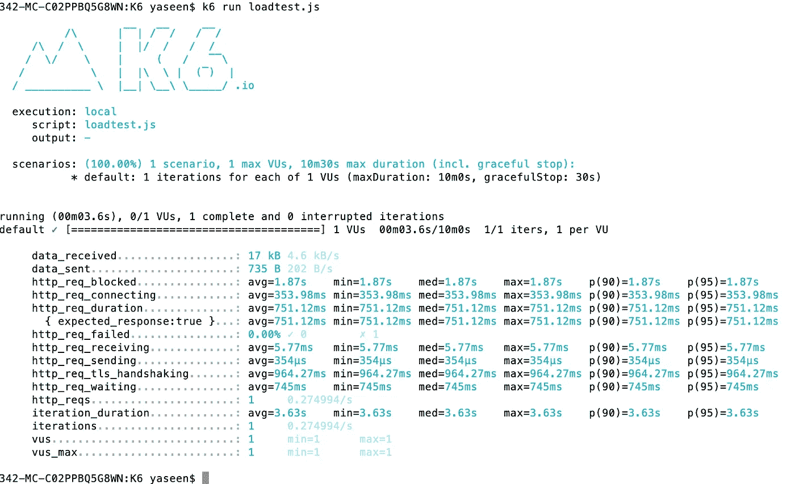
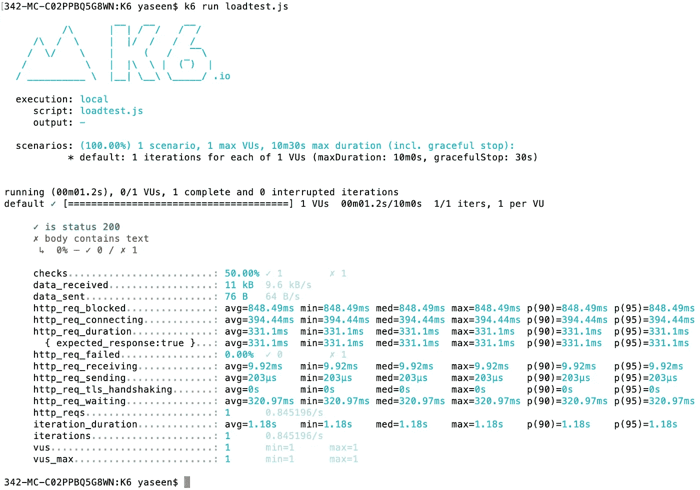
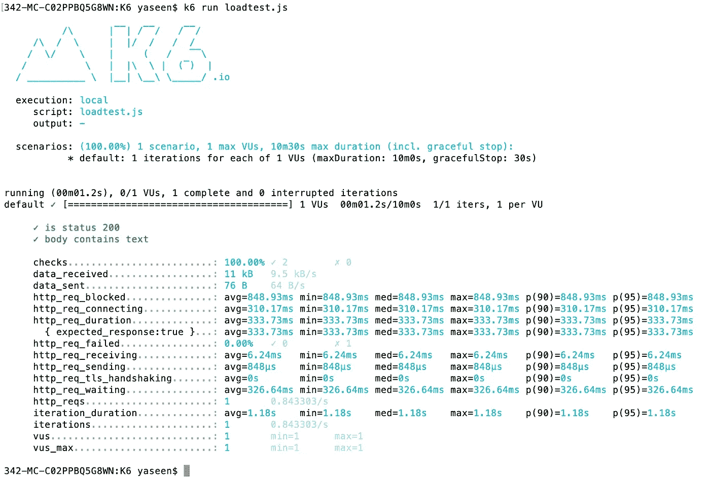
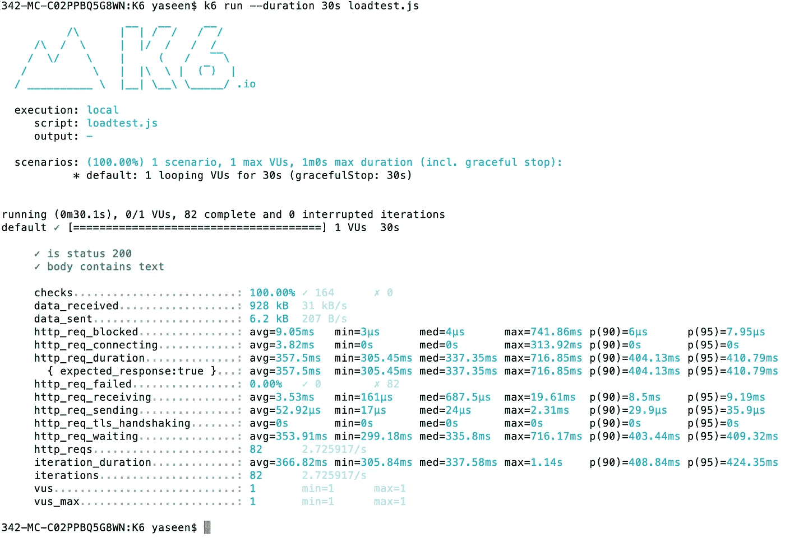
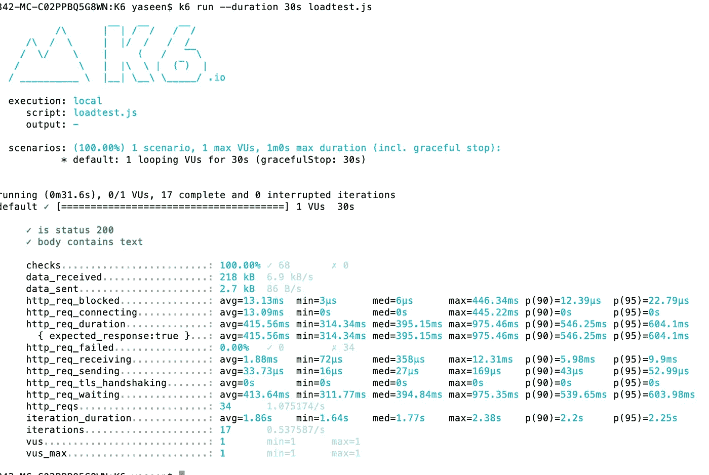
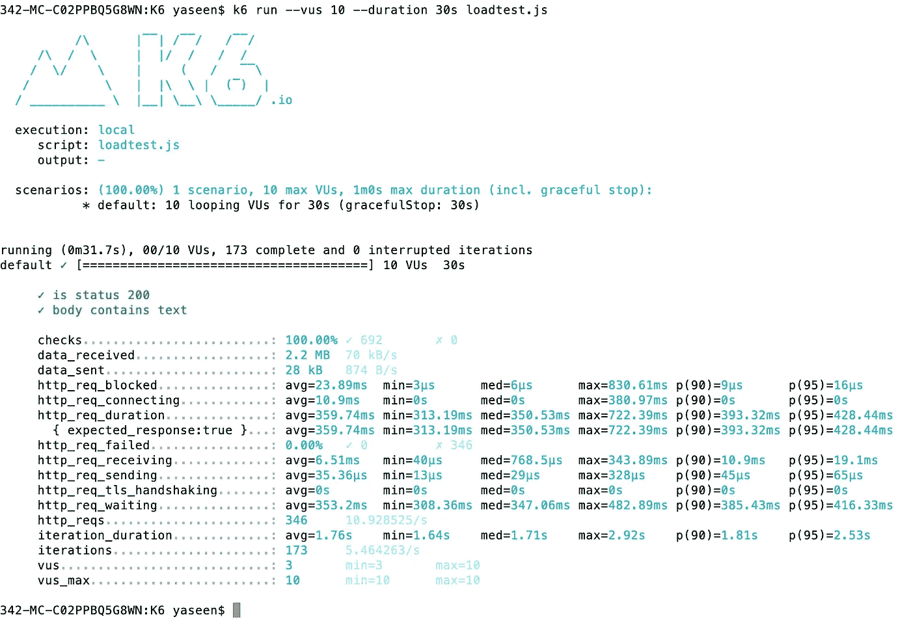
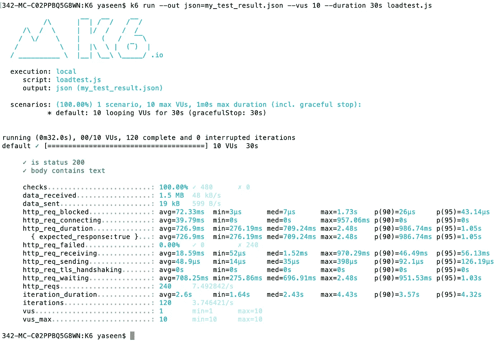
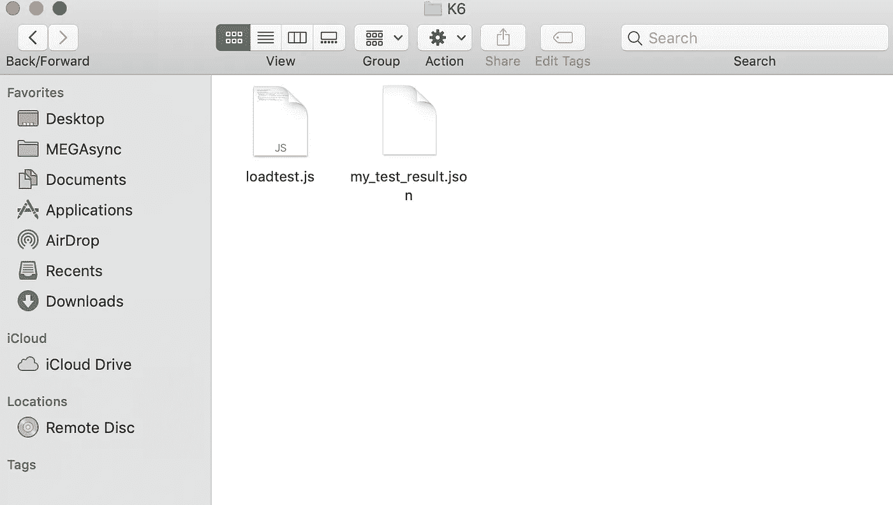

# 安装 K6 并运行负载测试

> 原文：<https://medium.com/nerd-for-tech/installing-k6-and-running-a-load-test-b1fd07161b37?source=collection_archive---------8----------------------->

# 装置

我有一台 Mac 设备，所以我将使用 brew 来安装 K6。其他使用其他操作系统的用户，请阅读此[文档](https://k6.io/docs/getting-started/installation/)。

```
brew install k6
```

创建一个新文件夹 K6，并创建一个名为 loadtest.js 的文件名。

```
touch loadtest.js
```

将以下脚本添加到该文件中

```
import http from 'k6/http';
import { sleep } from 'k6';export default function () {
  http.get('[https://test.k6.io'](https://test.k6.io'));
  sleep(1);
}
```

将尝试使用以下命令运行脚本。

```
k6 run loadtest.js
```

现在你可以看到结果了



我们将为这个请求做断言。断言是确保我们到达正确终点的中继重要因素。

我试图否定这个断言。

```
import { check } from 'k6';
import http from 'k6/http';export default function () {
  let res = http.get('[http://test.k6.io/'](http://test.k6.io/'));
  check(res, {
    'is status 200': (r) => r.status === 200,
    'body contains text': (r) => r.body.includes('aaa'),
  });
}
```



我们将更正并运行相同的测试。

```
import { check } from 'k6';
import http from 'k6/http';export default function () {
  let res = http.get('[http://test.k6.io/'](http://test.k6.io/'));
  check(res, {
    'is status 200': (r) => r.status === 200,
    'body contains text': (r) => r.body.includes('Collection of simple web-pages suitable for load testing.'),
  });
}
```



然后，我们将尝试与一个用户一起运行 30 秒

```
k6 run --duration 30s loadtest.js
```



是时候向脚本中添加一个端点了

```
import { check, sleep } from 'k6';
import http from 'k6/http';export default function () {
  let res = http.get('[http://test.k6.io/',{tags](http://test.k6.io/',{tags): {'name': 'home'}});
  check(res, {
    'is status 200': (r) => r.status === 200,
    'body contains text': (r) => r.body.includes('Collection of simple web-pages suitable for load testing.'),
  });
sleep(1);
  res = http.get('[http://test.k6.io/news.php',{tags](http://test.k6.io/news.php',{tags): {'name': 'news'}});
  check(res, {
    'is status 200': (r) => r.status === 200,
    'body contains text': (r) => r.body.includes('In the news'),
  });
}
```

然后，我们将尝试与一个用户一起运行 30 秒



然后，我们将尝试 10 个用户运行 30 秒

```
k6 run --vus 10 --duration 30s loadtest.js
```



我们可以得到 json 格式的结果

```
k6 run --out json=my_test_result.json --vus 10 --duration 30s loadtest.js
```

