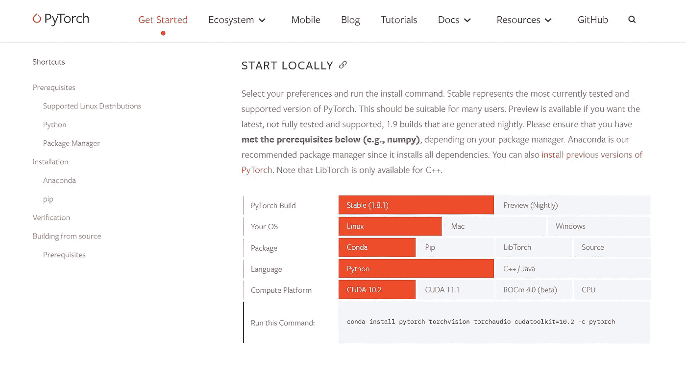

# 在 Ubuntu 18.04 中安装支持 GPU(CUDA)的 Pytorch 完整指南

> 原文：<https://medium.com/nerd-for-tech/installing-pytorch-with-gpu-support-cuda-in-ubuntu-18-04-complete-guide-edd6d51ee7ab?source=collection_archive---------3----------------------->


PyTorch(图片来源—[https://pytorch.org/get-started/locally/](https://pytorch.org/get-started/locally/))

这些天来，大多数研究级机器学习算法都是在支持 CUDA 的 GPU 上运行，因为在以更高速度处理网络方面有明显的优势，特别是在涉及“计算机视觉”问题时。在使用 PyTorch 进行编码和运行基准测试之前，我们需要设置环境来使用 GPU 处理我们的网络。

PyTorch 是一个比 TensorFlow 更灵活的框架，可用于此类应用，并且比 TensorFlow 更广泛地用于研究级应用。因此，为 PyTorch 设置一个能够使用 GPU 进行计算的环境非常重要。

***在 Ubuntu 18.04 中检查我的 TensorFlow GPU 安装如果你想测试出来也一样(*** [***点击这里***](https://i-pamuditha.medium.com/installing-tensorflow-gpu-enabling-cuda-in-ubuntu-18-04-complete-guide-ca9dfaa5bdd3)***)***

这个过程比 TensorFlow 简单得多，让我们看看在 Ubuntu 18.04 中是如何实现的。

**重要提示:**

1.  我已经用“Anaconda”演示了这一点，并且通过为 PyTorch 创建一个单独的环境来安装这些包。如果您想删除 PyTorch 安装，或者遇到似乎无法解决的错误，您可以删除环境并通过创建一个新环境重新开始，而不用删除整个 anaconda 安装，这就很方便了。
2.  我已经提到了当您运行以下命令时终端中可能出现的错误，以及如何在运行这些命令时纠正它们。如果你遇到了本文没有提到的错误，请在下面评论它们，我会尽力帮助你。在这种情况下，堆栈溢出也非常有用。
3.  最后，我给出了运行的示例代码，您可以用它来检查安装是否成功。建议在“jupyter 笔记本”中进行尝试。

# 步骤 01:系统检查

## ㈠确保你的系统能够使用 CUDA

访问以下网站，确保您的 GPU 支持 CUDA。[https://developer.nvidia.com/cuda-gpus](https://developer.nvidia.com/cuda-gpus)

> 但是这个支持 CUDA 的 GPU 列表似乎不完整，因为我现在使用的 GPU 是支持 CUDA 的，出于某种原因，它没有列在上面给出的列表中！
> 
> 因此，在继续此过程之前，请彻底检查。
> 
> 谷歌“CUDA 启用了吗？”你的 GPU 版本可能会给你想要的答案。
> 
> 或者，访问 NVIDIA 的官方宣传页面，看看它是否被列为 CUDA enabled。

## (ii)确定哪些 CUDA/ cuDNN 软件包与您的 GPU 兼容

不同的 GPU 支持不同版本的 CUDA，如果你的 GPU 相对较旧，那么它很有可能无法与最新版本的 CUDA 兼容。因此，在盲目安装最新的 CUDA 工具包版本之前，检查适合您自己的 GPU 的版本是非常重要的。这可以在互联网上搜索或访问[NVIDIA 官方开发者论坛](https://forums.developer.nvidia.com/)来完成。

# 步骤 02:安装 PyTorch

## ㈠安装 Anaconda

访问[https://www.anaconda.com/products/individual](https://www.anaconda.com/products/individual)，安装您喜欢的版本。

## ㈡为 Pytorch 创造新的环境

请注意，基于兼容性问题，我在此环境中使用了 python 版。将它替换为您的机器兼容的版本，以便进行全新安装。请不要以为你需要 python 3.7 或更高版本才能使用 PyTorch。

```
conda create -n torch-gpu python=3.7
source activate torch-gpu
```

***— — — —此时可能的错误:——*—**

```
conda: command not found
```

这是因为 anaconda 安装的路径没有在您的`.bashrc`或`.zshrc`中设置

**试试:**

`export PATH="/home/username/anaconda3/bin:$PATH"`

**— — — — —错误解决结束— —**

## ㈢安装 PyTorch

对于 PyTorch 来说，它比 TensorFlow 安装更简单，因为您不必单独安装 CUDA ToolKit 和 cuDNN，因为您可以使用 PyTorch 官网上给出的一个命令一次性安装它们。

**您只需识别合适的 CUDA 工具包版本**，cuDNN 包将被自动选择，这与 TensorFlow 安装不同，这使得 PyTorch 安装非常容易。

访问[https://pytorch.org/get-started/locally/](https://pytorch.org/get-started/locally/)，网站将根据您的操作系统、其版本和 CUDA 版本自动选择合适的 pytorch 版本。如果需要更改，您可以随时更改所选的瓷砖并使其正确。



来源—[https://pytorch.org/get-started/locally/](https://pytorch.org/get-started/locally/)

如果你的系统比较老，可以查看 PyTorch 的[以前版本，选择适合你系统的。在我们为 PyTorch 创建的已经激活的环境中运行 PyTorch 网站给出的命令。](https://pytorch.org/get-started/previous-versions/)

**示例代码:**

```
conda install pytorch torchvision torchaudio cudatoolkit=10.2 -c pytorch
```

# 步骤 03:验证安装

在 jupyter 笔记本中运行以下程序验证安装。

```
import torch
torch.cuda.is_available()
```

或者

```
import torch
torch.cuda.device(0)
```

或者

```
import torch
torch.cuda.device_count()
```

或者

```
import torch
torch.cuda.get_device_name(0)
```

**尽情享受吧！**

**:**

***在 Ubuntu 18.04 上检查我的 TensorFlow GPU 安装，如果你想测试的话也可以(*** [***点击这里***](https://i-pamuditha.medium.com/installing-tensorflow-gpu-enabling-cuda-in-ubuntu-18-04-complete-guide-ca9dfaa5bdd3)***)***