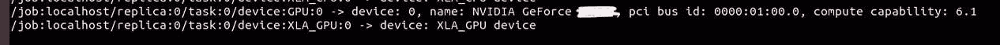

# 在 Ubuntu 18.04 中安装 TensorFlow GPU 和启用 CUDA 完整指南

> 原文：<https://medium.com/nerd-for-tech/installing-tensorflow-gpu-enabling-cuda-in-ubuntu-18-04-complete-guide-ca9dfaa5bdd3?source=collection_archive---------8----------------------->


图片来源—[https://software . Intel . com/content/www/us/en/develop/tools/frameworks . html](https://software.intel.com/content/www/us/en/develop/tools/frameworks.html)

这些天来，大多数研究级机器学习算法都是在支持 CUDA 的 GPU 上运行，因为在以更高速度处理网络方面有明显的优势，特别是在涉及“计算机视觉”问题时。在使用 TensorFlow 进行编码和运行基准测试之前，我们需要设置环境来使用 GPU 处理我们的网络。对于大多数人来说，这确实是一个乏味的过程，我自己不得不在 Windows 和我的 Ubuntu 分区上尝试了 2-3 次。我们都同意 NVIDIA 文档在这种情况下没有真正的帮助，因为写作的普遍性和复杂性。

## **重要:**

1.  我已经提到了当您运行以下命令时终端中可能出现的错误，以及如何在运行这些命令时纠正它们。如果你遇到了本文没有提到的错误，请在下面评论它们，我会尽力帮助你。[堆栈溢出](https://stackoverflow.com/)在这种情况下也非常有用。
2.  我已经使用“Anaconda”演示了这一点，并且通过为 Tensorflow-GPU 版本创建一个单独的环境来安装这些包。如果您想删除 Tensorflow-GPU 安装，或者如果您遇到似乎无法解决的错误，您可以删除环境并通过创建一个新环境重新开始，而无需删除整个 anaconda 安装，这将非常方便。
3.  最后，我给出了运行的示例代码，您可以用它来检查安装是否成功。建议在“jupyter 笔记本”中进行尝试。

# 步骤 01:系统检查

## ㈠确保你的系统能够使用 CUDA

访问以下网站，确保您的 GPU 支持 CUDA。[https://developer.nvidia.com/cuda-gpus](https://developer.nvidia.com/cuda-gpus)

> 但是这个支持 CUDA 的 GPU 列表似乎不完整，因为我现在使用的 GPU 是支持 CUDA 的，出于某种原因，它没有列在上面给出的列表中！
> 
> 因此，在继续此过程之前，请彻底检查。
> 
> 谷歌“CUDA 启用了吗？”你的 GPU 版本可能会给你想要的答案。
> 
> 或者否则，访问 NVIDIA 的官方宣传页面，看看它是否被列为 CUDA enabled。

## (ii)确定哪些 CUDA/ cuDNN 软件包与您的 GPU 兼容

不同的 GPU 支持不同版本的 CUDA，如果你的 GPU 相对较旧，那么它很有可能无法与最新版本的 CUDA 兼容。因此，在盲目安装最新的 CUDA 工具包版本之前，检查适合您自己的 GPU 的版本是非常重要的。这可以在互联网上搜索或访问[NVIDIA 官方开发者论坛](https://forums.developer.nvidia.com/)来完成。

# 步骤 02:删除 NVIDIA Nouveau 驱动程序(xserver-xorg-video)

## ㈠将司机列入黑名单

```
sudo bash -c "echo blacklist nouveau > /etc/modprobe.d/blacklist-nvidia-nouveau.conf"sudo bash -c "echo options nouveau modeset=0 >> /etc/modprobe.d/blacklist-nvidia-nouveau.conf"
```

## (ii)确认新 modprobe 配置文件的内容

```
cat /etc/modprobe.d/blacklist-nvidia-nouveau.conf
```

在执行上面的行之后，您必须看到类似下面给出的输出。

```
blacklist nouveau
options nouveau modeset=0
```

## (iii)更新内核 initramfs

```
sudo update-initramfs -u
```

***————————此时可能出现的错误:— — — — — — — —***

```
update-initramfs: Generating /boot/initrd.img-4.18.0-15-generic
I: The initramfs will attempt to resume from /dev/sda5
I: (UUID=09e25397-4a2c-4fb0-a605-a7013eecb59c)
I: Set the RESUME variable to override this.
```

当您有一个双引导系统时，上面的冲突最容易发生。建议设置恢复变量，交换 UUID 需要添加到`/etc/initramfs-tools/conf.d/resume`文件中。

1.  确定您的掉期 UUID

```
blkid | awk -F\" '/swap/ {print $2}'
```

2.在简历文件中设置相关的 ID

```
printf "RESUME=UUID=$(blkid | awk -F\" '/swap/ {print $2}')\n" | sudo tee /etc/initramfs-tools/conf.d/resume
```

3.再次运行以下命令来更新系统上的内核

```
sudo update-initramfs -u -k all
```

**— — — —错误解决结束— —**

## ㈣重新启动

```
sudo reboot
```

# 步骤 03:删除其他 NVIDIA 驱动程序

## (I)添加图形驱动程序 PPA(个人包存档)

```
sudo add-apt-repository ppa:graphics-drivers/ppa
sudo apt-get update
```

## (二)清洗驾驶员

```
sudo apt-get purge nvidia*
```

## ㈢重新启动

```
sudo reboot
```

# 步骤 04:安装专有的 NVIDIA 驱动程序

## ㈠自动安装驱动程序

```
sudo apt update
sudo ubuntu-drivers autoinstall
```

***— — — —此时可能的错误:——*—**

```
Some packages could not be installed. This may mean that you have
requested an impossible situation or if you are using the unstable
distribution that some required packages have not yet been created
or been moved out of Incoming.
The following information may help to resolve the situation:

The following packages have unmet dependencies:
 nvidia-driver-396 : Depends: nvidia-dkms-396 (= 396.54-0ubuntu0~gpu18.04.1) but it is not going to be installed
                     Depends: nvidia-utils-396 (= 396.54-0ubuntu0~gpu18.04.1) but it is not going to be installed
                     Recommends: nvidia-settings but it is not going to be installed
                     Recommends: nvidia-prime (>= 0.8) but it is not going to be installed
                     Recommends: libnvidia-compute-396:i386 (= 396.54-0ubuntu0~gpu18.04.1)
                     Recommends: libnvidia-decode-396:i386 (= 396.54-0ubuntu0~gpu18.04.1)
                     Recommends: libnvidia-encode-396:i386 (= 396.54-0ubuntu0~gpu18.04.1)
                     Recommends: libnvidia-ifr1-396:i386 (= 396.54-0ubuntu0~gpu18.04.1)
                     Recommends: libnvidia-fbc1-396:i386 (= 396.54-0ubuntu0~gpu18.04.1)
                     Recommends: libnvidia-gl-396:i386 (= 396.54-0ubuntu0~gpu18.04.1)
E: Unable to correct problems, you have held broken packages.
```

***解决这类涉及 NVIDIA 驱动程序安装的问题需要实例化方法，而不是一般化方法。因此，建议在*** [***堆栈溢出***](https://stackoverflow.com/) ***上搜索错误或帮助。***

**— — — —错误解决结束— —**

## ㈡重新启动

```
sudo reboot
```

## (iii)启用驱动程序并重启

```
sudo prime-select nvidia
sudo reboot
```

## (四)检查一切是否按预期运行

```
nvidia-smi
```

**示例输出:**


***— — — —此时可能出现的错误:——*—**

```
nvidia-smiNVIDIA-SMI has failed because it couldn't communicate with the NVIDIA driver. Make sure that the latest NVIDIA driver is installed and running.
```

请记住，错误可能是由于您的安装的内部缺陷而出现的，并且**下面推荐的方法可能无法解决问题**。如果没有，请在互联网或[堆栈溢出](https://stackoverflow.com/)上搜索错误，以获得更好的结果。

**试试:**

```
sudo apt-get update –fix-missingsudo dpkg –configure -asudo apt install -f
```

如果包装破损的问题仍然存在，解决方法是**手动编辑 dpkg 状态**文件。

**— — — — —错误解决结束— —**

# 步骤 05:安装 Tensorflow GPU

## ㈠安装 Anaconda

访问[https://www.anaconda.com/products/individual](https://www.anaconda.com/products/individual)，安装您喜欢的版本。

## (二)为 Tensorflow GPU 创建新环境

请注意，基于兼容性问题，我在此环境中使用了 python 版。将它替换为您的机器兼容的版本，以便进行全新安装。

```
conda create -n tf-gpu python=3.7
source activate tf-gpu
```

***— — — —此时可能的错误:——*—**

```
conda: command not found
```

这是因为 anaconda 安装的路径没有在您的`.bashrc`或`.zshrc`中设置

**试试:**

`export PATH="/home/username/anaconda3/bin:$PATH"`

**— — — —错误解决结束— —**

## ㈢安装 CUDA、cuDNN

此时，使用您在步骤 01 中查找的兼容 tensorflow、CUDA 和 cuDNN 版本，并相应地更改版本号。这里我使用了 **tensorflow 1** ，但请注意，有一个更新的版本 **tensorflow 2** 可用。

```
conda install \
tensorflow-gpu==1.12 \
cudatoolkit==9.0 \
cudnn=7.1.2 \
h5py
```

# 步骤 06:验证安装

## 对于张量流 1:

```
tf.test.gpu_device_name()
```

或者

```
sess = tf.Session(config=tf.ConfigProto(log_device_placement=True))
```

对于上面的命令，您应该会看到类似如下的内容:



## 对于 Tensorflow 2:

```
print("Num GPUs Available: ", len(tf.config.list_physical_devices('GPU')))
```

或者

```
import tensorflow as tf

assert tf.test.is_gpu_available()
assert tf.test.is_built_with_cuda() 
```

**尽情享受！**

**:)**

***在 Ubuntu 中检查我的 PyTorch GPU 安装如果你也想测试一下的话(*** [***点击这里***](https://i-pamuditha.medium.com/installing-pytorch-with-gpu-support-cuda-in-ubuntu-18-04-complete-guide-edd6d51ee7ab)***)***